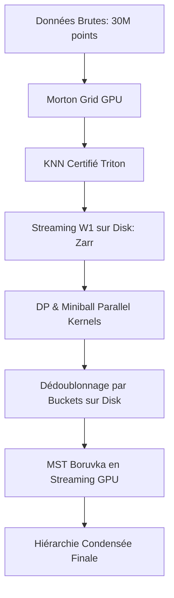

# Plan de Conception Détaillé : Architecture Out-of-Core & GPU (Phase 5)

Ce document présente les spécifications techniques et l'architecture logicielle pour la **Phase 5 (Performance et Scalabilité massive)** de la bibliothèque **PERG-HGP**. L'objectif est de permettre le traitement de nuages de points 3D de taille $N = 30\text{M}$ avec un ordre de percolation $K = 10\text{ à } 20$, dans les limites de mémoire d'un GPU Colab standard (T4/L4 de 15 Go de VRAM et 12 Go de RAM système).

---

## 1. Vue d'Ensemble des Verrous et Solutions

Pour surmonter les limites identifiées lors de l'auto-audit, l'architecture est divisée en quatre blocs fondamentaux décrits ci-après.

---

## 2. Bloc 1 : Grille Morton & KNN Parallèle Vectorisé (Triton/GPU)

La boucle de recherche de voisins actuelle (`query_knn_grid`) s'exécute en Python séquentiel, ce qui bloque le passage à l'échelle.

### 2.1 Encodage et Tri Parallèle
1.  **Encodage Morton GPU** : Les points $X$ sont projetés sur une grille régulière de résolution $2^{10} = 1024$ par axe. Les coordonnées entières 3D sont entrelacées en clés Morton de 30 bits via des opérations de décalage de bits parallélisées sur GPU.
2.  **Tri Radix GPU** : Les clés Morton sont triées en une seule passe GPU via `torch.sort` (implémentant un Radix Sort CUDA très performant). Les indices triés associés sont conservés.
3.  **Indexation des Cellules** : Calcul par balayage parallèle (`cumsum` et `diff`) des adresses de début et de fin de chaque cellule active dans le tableau trié.

### 2.2 Kernel de Requête KNN Vectorisé (Triton)
Un kernel Triton (`knn_grid_query_kernel`) est écrit pour exécuter les requêtes en parallèle :
*   **Parallélisme** : Chaque thread GPU traite un point de requête.
*   **Exploration** : Le thread lit la clé Morton du point, détermine sa cellule et explore les cellules adjacentes en spirale (rayon de 1 à 4).
*   **Certificat de Queue** : Le calcul de la distance minimale au bord de la zone explorée et la comparaison avec le $m$-ième voisin trouvé se font localement dans le thread.
*   **Fallback Localisé** : Si le certificat de queue échoue, au lieu d'un scan global sur les 30M de points, le thread interroge un sous-ensemble local étendu (par exemple, les 8 cellules mères de niveau supérieur), limitant la complexité à $O(\log N)$.

---

## 3. Bloc 2 : Stockage Out-of-Core & Dédoublonnage Externe (Zarr / Memmap)

À $K=20$, le tableau de facettes d'un atlas de $U = 2\text{M}$ cofaces contient $2\text{M} \times 21 = 42\text{M}$ de lignes. Le charger en RAM système pour un `np.unique` provoque un crash OOM.

### 3.1 Stockage sur Disque (`Zarr` / `np.memmap`)
*   Les cofaces candidates et les facettes générées sont écrites directement sur le disque dans des fichiers plats mappés en mémoire (`np.memmap` de type binaire brut) ou des structures chunkées compressées (`zarr`).

### 3.2 Dédoublonnage par Partitionnement Externe (Bucket Sort)
Pour dédoublonner 100M+ de facettes sans dépasser 1 Go de RAM :
1.  **Partitionnement** : Les facettes de taille $K$ (triées individuellement) sont lues par morceaux depuis le fichier `memmap`. Chaque facette est assignée à l'un des $B$ buckets sur disque (par exemple $B=64$) en fonction de la valeur de son premier sommet $v_0$.
2.  **Garantie d'Indépendance** : Deux facettes appartenant à des buckets différents ont des sommets de départ différents, elles sont donc **garanties d'être disjointes**.
3.  **Dédoublonnage Local** : Chaque bucket est chargé individuellement en RAM (taille max ~1.5M de lignes, soit moins de 100 Mo), dédoublonné via `np.unique` (ou un tri Radix GPU), puis écrit dans le fichier final de facettes uniques.

---

## 4. Bloc 3 : Résolution Miniball & DP Triton

Les calculs d'énergie et de miniball doivent éliminer la latence CPU de lancement de kernels PyTorch répétitifs.

### 4.1 Kernel de Programmation Dynamique (DP) pour le Champ de Rang
*   La résolution de la DP pour le calcul des poids $b_{ik}$ est implémentée dans un unique kernel GPU. 
*   Chaque thread calcule le tableau DP local pour son point en utilisant les registres GPU et la mémoire partagée (Shared Memory/SRAM), évitant l'allocation de tenseurs 3D intermédiaires en VRAM.

### 4.2 Kernel Triton pour le Miniball Active-Set 3D
*   Un kernel Triton dédié résout en parallèle le miniball de puissance additif pour les $U$ cofaces candidates.
*   Puisque le support maximal est de cardinal $4$ (en 3D), les matrices de corrélation et les multiplicateurs de Lagrange associés sont de taille $4 \times 4$ maximum. Ils sont résolus directement dans les registres du thread GPU, éliminant tout appel à un solveur CPU.

---

## 5. Bloc 4 : MST Borůvka en Streaming GPU

Kruskal nécessite le tri complet de toutes les arêtes du dual en RAM. Nous le remplaçons par une version en streaming de l'algorithme de Borůvka.

### 5.1 Algorithme de Borůvka Parallèle
L'algorithme progresse par phases de contraction ($\le \log_2(\text{facettes})$ phases, typiquement $\le 20$ en pratique) :
1.  **Phase d'initialisation** : Chaque facette unique est sa propre composante connexe dans un Union-Find GPU.
2.  **Streaming des Arêtes** : Les arêtes du dual sont lues depuis le stockage disque (Zarr/Memmap) par morceaux de $500\,000$ arêtes.
3.  **atomicMin GPU** : Pour chaque chunk d'arêtes chargé sur le GPU, on résout la racine du Union-Find pour les deux extrémités $u$ et $v$. Si elles appartiennent à des composantes différentes, on met à jour l'arête sortante la plus légère de la composante de $u$ (et de $v$) via une opération atomique `atomicMin` sur GPU.
4.  **Contraction** : À la fin de la passe de streaming, les composantes sont fusionnées en parallèle sur le GPU.
5.  **Critère d'Arrêt** : Les étapes 2 à 4 sont répétées jusqu'à ce qu'il ne reste qu'une seule composante.

---

## 6. Plan d'Implémentation Étape par Étape

> [!IMPORTANT]
> Pour garantir la non-régression, chaque étape sera validée par la suite de tests unitaires existante.

| Étape | Module Cible | Description | Métrique de Succès |
| :--- | :--- | :--- | :--- |
| **Step 5.1** | `grid.py` & `estimator.py` | Encodage Morton GPU et indexation de cellules par Radix Sort PyTorch. | Élimination de `decode_cell_key_cpu` et `encode_cell_coords_cpu`. |
| **Step 5.2** | `grid.py` | Écriture du kernel Triton de recherche KNN et du certificat de queue local. | 0 différence KNN vs brute-force. |
| **Step 5.3** | `cofaces.py` & `estimator.py` | Partitionnement externe et dédoublonnage de facettes par buckets `np.memmap`. | RAM système plafonnée à < 1 Go sur 20M de facettes. |
| **Step 5.4** | `hierarchy.py` | Implémentation du MST Borůvka en streaming GPU avec Union-Find parallèle. | Identité des MST obtenus vs Kruskal. |
| **Step 5.5** | `cofaces.py` | Kernel Triton d'active-set miniball parallélisé par coface. | Gain de vitesse > 10x sur la phase de certification. |
