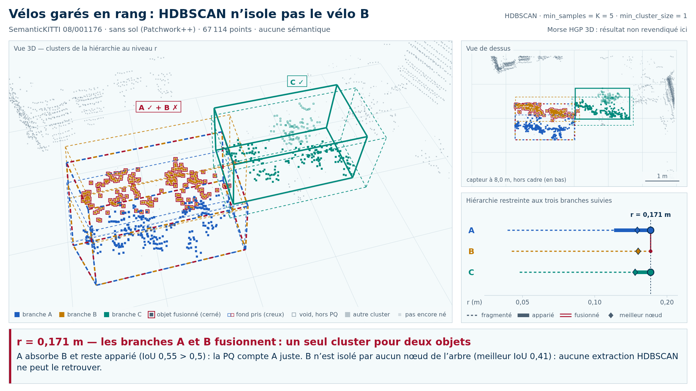

# Démos : HGP contre HDBSCAN sur SemanticKITTI

Exemples tirés de SemanticKITTI pour les présentations Inria / SZTE, rangés par **issue** : la hiérarchie de points de
Morse HGP 3D (v11) réussit ou échoue, la hiérarchie de HDBSCAN réussit ou échoue. Il y a deux sortes d'exemples :

- **cinq démos de scène entière** (trames sans sol, ou avec sol pour la 04), avec leurs vidéos : chacune balaie la
  hiérarchie de HDBSCAN (et d'ALPINE) sur la trame, suit trois objets et montre le niveau où elle les fusionne à tort,
  ou, pour le témoin, où elle réussit ; leur README donne aussi, désormais, la hiérarchie de points HGP sur la même
  trame ;
- **des bouts de scène** réduits aux seuls points de deux ou trois objets proches (voitures, vélos, vélos et piétons) :
  ni sol, ni fond, ni autre objet.

Chaque vidéo existe en deux thèmes, comme Percolia.com : **sombre** (fond marine) et **clair** (fond blanc).

```text
phase=demonstration_hors_registre
backend=reference_cpu (vidéos : HDBSCAN et ALPINE réimplémentés ; comparaisons HGP : morsehgp3D_v11 sur G4 contre scikit-learn 1.7.2)
profile=float32_brut pour les vidéos ; quantized_u21_input_only (grille de 1 mm) pour HGP
mode=illustration
public_status=not_claimed
```

## Organisation

| Dossier | Contenu |
| --- | --- |
| [`hgp_reussit_hdbscan_echoue/`](hgp_reussit_hdbscan_echoue/README.md) | 12 bouts de scène (vélos ; vélos et piétons) |
| [`hgp_echoue_hdbscan_reussit/`](hgp_echoue_hdbscan_reussit/README.md) | 2 bouts de scène (vélos) |
| [`hgp_echoue_hdbscan_echoue/`](hgp_echoue_hdbscan_echoue/README.md) | démos 01 à 04 ; 6 bouts de scène (vélos ; vélos et piétons) |
| [`hgp_reussit_hdbscan_reussit/`](hgp_reussit_hdbscan_reussit/README.md) | démo 05 (témoin) ; 11 bouts représentatifs (voitures, vélos, vélos et piétons) |
| [`bouts_evalues.json`](bouts_evalues.json) | les 360 bouts mesurés, leur catégorie et les meilleurs IoU par objet à chaque ordre |
| [`recherche/`](recherche/README.md) | criblage de la séquence 08 qui a désigné les démos de scène entière |
| [`tools/`](tools/) | lecture des trames, scènes et vidéos, recherche et rangement des bouts |
| [`player/`](player/index.html) | lecteur des scènes des vidéos |

Chaque exemple a son sous-dossier : un README (objets, tableau à chaque ordre, issue), des images ou des vidéos, et un
dossier `data/` local, ignoré par git, où se refont les points.

## Critères

- **Mesure.** Pour chaque objet, le **meilleur IoU** atteint par un nœud quelconque de la hiérarchie, au sens de la
  qualité panoptique de SemanticKITTI (points « void » exclus). Un objet à 0,5 ou moins ne peut être compté vrai
  positif par **aucune** extraction de la hiérarchie. C'est une borne optimiste : elle choisit, objet par objet, le
  meilleur niveau ; ce n'est pas encore un découpage automatique en clusters.
- **Même ordre.** HDBSCAN reçoit `min_samples` = k et l'on prend son arbre complet ; HGP est la hiérarchie de points
  H^r_{k+1} de `morsehgp3D_v11` (`docs/HIERARCHIE_POINTS.md`) ; k = 2, 3, 5, 10. Les deux sont calculés sur la même
  machine.
- **Réussite à l'ordre k** : tous les objets de l'exemple (les objets suivis, pour une démo de scène entière)
  dépassent 0,5.
- **Catégorie**, par priorité : HGP réussit et HDBSCAN échoue à un même ordre au moins ; sinon, l'inverse ; sinon, les
  deux échouent à un ordre au moins ; sinon, les deux réussissent à tous les ordres. Ces critères ont été fixés avant
  la lecture des résultats (`tools/choisir_bouts.py`).
- **Images des comparaisons HGP** : vue de dessus en trois panneaux : vérité (objets A bleu, B orange, C violet) ;
  meilleur groupe de HDBSCAN pour l'objet clé ; meilleur groupe de HGP pour le même objet. Vert : point de l'objet dans
  le groupe ; rouge : point d'un autre objet dans le groupe ; bleu : point de l'objet hors du groupe ; gris : autres
  points. L'objet clé est celui que manque la méthode qui échoue.

## Bouts de scène : bilan

Recherche : étiquettes de toutes les trames des séquences 00 à 10 (une sur 10, puis une sur 2 pour vélos et piétons),
groupes de deux ou trois objets d'au moins 50 points séparés de moins de 1 m (voitures) ou de 0,6 m puis 1 m (vélos,
piétons), un bout par groupe dans la trame où ils sont le plus serrés ; mesures sur G4 (sessions `claudebouts1` et
`claudebouts2`, reçu `morsehgp3D_v11/receipts/developpement_20261004/bouts_g4/`).

| Catégorie | Voitures | Vélos | Vélos et piétons |
| --- | --- | --- | --- |
| HGP réussit, HDBSCAN échoue | 0 | 11 | 2 |
| HGP échoue, HDBSCAN réussit | 0 | 3 | 0 |
| les deux échouent | 0 | 9 | 2 |
| les deux réussissent | 263 | 58 | 12 |

IoU moyen sur tous les objets des bouts (HDBSCAN / HGP) :

| Famille (objets) | k = 2 | k = 3 | k = 5 | k = 10 |
| --- | --- | --- | --- | --- |
| Voitures (573) | 0,980 / 0,979 | 0,979 / 0,978 | 0,978 / 0,978 | 0,973 / 0,976 |
| Vélos (178) | 0,826 / 0,831 | 0,818 / 0,835 | 0,808 / 0,837 | 0,771 / 0,831 |
| Vélos et piétons (38) | 0,884 / 0,878 | 0,880 / 0,887 | 0,877 / 0,889 | 0,836 / 0,869 |

Réduites à leurs seuls points, les voitures sont toujours retrouvées par les deux méthodes, même presque au contact
(45 bouts à moins de 30 cm, le plus petit écart 1 cm) : c'est le sol et le voisinage qui font échouer HDBSCAN sur les
scènes entières. Les vélos des démos 02 et 01/04, isolés en bouts, font échouer les deux méthodes.

## Démos de scène entière

Meilleur IoU atteignable par **un nœud quelconque** de l'arbre de HDBSCAN et d'ALPINE, pour chaque
objet suivi (A / B / C) ; 0,5 est le seuil d'appariement de la qualité panoptique (PQ). Les mesures HGP de ces
trames sont dans le README de chaque démo.

<!-- catalogue:début -->
| démo | trame | objets | HDBSCAN K = 5 | HDBSCAN K = 10 | ALPINE sans sémantique | vidéos |
| --- | --- | --- | --- | --- | --- | --- |
| [01 vélos garés en rang](hgp_echoue_hdbscan_echoue/01_velos_en_rang/) | 08/001176, sans sol | quatre vélos garés en deux paires ; trois suivis | 0,67 / **0,41** / 0,75 | 0,62 / **0,40** / 0,64 | 0,91 / 0,82 / 0,89 | K5 [sombre](hgp_echoue_hdbscan_echoue/01_velos_en_rang/01_velos_en_rang_hdbscan_K5_sombre.mp4) · [clair](hgp_echoue_hdbscan_echoue/01_velos_en_rang/01_velos_en_rang_hdbscan_K5_clair.mp4) ; K10 [sombre](hgp_echoue_hdbscan_echoue/01_velos_en_rang/01_velos_en_rang_hdbscan_K10_sombre.mp4) · [clair](hgp_echoue_hdbscan_echoue/01_velos_en_rang/01_velos_en_rang_hdbscan_K10_clair.mp4) |
| [02 vélos contre une façade](hgp_echoue_hdbscan_echoue/02_velos_contre_facade/) | 08/000882, sans sol | trois vélos contre un mur | **0,31** / **0,18** / 0,60 | **0,15** / **0,15** / 0,52 | 0,52 / **0,24** / 0,52 | K5 [sombre](hgp_echoue_hdbscan_echoue/02_velos_contre_facade/02_velos_contre_facade_hdbscan_K5_sombre.mp4) · [clair](hgp_echoue_hdbscan_echoue/02_velos_contre_facade/02_velos_contre_facade_hdbscan_K5_clair.mp4) ; K10 [sombre](hgp_echoue_hdbscan_echoue/02_velos_contre_facade/02_velos_contre_facade_hdbscan_K10_sombre.mp4) · [clair](hgp_echoue_hdbscan_echoue/02_velos_contre_facade/02_velos_contre_facade_hdbscan_K10_clair.mp4) ; ALPINE [sombre](hgp_echoue_hdbscan_echoue/02_velos_contre_facade/02_velos_contre_facade_alpine_bev_sombre.mp4) · [clair](hgp_echoue_hdbscan_echoue/02_velos_contre_facade/02_velos_contre_facade_alpine_bev_clair.mp4) |
| [03 piéton près d'une façade](hgp_echoue_hdbscan_echoue/03_pieton_contre_facade/) | 08/000048, sans sol | un piéton près d'une façade et d'un groupe, un piéton isolé, un vélo | **0,44** / 1,00 / 0,98 | **0,44** / 1,00 / 0,98 | 0,71 / 1,00 / 0,98 | K5 [sombre](hgp_echoue_hdbscan_echoue/03_pieton_contre_facade/03_pieton_contre_facade_hdbscan_K5_sombre.mp4) · [clair](hgp_echoue_hdbscan_echoue/03_pieton_contre_facade/03_pieton_contre_facade_hdbscan_K5_clair.mp4) ; K10 [sombre](hgp_echoue_hdbscan_echoue/03_pieton_contre_facade/03_pieton_contre_facade_hdbscan_K10_sombre.mp4) · [clair](hgp_echoue_hdbscan_echoue/03_pieton_contre_facade/03_pieton_contre_facade_hdbscan_K10_clair.mp4) |
| [04 vélos en rang, sol conservé](hgp_echoue_hdbscan_echoue/04_velos_en_rang_avec_sol/) | 08/001176, **sol conservé** | les trois vélos de 01 | **0,22** / **0,29** / **0,33** | **0,23** / **0,24** / **0,31** | (sans objet : ALPINE suppose le sol retiré) | K5 [sombre](hgp_echoue_hdbscan_echoue/04_velos_en_rang_avec_sol/04_velos_en_rang_avec_sol_hdbscan_K5_sombre.mp4) · [clair](hgp_echoue_hdbscan_echoue/04_velos_en_rang_avec_sol/04_velos_en_rang_avec_sol_hdbscan_K5_clair.mp4) ; K10 [sombre](hgp_echoue_hdbscan_echoue/04_velos_en_rang_avec_sol/04_velos_en_rang_avec_sol_hdbscan_K10_sombre.mp4) · [clair](hgp_echoue_hdbscan_echoue/04_velos_en_rang_avec_sol/04_velos_en_rang_avec_sol_hdbscan_K10_clair.mp4) |
| [05 témoin](hgp_reussit_hdbscan_reussit/05_temoin_voitures_en_file/) | 08/002554, sans sol | trois voitures garées à 0,7–1,2 m l'une de l'autre | 0,86 / 0,98 / 0,99 | 0,83 / 0,98 / 0,99 | 0,88 / 0,99 / 0,97 | K5 [sombre](hgp_reussit_hdbscan_reussit/05_temoin_voitures_en_file/05_temoin_voitures_en_file_hdbscan_K5_sombre.mp4) · [clair](hgp_reussit_hdbscan_reussit/05_temoin_voitures_en_file/05_temoin_voitures_en_file_hdbscan_K5_clair.mp4) ; ALPINE [sombre](hgp_reussit_hdbscan_reussit/05_temoin_voitures_en_file/05_temoin_voitures_en_file_alpine_bev_sombre.mp4) · [clair](hgp_reussit_hdbscan_reussit/05_temoin_voitures_en_file/05_temoin_voitures_en_file_alpine_bev_clair.mp4) |
<!-- catalogue:fin -->

Pour **tout** K de 1 à 10 (courbe du bilan de chaque vidéo), le vélo B de
01, les vélos A et B de 02, le piéton A de 03 et les trois vélos de 04
restent sous 0,5 : aucune valeur de `min_samples` ne les isole. Chaque dossier contient
ses vidéos dans les deux thèmes (`*_sombre.mp4`, `*_clair.mp4`), deux images
fixes par vidéo et par thème (`*_instant_cle.png`, l'instant clé : la
première fusion de branches suivies, la première absorption de fond pour 03
et 04, le dernier appariement pour 05 à K = 5, et pour 05 ALPINE la fusion de
deux voitures, sous le seuil voiture de l'article ; `*_bilan.png`, carte
finale), `demo.json` (la spécification et le texte) et
`resultats_*.json` (les nombres calculés, sans coordonnées).

## Ce qu'on voit dans une vidéo

<picture>
  <source media="(prefers-color-scheme: dark)" srcset="hgp_echoue_hdbscan_echoue/01_velos_en_rang/01_velos_en_rang_hdbscan_K5_sombre_instant_cle.png">
  
</picture>

- **Introduction (4 s)** : la vérité terrain, en boîtes pointillées, et une
  courte rotation de caméra. La scène est tournée pour que les objets
  soient **alignés sur les axes**, la rangée le long de x et le capteur du
  côté du spectateur. Les boîtes sont donc des boîtes alignées sur les axes
  qui épousent les objets.
- **Balayage** : le niveau r de la hiérarchie croît en échelle
  logarithmique. Pour chaque objet on suit **la branche qui passe par son
  meilleur nœud**, à partir de son point le plus dense. On affiche sa boîte
  (trait plein), qui **grossit avec la hiérarchie**, et ses points. Le
  balayage marque une pause, avec une légende, à chaque événement :
  appariement (IoU > 0,5), absorption de points hors objet, fusion de deux
  branches suivies. Une branche fusionnée passe au rouge. Sa boîte est alors
  tracée en tirets espacés, aux couleurs mêlées des objets qu'elle contient et
  du rouge. Les points de l'objet qu'elle a pris sont **cernés** d'un anneau
  rouge, et les points de fond pris par une branche sont des **carrés
  creux** : rouges si la branche est fusionnée, de la couleur de l'objet
  sinon ; gris pour les points void, que la PQ ignore (ils ne comptent ni
  dans la précision ni dans l'IoU affichées). Chaque état se lit donc aussi
  par sa forme, pas seulement par sa couleur, ce qui compte pour les
  spectateurs daltoniens.
- **Panneaux de droite** : la vue de dessus (BEV) et la **hiérarchie
  restreinte aux trois branches**. Axe log r ; tirets = fragmenté ; trait
  épais = apparié ; double trait rouge = fusionné (curseur ✗) ; connecteurs
  verticaux = fusions de branches. Elle se dessine au fur et à mesure du
  balayage.
- **Bilan (8 s)** : meilleur nœud de chaque objet, meilleure coupe
  horizontale (combien d'objets un même r apparie à la fois), et la courbe
  du meilleur IoU pour HDBSCAN K = 1…10 et ALPINE (un marqueur par objet :
  disque A, carré B, triangle C).

## Méthodes montrées

- **HDBSCAN, arbre complet.** `min_samples = K` (K = 5 et 10, les ordres de
  la tour v9), `min_cluster_size = 1`. Avec 1, rien n'est condensé : on
  balaie l'arbre du lien simple de la distance d'atteignabilité mutuelle
  `max(core_K(a), core_K(b), |a - b|)`. Convention de K : celle de
  scikit-learn, **le point compté**, comme dans le plan de qualité du dépôt
  (`docs/PERFORMANCE_MORSEHGP3D.md`). Une boule de rayon `core_K(x)` contient
  alors K points, comme une boule d'ordre K de la tour. La bibliothèque
  `hdbscan` compte sans le point : elle reçoit `min_samples = K - 1`. Un
  niveau r de cet arbre est DBSCAN(eps = r, min_samples = K) sans ses
  points de bord. Toute extraction HDBSCAN (EOM, feuilles,
  `cluster_selection_epsilon`) rend des nœuds de cet arbre. K = 1 est le
  clustering euclidien 3D ; il figure dans la courbe du bilan.
- **Hiérarchie de points HGP** (`morsehgp3D_v11`, règle retenue H^r_{k+1}) :
  la tour FULL exacte à l'ordre k, puis chaque point entre dans le groupe
  qui le couvre en premier, après une attente qui le rend stable. Calculée
  sur G4 par la session gardée, comparée à HDBSCAN de scikit-learn sur la
  même machine ; elle ne figure pas dans les vidéos.
- **ALPINE sans sémantique** (Sautier et al., 3DV 2026, `valeoai/Alpine`,
  commit `15d7fb3`). La méthode garde x, y (vue de dessus), relie chaque
  point à ses k = 32 plus proches voisins, garde les arêtes de longueur
  < t et prend les composantes connexes. Sans sémantique, il n'y a plus
  qu'une classe, donc un seul t, et le découpage par boîte, qui exige la
  classe, disparaît. Le sol doit être retiré (Patchwork++ ici). Balayer t
  donne une hiérarchie exactement emboîtée : l'arbre du lien simple du
  graphe kNN. Les seuils t de l'article (0,61 m vélo, 0,94 m piéton,
  1,8 m voiture) sont marqués sur l'axe. Le code public fixe k par
  mégarde à la dernière clé de classe ; nous prenons k = 32, la valeur de
  l'article.

Recherche bibliographique résumée : ALPINE (fig. 2 et 4 : voitures voisines,
échec de D&M), ElC-OIS (fig. 5 : vélo contre poteau, cycliste contre voiture,
voiture lointaine fragmentée, échecs de HDBSCAN, du clustering euclidien et
de CVC), 3DUIS (propositions Patchwork + HDBSCAN `min_cluster_size = 20`).
Aucun de ces articles ni de ces dépôts ne donne l'identifiant des trames de
ses figures. Seule 3DUIS livre une trame, 08/000000. La hiérarchie y réussit :
chacune des sept instances d'au moins 40 points a un nœud d'IoU ≥ 0,92, quel
que soit K (1, 5 ou 10). Ce n'est pas une trame difficile.
Les trames ci-dessus ont donc été **cherchées**, pas reprises.

## Comment les trames ont été trouvées

[`recherche/`](recherche/README.md) : criblage de 299 trames de la séquence
08 (une sur huit parmi celles qui ont au moins un vélo, une moto, un piéton,
un cycliste ou un motard, et deux voitures, de 60 points ou plus chacun), plus
117 trames autour des candidates. Chaque
trame est traitée entière, sans sol : de 32 000 à 101 000 points (126 000
avec le sol pour la démo 04), dans les tailles d'intérêt du dépôt. Le
critère est le meilleur IoU d'un nœud pour K = 1, 5, 10, au sens de la PQ.
Sur les instances d'au moins 50 points (le seuil `min_points` de la PQ), à
toutes distances :

<!-- stats:début -->
| classe | instances | aucun nœud > 0,5 à K = 5 | à K = 10 | pour K = 1, 5 et 10 |
| --- | ---: | ---: | ---: | ---: |
| voiture | 2 188 | 0 | 0 | 0 |
| piéton | 231 | 7 | 6 | 5 |
| autre véhicule | 140 | 2 | 2 | 2 |
| vélo | 138 | 22 | 36 | 17 |
| moto | 96 | 1 | 2 | 1 |
| cycliste | 94 | 1 | 1 | 0 |
| camion | 23 | 0 | 0 | 0 |
| motard | 8 | 0 | 0 | 0 |
<!-- stats:fin -->

À lire honnêtement : sur trame sans sol, l'arbre HDBSCAN **contient
presque toujours** les voitures (aucun échec sur 2 188), et le témoin 05 le
montre. Ses échecs se concentrent sur les petits objets au contact d'un
voisin : vélos garés (16 % à K = 5, 26 % à K = 10), piétons contre un mur ou
un groupe (3 %). Des trois cas de la figure 5 d'ElC-OIS, seul « vélo contre
une structure » se retrouve ici ; « cycliste contre voiture » et « voiture
lointaine fragmentée » n'échouent pas dans ce criblage (ElC-OIS mesurait
sous un masque sémantique). Garder le sol aggrave les échecs : dans la démo
04, les trois vélos échouent, contre un seul sans sol (démo 01).

## Limites

- La vérité terrain sert **seulement** à choisir et à noter les objets.
  Aucune hiérarchie ne la voit.
- Les « échecs » sont relatifs à l'annotation SemanticKITTI : une instance
  mal découpée ferait un faux échec. Chaque scène retenue a été vérifiée à la
  main, en examinant la composition de son meilleur nœud.
- Le meilleur nœud est une borne **optimiste** pour HDBSCAN : il suppose un
  oracle qui choisirait, objet par objet, le meilleur niveau. Toute
  extraction au même K, EOM compris, rend des nœuds de cet arbre : elle fait
  au mieux aussi bien. Le réglage de 3DUIS (`min_cluster_size = 20`, soit
  K = 21, sur un MST approché) n'est pas évalué ici.
- ALPINE sans sémantique n'est pas ALPINE : l'article n'en définit aucune
  variante sans classe, et la nôtre est la plus fidèle possible. Son arbre
  en vue de dessus n'est pas toujours moins bon que celui de HDBSCAN. En 01,
  il sépare les trois vélos vers t ≈ 0,1 m, six fois sous son seuil vélo.
  En 03, il isole le piéton A (0,71). Il n'y a donc de vidéo ALPINE que pour
  02, où il n'isole pas le vélo B, et pour le témoin 05, où son seuil
  voiture fusionne deux voitures.
- Une scène de piétons (08/000055) a été écartée : un piéton voisin y est
  annoté sans identifiant d'instance, et le meilleur nœud de HDBSCAN recouvre
  presque exactement leur union. Une autre vue de la démo 03 (08/000058) a
  été abandonnée : au sens de la PQ, le piéton y est apparié de justesse.
  Voir [`recherche/`](recherche/README.md).
- Une trame, un instant : aucune conclusion sur la séquence ni sur la
  fréquence des échecs au-delà du tableau ci-dessus.
- Les bouts de scène sont artificiels : retirer le sol et le voisinage
  supprime une partie de la difficulté réelle. Plusieurs bouts sont
  corrélés (même rangée de vélos vue à des instants voisins), et deux
  réussites de HGP se jouent à 0,51.

## Insérer dans une présentation

Les vidéos sont en **MP4 H.264** (profil High, yuv420p, 1920 × 1080,
30 i/s, sans son, `+faststart`), le format lu partout : PowerPoint, Keynote,
Google Slides, LibreOffice Impress, navigateurs. Chacune dure 38 à 57 s ;
les pauses sont intégrées, inutile de toucher au lecteur.

Deux thèmes, comme Percolia.com, avec les mêmes couleurs de fond et de
texte : `*_sombre.mp4` (fond marine `#071b2e`) pour des diapositives
sombres, `*_clair.mp4` (fond blanc) pour des diapositives claires, dont le
thème Inria de `PolyhedralEncoding/`. Les couleurs des objets A (bleu),
B (ambre), C (vert d'eau) et de la fusion (rouge) sont réglées par thème :
contraste d'au moins 3:1 sur les panneaux et écart CIEDE2000 d'au moins 20
entre elles, en vision normale comme en deutéranopie et en protanopie
simulées. `tools/test_scene_contract.py` le vérifie.

Beamer (LuaLaTeX, comme `PolyhedralEncoding/`) : le PDF ne contient pas la
vidéo, il la lance dans le lecteur externe. On garde l'image fixe comme
affiche et comme repli pour l'impression :

```latex
\usepackage{multimedia}
% ...
\movie[width=\textwidth,height=0.5625\textwidth,externalviewer]
  {\includegraphics[width=\textwidth]{demos/hgp_echoue_hdbscan_echoue/01_velos_en_rang/01_velos_en_rang_hdbscan_K5_clair_instant_cle.png}}
  {demos/hgp_echoue_hdbscan_echoue/01_velos_en_rang/01_velos_en_rang_hdbscan_K5_clair.mp4}
```

Pour une démonstration en direct, [`player/index.html`](player/index.html)
lit les mêmes scènes, avec lecture, pause (espace) et curseur :
`player/index.html?scene=../hgp_echoue_hdbscan_echoue/01_velos_en_rang/data/scene_hdbscan_K5.js`.
Comme sur Percolia.com, le bouton rond en haut à droite bascule le thème
(☀️ vers le clair, 🌙 vers le sombre). Le thème sombre est celui par défaut,
et le choix est mémorisé dans le navigateur. `&theme=clair` ou
`&theme=sombre` dans l'adresse impose un thème sans le mémoriser.
Les scènes sont régénérées localement, voir plus bas.

## Reproduire

Dépendances : Python 3.11 avec `numpy`, `scipy`, `hdbscan` (0.8.44 testé),
`pypatchworkpp` (1.4.1 testé) et `imageio-ffmpeg` ; Node.js avec Playwright et
son Chromium pour le rendu.

```bash
pip install numpy scipy hdbscan pypatchworkpp imageio-ffmpeg
python3 Zoltan/demos/tools/build_scene.py Zoltan/demos/hgp_echoue_hdbscan_echoue/01_velos_en_rang      # trame lue à distance, scènes + resultats_*.json
node Zoltan/demos/tools/render_video.cjs Zoltan/demos/hgp_echoue_hdbscan_echoue/01_velos_en_rang hdbscan_K5   # Playwright + ffmpeg, thèmes sombre et clair
python3 -O -m unittest discover -s Zoltan/demos/tools -p 'test_*.py'          # oracles bornés
python3 Zoltan/demos/tools/search_frames.py --seq 08 --step 8 --out criblage.jsonl
# Bouts de scène : recherche (sorties hors du dépôt), hiérarchies sur G4, rangement par catégorie
python3 Zoltan/demos/tools/chercher_bouts.py --cache CACHE --out SORTIE1 --step 10
python3 Zoltan/demos/tools/chercher_bouts.py --cache CACHE --out SORTIE2 --step 2 --gap-velo 1.0 --familles deux_roues
#   sessions gardées gcp-migration/v11_session.py : plans et reçus dans
#   morsehgp3D_v11/receipts/developpement_20261004/bouts_g4/
python3 Zoltan/demos/tools/choisir_bouts.py --bouts LOT/bouts.json --data LOT/data --results SESSION1/lidar \
    --members SESSION2/lidar --scene-data DONNEES_DES_DEMOS --out Zoltan/demos
python3 Zoltan/demos/tools/write_readmes.py                                   # README des démos et catalogue
```

`tools/kitti.py` lit les trames dans les archives officielles (KITTI
odometry velodyne, 84,8 Go ; labels SemanticKITTI, 179 Mo) par requêtes
HTTP partielles, sans les télécharger ; `demo.json` épingle le sha256 de
chaque trame. `tools/ground.py` reprend exactement les paramètres
Patchwork++ de la v8 : sur 08/000000 le masque est identique octet pour
octet à celui de `morsehgp3D_v8/receipts/lidar_ground_20260921/`, et un
test le vérifie quand cette trame est dans le cache local. `tools/hierarchy.py` porte l'arbre, le meilleur nœud et
le suivi des branches ; ses oracles (Prim dense, énumération de tous les
nœuds) sont dans `tools/test_hierarchy.py`. Le rendu est déterministe : une
image ne dépend que du temps, de la scène et du thème. Les scènes ne portent
que des rôles de couleur (objet A, B, C, fusion, texte) ; `player/player.js`
les résout dans la palette du thème.

## Licences

Code et texte : MIT, comme la racine. Les **vidéos et images** sont des
œuvres dérivées de KITTI (CC BY-NC-SA 3.0) et de SemanticKITTI (CC BY-NC-SA
4.0). Elles restent non commerciales, partagées dans les mêmes conditions,
avec attribution : Geiger et al., CVPR 2012 ; Behley et al., ICCV 2019.
Aucun octet KITTI, aucune coordonnée de point n'est versionné : `_cache/`
et `*/data/` sont ignorés par git. ALPINE est réimplémenté d'après
l'article, sans importer son code. La police Inter de la page du lecteur
(`player/fonts/`, sous-ensemble latin) est sous licence SIL OFL 1.1, jointe
(`player/fonts/OFL.txt`) ; les vidéos ne l'utilisent pas.
