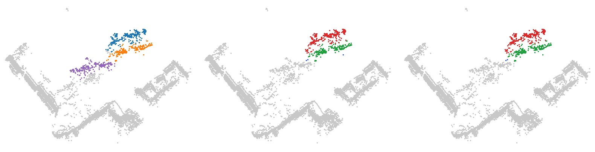
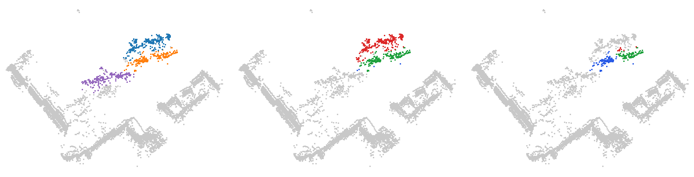
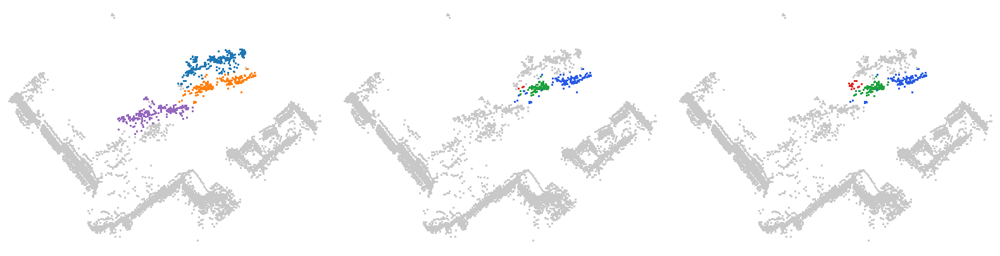
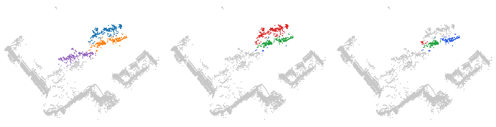
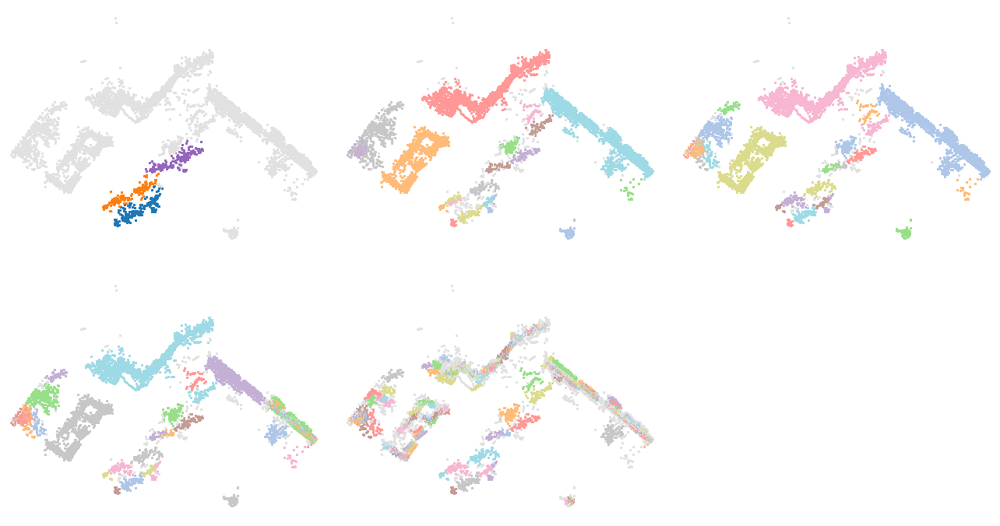

# Vélos garés en rang : HDBSCAN n'isole pas le vélo B

Trame SemanticKITTI `08/001176` (sol retiré par Patchwork++, paramètres de la v8) : 67 114 points dans la hiérarchie, trame entière. Empreinte sha256 du `.bin` : `2843601f1a174ca647ead5172b6be4a7f93a865c37185b54187c9cc75a03de00`.

Quatre vélos garés en deux paires sur un trottoir, devant un bâtiment : A et B côte à côte (leurs boîtes de vérité terrain se recouvrent en vue de dessus), C derrière, collé à un quatrième vélo non suivi (instance 55, qui échoue lui aussi).

Ce qu'il faut regarder : la branche de A absorbe B alors que B n'a jamais été isolé ; A reste apparié (la PQ le compte juste) mais B est perdu, et ce pour tout K de 1 à 10. L'arbre ALPINE en vue de dessus, lui, sépare les trois vélos suivis pour t ∈ [0,096 ; 0,102[ m, six fois sous son seuil vélo : pas de vidéo ALPINE pour cette scène.

## Objets suivis

| objet | classe | vérité terrain | points |
| --- | --- | --- | ---: |
| A | vélo | sem 11, instance 43 | 265 |
| B | vélo | sem 11, instance 57 | 194 |
| C | vélo | sem 11, instance 56 | 207 |

## Résultats

Meilleur IoU d’un nœud de l’arbre (≤ 0,5 : aucune extraction ne rend l’objet), premier niveau apparié, premier niveau fusionné, en mètres.

| méthode | A : IoU / apparié / fusionné | B : IoU / apparié / fusionné | C : IoU / apparié / fusionné | coupe commune |
| --- | --- | --- | --- | --- |
| HDBSCAN, K = 5 | 0,67 / 0,120 / 0,202 | 0,41 / — / 0,171 | 0,75 / 0,145 / 0,202 | 2 sur 3 (r de 0,145 à 0,202) |
| HDBSCAN, K = 10 | 0,62 / 0,186 / 0,270 | 0,40 / — / 0,196 | 0,64 / 0,177 / 0,263 | 2 sur 3 (r de 0,186 à 0,263) |
| ALPINE sans sémantique | 0,91 / 0,076 / 0,128 | 0,82 / 0,096 / 0,102 | 0,89 / 0,063 / 0,126 | 3 sur 3 (t de 0,096 à 0,102) |

Meilleur IoU pour chaque K = min_samples de HDBSCAN, et pour ALPINE sans sémantique :

| objet | K = 1 | K = 2 | K = 3 | K = 4 | K = 5 | K = 6 | K = 7 | K = 8 | K = 9 | K = 10 | ALPINE |
| --- | ---: | ---: | ---: | ---: | ---: | ---: | ---: | ---: | ---: | ---: | ---: |
| A | 0,66 | 0,66 | 0,65 | 0,64 | 0,67 | 0,66 | 0,64 | 0,58 | 0,58 | 0,62 | 0,91 |
| B | 0,41 | 0,41 | 0,41 | 0,42 | 0,41 | 0,40 | 0,40 | 0,40 | 0,40 | 0,40 | 0,82 |
| C | 0,65 | 0,65 | 0,64 | 0,63 | 0,75 | 0,75 | 0,72 | 0,63 | 0,63 | 0,64 | 0,89 |

## Hiérarchie de points HGP (v11)

Catégorie : [HGP et HDBSCAN échouent](../README.md). Hiérarchie de points H^r_{k+1} de `morsehgp3D_v11` contre l'arbre de HDBSCAN (`min_samples` = k), calculés sur la même trame et la même machine (session G4 `claudebouts2`, commit b72fe8771, scikit-learn 1.7.2). Meilleur IoU de chaque objet suivi :

| k | HDBSCAN (A / B / C) | HGP (A / B / C) | issue |
| --- | --- | --- | --- |
| 2 | 0,66 / **0,41** / 0,65 | 0,60 / **0,41** / 0,66 | les deux échouent |
| 3 | 0,65 / **0,41** / 0,64 | 0,63 / **0,48** / 0,83 | les deux échouent |
| 5 | 0,67 / **0,41** / 0,75 | 0,70 / **0,42** / 0,84 | les deux échouent |
| 10 | 0,62 / **0,40** / 0,64 | 0,70 / **0,43** / 0,67 | les deux échouent |

Images : vérité ; meilleur groupe de HDBSCAN pour l'objet clé ; meilleur groupe de HGP pour le même objet (vert : objet dans le groupe ; rouge : autre point dans le groupe ; bleu : objet hors du groupe ; gris : autres points ; fenêtre de 2 m autour des objets suivis).

k = 2, objet B :

k = 3, objet B :

k = 5, objet B :

k = 10, objet B :

## Vidéos

- HDBSCAN, K = 5 : vidéo [sombre](01_velos_en_rang_hdbscan_K5_sombre.mp4) · [clair](01_velos_en_rang_hdbscan_K5_clair.mp4) ; instant clé [sombre](01_velos_en_rang_hdbscan_K5_sombre_instant_cle.png) · [clair](01_velos_en_rang_hdbscan_K5_clair_instant_cle.png) ; bilan [sombre](01_velos_en_rang_hdbscan_K5_sombre_bilan.png) · [clair](01_velos_en_rang_hdbscan_K5_clair_bilan.png)
- HDBSCAN, K = 10 : vidéo [sombre](01_velos_en_rang_hdbscan_K10_sombre.mp4) · [clair](01_velos_en_rang_hdbscan_K10_clair.mp4) ; instant clé [sombre](01_velos_en_rang_hdbscan_K10_sombre_instant_cle.png) · [clair](01_velos_en_rang_hdbscan_K10_clair_instant_cle.png) ; bilan [sombre](01_velos_en_rang_hdbscan_K10_sombre_bilan.png) · [clair](01_velos_en_rang_hdbscan_K10_clair_bilan.png)
- ALPINE sans sémantique : pas de vidéo (arbre calculé, chiffres ci-dessus seulement).

Fusions de branches suivies (HDBSCAN, K = 5) : A+B à r = 0,171 m ; A+B+C à r = 0,202 m.

Chaque vidéo existe en thème sombre (fond marine) et clair (fond blanc), comme Percolia.com : prendre celui du fond des diapositives.

Régénérer : `python3 Zoltan/demos/tools/build_scene.py Zoltan/demos/hgp_echoue_hdbscan_echoue/01_velos_en_rang`, puis `node Zoltan/demos/tools/render_video.cjs Zoltan/demos/hgp_echoue_hdbscan_echoue/01_velos_en_rang <étiquette>` (les deux thèmes ; `--theme clair` ou `--theme sombre` pour un seul).

<!-- plat:debut -->

## Sortie plate (clusters)

mcs = 20, racine exclue, aucune complétion. Panneaux, de gauche à droite puis de haut en bas : vérité ; HDBSCAN (`sklearn` tel quel) ; HGP, EOM z = 1 ; HGP, EOM z = 2 ; HGP, feuilles. Un cluster apparié à un objet suivi (IoU > 1/2) prend la couleur de l'objet ; les autres clusters ont des couleurs pâles ; le bruit est gris clair.

| Sortie (k = 5) | Clusters | Objets retrouvés | Objets fusionnés |
| --- | --- | --- | --- |
| HDBSCAN (`sklearn` tel quel) | 196 | 9 / 14 | 0 |
| HGP, EOM z = 1 | 241 | 11 / 14 | 0 |
| HGP, EOM z = 2 | 338 | 11 / 14 | 0 |
| HGP, feuilles | 1027 | 7 / 14 | 0 |

Données : arbres exportés par `morsehgp3D_v11/bench/points_flat_dump.py` (session G4 `claudeflat0`), tête certifiée `points_flat.py` ; outil : `tools/rendre_plat.py` ; décision : `morsehgp3D_v11/docs/SORTIE_PLATE.md`.

<!-- plat:fin -->
