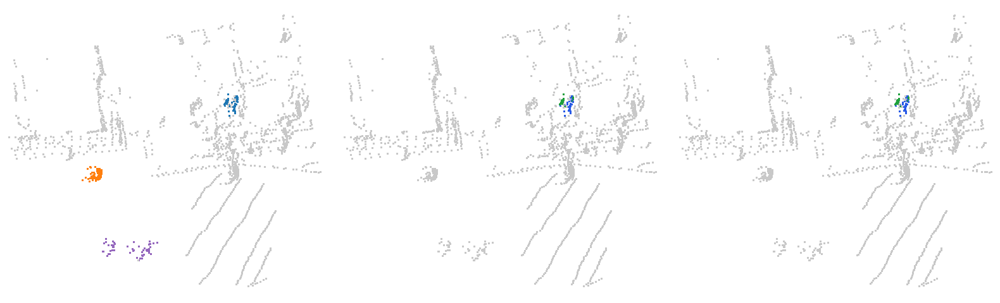
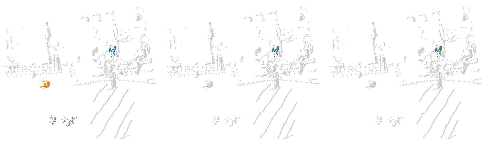
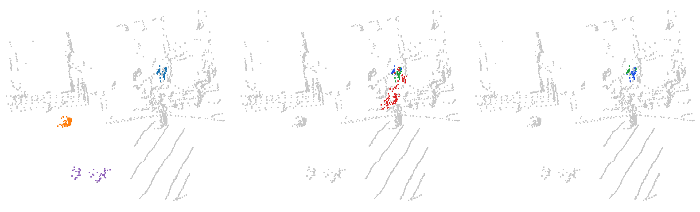
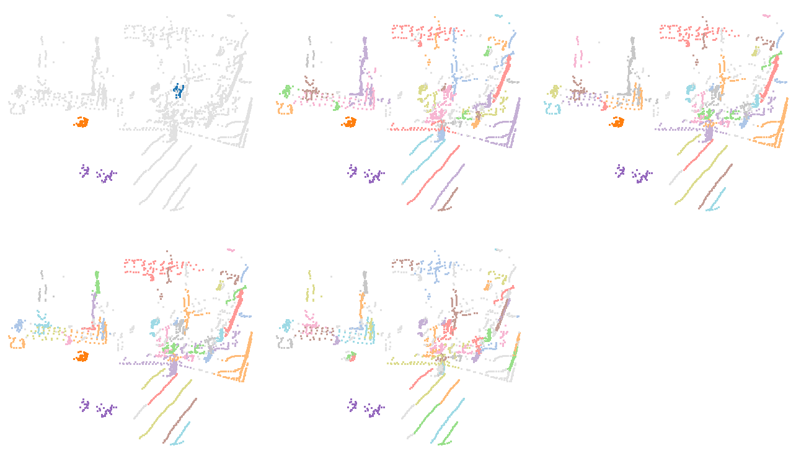

# Piéton près d'une façade : coupé en deux, puis absorbé

Trame SemanticKITTI `08/000048` (sol retiré par Patchwork++, paramètres de la v8) : 44 339 points dans la hiérarchie, trame entière. Empreinte sha256 du `.bin` : `6b3c08eb1b21a0256faeb9204c1b32090f0b7fd0f925e175cdbbe53ba0e9d2b2`.

Trois petits objets à la même distance du capteur. Le piéton A se tient près d'une façade, d'un mobilier (classe « autre objet ») et d'un groupe de piétons en mouvement. À K = 5, la hiérarchie le coupe en deux : à r = 0,305 m, 30 de ses 54 points sont dans un cluster de 762 points (463 « autre objet », 131 piétons en mouvement, 84 bâtiment, 52 trottoir), et les 24 autres forment un nœud pur, son meilleur nœud (IoU 0,44). Le piéton isolé B et le vélo C sont, eux, trouvés (IoU 1,00 et 0,98).

Le meilleur IoU de A vaut 0,44 pour tout K de 1 à 10. L'échec se répète dans les trames voisines (voir `recherche/`). L'arbre ALPINE en vue de dessus isole A (IoU 0,71) : pas de vidéo ALPINE pour cette scène.

Scène écartée au passage : en 08/000055, un autre piéton semblait échouer, mais sa boîte de vérité terrain contient un second piéton annoté sans identifiant d'instance, et le meilleur nœud de HDBSCAN recouvre presque exactement leur union. Le cas mêle un vrai rapprochement et une annotation incomplète ; nous l'avons écarté pour ne pas compter un défaut d'annotation comme un échec.

## Objets suivis

| objet | classe | vérité terrain | points |
| --- | --- | --- | ---: |
| A | piéton près de la façade | sem 30, instance 9 | 54 |
| B | piéton isolé | sem 30, instance 15 | 70 |
| C | vélo | sem 11, instance 24 | 50 |

## Résultats

Meilleur IoU d’un nœud de l’arbre (≤ 0,5 : aucune extraction ne rend l’objet), premier niveau apparié, premier niveau fusionné, en mètres.

| méthode | A : IoU / apparié / fusionné | B : IoU / apparié / fusionné | C : IoU / apparié / fusionné | coupe commune |
| --- | --- | --- | --- | --- |
| HDBSCAN, K = 5 | 0,44 / — / 0,326 | 1,00 / 0,141 / 0,537 | 0,98 / 0,290 / 0,974 | 2 sur 3 (r de 0,290 à 0,537) |
| HDBSCAN, K = 10 | 0,44 / — / 0,265 | 1,00 / 0,215 / 0,537 | 0,98 / 0,431 / 0,974 | 2 sur 3 (r de 0,431 à 0,537) |
| ALPINE sans sémantique | 0,71 / 0,066 / 0,133 | 1,00 / 0,038 / 0,416 | 0,98 / 0,186 / 0,922 | 2 sur 3 (t de 0,066 à 0,133) |

Meilleur IoU pour chaque K = min_samples de HDBSCAN, et pour ALPINE sans sémantique :

| objet | K = 1 | K = 2 | K = 3 | K = 4 | K = 5 | K = 6 | K = 7 | K = 8 | K = 9 | K = 10 | ALPINE |
| --- | ---: | ---: | ---: | ---: | ---: | ---: | ---: | ---: | ---: | ---: | ---: |
| A | 0,44 | 0,44 | 0,44 | 0,44 | 0,44 | 0,44 | 0,44 | 0,44 | 0,44 | 0,44 | 0,71 |
| B | 1,00 | 1,00 | 1,00 | 1,00 | 1,00 | 1,00 | 1,00 | 1,00 | 1,00 | 1,00 | 1,00 |
| C | 0,98 | 0,98 | 0,98 | 0,98 | 0,98 | 0,98 | 0,98 | 0,98 | 0,98 | 0,98 | 0,98 |

## Hiérarchie de points HGP (v11)

Catégorie : [HGP et HDBSCAN échouent](../README.md). Hiérarchie de points H^r_{k+1} de `morsehgp3D_v11` contre l'arbre de HDBSCAN (`min_samples` = k), calculés sur la même trame et la même machine (session G4 `claudebouts2`, commit b72fe8771, scikit-learn 1.7.2). Meilleur IoU de chaque objet suivi :

| k | HDBSCAN (A / B / C) | HGP (A / B / C) | issue |
| --- | --- | --- | --- |
| 2 | **0,44** / 1,00 / 0,98 | **0,44** / 1,00 / 0,98 | les deux échouent |
| 3 | **0,44** / 1,00 / 0,98 | **0,46** / 1,00 / 0,98 | les deux échouent |
| 5 | **0,44** / 1,00 / 0,98 | **0,46** / 1,00 / 0,98 | les deux échouent |
| 10 | **0,44** / 1,00 / 0,98 | **0,44** / 1,00 / 0,98 | les deux échouent |

Images : vérité ; meilleur groupe de HDBSCAN pour l'objet clé ; meilleur groupe de HGP pour le même objet (vert : objet dans le groupe ; rouge : autre point dans le groupe ; bleu : objet hors du groupe ; gris : autres points ; fenêtre de 2 m autour des objets suivis).

k = 2, objet A :

k = 3, objet A :

k = 5, objet A :

k = 10, objet A :

## Vidéos

- HDBSCAN, K = 5 : vidéo [sombre](03_pieton_contre_facade_hdbscan_K5_sombre.mp4) · [clair](03_pieton_contre_facade_hdbscan_K5_clair.mp4) ; instant clé [sombre](03_pieton_contre_facade_hdbscan_K5_sombre_instant_cle.png) · [clair](03_pieton_contre_facade_hdbscan_K5_clair_instant_cle.png) ; bilan [sombre](03_pieton_contre_facade_hdbscan_K5_sombre_bilan.png) · [clair](03_pieton_contre_facade_hdbscan_K5_clair_bilan.png)
- HDBSCAN, K = 10 : vidéo [sombre](03_pieton_contre_facade_hdbscan_K10_sombre.mp4) · [clair](03_pieton_contre_facade_hdbscan_K10_clair.mp4) ; instant clé [sombre](03_pieton_contre_facade_hdbscan_K10_sombre_instant_cle.png) · [clair](03_pieton_contre_facade_hdbscan_K10_clair_instant_cle.png) ; bilan [sombre](03_pieton_contre_facade_hdbscan_K10_sombre_bilan.png) · [clair](03_pieton_contre_facade_hdbscan_K10_clair_bilan.png)
- ALPINE sans sémantique : pas de vidéo (arbre calculé, chiffres ci-dessus seulement).

Fusions de branches suivies (HDBSCAN, K = 5) : A+B à r = 0,708 m ; A+B+C à r = 0,974 m.

Chaque vidéo existe en thème sombre (fond marine) et clair (fond blanc), comme Percolia.com : prendre celui du fond des diapositives.

Régénérer : `python3 Zoltan/demos/tools/build_scene.py Zoltan/demos/hgp_echoue_hdbscan_echoue/03_pieton_contre_facade`, puis `node Zoltan/demos/tools/render_video.cjs Zoltan/demos/hgp_echoue_hdbscan_echoue/03_pieton_contre_facade <étiquette>` (les deux thèmes ; `--theme clair` ou `--theme sombre` pour un seul).

<!-- plat:debut -->

## Sortie plate (clusters)

mcs = 20, racine exclue, aucune complétion. Panneaux, de gauche à droite puis de haut en bas : vérité ; HDBSCAN (`sklearn` tel quel) ; HGP, EOM z = 1 ; HGP, EOM z = 2 ; HGP, feuilles. Un cluster apparié à un objet suivi (IoU > 1/2) prend la couleur de l'objet ; les autres clusters ont des couleurs pâles ; le bruit est gris clair.

| Sortie (k = 5) | Clusters | Objets retrouvés | Objets fusionnés |
| --- | --- | --- | --- |
| HDBSCAN (`sklearn` tel quel) | 226 | 11 / 13 | 0 |
| HGP, EOM z = 1 | 277 | 11 / 13 | 0 |
| HGP, EOM z = 2 | 397 | 9 / 13 | 0 |
| HGP, feuilles | 670 | 3 / 13 | 0 |

Données : arbres exportés par `morsehgp3D_v11/bench/points_flat_dump.py` (session G4 `claudeflat0`), tête certifiée `points_flat.py` ; outil : `tools/rendre_plat.py` ; décision : `morsehgp3D_v11/docs/SORTIE_PLATE.md`.

<!-- plat:fin -->
