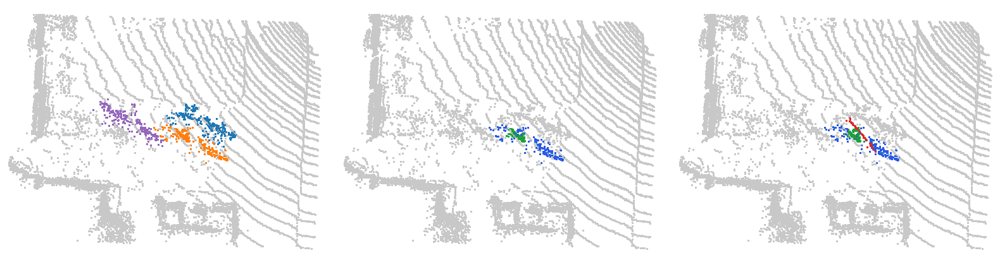
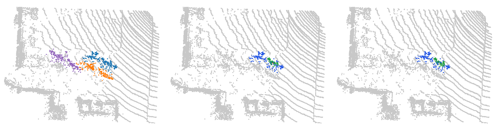
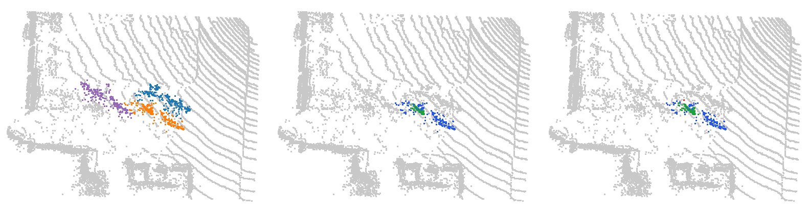

# Vélos en rang, sol conservé : HDBSCAN n'en isole aucun

Trame SemanticKITTI `08/001176` (sol conservé) : 126 267 points dans la hiérarchie, trame entière. Empreinte sha256 du `.bin` : `2843601f1a174ca647ead5172b6be4a7f93a865c37185b54187c9cc75a03de00`.

La même trame que la démo 01, sol conservé. Chaque vélo touche le trottoir : sa branche absorbe le sol avant d'être complète. Aucun des trois n'est isolé, pour aucun K de 1 à 10, alors que sans sol A et C l'étaient.

ALPINE est omis : sa projection en vue de dessus suppose le sol retiré (la sémantique le retire dans l'article).

## Objets suivis

| objet | classe | vérité terrain | points |
| --- | --- | --- | ---: |
| A | vélo | sem 11, instance 43 | 299 |
| B | vélo | sem 11, instance 57 | 218 |
| C | vélo | sem 11, instance 56 | 223 |

## Résultats

Meilleur IoU d’un nœud de l’arbre (≤ 0,5 : aucune extraction ne rend l’objet), premier niveau apparié, premier niveau fusionné, en mètres.

| méthode | A : IoU / apparié / fusionné | B : IoU / apparié / fusionné | C : IoU / apparié / fusionné | coupe commune |
| --- | --- | --- | --- | --- |
| HDBSCAN, K = 5 | 0,22 / — / 0,092 | 0,29 / — / 0,135 | 0,33 / — / 0,145 | 0 sur 3 |
| HDBSCAN, K = 10 | 0,23 / — / 0,121 | 0,24 / — / 0,164 | 0,31 / — / 0,177 | 0 sur 3 |

Meilleur IoU pour chaque K = min_samples de HDBSCAN (ALPINE omis : il suppose le sol retiré) :

| objet | K = 1 | K = 2 | K = 3 | K = 4 | K = 5 | K = 6 | K = 7 | K = 8 | K = 9 | K = 10 |
| --- | ---: | ---: | ---: | ---: | ---: | ---: | ---: | ---: | ---: | ---: |
| A | 0,30 | 0,30 | 0,29 | 0,28 | 0,22 | 0,22 | 0,22 | 0,20 | 0,22 | 0,23 |
| B | 0,31 | 0,31 | 0,30 | 0,31 | 0,29 | 0,28 | 0,26 | 0,25 | 0,25 | 0,24 |
| C | 0,36 | 0,36 | 0,35 | 0,34 | 0,33 | 0,33 | 0,30 | 0,33 | 0,32 | 0,31 |

## Hiérarchie de points HGP (v11)

Catégorie : [HGP et HDBSCAN échouent](../README.md). Hiérarchie de points H^r_{k+1} de `morsehgp3D_v11` contre l'arbre de HDBSCAN (`min_samples` = k), calculés sur la même trame et la même machine (session G4 `claudebouts2`, commit b72fe8771, scikit-learn 1.7.2). Meilleur IoU de chaque objet suivi :

| k | HDBSCAN (A / B / C) | HGP (A / B / C) | issue |
| --- | --- | --- | --- |
| 2 | **0,30** / **0,31** / **0,36** | **0,45** / **0,26** / **0,39** | les deux échouent |
| 3 | **0,29** / **0,30** / **0,35** | **0,30** / **0,33** / 0,56 | les deux échouent |
| 5 | **0,22** / **0,29** / **0,33** | **0,30** / **0,32** / **0,45** | les deux échouent |
| 10 | **0,23** / **0,24** / **0,31** | **0,34** / **0,34** / **0,37** | les deux échouent |

Images : vérité ; meilleur groupe de HDBSCAN pour l'objet clé ; meilleur groupe de HGP pour le même objet (vert : objet dans le groupe ; rouge : autre point dans le groupe ; bleu : objet hors du groupe ; gris : autres points ; fenêtre de 2 m autour des objets suivis).

k = 2, objet B :

k = 3, objet A :

k = 5, objet A :

k = 10, objet B :

## Vidéos

- HDBSCAN, K = 5 : vidéo [sombre](04_velos_en_rang_avec_sol_hdbscan_K5_sombre.mp4) · [clair](04_velos_en_rang_avec_sol_hdbscan_K5_clair.mp4) ; instant clé [sombre](04_velos_en_rang_avec_sol_hdbscan_K5_sombre_instant_cle.png) · [clair](04_velos_en_rang_avec_sol_hdbscan_K5_clair_instant_cle.png) ; bilan [sombre](04_velos_en_rang_avec_sol_hdbscan_K5_sombre_bilan.png) · [clair](04_velos_en_rang_avec_sol_hdbscan_K5_clair_bilan.png)
- HDBSCAN, K = 10 : vidéo [sombre](04_velos_en_rang_avec_sol_hdbscan_K10_sombre.mp4) · [clair](04_velos_en_rang_avec_sol_hdbscan_K10_clair.mp4) ; instant clé [sombre](04_velos_en_rang_avec_sol_hdbscan_K10_sombre_instant_cle.png) · [clair](04_velos_en_rang_avec_sol_hdbscan_K10_clair_instant_cle.png) ; bilan [sombre](04_velos_en_rang_avec_sol_hdbscan_K10_sombre_bilan.png) · [clair](04_velos_en_rang_avec_sol_hdbscan_K10_clair_bilan.png)

Fusions de branches suivies (HDBSCAN, K = 5) : A+B à r = 0,145 m ; A+B+C à r = 0,145 m.

Chaque vidéo existe en thème sombre (fond marine) et clair (fond blanc), comme Percolia.com : prendre celui du fond des diapositives.

Régénérer : `python3 Zoltan/demos/tools/build_scene.py Zoltan/demos/hgp_echoue_hdbscan_echoue/04_velos_en_rang_avec_sol`, puis `node Zoltan/demos/tools/render_video.cjs Zoltan/demos/hgp_echoue_hdbscan_echoue/04_velos_en_rang_avec_sol <étiquette>` (les deux thèmes ; `--theme clair` ou `--theme sombre` pour un seul).
