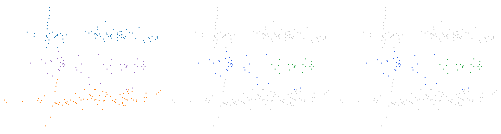

# Trois vélos (trame 06/000016)

Catégorie : [HGP et HDBSCAN échouent](../README.md). Bout de scène SemanticKITTI, séquence 06, trame 000016, réduit aux seuls points de ses objets : ni sol, ni fond, ni autre objet ; mesures G4 `claudebouts1` (tous les bouts, commit f1a53fe1c) et `claudebouts2` (blocs publiés, commit b72fe8771).

| objet | classe | points |
| --- | --- | --- |
| A | vélo | 83 |
| B | vélo | 87 |
| C | vélo | 50 |

Écarts (plus courte distance entre les points de deux objets) : B–C : 0,04 m, A–B : 0,37 m, A–C : 0,12 m. Sites au millimètre : 220.

| k | HDBSCAN, meilleur IoU par objet (A / B / C) | HGP, meilleur IoU par objet | IoU moyen HDBSCAN / HGP | issue |
| --- | --- | --- | --- | --- |
| 2 | 0,63 / 0,88 / **0,40** | 0,62 / 0,86 / **0,40** | 0,64 / 0,63 | les deux échouent |
| 3 | 0,63 / 0,85 / **0,40** | 0,54 / 0,77 / **0,40** | 0,62 / 0,57 | les deux échouent |
| 5 | 0,63 / 0,78 / **0,40** | 0,54 / 0,78 / **0,40** | 0,60 / 0,57 | les deux échouent |
| 10 | **0,47** / 0,61 / **0,30** | **0,39** / 0,75 / **0,40** | 0,46 / 0,51 | les deux échouent |

En gras : objet à 0,5 ou moins : aucun groupe de la hiérarchie ne le recouvre à plus de la moitié.

## Images

Vue de dessus, tournée selon l'axe principal. Trois panneaux : vérité (A bleu, B orange, C violet) ; meilleur groupe de HDBSCAN pour l'objet clé ; meilleur groupe de HGP pour le même objet. Vert : point de l'objet dans le groupe ; rouge : point d'un autre objet dans le groupe ; bleu : point de l'objet hors du groupe ; gris : autres points.

k = 2, objet clé C :


k = 3, objet clé C :


k = 5, objet clé C :



k = 10, objet clé C :


## Données

`bout.json` décrit le bout (trame, empreintes sha256 de la trame, des étiquettes et des fichiers du bout, instances) et donne les meilleurs IoU à chaque ordre. Les points ne sont pas versionnés (CC BY-NC-SA) : `data/` est ignoré par git. Pour les refaire à l'identique depuis les archives officielles :

```sh
python3 Zoltan/demos/tools/chercher_bouts.py --cache CACHE --out Zoltan/demos/hgp_echoue_hdbscan_echoue/bout_06_000016_trois_velos_10_17_18 \
    --rebuild Zoltan/demos/hgp_echoue_hdbscan_echoue/bout_06_000016_trois_velos_10_17_18/bout.json
```
