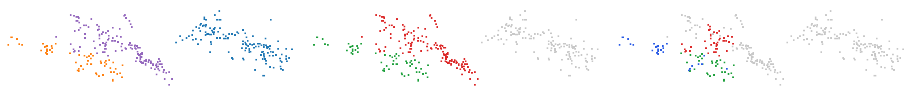
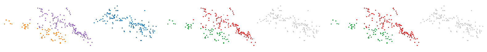
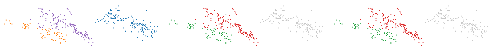
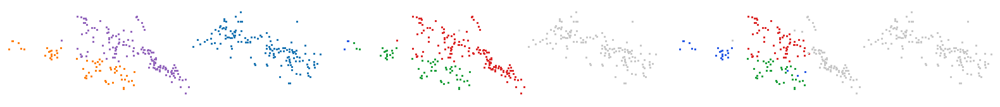

# Trois vélos (trame 08/001170)

Catégorie : [HGP et HDBSCAN échouent](../README.md). Bout de scène SemanticKITTI, séquence 08, trame 001170, réduit aux seuls points de ses objets : ni sol, ni fond, ni autre objet ; mesures G4 `claudebouts1` (tous les bouts, commit f1a53fe1c) et `claudebouts2` (blocs publiés, commit b72fe8771).

| objet | classe | points |
| --- | --- | --- |
| A | vélo | 141 |
| B | vélo | 60 |
| C | vélo | 142 |

Écarts (plus courte distance entre les points de deux objets) : A–C : 0,38 m, B–C : 0,07 m. Sites au millimètre : 343.

| k | HDBSCAN, meilleur IoU par objet (A / B / C) | HGP, meilleur IoU par objet | IoU moyen HDBSCAN / HGP | issue |
| --- | --- | --- | --- | --- |
| 2 | 1,00 / **0,30** / 0,76 | 1,00 / **0,33** / 0,74 | 0,68 / 0,69 | les deux échouent |
| 3 | 0,99 / **0,30** / 0,77 | 1,00 / **0,30** / 0,76 | 0,69 / 0,69 | les deux échouent |
| 5 | 0,99 / **0,30** / 0,74 | 1,00 / **0,30** / 0,77 | 0,67 / 0,69 | les deux échouent |
| 10 | 0,99 / **0,28** / 0,73 | 1,00 / **0,30** / 0,78 | 0,66 / 0,69 | les deux échouent |

En gras : objet à 0,5 ou moins : aucun groupe de la hiérarchie ne le recouvre à plus de la moitié.

## Images

Vue de dessus, tournée selon l'axe principal. Trois panneaux : vérité (A bleu, B orange, C violet) ; meilleur groupe de HDBSCAN pour l'objet clé ; meilleur groupe de HGP pour le même objet. Vert : point de l'objet dans le groupe ; rouge : point d'un autre objet dans le groupe ; bleu : point de l'objet hors du groupe ; gris : autres points.

k = 2, objet clé B :



k = 3, objet clé B :



k = 5, objet clé B :



k = 10, objet clé B :



## Données

`bout.json` décrit le bout (trame, empreintes sha256 de la trame, des étiquettes et des fichiers du bout, instances) et donne les meilleurs IoU à chaque ordre. Les points ne sont pas versionnés (CC BY-NC-SA) : `data/` est ignoré par git. Pour les refaire à l'identique depuis les archives officielles :

```sh
python3 Zoltan/demos/tools/chercher_bouts.py --cache CACHE --out Zoltan/demos/hgp_echoue_hdbscan_echoue/bout_08_001170_trois_velos_43_55_56 \
    --rebuild Zoltan/demos/hgp_echoue_hdbscan_echoue/bout_08_001170_trois_velos_43_55_56/bout.json
```
