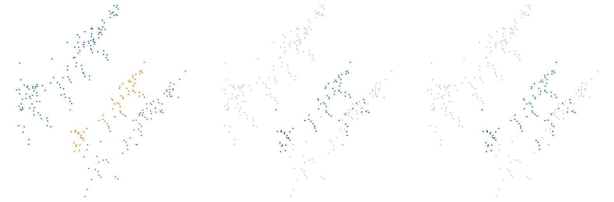
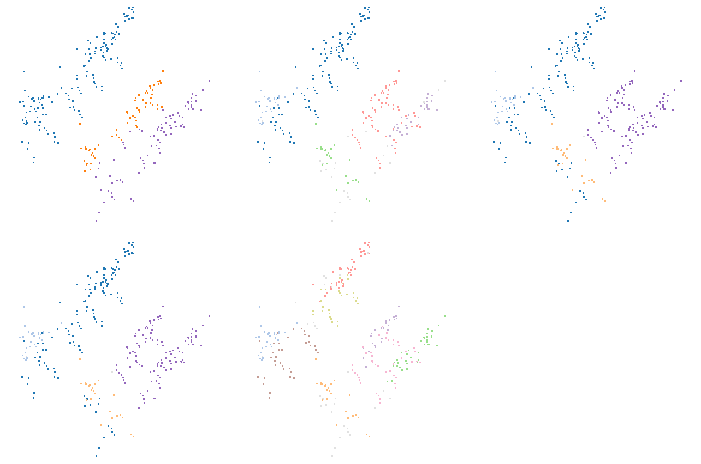

# Trois vélos (trame 06/000774)

Catégorie : [HGP échoue, HDBSCAN réussit](../README.md). Bout de scène SemanticKITTI, séquence 06, trame 000774, réduit aux seuls points de ses objets : ni sol, ni fond, ni autre objet ; mesures G4 `claudebouts1` (tous les bouts, commit f1a53fe1c) et `claudebouts2` (blocs publiés, commit b72fe8771).

| objet | classe | points |
| --- | --- | --- |
| A | vélo | 141 |
| B | vélo | 63 |
| C | vélo | 86 |

Écarts (plus courte distance entre les points de deux objets) : A–B : 0,30 m, A–C : 0,43 m, B–C : 0,03 m. Sites au millimètre : 290.

| k | HDBSCAN, meilleur IoU par objet (A / B / C) | HGP, meilleur IoU par objet | IoU moyen HDBSCAN / HGP | issue |
| --- | --- | --- | --- | --- |
| 2 | 0,81 / **0,49** / 0,58 | 0,80 / **0,48** / 0,58 | 0,63 / 0,62 | les deux échouent |
| 3 | 0,80 / 0,51 / 0,58 | 0,80 / **0,47** / 0,52 | 0,63 / 0,60 | HGP échoue, HDBSCAN réussit |
| 5 | 0,80 / **0,49** / 0,55 | 0,80 / **0,47** / 0,58 | 0,61 / 0,62 | les deux échouent |
| 10 | 0,76 / **0,43** / 0,53 | 0,80 / **0,44** / 0,52 | 0,57 / 0,59 | les deux échouent |

En gras : objet à 0,5 ou moins : aucun groupe de la hiérarchie ne le recouvre à plus de la moitié.

<!-- video:début -->
Vidéos HGP contre HDBSCAN de ce groupe, en deux variantes (instances seules, sol retiré automatiquement) : [`videos_hgp_hdbscan/06_000774_trois_velos_6_14_15`](../../videos_hgp_hdbscan/06_000774_trois_velos_6_14_15/README.md).
<!-- video:fin -->

## Images

Vue de dessus, tournée selon l'axe principal. Trois panneaux : vérité (A bleu, B orange, C violet) ; meilleur groupe de HDBSCAN pour l'objet clé ; meilleur groupe de HGP pour le même objet. Vert : point de l'objet dans le groupe ; rouge : point d'un autre objet dans le groupe ; bleu : point de l'objet hors du groupe ; gris : autres points.

k = 3, objet clé B :



## Données

`bout.json` décrit le bout (trame, empreintes sha256 de la trame, des étiquettes et des fichiers du bout, instances) et donne les meilleurs IoU à chaque ordre. Les points ne sont pas versionnés (CC BY-NC-SA) : `data/` est ignoré par git. Pour les refaire à l'identique depuis les archives officielles :

```sh
python3 Zoltan/demos/tools/chercher_bouts.py --cache CACHE --out Zoltan/demos/hgp_echoue_hdbscan_reussit/bout_06_000774_trois_velos_6_14_15 \
    --rebuild Zoltan/demos/hgp_echoue_hdbscan_reussit/bout_06_000774_trois_velos_6_14_15/bout.json
```

<!-- plat:debut -->

## Sortie plate (clusters)

mcs = 20, racine exclue, aucune complétion. Panneaux, de gauche à droite puis de haut en bas : vérité ; HDBSCAN (`sklearn` tel quel) ; HGP, EOM z = 1 ; HGP, EOM z = 2 ; HGP, feuilles. Un cluster apparié à un objet suivi (IoU > 1/2) prend la couleur de l'objet ; les autres clusters ont des couleurs pâles ; le bruit est gris clair.



| Sortie (k = 3) | Clusters | Objets retrouvés | Objets fusionnés |
| --- | --- | --- | --- |
| HDBSCAN (`sklearn` tel quel) | 5 | 1 / 3 | 0 |
| HGP, EOM z = 1 | 4 | 1 / 3 | 2 |
| HGP, EOM z = 2 | 4 | 1 / 3 | 2 |
| HGP, feuilles | 8 | 0 / 3 | 0 |

Données : arbres exportés par `morsehgp3D_v11/bench/points_flat_dump.py` (session G4 `claudeflat0`), tête certifiée `points_flat.py` ; outil : `tools/rendre_plat.py` ; décision : `morsehgp3D_v11/docs/SORTIE_PLATE.md`.

<!-- plat:fin -->
