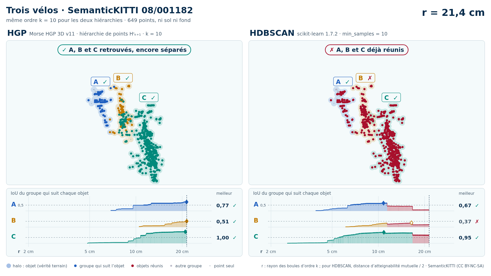
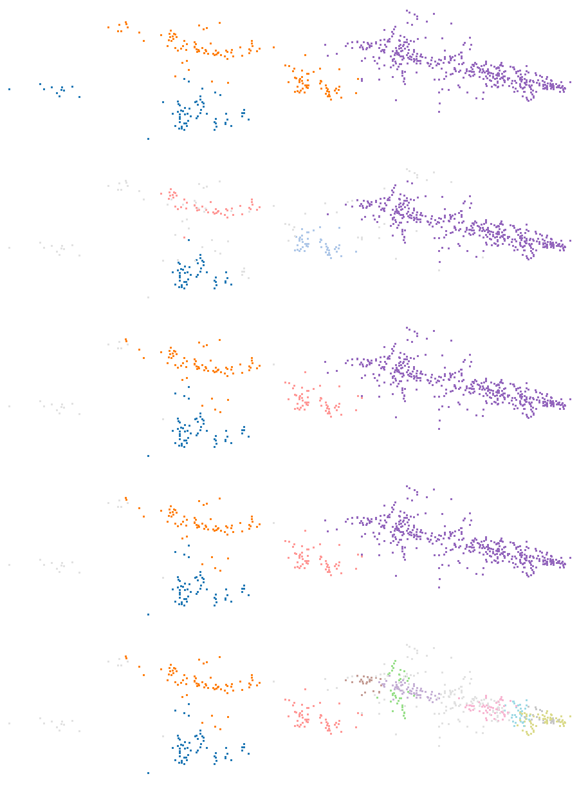

# Trois vélos (trame 08/001182)

Catégorie : [HGP réussit, HDBSCAN échoue](../README.md). Bout de scène SemanticKITTI, séquence 08, trame 001182, réduit aux seuls points de ses objets : ni sol, ni fond, ni autre objet ; mesures G4 `claudebouts1` (tous les bouts, commit f1a53fe1c) et `claudebouts2` (blocs publiés, commit b72fe8771).

| objet | classe | points |
| --- | --- | --- |
| A | vélo | 73 |
| B | vélo | 132 |
| C | vélo | 444 |

Écarts (plus courte distance entre les points de deux objets) : A–B : 0,09 m, A–C : 0,74 m, B–C : 0,03 m. Sites au millimètre : 649.

| k | HDBSCAN, meilleur IoU par objet (A / B / C) | HGP, meilleur IoU par objet | IoU moyen HDBSCAN / HGP | issue |
| --- | --- | --- | --- | --- |
| 2 | 0,82 / 0,56 / 0,94 | 0,68 / **0,49** / 0,99 | 0,78 / 0,72 | HGP échoue, HDBSCAN réussit |
| 3 | 0,81 / 0,55 / 0,94 | 0,79 / 0,56 / 0,98 | 0,77 / 0,78 | les deux réussissent |
| 5 | 0,77 / 0,52 / 0,93 | 0,78 / 0,51 / 0,99 | 0,74 / 0,76 | les deux réussissent |
| 10 | 0,67 / **0,37** / 0,95 | 0,77 / 0,51 / 1,00 | 0,66 / 0,76 | HGP réussit, HDBSCAN échoue |

En gras : objet à 0,5 ou moins : aucun groupe de la hiérarchie ne le recouvre à plus de la moitié.

<!-- video:début -->
## Vidéo : HGP contre HDBSCAN, k = 10

<picture>
  <source media="(prefers-color-scheme: dark)" srcset="bout_08_001182_trois_velos_55_56_57_hgp_hdbscan_k10_sombre_instant_cle.png">
  
</picture>

Vidéo de 48 s, 1920 × 1080 : [thème sombre](bout_08_001182_trois_velos_55_56_57_hgp_hdbscan_k10_sombre.mp4) · [thème clair](bout_08_001182_trois_velos_55_56_57_hgp_hdbscan_k10_clair.mp4) ; image finale : [sombre](bout_08_001182_trois_velos_55_56_57_hgp_hdbscan_k10_sombre_bilan.png) · [clair](bout_08_001182_trois_velos_55_56_57_hgp_hdbscan_k10_clair_bilan.png).

Mêmes 649 points, même ordre k = 10 : à gauche la hiérarchie de points HGP de `morsehgp3D_v11` (Hʳₖ₊₁), à droite l'arbre de HDBSCAN (scikit-learn 1.7.2, `min_samples` = 10). Le niveau r croît pour les deux à la fois et s'arrête à chaque événement des groupes qui suivent les objets (mêmes textes que les bandeaux de la vidéo) :

| r | HGP | HDBSCAN |
| --- | --- | --- |
| 5,5 cm |  | ✓ C retrouvé · IoU 0,502 |
| 6,6 cm |  | ✓ A retrouvé · IoU 0,51 |
| 10,7 cm | ✓ C retrouvé · IoU 0,66 |  |
| 11,2 cm | ✓ A retrouvé · IoU 0,51 |  |
| 11,4 cm | A et B encore séparés | ✗ A et B réunis : B jamais retrouvé |
| 16,7 cm | A, B et C encore séparés | ✗ A, B et C réunis : B jamais retrouvé |
| 21,4 cm | ✓ A, B et C retrouvés, encore séparés | ✗ A, B et C déjà réunis |
| 22,0 cm | ✓ A et B réunis, chacun retrouvé avant |  |
| 24,9 cm | ✓ A, B et C réunis, chacun retrouvé avant |  |

Meilleur IoU de chaque objet : HGP A 0,77, B 0,51, C 1,00 ; HDBSCAN A 0,67, B 0,37, C 0,95. Légende, convention de niveau et contrôle des calculs : [README de `demos/`](../../README.md#vidéos-hgp-contre-hdbscan-des-bouts) ; nombres : [`resultats_duel_k10.json`](resultats_duel_k10.json).

<!-- video:fin -->

## Images

Vue de dessus, tournée selon l'axe principal. Trois panneaux : vérité (A bleu, B orange, C violet) ; meilleur groupe de HDBSCAN pour l'objet clé ; meilleur groupe de HGP pour le même objet. Vert : point de l'objet dans le groupe ; rouge : point d'un autre objet dans le groupe ; bleu : point de l'objet hors du groupe ; gris : autres points.

k = 10, objet clé B :


## Données

`bout.json` décrit le bout (trame, empreintes sha256 de la trame, des étiquettes et des fichiers du bout, instances) et donne les meilleurs IoU à chaque ordre. Les points ne sont pas versionnés (CC BY-NC-SA) : `data/` est ignoré par git. Pour les refaire à l'identique depuis les archives officielles :

```sh
python3 Zoltan/demos/tools/chercher_bouts.py --cache CACHE --out Zoltan/demos/hgp_reussit_hdbscan_echoue/bout_08_001182_trois_velos_55_56_57 \
    --rebuild Zoltan/demos/hgp_reussit_hdbscan_echoue/bout_08_001182_trois_velos_55_56_57/bout.json
```

<!-- plat:debut -->

## Sortie plate (clusters)

mcs = 20, racine exclue, aucune complétion. Panneaux, de gauche à droite puis de haut en bas : vérité ; HDBSCAN (`sklearn` tel quel) ; HGP, EOM z = 1 ; HGP, EOM z = 2 ; HGP, feuilles. Un cluster apparié à un objet suivi (IoU > 1/2) prend la couleur de l'objet ; les autres clusters ont des couleurs pâles ; le bruit est gris clair.



| Sortie (k = 10) | Clusters | Objets retrouvés | Objets fusionnés |
| --- | --- | --- | --- |
| HDBSCAN (`sklearn` tel quel) | 4 | 2 / 3 | 0 |
| HGP, EOM z = 1 | 4 | 3 / 3 | 0 |
| HGP, EOM z = 2 | 4 | 3 / 3 | 0 |
| HGP, feuilles | 10 | 2 / 3 | 0 |

Données : arbres exportés par `morsehgp3D_v11/bench/points_flat_dump.py` (session G4 `claudeflat0`), tête certifiée `points_flat.py` ; outil : `tools/rendre_plat.py` ; décision : `morsehgp3D_v11/docs/SORTIE_PLATE.md`.

<!-- plat:fin -->
