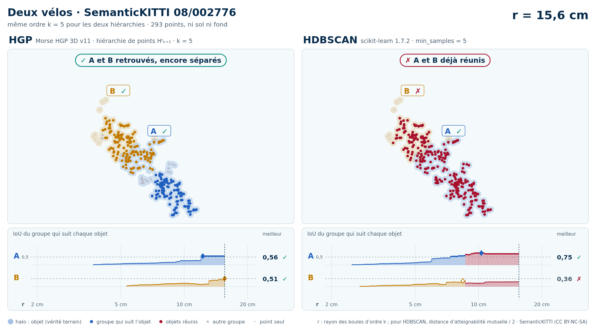
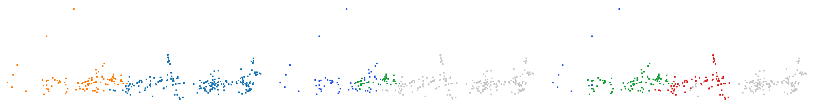
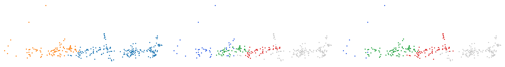
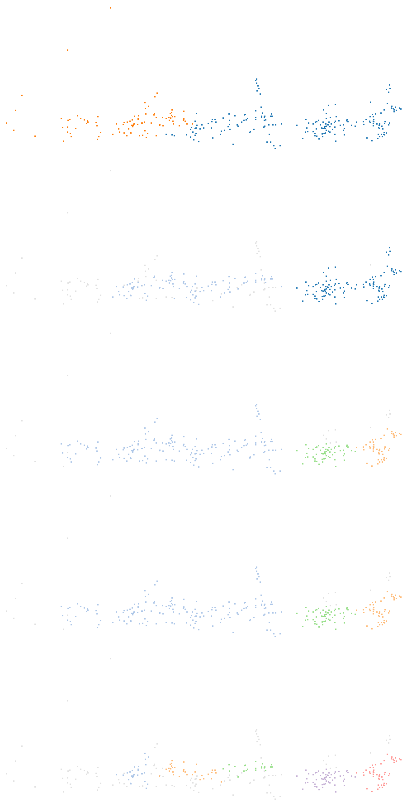

# Deux vélos (trame 08/002776)

Catégorie : [HGP réussit, HDBSCAN échoue](../README.md). Bout de scène SemanticKITTI, séquence 08, trame 002776, réduit aux seuls points de ses objets : ni sol, ni fond, ni autre objet ; mesures G4 `claudebouts1` (tous les bouts, commit f1a53fe1c) et `claudebouts2` (blocs publiés, commit b72fe8771).

| objet | classe | points |
| --- | --- | --- |
| A | vélo | 198 |
| B | vélo | 95 |

Écarts (plus courte distance entre les points de deux objets) : A–B : 0,13 m. Sites au millimètre : 293.

| k | HDBSCAN, meilleur IoU par objet (A / B) | HGP, meilleur IoU par objet | IoU moyen HDBSCAN / HGP | issue |
| --- | --- | --- | --- | --- |
| 2 | 0,75 / **0,42** | 0,69 / **0,49** | 0,59 / 0,59 | les deux échouent |
| 3 | 0,75 / **0,41** | 0,69 / 0,51 | 0,58 / 0,60 | HGP réussit, HDBSCAN échoue |
| 5 | 0,75 / **0,36** | 0,70 / 0,53 | 0,56 / 0,61 | HGP réussit, HDBSCAN échoue |
| 10 | 0,70 / **0,45** | 0,70 / **0,49** | 0,57 / 0,59 | les deux échouent |

En gras : objet à 0,5 ou moins : aucun groupe de la hiérarchie ne le recouvre à plus de la moitié.

<!-- video:début -->
## Vidéo : HGP contre HDBSCAN, k = 5

<picture>
  <source media="(prefers-color-scheme: dark)" srcset="bout_08_002776_deux_velos_17_64_hgp_hdbscan_k5_sombre_instant_cle.png">
  
</picture>

Vidéo de 38 s, 1920 × 1080 : [thème sombre](bout_08_002776_deux_velos_17_64_hgp_hdbscan_k5_sombre.mp4) · [thème clair](bout_08_002776_deux_velos_17_64_hgp_hdbscan_k5_clair.mp4) ; image finale : [sombre](bout_08_002776_deux_velos_17_64_hgp_hdbscan_k5_sombre_bilan.png) · [clair](bout_08_002776_deux_velos_17_64_hgp_hdbscan_k5_clair_bilan.png).

Mêmes 293 points, même ordre k = 5 : à gauche la hiérarchie de points HGP de `morsehgp3D_v11` (Hʳₖ₊₁), à droite l'arbre de HDBSCAN (scikit-learn 1.7.2, `min_samples` = 5). Le niveau r croît pour les deux à la fois et s'arrête à chaque événement des groupes qui suivent les objets (mêmes textes que les bandeaux de la vidéo) :

| r | HGP | HDBSCAN |
| --- | --- | --- |
| 7,3 cm |  | ✓ A retrouvé · IoU 0,51 |
| 8,7 cm | A et B encore séparés | ✗ A et B réunis : B jamais retrouvé |
| 12,0 cm | ✓ A retrouvé · IoU 0,53 |  |
| 15,6 cm | ✓ A et B retrouvés, encore séparés | ✗ A et B déjà réunis |
| 17,7 cm | ✓ A et B réunis, chacun retrouvé avant |  |

Meilleur IoU de chaque objet : HGP A 0,70, B 0,53 ; HDBSCAN A 0,75, B 0,36. Légende, convention de niveau et contrôle des calculs : [README de `demos/`](../../README.md#vidéos-hgp-contre-hdbscan-des-bouts) ; nombres : [`resultats_duel_k5.json`](resultats_duel_k5.json).

<!-- video:fin -->

## Images

Vue de dessus, tournée selon l'axe principal. Trois panneaux : vérité (A bleu, B orange, C violet) ; meilleur groupe de HDBSCAN pour l'objet clé ; meilleur groupe de HGP pour le même objet. Vert : point de l'objet dans le groupe ; rouge : point d'un autre objet dans le groupe ; bleu : point de l'objet hors du groupe ; gris : autres points.

k = 3, objet clé B :



k = 5, objet clé B :



## Données

`bout.json` décrit le bout (trame, empreintes sha256 de la trame, des étiquettes et des fichiers du bout, instances) et donne les meilleurs IoU à chaque ordre. Les points ne sont pas versionnés (CC BY-NC-SA) : `data/` est ignoré par git. Pour les refaire à l'identique depuis les archives officielles :

```sh
python3 Zoltan/demos/tools/chercher_bouts.py --cache CACHE --out Zoltan/demos/hgp_reussit_hdbscan_echoue/bout_08_002776_deux_velos_17_64 \
    --rebuild Zoltan/demos/hgp_reussit_hdbscan_echoue/bout_08_002776_deux_velos_17_64/bout.json
```

<!-- plat:debut -->

## Sortie plate (clusters)

mcs = 20, racine exclue, aucune complétion. Panneaux, de gauche à droite puis de haut en bas : vérité ; HDBSCAN (`sklearn` tel quel) ; HGP, EOM z = 1 ; HGP, EOM z = 2 ; HGP, feuilles. Un cluster apparié à un objet suivi (IoU > 1/2) prend la couleur de l'objet ; les autres clusters ont des couleurs pâles ; le bruit est gris clair.



| Sortie (k = 5) | Clusters | Objets retrouvés | Objets fusionnés |
| --- | --- | --- | --- |
| HDBSCAN (`sklearn` tel quel) | 2 | 1 / 2 | 0 |
| HGP, EOM z = 1 | 3 | 0 / 2 | 1 |
| HGP, EOM z = 2 | 3 | 0 / 2 | 1 |
| HGP, feuilles | 5 | 0 / 2 | 0 |

Données : arbres exportés par `morsehgp3D_v11/bench/points_flat_dump.py` (session G4 `claudeflat0`), tête certifiée `points_flat.py` ; outil : `tools/rendre_plat.py` ; décision : `morsehgp3D_v11/docs/SORTIE_PLATE.md`.

<!-- plat:fin -->
