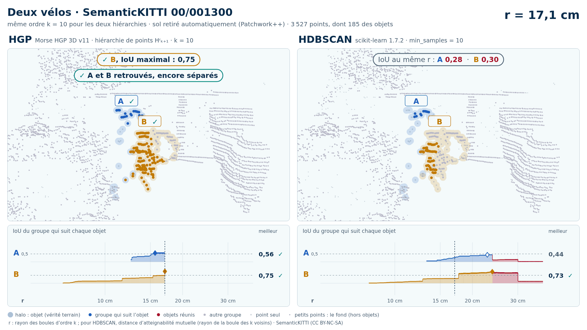
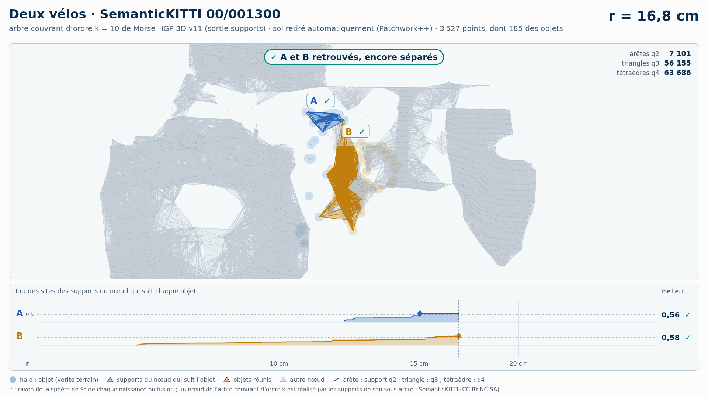

# Deux vélos (trame 00/001300) — sol retiré automatiquement (Patchwork++)

[Exemple](../README.md) · autre variante : [instances de la vérité terrain seules](../instances/README.md) · [liste des exemples](../../README.md)

**k = 10** (HGP réussit, HDBSCAN échoue) :

<picture>
  <source media="(prefers-color-scheme: dark)" srcset="00_001300_deux_velos_53_67_sans_sol_k10_sombre_instant_cle.png">
  
</picture>

Vidéo de 67 s, k = 10, 1920 × 1080 : [thème sombre](00_001300_deux_velos_53_67_sans_sol_k10_sombre.mp4) · [thème clair](00_001300_deux_velos_53_67_sans_sol_k10_clair.mp4) ; image finale : [sombre](00_001300_deux_velos_53_67_sans_sol_k10_sombre_bilan.png) · [clair](00_001300_deux_velos_53_67_sans_sol_k10_clair_bilan.png).

<picture>
  <source media="(prefers-color-scheme: dark)" srcset="00_001300_deux_velos_53_67_sans_sol_k10_supports_sombre_instant_cle.png">
  
</picture>

Hiérarchie des supports q2, q3, q4 au même ordre, 43 s : [thème sombre](00_001300_deux_velos_53_67_sans_sol_k10_supports_sombre.mp4) · [thème clair](00_001300_deux_velos_53_67_sans_sol_k10_supports_clair.mp4) ; image finale : [sombre](00_001300_deux_velos_53_67_sans_sol_k10_supports_sombre_bilan.png) · [clair](00_001300_deux_velos_53_67_sans_sol_k10_supports_clair_bilan.png). Arbre couvrant d'ordre 10 : 155 531 nœuds, 155 533 naissances et fusions, chacune avec son support S\* (155 533 supports : 8 323 arêtes q2, 67 817 triangles q3, 79 393 tétraèdres q4).

Points : tout ce que Patchwork++ (paramètres de la v8) ne classe pas en sol dans la boîte horizontale des objets élargie de 1 m, à toutes hauteurs : 3 527 points, dont 185 des objets (A 36, B 149) ; 111 points des objets retirés comme sol. Aucune étiquette ne sert au nettoyage : elles ne servent qu'à mesurer.

Meilleur IoU de chaque objet, même mesure que la campagne G4 (points void exclus) :

| k | HGP, meilleur IoU (A / B) | HDBSCAN, meilleur IoU | issue |
| --- | --- | --- | --- |
| 5 | 0,56 / 0,72 | 0,56 / 0,73 | les deux réussissent |
| 10 | 0,56 / 0,75 | **0,44** / 0,73 | HGP réussit, HDBSCAN échoue |

En gras : objet à 0,5 ou moins, qu'aucun groupe de la hiérarchie ne recouvre à plus de la moitié. Une vidéo par ordre où HGP réussit et HDBSCAN échoue ; sans gain, une seule, à k = 5.

## Événements de la vidéo à k = 10

Mêmes textes que les bandeaux. Premier balayage, HDBSCAN seul (HGP attend) :

| r | HDBSCAN |
| --- | --- |
| 23,9 cm | ✓ B, IoU maximal : 0,73 |
| 23,9 cm | ✗ A et B réunis : A jamais retrouvé |
| 30,0 cm | ✗ A et B, déjà réunis, fusionnent avec la végétation |

Second balayage, HGP ; HDBSCAN le suit au même r, sans pause propre :

| r | HGP | HDBSCAN au même r |
| --- | --- | --- |
| 15,6 cm | ✓ A, IoU maximal : 0,56 | IoU au même r : A 0,17 |
| 17,1 cm | ✓ B, IoU maximal : 0,75 ; ✓ A et B retrouvés, encore séparés | IoU au même r : A 0,28  ·  B 0,30 |
| 17,7 cm | ✓ A et B réunis, chacun retrouvé avant |  |
| 23,7 cm | ✗ A et B, déjà réunis, fusionnent avec la végétation |  |

Nombres : [`resultats_duel_k10.json`](resultats_duel_k10.json).

## Hiérarchie des supports à k = 10

Meilleur IoU des sites des supports du nœud qui suit chaque objet : 0,56 / 0,74 (hiérarchie de points HGP : 0,56 / 0,75). Événements, mêmes textes que les bandeaux :

| r | supports |
| --- | --- |
| 15,0 cm | ✓ A, IoU maximal : 0,56 |
| 16,8 cm | ✓ A et B retrouvés, encore séparés |
| 17,1 cm | ✓ B, IoU maximal : 0,74 |
| 17,7 cm | ✓ A et B réunis, chacun retrouvé avant |
| 23,7 cm | ✗ A et B, déjà réunis, fusionnent avec la végétation |

Nombres : [`resultats_supports_k10.json`](resultats_supports_k10.json).

Lecture, légende et convention de niveau : [README de la liste](../../README.md#lire-une-vidéo).

## Données

`bout.json` décrit la variante (trame, empreintes, instances, découpe, mesures). Les points ne sont pas versionnés (CC BY-NC-SA) : `data/` est ignoré par git ; ils se refont depuis les archives officielles (README de la liste, « Reproduire »).

