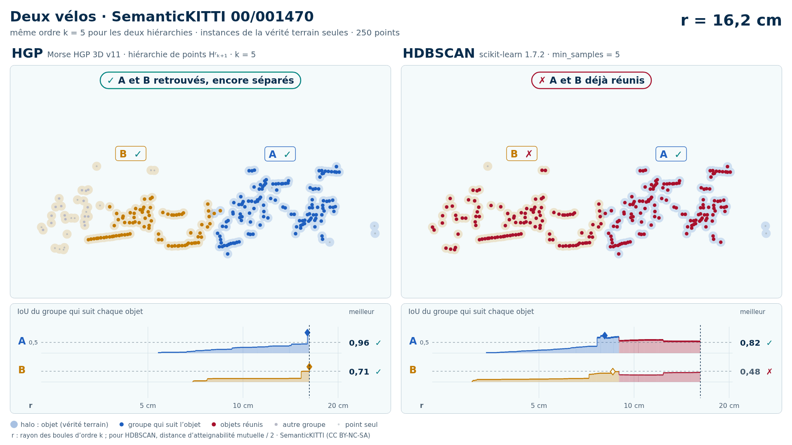
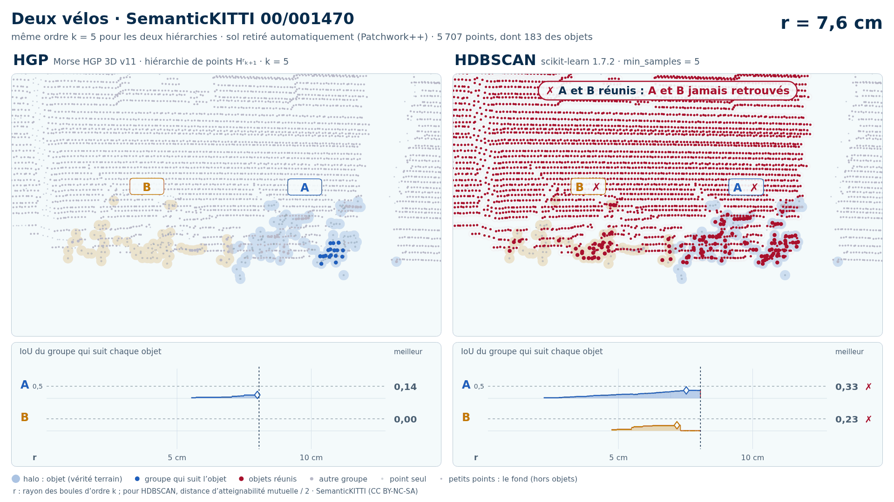

# Deux vélos (trame 00/001470)

Exemple vidéo HGP contre HDBSCAN ([liste](../README.md)) : SemanticKITTI, séquence 00, trame 001470. Deux variantes, chacune dans son sous-dossier :

- [`instances/`](instances/README.md) : les seuls points des objets (vérité terrain), 250 points ;
- [`sans_sol/`](sans_sol/README.md) : tout ce que Patchwork++ ne classe pas en sol dans la boîte des objets élargie de 1 m, 5 707 points (aucune étiquette ne sert au nettoyage).

| objet | classe | points (instances) | points gardés sans sol | points retirés comme sol |
| --- | --- | --- | --- | --- |
| A | vélo | 138 | 119 | 19 |
| B | vélo | 112 | 64 | 48 |

Écarts (plus courte distance entre les points de deux objets) : A–B : 0,12 m. Dans la découpe sans sol : aucune autre instance ; 0 points void ; 810 points de sol retirés.

| variante | k | HGP, meilleur IoU (A / B) | HDBSCAN, meilleur IoU | issue |
| --- | --- | --- | --- | --- |
| instances de la vérité terrain seules | 5 | 0,96 / 0,71 | 0,82 / **0,48** | HGP réussit, HDBSCAN échoue |
| instances de la vérité terrain seules | 10 | 0,62 / **0,48** | 0,62 / **0,45** | les deux échouent |
| sol retiré automatiquement (Patchwork++) | 5 | **0,31** / **0,31** | **0,33** / **0,23** | les deux échouent |
| sol retiré automatiquement (Patchwork++) | 10 | **0,32** / **0,28** | **0,25** / **0,09** | les deux échouent |

En gras : objet à 0,5 ou moins, qu'aucun groupe de la hiérarchie ne recouvre à plus de la moitié. Vidéos : k = 5 (instances), k = 5 (sans sol). Objets : instances SemanticKITTI A = 43, B = 61.

<!-- video:début -->
## Vidéos

| | instances de la vérité terrain seules | sol retiré automatiquement (Patchwork++) |
| --- | --- | --- |
| vidéo | [README](instances/README.md) · k = 5 : [sombre](instances/00_001470_deux_velos_43_61_instances_k5_sombre.mp4) · [clair](instances/00_001470_deux_velos_43_61_instances_k5_clair.mp4) | [README](sans_sol/README.md) · k = 5 : [sombre](sans_sol/00_001470_deux_velos_43_61_sans_sol_k5_sombre.mp4) · [clair](sans_sol/00_001470_deux_velos_43_61_sans_sol_k5_clair.mp4) |

**Instances de la vérité terrain seules** :

<picture>
  <source media="(prefers-color-scheme: dark)" srcset="instances/00_001470_deux_velos_43_61_instances_k5_sombre_instant_cle.png">
  
</picture>

**Sol retiré automatiquement (Patchwork++)** :

<picture>
  <source media="(prefers-color-scheme: dark)" srcset="sans_sol/00_001470_deux_velos_43_61_sans_sol_k5_sombre_instant_cle.png">
  
</picture>

<!-- video:fin -->
