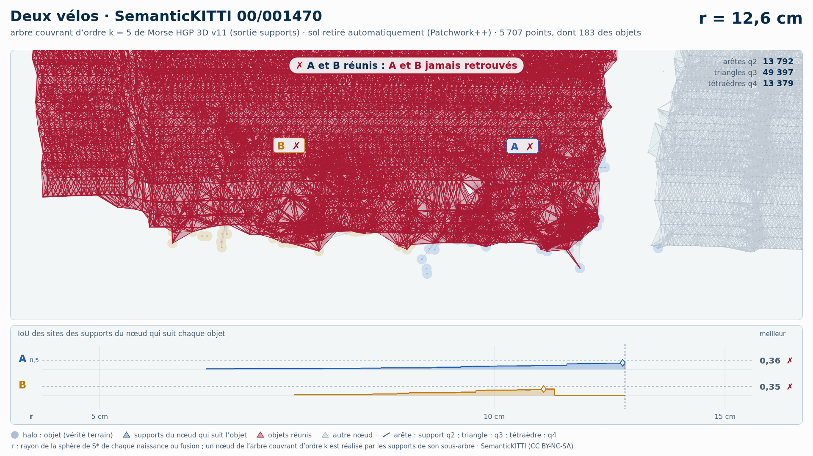

# Deux vélos (trame 00/001470) — sol retiré automatiquement (Patchwork++)

[Exemple](../README.md) · autre variante : [instances de la vérité terrain seules](../instances/README.md) · [liste des exemples](../../README.md)

**k = 5** (les deux échouent, aucun gain HGP dans cette variante) :

<picture>
  <source media="(prefers-color-scheme: dark)" srcset="00_001470_deux_velos_43_61_sans_sol_k5_sombre_instant_cle.png">
  
</picture>

Vidéo de 60 s, k = 5, 1920 × 1080 : [thème sombre](00_001470_deux_velos_43_61_sans_sol_k5_sombre.mp4) · [thème clair](00_001470_deux_velos_43_61_sans_sol_k5_clair.mp4) ; image finale : [sombre](00_001470_deux_velos_43_61_sans_sol_k5_sombre_bilan.png) · [clair](00_001470_deux_velos_43_61_sans_sol_k5_clair_bilan.png).

<picture>
  <source media="(prefers-color-scheme: dark)" srcset="00_001470_deux_velos_43_61_sans_sol_k5_supports_sombre_instant_cle.png">
  
</picture>

Hiérarchie des supports q2, q3, q4 au même ordre, 37 s : [thème sombre](00_001470_deux_velos_43_61_sans_sol_k5_supports_sombre.mp4) · [thème clair](00_001470_deux_velos_43_61_sans_sol_k5_supports_clair.mp4) ; image finale : [sombre](00_001470_deux_velos_43_61_sans_sol_k5_supports_sombre_bilan.png) · [clair](00_001470_deux_velos_43_61_sans_sol_k5_supports_clair_bilan.png). Arbre couvrant d'ordre 5 : 81 806 nœuds, 81 839 naissances et fusions, chacune avec son support S\* (81 839 supports : 14 539 arêtes q2, 52 447 triangles q3, 14 853 tétraèdres q4).

Points : tout ce que Patchwork++ (paramètres de la v8) ne classe pas en sol dans la boîte horizontale des objets élargie de 1 m, à toutes hauteurs : 5 707 points, dont 183 des objets (A 119, B 64) ; 67 points des objets retirés comme sol. Aucune étiquette ne sert au nettoyage : elles ne servent qu'à mesurer.

Meilleur IoU de chaque objet (meilleur bloc ; seuls les points non étiquetés et aberrants, classes 0 et 1, sont exclus : « autre structure » et « autre objet » comptent comme du fond) :

| k | HGP, meilleur IoU (A / B) | HDBSCAN, meilleur IoU | issue |
| --- | --- | --- | --- |
| 5 | **0,31** / **0,31** | **0,33** / **0,23** | les deux échouent |
| 10 | **0,32** / **0,28** | **0,25** / **0,09** | les deux échouent |

En gras : objet à 0,5 ou moins, qu'aucun groupe de la hiérarchie ne recouvre à plus de la moitié. Une vidéo par ordre où HGP réussit et HDBSCAN échoue ; sans gain, une seule, à k = 5.

## Événements de la vidéo à k = 5

Mêmes textes que les bandeaux. Premier balayage, HDBSCAN seul (HGP attend) :

| r | HDBSCAN |
| --- | --- |
| 13,8 cm | ✗ B fusionne avec le bâtiment · IoU 0,23 → 0,01 |
| 15,3 cm | ✗ A et B réunis : A et B jamais retrouvés |

Second balayage, HGP ; HDBSCAN le suit au même r, sans pause propre :

| r | HGP | HDBSCAN au même r |
| --- | --- | --- |
| 11,1 cm | ✗ B fusionne avec le bâtiment · IoU 0,31 → 0,01 |  |
| 11,7 cm | ✗ A et B réunis : A et B jamais retrouvés | A et B encore séparés |

Nombres : [`resultats_duel_k5.json`](resultats_duel_k5.json).

## Hiérarchie des supports à k = 5

Meilleur IoU des sites des supports du nœud qui suit chaque objet : 0,36 / 0,35 (hiérarchie de points HGP : 0,31 / 0,31). Événements, mêmes textes que les bandeaux :

| r | supports |
| --- | --- |
| 11,1 cm | ✗ B fusionne avec le bâtiment · IoU 0,35 → 0,01 |
| 12,6 cm | ✗ A et B réunis : A et B jamais retrouvés |

Nombres : [`resultats_supports_k5.json`](resultats_supports_k5.json).

Lecture, légende et convention de niveau : [README de la liste](../../README.md#lire-une-vidéo).

## Données

`bout.json` décrit la variante (trame, empreintes, instances, découpe, mesures). Les points ne sont pas versionnés (CC BY-NC-SA) : `data/` est ignoré par git ; ils se refont depuis les archives officielles (README de la liste, « Reproduire »).

