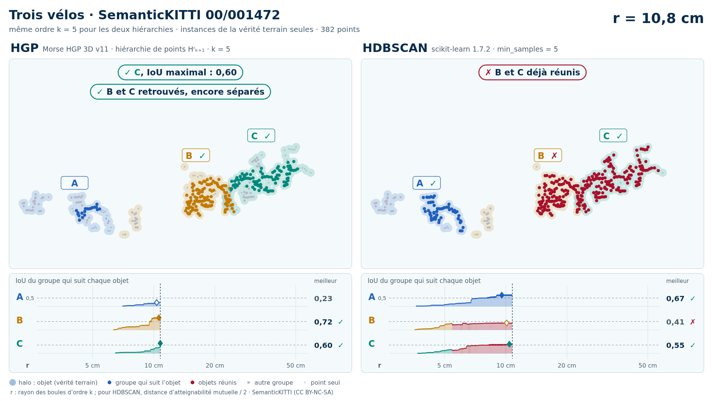
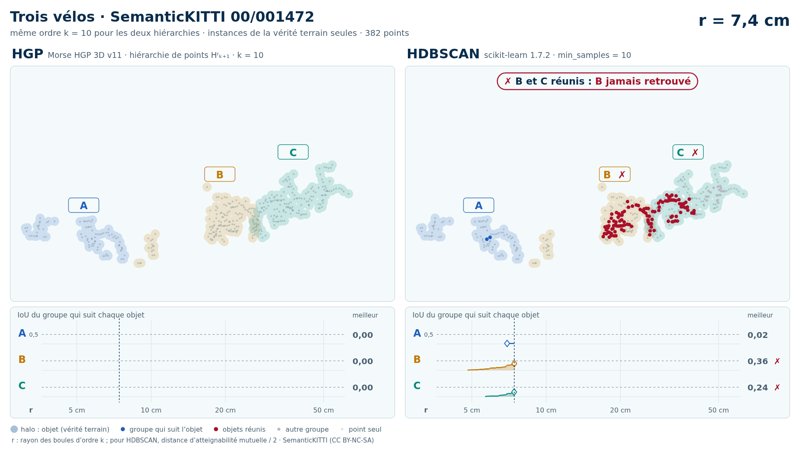

# Trois vélos (trame 00/001472) — instances de la vérité terrain seules

[Exemple](../README.md) · autre variante : [sol retiré automatiquement (Patchwork++)](../sans_sol/README.md) · [liste des exemples](../../README.md)

**k = 5** (HGP réussit, HDBSCAN échoue) :

<picture>
  <source media="(prefers-color-scheme: dark)" srcset="00_001472_trois_velos_40_42_59_instances_k5_sombre_instant_cle.png">
  
</picture>

Vidéo de 50 s, k = 5, 1920 × 1080 : [thème sombre](00_001472_trois_velos_40_42_59_instances_k5_sombre.mp4) · [thème clair](00_001472_trois_velos_40_42_59_instances_k5_clair.mp4) ; image finale : [sombre](00_001472_trois_velos_40_42_59_instances_k5_sombre_bilan.png) · [clair](00_001472_trois_velos_40_42_59_instances_k5_clair_bilan.png).

**k = 10** (HGP réussit, HDBSCAN échoue) :

<picture>
  <source media="(prefers-color-scheme: dark)" srcset="00_001472_trois_velos_40_42_59_instances_k10_sombre_instant_cle.png">
  
</picture>

Vidéo de 49 s, k = 10, 1920 × 1080 : [thème sombre](00_001472_trois_velos_40_42_59_instances_k10_sombre.mp4) · [thème clair](00_001472_trois_velos_40_42_59_instances_k10_clair.mp4) ; image finale : [sombre](00_001472_trois_velos_40_42_59_instances_k10_sombre_bilan.png) · [clair](00_001472_trois_velos_40_42_59_instances_k10_clair_bilan.png).

Points : les seuls points des objets du groupe (vérité terrain SemanticKITTI), 382 points (A 82, B 139, C 161) : ni sol, ni fond, ni autre objet.

Meilleur IoU de chaque objet, même mesure que la campagne G4 (points void exclus) :

| k | HGP, meilleur IoU (A / B / C) | HDBSCAN, meilleur IoU | issue |
| --- | --- | --- | --- |
| 5 | 0,84 / 0,72 / 0,60 | 0,84 / **0,41** / 0,57 | HGP réussit, HDBSCAN échoue |
| 10 | 0,84 / 0,76 / 0,57 | 0,84 / **0,43** / 0,57 | HGP réussit, HDBSCAN échoue |

En gras : objet à 0,5 ou moins, qu'aucun groupe de la hiérarchie ne recouvre à plus de la moitié. Une vidéo par ordre où HGP réussit et HDBSCAN échoue ; sans gain, une seule, à k = 5.

## Événements de la vidéo à k = 5

Le niveau r croît pour les deux colonnes à la fois et s'arrête à chaque événement des groupes qui suivent les objets (mêmes textes que les bandeaux) :

| r | HGP | HDBSCAN |
| --- | --- | --- |
| 5,4 cm |  | ✗ B et C réunis : B jamais retrouvé |
| 10,6 cm | ✓ B, IoU maximal : 0,72 |  |
| 10,8 cm | ✓ C, IoU maximal : 0,60 ; ✓ B et C retrouvés, encore séparés | ✗ B et C déjà réunis |
| 10,8 cm | ✓ B et C réunis, chacun retrouvé avant |  |
| 16,5 cm |  | ✓ C, IoU maximal : 0,57 |
| 18,1 cm |  | ✓ A, IoU maximal : 0,84 |
| 26,9 cm | ✓ A, IoU maximal : 0,84 |  |
| 43,4 cm |  | ✗ A, B et C réunis : B jamais retrouvé |
| 45,7 cm | ✓ A, B et C réunis, chacun retrouvé avant |  |

Nombres : [`resultats_duel_k5.json`](resultats_duel_k5.json).

## Événements de la vidéo à k = 10

Le niveau r croît pour les deux colonnes à la fois et s'arrête à chaque événement des groupes qui suivent les objets (mêmes textes que les bandeaux) :

| r | HGP | HDBSCAN |
| --- | --- | --- |
| 7,4 cm |  | ✗ B et C réunis : B jamais retrouvé |
| 14,2 cm | ✓ B, IoU maximal : 0,76 |  |
| 14,4 cm | ✗ B et C réunis : C pas encore retrouvé |  |
| 18,1 cm |  | ✓ A, IoU maximal : 0,84 |
| 25,2 cm |  | ✓ C, IoU maximal : 0,57 |
| 26,3 cm | ✓ C, IoU maximal : 0,57 |  |
| 32,5 cm | ✓ A, IoU maximal : 0,84 |  |
| 43,4 cm |  | ✗ A, B et C réunis : B jamais retrouvé |
| 48,9 cm | ✓ A, B et C réunis, chacun retrouvé avant |  |

Nombres : [`resultats_duel_k10.json`](resultats_duel_k10.json).

Lecture, légende et convention de niveau : [README de la liste](../../README.md#lire-une-vidéo).

## Données

`bout.json` décrit la variante (trame, empreintes, instances, découpe, mesures). Les points ne sont pas versionnés (CC BY-NC-SA) : `data/` est ignoré par git ; ils se refont depuis les archives officielles (README de la liste, « Reproduire »).

