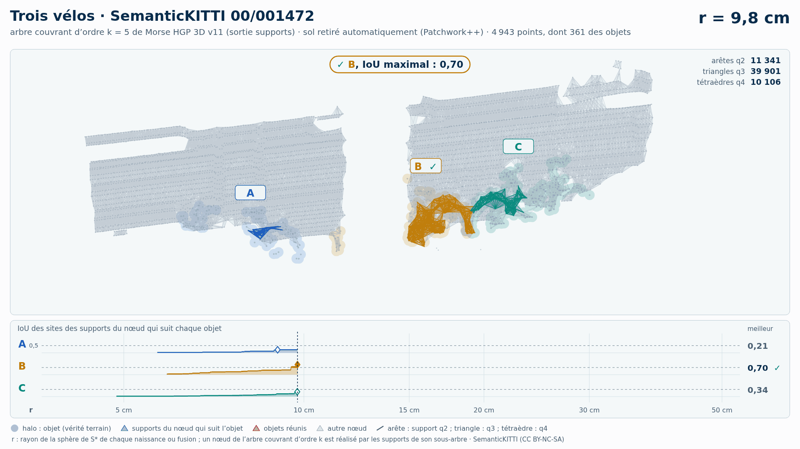

# Trois vélos (trame 00/001472) — sol retiré automatiquement (Patchwork++)

[Exemple](../README.md) · autre variante : [instances de la vérité terrain seules](../instances/README.md) · [liste des exemples](../../README.md)

**k = 5** (les deux échouent, aucun gain HGP dans cette variante) :

<picture>
  <source media="(prefers-color-scheme: dark)" srcset="00_001472_trois_velos_40_42_59_sans_sol_k5_sombre_instant_cle.png">
  
</picture>

Vidéo de 77 s, k = 5, 1920 × 1080 : [thème sombre](00_001472_trois_velos_40_42_59_sans_sol_k5_sombre.mp4) · [thème clair](00_001472_trois_velos_40_42_59_sans_sol_k5_clair.mp4) ; image finale : [sombre](00_001472_trois_velos_40_42_59_sans_sol_k5_sombre_bilan.png) · [clair](00_001472_trois_velos_40_42_59_sans_sol_k5_clair_bilan.png).

<picture>
  <source media="(prefers-color-scheme: dark)" srcset="00_001472_trois_velos_40_42_59_sans_sol_k5_supports_sombre_instant_cle.png">
  
</picture>

Hiérarchie des supports q2, q3, q4 au même ordre, 47 s : [thème sombre](00_001472_trois_velos_40_42_59_sans_sol_k5_supports_sombre.mp4) · [thème clair](00_001472_trois_velos_40_42_59_sans_sol_k5_supports_clair.mp4) ; image finale : [sombre](00_001472_trois_velos_40_42_59_sans_sol_k5_supports_sombre_bilan.png) · [clair](00_001472_trois_velos_40_42_59_sans_sol_k5_supports_clair_bilan.png). Arbre couvrant d'ordre 5 : 73 845 nœuds, 73 938 naissances et fusions, chacune avec son support S\* (73 938 supports : 13 046 arêtes q2, 47 070 triangles q3, 13 822 tétraèdres q4).

Points : tout ce que Patchwork++ (paramètres de la v8) ne classe pas en sol dans la boîte horizontale des objets élargie de 1 m, à toutes hauteurs : 4 943 points, dont 361 des objets (A 80, B 126, C 155) ; 21 points des objets retirés comme sol. Aucune étiquette ne sert au nettoyage : elles ne servent qu'à mesurer.

Meilleur IoU de chaque objet, même mesure que la campagne G4 (points void exclus) :

| k | HGP, meilleur IoU (A / B / C) | HDBSCAN, meilleur IoU | issue |
| --- | --- | --- | --- |
| 5 | **0,25** / 0,69 / 0,57 | **0,23** / **0,38** / **0,23** | les deux échouent |
| 10 | **0,19** / 0,51 / **0,26** | **0,11** / **0,21** / **0,17** | les deux échouent |

En gras : objet à 0,5 ou moins, qu'aucun groupe de la hiérarchie ne recouvre à plus de la moitié. Une vidéo par ordre où HGP réussit et HDBSCAN échoue ; sans gain, une seule, à k = 5.

## Événements de la vidéo à k = 5

Mêmes textes que les bandeaux. Premier balayage, HDBSCAN seul (HGP attend) :

| r | HDBSCAN |
| --- | --- |
| 10,5 cm | ✗ B fusionne avec le bâtiment · IoU 0,38 → 0,03 |
| 10,9 cm | ✗ B et C réunis : B et C jamais retrouvés |
| 13,5 cm | ✗ A fusionne avec le bâtiment · IoU 0,23 → 0,02 |
| 79,5 cm | ✗ A, B et C réunis : A, B et C jamais retrouvés |

Second balayage, HGP ; HDBSCAN le suit au même r, sans pause propre :

| r | HGP | HDBSCAN au même r |
| --- | --- | --- |
| 9,8 cm | ✓ B, IoU maximal : 0,69 | IoU au même r : B 0,29 |
| 9,8 cm | ✗ B fusionne avec le bâtiment · IoU 0,69 → 0,05 |  |
| 10,7 cm | ✓ C, IoU maximal : 0,57 | IoU au même r : C 0,23 |
| 10,8 cm | ✓ B et C réunis, chacun retrouvé avant |  |
| 11,9 cm | ✗ A fusionne avec le bâtiment · IoU 0,25 → 0,02 |  |
| 42,9 cm | ✗ A, B et C réunis : A jamais retrouvé |  |

Nombres : [`resultats_duel_k5.json`](resultats_duel_k5.json).

## Hiérarchie des supports à k = 5

Meilleur IoU des sites des supports du nœud qui suit chaque objet : 0,31 / 0,70 / 0,66 (hiérarchie de points HGP : 0,25 / 0,69 / 0,57). Événements, mêmes textes que les bandeaux :

| r | supports |
| --- | --- |
| 9,8 cm | ✓ B, IoU maximal : 0,70 |
| 9,8 cm | ✗ B fusionne avec le bâtiment · IoU 0,70 → 0,05 |
| 10,7 cm | ✓ C, IoU maximal : 0,66 |
| 10,8 cm | ✓ B et C réunis, chacun retrouvé avant |
| 11,9 cm | ✗ A fusionne avec le bâtiment · IoU 0,31 → 0,03 |
| 42,9 cm | ✗ A, B et C réunis : A jamais retrouvé |

Nombres : [`resultats_supports_k5.json`](resultats_supports_k5.json).

Lecture, légende et convention de niveau : [README de la liste](../../README.md#lire-une-vidéo).

## Données

`bout.json` décrit la variante (trame, empreintes, instances, découpe, mesures). Les points ne sont pas versionnés (CC BY-NC-SA) : `data/` est ignoré par git ; ils se refont depuis les archives officielles (README de la liste, « Reproduire »).

