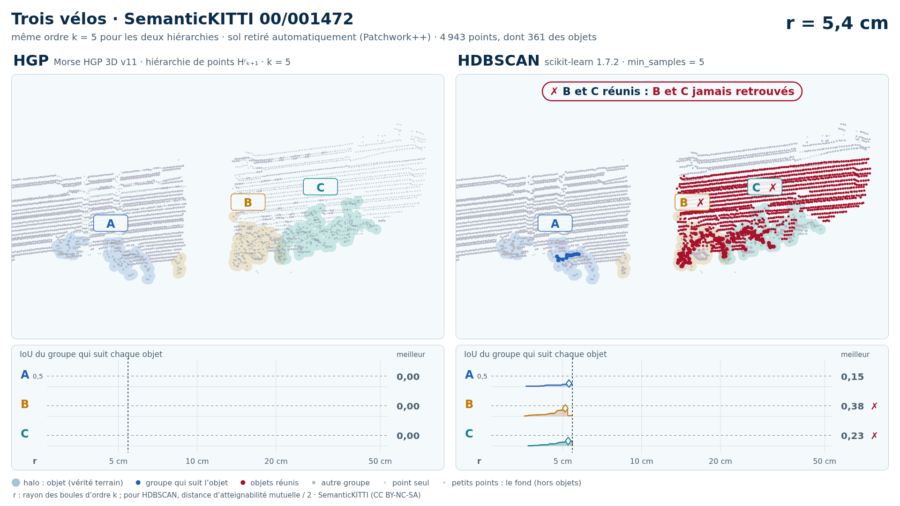

# Trois vélos (trame 00/001472) — sol retiré automatiquement (Patchwork++)

[Exemple](../README.md) · autre variante : [instances de la vérité terrain seules](../instances/README.md) · [liste des exemples](../../README.md)

**k = 5** (les deux échouent, aucun gain HGP dans cette variante) :

<picture>
  <source media="(prefers-color-scheme: dark)" srcset="00_001472_trois_velos_40_42_59_sans_sol_k5_sombre_instant_cle.png">
  
</picture>

Vidéo de 56 s, k = 5, 1920 × 1080 : [thème sombre](00_001472_trois_velos_40_42_59_sans_sol_k5_sombre.mp4) · [thème clair](00_001472_trois_velos_40_42_59_sans_sol_k5_clair.mp4) ; image finale : [sombre](00_001472_trois_velos_40_42_59_sans_sol_k5_sombre_bilan.png) · [clair](00_001472_trois_velos_40_42_59_sans_sol_k5_clair_bilan.png).

Points : tout ce que Patchwork++ (paramètres de la v8) ne classe pas en sol dans la boîte horizontale des objets élargie de 1 m, à toutes hauteurs : 4 943 points, dont 361 des objets (A 80, B 126, C 155) ; 21 points des objets retirés comme sol. Aucune étiquette ne sert au nettoyage : elles ne servent qu'à mesurer.

Meilleur IoU de chaque objet, même mesure que la campagne G4 (points void exclus) :

| k | HGP, meilleur IoU (A / B / C) | HDBSCAN, meilleur IoU | issue |
| --- | --- | --- | --- |
| 5 | **0,25** / 0,69 / 0,57 | **0,23** / **0,38** / **0,23** | les deux échouent |
| 10 | **0,19** / 0,51 / **0,26** | **0,11** / **0,21** / **0,17** | les deux échouent |

En gras : objet à 0,5 ou moins, qu'aucun groupe de la hiérarchie ne recouvre à plus de la moitié. Une vidéo par ordre où HGP réussit et HDBSCAN échoue ; sans gain, une seule, à k = 5.

## Événements de la vidéo à k = 5

Le niveau r croît pour les deux colonnes à la fois et s'arrête à chaque événement des groupes qui suivent les objets (mêmes textes que les bandeaux) :

| r | HGP | HDBSCAN |
| --- | --- | --- |
| 5,2 cm |  | ✗ B fusionne avec le bâtiment · IoU 0,38 → 0,03 |
| 5,4 cm |  | ✗ B et C réunis : B et C jamais retrouvés |
| 6,7 cm |  | ✗ A fusionne avec le bâtiment · IoU 0,23 → 0,02 |
| 9,8 cm | ✓ B, IoU maximal : 0,69 |  |
| 9,8 cm | ✗ B fusionne avec le bâtiment · IoU 0,69 → 0,05 |  |
| 10,7 cm | ✓ C, IoU maximal : 0,57 |  |
| 10,8 cm | ✓ B et C réunis, chacun retrouvé avant |  |
| 11,9 cm | ✗ A fusionne avec le bâtiment · IoU 0,25 → 0,02 |  |
| 39,8 cm |  | ✗ A, B et C réunis : A, B et C jamais retrouvés |
| 42,9 cm | ✗ A, B et C réunis : A jamais retrouvé |  |

Nombres : [`resultats_duel_k5.json`](resultats_duel_k5.json).

Lecture, légende et convention de niveau : [README de la liste](../../README.md#lire-une-vidéo).

## Données

`bout.json` décrit la variante (trame, empreintes, instances, découpe, mesures). Les points ne sont pas versionnés (CC BY-NC-SA) : `data/` est ignoré par git ; ils se refont depuis les archives officielles (README de la liste, « Reproduire »).

