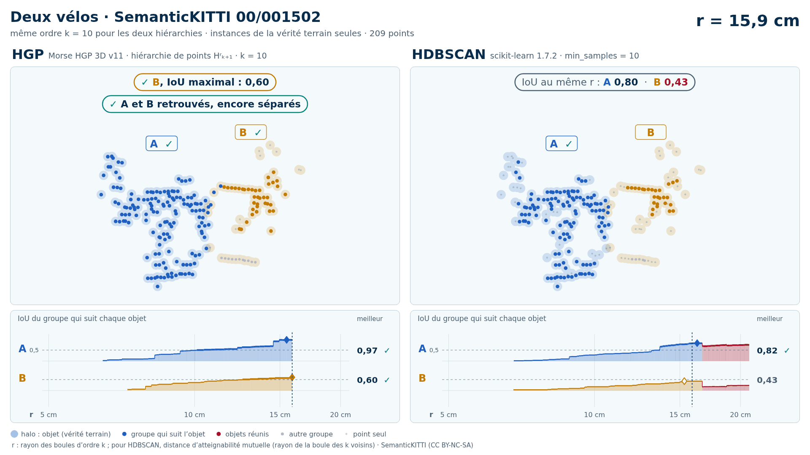

# Deux vélos (trame 00/001502) — instances de la vérité terrain seules

[Exemple](../README.md) · autre variante : [sol retiré automatiquement (Patchwork++)](../sans_sol/README.md) · [liste des exemples](../../README.md)

**k = 5** (HGP réussit, HDBSCAN échoue) :

<picture>
  <source media="(prefers-color-scheme: dark)" srcset="00_001502_deux_velos_28_66_instances_k5_sombre_instant_cle.png">
  
</picture>

Vidéo de 61 s, k = 5, 1920 × 1080 : [thème sombre](00_001502_deux_velos_28_66_instances_k5_sombre.mp4) · [thème clair](00_001502_deux_velos_28_66_instances_k5_clair.mp4) ; image finale : [sombre](00_001502_deux_velos_28_66_instances_k5_sombre_bilan.png) · [clair](00_001502_deux_velos_28_66_instances_k5_clair_bilan.png).

**k = 10** (HGP réussit, HDBSCAN échoue) :

<picture>
  <source media="(prefers-color-scheme: dark)" srcset="00_001502_deux_velos_28_66_instances_k10_sombre_instant_cle.png">
  
</picture>

Vidéo de 61 s, k = 10, 1920 × 1080 : [thème sombre](00_001502_deux_velos_28_66_instances_k10_sombre.mp4) · [thème clair](00_001502_deux_velos_28_66_instances_k10_clair.mp4) ; image finale : [sombre](00_001502_deux_velos_28_66_instances_k10_sombre_bilan.png) · [clair](00_001502_deux_velos_28_66_instances_k10_clair_bilan.png).

Points : les seuls points des objets du groupe (vérité terrain SemanticKITTI), 209 points (A 146, B 63) : ni sol, ni fond, ni autre objet.

Meilleur IoU de chaque objet, même mesure que la campagne G4 (points void exclus) :

| k | HGP, meilleur IoU (A / B) | HDBSCAN, meilleur IoU | issue |
| --- | --- | --- | --- |
| 5 | 0,78 / 0,60 | 0,74 / **0,40** | HGP réussit, HDBSCAN échoue |
| 10 | 0,97 / 0,60 | 0,82 / **0,43** | HGP réussit, HDBSCAN échoue |

En gras : objet à 0,5 ou moins, qu'aucun groupe de la hiérarchie ne recouvre à plus de la moitié. Une vidéo par ordre où HGP réussit et HDBSCAN échoue ; sans gain, une seule, à k = 5.

## Événements de la vidéo à k = 5

Mêmes textes que les bandeaux. Premier balayage, HDBSCAN seul (HGP attend) :

| r | HDBSCAN |
| --- | --- |
| 10,6 cm | ✗ A et B réunis : B jamais retrouvé |
| 14,1 cm | ✓ A, IoU maximal : 0,74 |

Second balayage, HGP ; HDBSCAN le suit au même r, sans pause propre :

| r | HGP | HDBSCAN au même r |
| --- | --- | --- |
| 10,6 cm | ✓ B, IoU maximal : 0,60 ; ✓ A et B retrouvés, encore séparés | IoU au même r : A 0,58  ·  B 0,40 |
| 10,6 cm | ✓ A et B réunis, chacun retrouvé avant |  |
| 11,0 cm | ✓ A, IoU maximal : 0,78 | ✗ A et B déjà réunis |

Nombres : [`resultats_duel_k5.json`](resultats_duel_k5.json).

## Événements de la vidéo à k = 10

Mêmes textes que les bandeaux. Premier balayage, HDBSCAN seul (HGP attend) :

| r | HDBSCAN |
| --- | --- |
| 16,3 cm | ✓ A, IoU maximal : 0,82 |
| 16,7 cm | ✗ A et B réunis : B jamais retrouvé |

Second balayage, HGP ; HDBSCAN le suit au même r, sans pause propre :

| r | HGP | HDBSCAN au même r |
| --- | --- | --- |
| 15,5 cm | ✓ A, IoU maximal : 0,97 | IoU au même r : A 0,77 |
| 15,9 cm | ✓ B, IoU maximal : 0,60 ; ✓ A et B retrouvés, encore séparés | IoU au même r : A 0,80  ·  B 0,43 |
| 16,0 cm | ✓ A et B réunis, chacun retrouvé avant |  |

Nombres : [`resultats_duel_k10.json`](resultats_duel_k10.json).

Lecture, légende et convention de niveau : [README de la liste](../../README.md#lire-une-vidéo).

## Données

`bout.json` décrit la variante (trame, empreintes, instances, découpe, mesures). Les points ne sont pas versionnés (CC BY-NC-SA) : `data/` est ignoré par git ; ils se refont depuis les archives officielles (README de la liste, « Reproduire »).

