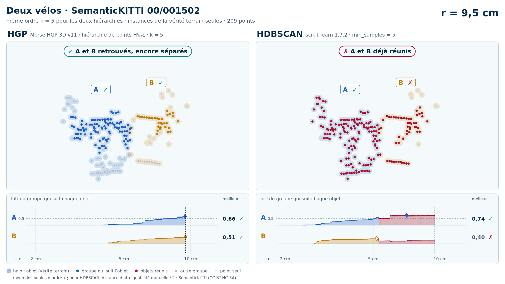

# Deux vélos (trame 00/001502) — instances de la vérité terrain seules

[Exemple](../README.md) · autre variante : [sol retiré automatiquement (Patchwork++)](../sans_sol/README.md) · [liste des exemples](../../README.md)

<picture>
  <source media="(prefers-color-scheme: dark)" srcset="00_001502_deux_velos_28_66_instances_k5_sombre_instant_cle.png">
  
</picture>

Vidéo de 39 s, k = 5, 1920 × 1080 : [thème sombre](00_001502_deux_velos_28_66_instances_k5_sombre.mp4) · [thème clair](00_001502_deux_velos_28_66_instances_k5_clair.mp4) ; image finale : [sombre](00_001502_deux_velos_28_66_instances_k5_sombre_bilan.png) · [clair](00_001502_deux_velos_28_66_instances_k5_clair_bilan.png).

Points : les seuls points des objets du groupe (vérité terrain SemanticKITTI), 209 points (A 146, B 63) : ni sol, ni fond, ni autre objet.

Meilleur IoU de chaque objet, même mesure que la campagne G4 (points void exclus) :

| k | HGP, meilleur IoU (A / B) | HDBSCAN, meilleur IoU | issue |
| --- | --- | --- | --- |
| 5 | 0,78 / 0,60 | 0,74 / **0,40** | HGP réussit, HDBSCAN échoue |
| 10 | 0,97 / 0,60 | 0,82 / **0,43** | HGP réussit, HDBSCAN échoue |

En gras : objet à 0,5 ou moins, qu'aucun groupe de la hiérarchie ne recouvre à plus de la moitié.

## Événements de la vidéo (k = 5)

Le niveau r croît pour les deux colonnes à la fois et s'arrête à chaque événement des groupes qui suivent les objets (mêmes textes que les bandeaux) :

| r | HGP | HDBSCAN |
| --- | --- | --- |
| 5,1 cm |  | ✓ A retrouvé · IoU 0,51 |
| 5,3 cm | A et B encore séparés | ✗ A et B réunis : B jamais retrouvé |
| 7,8 cm | ✓ A retrouvé · IoU 0,51 |  |
| 9,5 cm | ✓ A et B retrouvés, encore séparés | ✗ A et B déjà réunis |
| 10,6 cm | ✓ A et B réunis, chacun retrouvé avant |  |

Lecture, légende et convention de niveau : [README de la liste](../../README.md#lire-une-vidéo) ; nombres : [`resultats_duel_k5.json`](resultats_duel_k5.json).

## Données

`bout.json` décrit la variante (trame, empreintes, instances, découpe, mesures). Les points ne sont pas versionnés (CC BY-NC-SA) : `data/` est ignoré par git ; ils se refont depuis les archives officielles (README de la liste, « Reproduire »).

