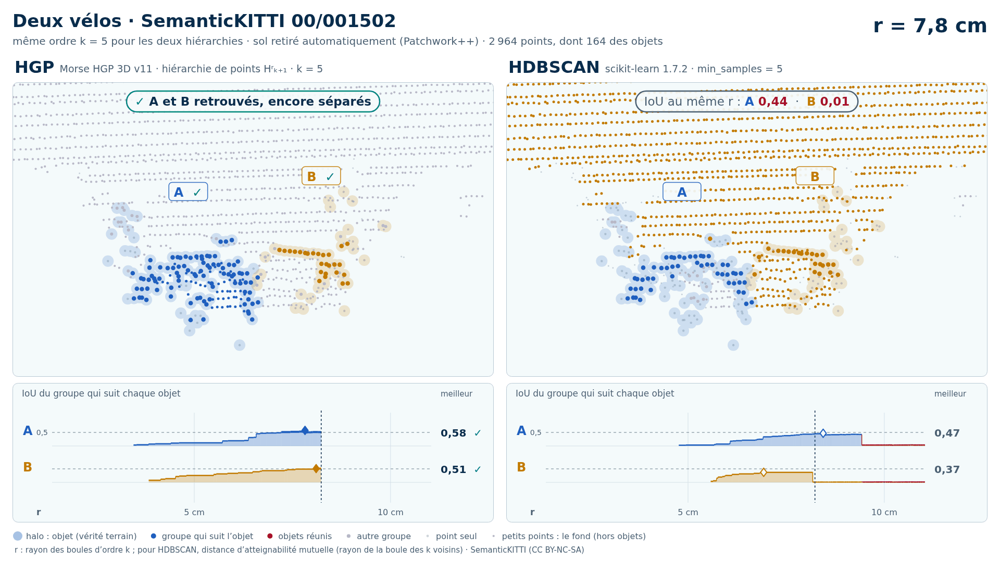
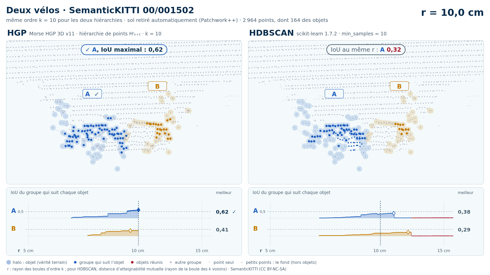

# Deux vélos (trame 00/001502) — sol retiré automatiquement (Patchwork++)

[Exemple](../README.md) · autre variante : [instances de la vérité terrain seules](../instances/README.md) · [liste des exemples](../../README.md)

**k = 5** (HGP réussit, HDBSCAN échoue) :

<picture>
  <source media="(prefers-color-scheme: dark)" srcset="00_001502_deux_velos_28_66_sans_sol_k5_sombre_instant_cle.png">
  
</picture>

Vidéo de 67 s, k = 5, 1920 × 1080 : [thème sombre](00_001502_deux_velos_28_66_sans_sol_k5_sombre.mp4) · [thème clair](00_001502_deux_velos_28_66_sans_sol_k5_clair.mp4) ; image finale : [sombre](00_001502_deux_velos_28_66_sans_sol_k5_sombre_bilan.png) · [clair](00_001502_deux_velos_28_66_sans_sol_k5_clair_bilan.png).

**k = 10** (HGP réussit, HDBSCAN échoue) :

<picture>
  <source media="(prefers-color-scheme: dark)" srcset="00_001502_deux_velos_28_66_sans_sol_k10_sombre_instant_cle.png">
  
</picture>

Vidéo de 64 s, k = 10, 1920 × 1080 : [thème sombre](00_001502_deux_velos_28_66_sans_sol_k10_sombre.mp4) · [thème clair](00_001502_deux_velos_28_66_sans_sol_k10_clair.mp4) ; image finale : [sombre](00_001502_deux_velos_28_66_sans_sol_k10_sombre_bilan.png) · [clair](00_001502_deux_velos_28_66_sans_sol_k10_clair_bilan.png).

Points : tout ce que Patchwork++ (paramètres de la v8) ne classe pas en sol dans la boîte horizontale des objets élargie de 1 m, à toutes hauteurs : 2 964 points, dont 164 des objets (A 113, B 51) ; 45 points des objets retirés comme sol. Aucune étiquette ne sert au nettoyage : elles ne servent qu'à mesurer.

Meilleur IoU de chaque objet, même mesure que la campagne G4 (points void exclus) :

| k | HGP, meilleur IoU (A / B) | HDBSCAN, meilleur IoU | issue |
| --- | --- | --- | --- |
| 5 | 0,58 / 0,51 | **0,47** / **0,37** | HGP réussit, HDBSCAN échoue |
| 10 | 0,62 / 0,53 | **0,38** / **0,29** | HGP réussit, HDBSCAN échoue |

En gras : objet à 0,5 ou moins, qu'aucun groupe de la hiérarchie ne recouvre à plus de la moitié. Une vidéo par ordre où HGP réussit et HDBSCAN échoue ; sans gain, une seule, à k = 5.

## Événements de la vidéo à k = 5

Mêmes textes que les bandeaux. Premier balayage, HDBSCAN seul (HGP attend) :

| r | HDBSCAN |
| --- | --- |
| 7,8 cm | ✗ B fusionne avec le bâtiment · IoU 0,37 → 0,01 |
| 9,2 cm | ✗ A et B réunis : A et B jamais retrouvés |

Second balayage, HGP ; HDBSCAN le suit au même r, sans pause propre :

| r | HGP | HDBSCAN au même r |
| --- | --- | --- |
| 7,4 cm | ✓ A, IoU maximal : 0,58 | IoU au même r : A 0,41 |
| 7,7 cm | ✓ B, IoU maximal : 0,51 | IoU au même r : B 0,37 |
| 7,8 cm | ✓ A et B retrouvés, encore séparés | IoU au même r : A 0,44  ·  B 0,01 |
| 7,9 cm | ✗ B fusionne avec le bâtiment · IoU 0,51 → 0,01 |  |
| 8,1 cm | ✓ A et B réunis, chacun retrouvé avant |  |

Nombres : [`resultats_duel_k5.json`](resultats_duel_k5.json).

## Événements de la vidéo à k = 10

Mêmes textes que les bandeaux. Premier balayage, HDBSCAN seul (HGP attend) :

| r | HDBSCAN |
| --- | --- |
| 11,0 cm | ✗ A fusionne avec le bâtiment · IoU 0,37 → 0,02 |
| 12,2 cm | ✗ A et B réunis : A et B jamais retrouvés |

Second balayage, HGP ; HDBSCAN le suit au même r, sans pause propre :

| r | HGP | HDBSCAN au même r |
| --- | --- | --- |
| 10,0 cm | ✓ A, IoU maximal : 0,62 | IoU au même r : A 0,32 |
| 10,1 cm | ✗ A fusionne avec le bâtiment · IoU 0,62 → 0,03 |  |
| 12,5 cm | ✓ B, IoU maximal : 0,53 | ✗ A et B déjà réunis |
| 12,7 cm | ✓ A et B réunis, chacun retrouvé avant |  |

Nombres : [`resultats_duel_k10.json`](resultats_duel_k10.json).

Lecture, légende et convention de niveau : [README de la liste](../../README.md#lire-une-vidéo).

## Données

`bout.json` décrit la variante (trame, empreintes, instances, découpe, mesures). Les points ne sont pas versionnés (CC BY-NC-SA) : `data/` est ignoré par git ; ils se refont depuis les archives officielles (README de la liste, « Reproduire »).

