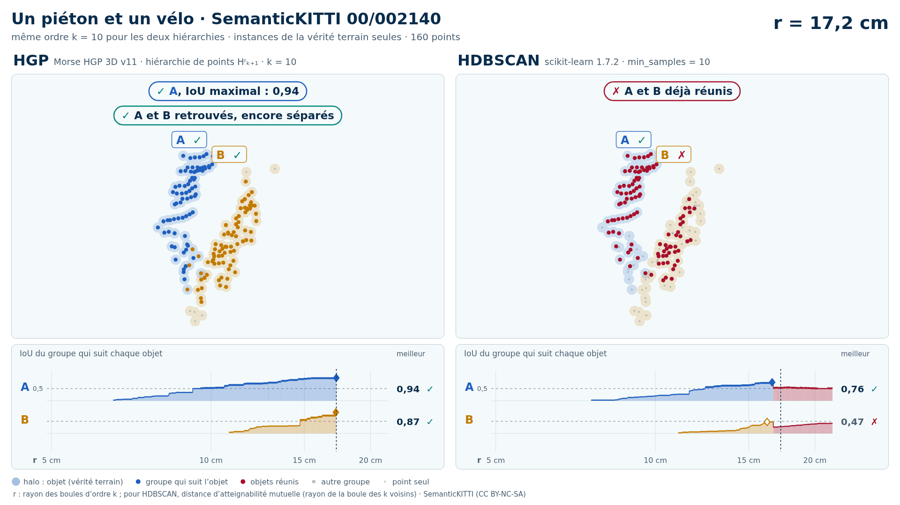
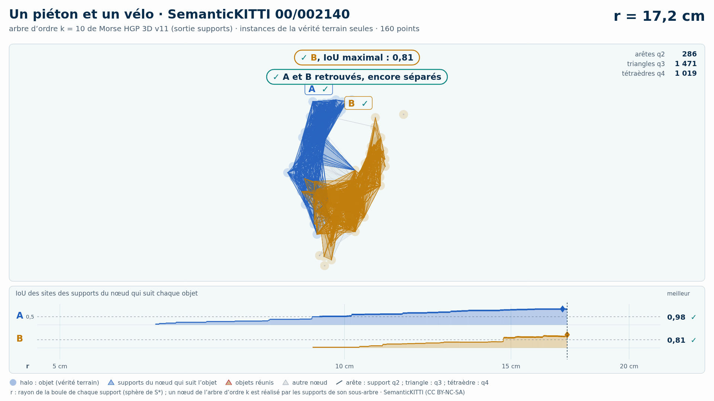

# Un piéton et un vélo (trame 00/002140) — instances de la vérité terrain seules

[Exemple](../README.md) · autre variante : [sol retiré automatiquement (Patchwork++)](../sans_sol/README.md) · [liste des exemples](../../README.md)

**k = 10** (HGP réussit, HDBSCAN échoue) :

<picture>
  <source media="(prefers-color-scheme: dark)" srcset="00_002140_pieton_velo_1_6_instances_k10_sombre_instant_cle.png">
  
</picture>

Vidéo de 62 s, k = 10, 1920 × 1080 : [thème sombre](00_002140_pieton_velo_1_6_instances_k10_sombre.mp4) · [thème clair](00_002140_pieton_velo_1_6_instances_k10_clair.mp4) ; image finale : [sombre](00_002140_pieton_velo_1_6_instances_k10_sombre_bilan.png) · [clair](00_002140_pieton_velo_1_6_instances_k10_clair_bilan.png).

<picture>
  <source media="(prefers-color-scheme: dark)" srcset="00_002140_pieton_velo_1_6_instances_k10_supports_sombre_instant_cle.png">
  
</picture>

Hiérarchie des supports q2, q3, q4 au même ordre, 39 s : [thème sombre](00_002140_pieton_velo_1_6_instances_k10_supports_sombre.mp4) · [thème clair](00_002140_pieton_velo_1_6_instances_k10_supports_clair.mp4) ; image finale : [sombre](00_002140_pieton_velo_1_6_instances_k10_supports_sombre_bilan.png) · [clair](00_002140_pieton_velo_1_6_instances_k10_supports_clair_bilan.png). Arbre d'ordre 10 : 4 402 nœuds, 5 579 boules, 5 579 supports (487 arêtes q2, 2 841 triangles q3, 2 251 tétraèdres q4).

Points : les seuls points des objets du groupe (vérité terrain SemanticKITTI), 160 points (A 82, B 78) : ni sol, ni fond, ni autre objet.

Meilleur IoU de chaque objet, même mesure que la campagne G4 (points void exclus) :

| k | HGP, meilleur IoU (A / B) | HDBSCAN, meilleur IoU | issue |
| --- | --- | --- | --- |
| 5 | 0,94 / 0,91 | 0,90 / 0,78 | les deux réussissent |
| 10 | 0,94 / 0,87 | 0,76 / **0,49** | HGP réussit, HDBSCAN échoue |

En gras : objet à 0,5 ou moins, qu'aucun groupe de la hiérarchie ne recouvre à plus de la moitié. Une vidéo par ordre où HGP réussit et HDBSCAN échoue ; sans gain, une seule, à k = 5.

## Événements de la vidéo à k = 10

Mêmes textes que les bandeaux. Premier balayage, HDBSCAN seul (HGP attend) :

| r | HDBSCAN |
| --- | --- |
| 16,6 cm | ✓ A, IoU maximal : 0,76 |
| 16,7 cm | ✗ A et B réunis : B jamais retrouvé |

Second balayage, HGP ; HDBSCAN le suit au même r, sans pause propre :

| r | HGP | HDBSCAN au même r |
| --- | --- | --- |
| 17,2 cm | ✓ B, IoU maximal : 0,87 | ✗ A et B déjà réunis |
| 17,2 cm | ✓ A, IoU maximal : 0,94 ; ✓ A et B retrouvés, encore séparés | ✗ A et B déjà réunis |
| 17,3 cm | ✓ A et B réunis, chacun retrouvé avant |  |

Nombres : [`resultats_duel_k10.json`](resultats_duel_k10.json).

## Hiérarchie des supports à k = 10

Meilleur IoU des sites des supports du nœud qui suit chaque objet : 0,98 / 0,81 (hiérarchie de points HGP : 0,94 / 0,87). Événements, mêmes textes que les bandeaux :

| r | supports |
| --- | --- |
| 17,0 cm | ✓ A, IoU maximal : 0,98 |
| 17,2 cm | ✓ B, IoU maximal : 0,81 ; ✓ A et B retrouvés, encore séparés |
| 17,3 cm | ✓ A et B réunis, chacun retrouvé avant |

Nombres : [`resultats_supports_k10.json`](resultats_supports_k10.json).

Lecture, légende et convention de niveau : [README de la liste](../../README.md#lire-une-vidéo).

## Données

`bout.json` décrit la variante (trame, empreintes, instances, découpe, mesures). Les points ne sont pas versionnés (CC BY-NC-SA) : `data/` est ignoré par git ; ils se refont depuis les archives officielles (README de la liste, « Reproduire »).

