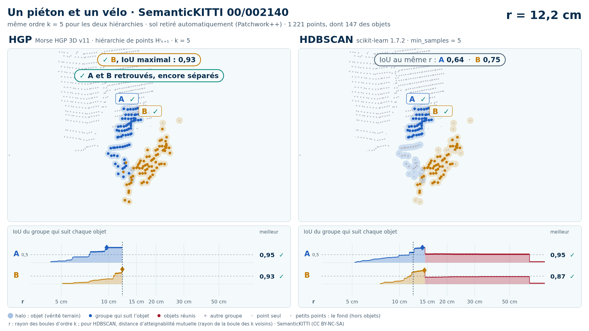

# Un piéton et un vélo (trame 00/002140) — sol retiré automatiquement (Patchwork++)

[Exemple](../README.md) · autre variante : [instances de la vérité terrain seules](../instances/README.md) · [liste des exemples](../../README.md)

**k = 5** (les deux réussissent, aucun gain HGP dans cette variante) :

<picture>
  <source media="(prefers-color-scheme: dark)" srcset="00_002140_pieton_velo_1_6_sans_sol_k5_sombre_instant_cle.png">
  
</picture>

Vidéo de 69 s, k = 5, 1920 × 1080 : [thème sombre](00_002140_pieton_velo_1_6_sans_sol_k5_sombre.mp4) · [thème clair](00_002140_pieton_velo_1_6_sans_sol_k5_clair.mp4) ; image finale : [sombre](00_002140_pieton_velo_1_6_sans_sol_k5_sombre_bilan.png) · [clair](00_002140_pieton_velo_1_6_sans_sol_k5_clair_bilan.png).

Points : tout ce que Patchwork++ (paramètres de la v8) ne classe pas en sol dans la boîte horizontale des objets élargie de 1 m, à toutes hauteurs : 1 221 points, dont 147 des objets (A 78, B 69) ; 13 points des objets retirés comme sol. Aucune étiquette ne sert au nettoyage : elles ne servent qu'à mesurer.

Meilleur IoU de chaque objet, même mesure que la campagne G4 (points void exclus) :

| k | HGP, meilleur IoU (A / B) | HDBSCAN, meilleur IoU | issue |
| --- | --- | --- | --- |
| 5 | 0,95 / 0,93 | 0,95 / 0,87 | les deux réussissent |
| 10 | 0,94 / 0,79 | 0,83 / 0,61 | les deux réussissent |

En gras : objet à 0,5 ou moins, qu'aucun groupe de la hiérarchie ne recouvre à plus de la moitié. Une vidéo par ordre où HGP réussit et HDBSCAN échoue ; sans gain, une seule, à k = 5.

## Événements de la vidéo à k = 5

Mêmes textes que les bandeaux. Premier balayage, HDBSCAN seul (HGP attend) :

| r | HDBSCAN |
| --- | --- |
| 14,0 cm | ✓ A, IoU maximal : 0,95 |
| 14,4 cm | ✓ B, IoU maximal : 0,87 ; ✓ A et B retrouvés, encore séparés |
| 14,5 cm | ✓ A et B réunis, chacun retrouvé avant |
| 66,9 cm | ✗ A et B, déjà réunis, fusionnent avec le bâtiment |

Second balayage, HGP ; HDBSCAN le suit au même r, sans pause propre :

| r | HGP | HDBSCAN au même r |
| --- | --- | --- |
| 9,7 cm | ✓ A, IoU maximal : 0,95 | IoU au même r : A 0,36 |
| 12,2 cm | ✓ B, IoU maximal : 0,93 ; ✓ A et B retrouvés, encore séparés | IoU au même r : A 0,64  ·  B 0,75 |
| 13,6 cm | ✓ A et B réunis, chacun retrouvé avant |  |
| 36,4 cm | ✗ A et B, déjà réunis, fusionnent avec le bâtiment |  |

Nombres : [`resultats_duel_k5.json`](resultats_duel_k5.json).

Lecture, légende et convention de niveau : [README de la liste](../../README.md#lire-une-vidéo).

## Données

`bout.json` décrit la variante (trame, empreintes, instances, découpe, mesures). Les points ne sont pas versionnés (CC BY-NC-SA) : `data/` est ignoré par git ; ils se refont depuis les archives officielles (README de la liste, « Reproduire »).

