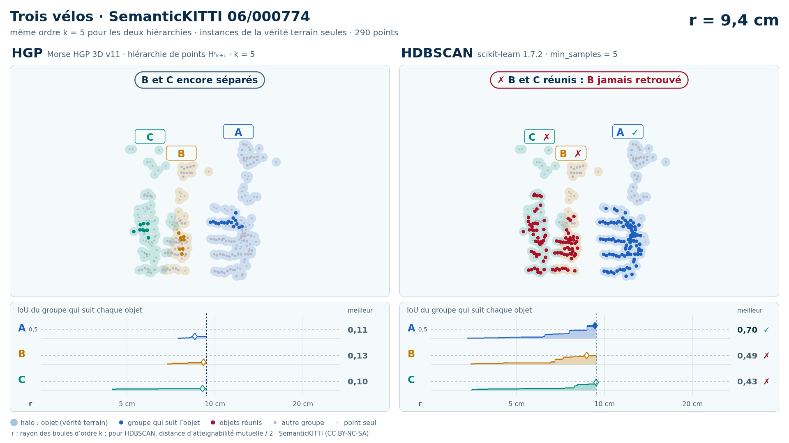
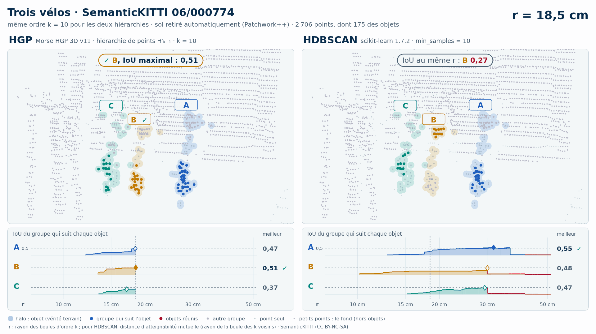

# Trois vélos (trame 06/000774)

Exemple vidéo HGP contre HDBSCAN ([liste](../README.md)) : SemanticKITTI, séquence 06, trame 000774. Deux variantes, chacune dans son sous-dossier :

- [`instances/`](instances/README.md) : les seuls points des objets (vérité terrain), 290 points ;
- [`sans_sol/`](sans_sol/README.md) : tout ce que Patchwork++ ne classe pas en sol dans la boîte des objets élargie de 1 m, 2 706 points (aucune étiquette ne sert au nettoyage).

| objet | classe | points (instances) | points gardés sans sol | points retirés comme sol |
| --- | --- | --- | --- | --- |
| A | vélo | 141 | 83 | 58 |
| B | vélo | 63 | 41 | 22 |
| C | vélo | 86 | 51 | 35 |

Écarts (plus courte distance entre les points de deux objets) : A–B : 0,30 m, A–C : 0,43 m, B–C : 0,03 m. Dans la découpe sans sol : aucune autre instance ; 185 points void ; 990 points de sol retirés.

| variante | k | HGP, meilleur IoU (A / B / C) | HDBSCAN, meilleur IoU | issue |
| --- | --- | --- | --- | --- |
| instances de la vérité terrain seules | 5 | 0,80 / **0,47** / 0,58 | 0,80 / **0,49** / 0,55 | les deux échouent |
| instances de la vérité terrain seules | 10 | 0,80 / **0,44** / 0,52 | 0,76 / **0,43** / 0,53 | les deux échouent |
| sol retiré automatiquement (Patchwork++) | 5 | 0,65 / 0,57 / 0,69 | 0,64 / 0,59 / 0,69 | les deux réussissent |
| sol retiré automatiquement (Patchwork++) | 10 | 0,63 / 0,51 / 0,61 | 0,55 / **0,48** / **0,47** | HGP réussit, HDBSCAN échoue |

En gras : objet à 0,5 ou moins, qu'aucun groupe de la hiérarchie ne recouvre à plus de la moitié. Vidéos : k = 5 (instances) ; k = 10 (sans sol). Objets : instances SemanticKITTI A = 6, B = 14, C = 15.

## Même scène

Autres groupes de la recherche qui partagent une instance avec celui-ci (même rangée, trames voisines) ; un seul exemple est montré par scène.

| groupe | trame | instances seules : k = 5 / 10 | sans sol : k = 5 / 10 |
| --- | --- | --- | --- |
| 14, 15 | 06/000774 | deux échecs / deux échecs | deux réussites / **gain HGP** |
| 6, 15 | 06/000774 | deux réussites / deux réussites | deux réussites / **gain HGP** |

Les groupes sont nommés par les numéros d'instance SemanticKITTI de leurs objets.

<!-- video:début -->
## Vidéos

| | instances de la vérité terrain seules | sol retiré automatiquement (Patchwork++) |
| --- | --- | --- |
| vidéos | [README](instances/README.md) · k = 5 : [sombre](instances/06_000774_trois_velos_6_14_15_instances_k5_sombre.mp4) · [clair](instances/06_000774_trois_velos_6_14_15_instances_k5_clair.mp4) | [README](sans_sol/README.md) · k = 10 : [sombre](sans_sol/06_000774_trois_velos_6_14_15_sans_sol_k10_sombre.mp4) · [clair](sans_sol/06_000774_trois_velos_6_14_15_sans_sol_k10_clair.mp4) |

**Instances de la vérité terrain seules**, k = 5 :

<picture>
  <source media="(prefers-color-scheme: dark)" srcset="instances/06_000774_trois_velos_6_14_15_instances_k5_sombre_instant_cle.png">
  
</picture>

**Sol retiré automatiquement (Patchwork++)**, k = 10 :

<picture>
  <source media="(prefers-color-scheme: dark)" srcset="sans_sol/06_000774_trois_velos_6_14_15_sans_sol_k10_sombre_instant_cle.png">
  
</picture>

<!-- video:fin -->
