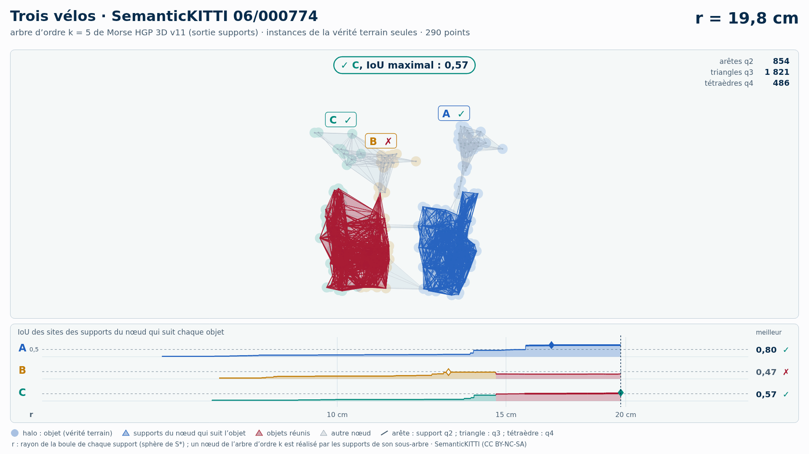

# Trois vélos (trame 06/000774) — instances de la vérité terrain seules

[Exemple](../README.md) · autre variante : [sol retiré automatiquement (Patchwork++)](../sans_sol/README.md) · [liste des exemples](../../README.md)

**k = 5** (les deux échouent, aucun gain HGP dans cette variante) :

<picture>
  <source media="(prefers-color-scheme: dark)" srcset="06_000774_trois_velos_6_14_15_instances_k5_sombre_instant_cle.png">
  
</picture>

Vidéo de 70 s, k = 5, 1920 × 1080 : [thème sombre](06_000774_trois_velos_6_14_15_instances_k5_sombre.mp4) · [thème clair](06_000774_trois_velos_6_14_15_instances_k5_clair.mp4) ; image finale : [sombre](06_000774_trois_velos_6_14_15_instances_k5_sombre_bilan.png) · [clair](06_000774_trois_velos_6_14_15_instances_k5_clair_bilan.png).

<picture>
  <source media="(prefers-color-scheme: dark)" srcset="06_000774_trois_velos_6_14_15_instances_k5_supports_sombre_instant_cle.png">
  
</picture>

Hiérarchie des supports q2, q3, q4 au même ordre, 42 s : [thème sombre](06_000774_trois_velos_6_14_15_instances_k5_supports_sombre.mp4) · [thème clair](06_000774_trois_velos_6_14_15_instances_k5_supports_clair.mp4) ; image finale : [sombre](06_000774_trois_velos_6_14_15_instances_k5_supports_sombre_bilan.png) · [clair](06_000774_trois_velos_6_14_15_instances_k5_supports_clair_bilan.png). Arbre couvrant d'ordre 5 : 3 864 nœuds, 3 864 naissances et fusions, chacune avec son support S\* (3 864 supports : 767 arêtes q2, 2 243 triangles q3, 854 tétraèdres q4).

Points : les seuls points des objets du groupe (vérité terrain SemanticKITTI), 290 points (A 141, B 63, C 86) : ni sol, ni fond, ni autre objet.

Meilleur IoU de chaque objet (meilleur bloc ; seuls les points non étiquetés et aberrants, classes 0 et 1, sont exclus : « autre structure » et « autre objet » comptent comme du fond) :

| k | HGP, meilleur IoU (A / B / C) | HDBSCAN, meilleur IoU | issue |
| --- | --- | --- | --- |
| 5 | 0,80 / **0,47** / 0,58 | 0,80 / **0,49** / 0,55 | les deux échouent |
| 10 | 0,80 / **0,44** / 0,52 | 0,76 / **0,43** / 0,53 | les deux échouent |

En gras : objet à 0,5 ou moins, qu'aucun groupe de la hiérarchie ne recouvre à plus de la moitié. Une vidéo par ordre où HGP réussit et HDBSCAN échoue ; sans gain, une seule, à k = 5.

## Événements de la vidéo à k = 5

Mêmes textes que les bandeaux. Premier balayage, HDBSCAN seul (HGP attend) :

| r | HDBSCAN |
| --- | --- |
| 18,7 cm | ✗ B et C réunis : B jamais retrouvé |
| 29,1 cm | ✓ C, IoU maximal : 0,55 |
| 29,6 cm | ✓ A, IoU maximal : 0,80 |
| 30,0 cm | ✗ A, B et C réunis : B jamais retrouvé |

Second balayage, HGP ; HDBSCAN le suit au même r, sans pause propre :

| r | HGP | HDBSCAN au même r |
| --- | --- | --- |
| 14,6 cm | ✗ B et C réunis : B jamais retrouvé | B et C encore séparés |
| 16,7 cm | ✓ A, IoU maximal : 0,80 | IoU au même r : A 0,45 |
| 19,9 cm | ✓ C, IoU maximal : 0,58 | ✗ B et C déjà réunis |
| 21,5 cm | ✗ A, B et C réunis : B jamais retrouvé |  |

Nombres : [`resultats_duel_k5.json`](resultats_duel_k5.json).

## Hiérarchie des supports à k = 5

Meilleur IoU des sites des supports du nœud qui suit chaque objet : 0,81 / 0,47 / 0,57 (hiérarchie de points HGP : 0,80 / 0,47 / 0,58). Événements, mêmes textes que les bandeaux :

| r | supports |
| --- | --- |
| 14,6 cm | ✗ B et C réunis : B jamais retrouvé |
| 19,8 cm | ✓ C, IoU maximal : 0,57 |
| 19,9 cm | ✓ A, IoU maximal : 0,81 |
| 21,5 cm | ✗ A, B et C réunis : B jamais retrouvé |

Nombres : [`resultats_supports_k5.json`](resultats_supports_k5.json).

Lecture, légende et convention de niveau : [README de la liste](../../README.md#lire-une-vidéo).

## Données

`bout.json` décrit la variante (trame, empreintes, instances, découpe, mesures). Les points ne sont pas versionnés (CC BY-NC-SA) : `data/` est ignoré par git ; ils se refont depuis les archives officielles (README de la liste, « Reproduire »).

