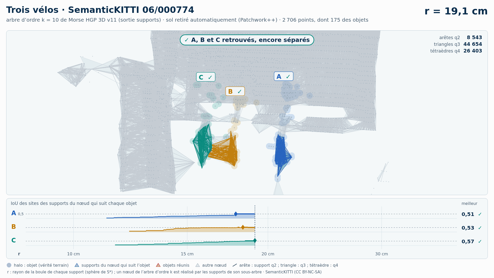

# Trois vélos (trame 06/000774) — sol retiré automatiquement (Patchwork++)

[Exemple](../README.md) · autre variante : [instances de la vérité terrain seules](../instances/README.md) · [liste des exemples](../../README.md)

**k = 10** (HGP réussit, HDBSCAN échoue) :

<picture>
  <source media="(prefers-color-scheme: dark)" srcset="06_000774_trois_velos_6_14_15_sans_sol_k10_sombre_instant_cle.png">
  
</picture>

Vidéo de 77 s, k = 10, 1920 × 1080 : [thème sombre](06_000774_trois_velos_6_14_15_sans_sol_k10_sombre.mp4) · [thème clair](06_000774_trois_velos_6_14_15_sans_sol_k10_clair.mp4) ; image finale : [sombre](06_000774_trois_velos_6_14_15_sans_sol_k10_sombre_bilan.png) · [clair](06_000774_trois_velos_6_14_15_sans_sol_k10_clair_bilan.png).

<picture>
  <source media="(prefers-color-scheme: dark)" srcset="06_000774_trois_velos_6_14_15_sans_sol_k10_supports_sombre_instant_cle.png">
  
</picture>

Hiérarchie des supports q2, q3, q4 au même ordre, 48 s : [thème sombre](06_000774_trois_velos_6_14_15_sans_sol_k10_supports_sombre.mp4) · [thème clair](06_000774_trois_velos_6_14_15_sans_sol_k10_supports_clair.mp4) ; image finale : [sombre](06_000774_trois_velos_6_14_15_sans_sol_k10_supports_sombre_bilan.png) · [clair](06_000774_trois_velos_6_14_15_sans_sol_k10_supports_clair_bilan.png). Arbre d'ordre 10 : 84 106 nœuds, 107 845 boules, 107 845 supports (10 861 arêtes q2, 58 979 triangles q3, 38 005 tétraèdres q4).

Points : tout ce que Patchwork++ (paramètres de la v8) ne classe pas en sol dans la boîte horizontale des objets élargie de 1 m, à toutes hauteurs : 2 706 points, dont 175 des objets (A 83, B 41, C 51) ; 115 points des objets retirés comme sol. Aucune étiquette ne sert au nettoyage : elles ne servent qu'à mesurer.

Meilleur IoU de chaque objet, même mesure que la campagne G4 (points void exclus) :

| k | HGP, meilleur IoU (A / B / C) | HDBSCAN, meilleur IoU | issue |
| --- | --- | --- | --- |
| 5 | 0,65 / 0,57 / 0,69 | 0,64 / 0,59 / 0,69 | les deux réussissent |
| 10 | 0,63 / 0,51 / 0,61 | 0,55 / **0,48** / **0,47** | HGP réussit, HDBSCAN échoue |

En gras : objet à 0,5 ou moins, qu'aucun groupe de la hiérarchie ne recouvre à plus de la moitié. Une vidéo par ordre où HGP réussit et HDBSCAN échoue ; sans gain, une seule, à k = 5.

## Événements de la vidéo à k = 10

Mêmes textes que les bandeaux. Premier balayage, HDBSCAN seul (HGP attend) :

| r | HDBSCAN |
| --- | --- |
| 30,1 cm | ✗ B et C réunis : B et C jamais retrouvés |
| 30,1 cm | ✗ B et C, déjà réunis, fusionnent avec la végétation |
| 31,7 cm | ✓ A, IoU maximal : 0,55 |
| 36,5 cm | ✗ A fusionne avec le bâtiment · IoU 0,52 → 0,04 |
| 41,3 cm | ✗ A, B et C réunis : B et C jamais retrouvés |

Second balayage, HGP ; HDBSCAN le suit au même r, sans pause propre :

| r | HGP | HDBSCAN au même r |
| --- | --- | --- |
| 18,5 cm | ✓ B, IoU maximal : 0,51 | IoU au même r : B 0,27 |
| 21,2 cm | ✓ C, IoU maximal : 0,61 | IoU au même r : C 0,35 |
| 21,4 cm | ✓ B et C réunis, chacun retrouvé avant |  |
| 24,7 cm | ✓ A, IoU maximal : 0,63 | IoU au même r : A 0,46 |
| 30,8 cm | ✗ B et C, déjà réunis, fusionnent avec la végétation |  |
| 31,4 cm | ✓ A, B et C réunis, chacun retrouvé avant |  |

Nombres : [`resultats_duel_k10.json`](resultats_duel_k10.json).

## Hiérarchie des supports à k = 10

Meilleur IoU des sites des supports du nœud qui suit chaque objet : 0,66 / 0,53 / 0,71 (hiérarchie de points HGP : 0,63 / 0,51 / 0,61). Événements, mêmes textes que les bandeaux :

| r | supports |
| --- | --- |
| 18,3 cm | ✓ B, IoU maximal : 0,53 |
| 19,1 cm | ✓ A, B et C retrouvés, encore séparés |
| 19,8 cm | ✓ C, IoU maximal : 0,71 |
| 21,4 cm | ✓ B et C réunis, chacun retrouvé avant |
| 28,5 cm | ✓ A, IoU maximal : 0,66 |
| 30,8 cm | ✗ B et C, déjà réunis, fusionnent avec la végétation |
| 31,4 cm | ✓ A, B et C réunis, chacun retrouvé avant |

Nombres : [`resultats_supports_k10.json`](resultats_supports_k10.json).

Lecture, légende et convention de niveau : [README de la liste](../../README.md#lire-une-vidéo).

## Données

`bout.json` décrit la variante (trame, empreintes, instances, découpe, mesures). Les points ne sont pas versionnés (CC BY-NC-SA) : `data/` est ignoré par git ; ils se refont depuis les archives officielles (README de la liste, « Reproduire »).

