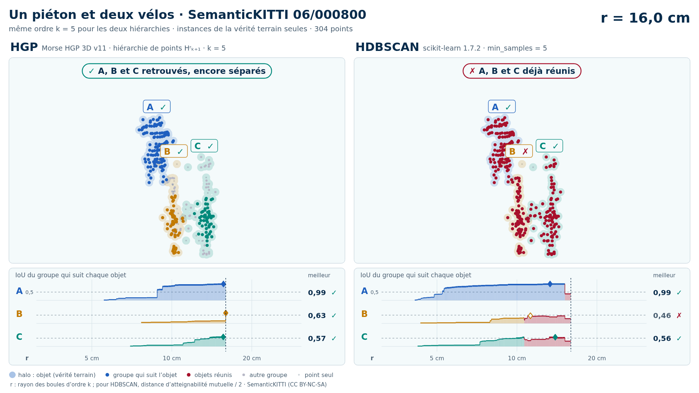
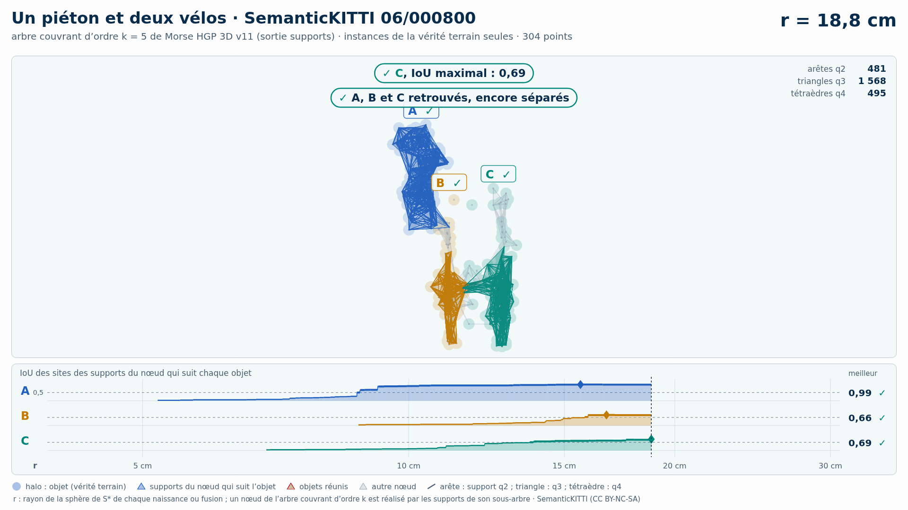
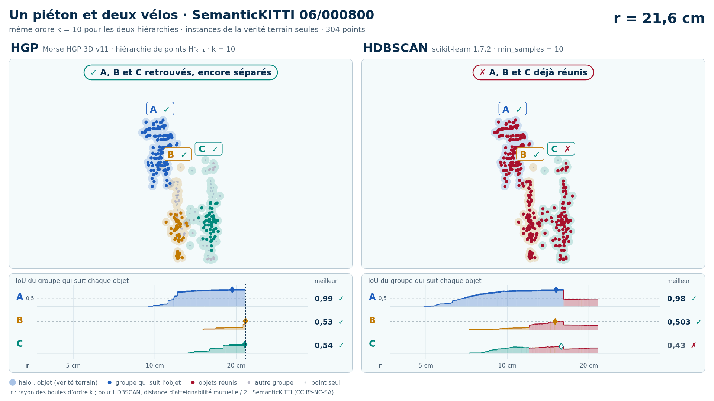
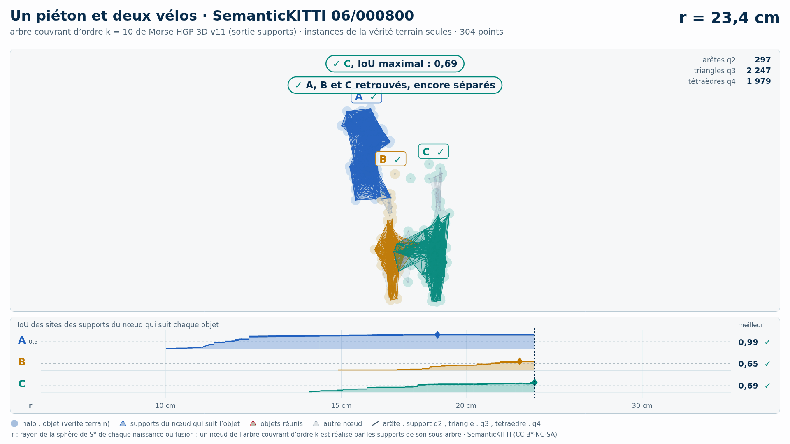

# Un piéton et deux vélos (trame 06/000800) — instances de la vérité terrain seules

[Exemple](../README.md) · autre variante : [sol retiré automatiquement (Patchwork++)](../sans_sol/README.md) · [liste des exemples](../../README.md)

**k = 5** (HGP réussit, HDBSCAN échoue) :

<picture>
  <source media="(prefers-color-scheme: dark)" srcset="06_000800_pieton_deux_velos_2_8_12_instances_k5_sombre_instant_cle.png">
  
</picture>

Vidéo de 73 s, k = 5, 1920 × 1080 : [thème sombre](06_000800_pieton_deux_velos_2_8_12_instances_k5_sombre.mp4) · [thème clair](06_000800_pieton_deux_velos_2_8_12_instances_k5_clair.mp4) ; image finale : [sombre](06_000800_pieton_deux_velos_2_8_12_instances_k5_sombre_bilan.png) · [clair](06_000800_pieton_deux_velos_2_8_12_instances_k5_clair_bilan.png).

<picture>
  <source media="(prefers-color-scheme: dark)" srcset="06_000800_pieton_deux_velos_2_8_12_instances_k5_supports_sombre_instant_cle.png">
  
</picture>

Hiérarchie des supports q2, q3, q4 au même ordre, 43 s : [thème sombre](06_000800_pieton_deux_velos_2_8_12_instances_k5_supports_sombre.mp4) · [thème clair](06_000800_pieton_deux_velos_2_8_12_instances_k5_supports_clair.mp4) ; image finale : [sombre](06_000800_pieton_deux_velos_2_8_12_instances_k5_supports_sombre_bilan.png) · [clair](06_000800_pieton_deux_velos_2_8_12_instances_k5_supports_clair_bilan.png). Arbre couvrant d'ordre 5 : 4 254 nœuds, 4 254 naissances et fusions, chacune avec son support S\* (4 254 supports : 730 arêtes q2, 2 532 triangles q3, 992 tétraèdres q4).

**k = 10** (HGP réussit, HDBSCAN échoue) :

<picture>
  <source media="(prefers-color-scheme: dark)" srcset="06_000800_pieton_deux_velos_2_8_12_instances_k10_sombre_instant_cle.png">
  
</picture>

Vidéo de 72 s, k = 10, 1920 × 1080 : [thème sombre](06_000800_pieton_deux_velos_2_8_12_instances_k10_sombre.mp4) · [thème clair](06_000800_pieton_deux_velos_2_8_12_instances_k10_clair.mp4) ; image finale : [sombre](06_000800_pieton_deux_velos_2_8_12_instances_k10_sombre_bilan.png) · [clair](06_000800_pieton_deux_velos_2_8_12_instances_k10_clair_bilan.png).

<picture>
  <source media="(prefers-color-scheme: dark)" srcset="06_000800_pieton_deux_velos_2_8_12_instances_k10_supports_sombre_instant_cle.png">
  
</picture>

Hiérarchie des supports q2, q3, q4 au même ordre, 43 s : [thème sombre](06_000800_pieton_deux_velos_2_8_12_instances_k10_supports_sombre.mp4) · [thème clair](06_000800_pieton_deux_velos_2_8_12_instances_k10_supports_clair.mp4) ; image finale : [sombre](06_000800_pieton_deux_velos_2_8_12_instances_k10_supports_sombre_bilan.png) · [clair](06_000800_pieton_deux_velos_2_8_12_instances_k10_supports_clair_bilan.png). Arbre couvrant d'ordre 10 : 12 008 nœuds, 12 008 naissances et fusions, chacune avec son support S\* (12 008 supports : 595 arêtes q2, 5 156 triangles q3, 6 257 tétraèdres q4).

Points : les seuls points des objets du groupe (vérité terrain SemanticKITTI), 304 points (A 117, B 86, C 101) : ni sol, ni fond, ni autre objet.

Meilleur IoU de chaque objet (meilleur bloc ; seuls les points non étiquetés et aberrants, classes 0 et 1, sont exclus : « autre structure » et « autre objet » comptent comme du fond) :

| k | HGP, meilleur IoU (A / B / C) | HDBSCAN, meilleur IoU | issue |
| --- | --- | --- | --- |
| 5 | 0,99 / 0,64 / 0,69 | 0,99 / **0,46** / 0,56 | HGP réussit, HDBSCAN échoue |
| 10 | 0,99 / 0,64 / 0,70 | 0,98 / 0,50 / **0,43** | HGP réussit, HDBSCAN échoue |

En gras : objet à 0,5 ou moins, qu'aucun groupe de la hiérarchie ne recouvre à plus de la moitié. Une vidéo par ordre où HGP réussit et HDBSCAN échoue ; sans gain, une seule, à k = 5.

## Événements de la vidéo à k = 5

Mêmes textes que les bandeaux. Premier balayage, HDBSCAN seul (HGP attend) :

| r | HDBSCAN |
| --- | --- |
| 21,3 cm | ✗ B et C réunis : B jamais retrouvé |
| 26,6 cm | ✓ A, IoU maximal : 0,99 |
| 27,9 cm | ✓ C, IoU maximal : 0,56 |
| 30,3 cm | ✗ A, B et C réunis : B jamais retrouvé |

Second balayage, HGP ; HDBSCAN le suit au même r, sans pause propre :

| r | HGP | HDBSCAN au même r |
| --- | --- | --- |
| 15,6 cm | ✓ A, IoU maximal : 0,99 | IoU au même r : A 0,90 |
| 16,4 cm | ✓ B, IoU maximal : 0,64 | IoU au même r : B 0,26 |
| 17,6 cm | ✓ A, B et C retrouvés, encore séparés | IoU au même r : A 0,93  ·  B 0,29  ·  C 0,45 |
| 18,8 cm | ✓ C, IoU maximal : 0,69 | IoU au même r : C 0,48 |
| 18,9 cm | ✓ B et C réunis, chacun retrouvé avant |  |
| 24,6 cm | ✓ A, B et C réunis, chacun retrouvé avant |  |

Nombres : [`resultats_duel_k5.json`](resultats_duel_k5.json).

## Hiérarchie des supports à k = 5

Meilleur IoU des sites des supports du nœud qui suit chaque objet : 0,99 / 0,66 / 0,69 (hiérarchie de points HGP : 0,99 / 0,64 / 0,69). Événements, mêmes textes que les bandeaux :

| r | supports |
| --- | --- |
| 15,6 cm | ✓ A, IoU maximal : 0,99 |
| 16,7 cm | ✓ B, IoU maximal : 0,66 |
| 18,8 cm | ✓ C, IoU maximal : 0,69 ; ✓ A, B et C retrouvés, encore séparés |
| 18,9 cm | ✓ B et C réunis, chacun retrouvé avant |
| 24,6 cm | ✓ A, B et C réunis, chacun retrouvé avant |

Nombres : [`resultats_supports_k5.json`](resultats_supports_k5.json).

## Événements de la vidéo à k = 10

Mêmes textes que les bandeaux. Premier balayage, HDBSCAN seul (HGP attend) :

| r | HDBSCAN |
| --- | --- |
| 24,1 cm | ✗ B et C réunis : C jamais retrouvé |
| 30,1 cm | ✓ B, IoU maximal : 0,503 |
| 30,3 cm | ✓ A, IoU maximal : 0,98 |
| 32,3 cm | ✗ A, B et C réunis : C jamais retrouvé |

Second balayage, HGP ; HDBSCAN le suit au même r, sans pause propre :

| r | HGP | HDBSCAN au même r |
| --- | --- | --- |
| 19,3 cm | ✓ A, IoU maximal : 0,99 | IoU au même r : A 0,90 |
| 23,2 cm | ✓ B, IoU maximal : 0,64 | IoU au même r : B 0,13 |
| 23,4 cm | ✓ C, IoU maximal : 0,70 ; ✓ A, B et C retrouvés, encore séparés | IoU au même r : A 0,92  ·  B 0,14  ·  C 0,34 |
| 23,9 cm | ✓ B et C réunis, chacun retrouvé avant |  |
| 29,4 cm | ✓ A, B et C réunis, chacun retrouvé avant |  |

Nombres : [`resultats_duel_k10.json`](resultats_duel_k10.json).

## Hiérarchie des supports à k = 10

Meilleur IoU des sites des supports du nœud qui suit chaque objet : 0,99 / 0,65 / 0,69 (hiérarchie de points HGP : 0,99 / 0,64 / 0,70). Événements, mêmes textes que les bandeaux :

| r | supports |
| --- | --- |
| 18,7 cm | ✓ A, IoU maximal : 0,99 |
| 22,6 cm | ✓ B, IoU maximal : 0,65 |
| 23,4 cm | ✓ C, IoU maximal : 0,69 ; ✓ A, B et C retrouvés, encore séparés |
| 23,9 cm | ✓ B et C réunis, chacun retrouvé avant |
| 29,4 cm | ✓ A, B et C réunis, chacun retrouvé avant |

Nombres : [`resultats_supports_k10.json`](resultats_supports_k10.json).

Lecture, légende et convention de niveau : [README de la liste](../../README.md#lire-une-vidéo).

## Données

`bout.json` décrit la variante (trame, empreintes, instances, découpe, mesures). Les points ne sont pas versionnés (CC BY-NC-SA) : `data/` est ignoré par git ; ils se refont depuis les archives officielles (README de la liste, « Reproduire »).

