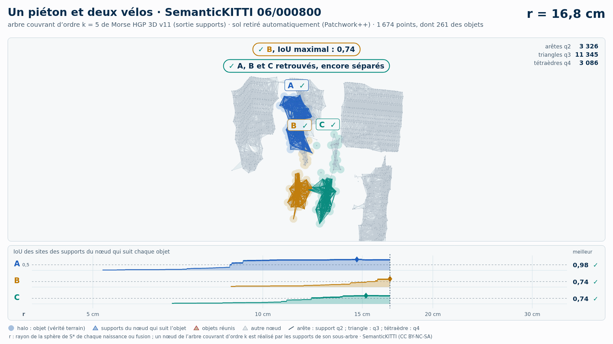
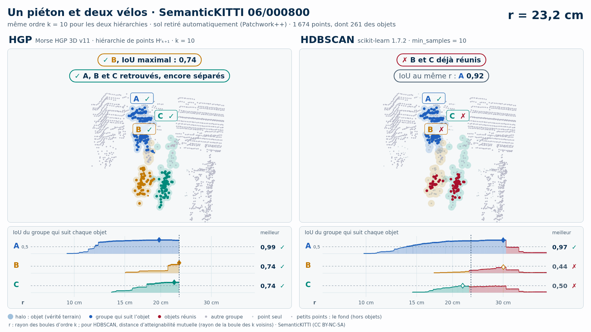
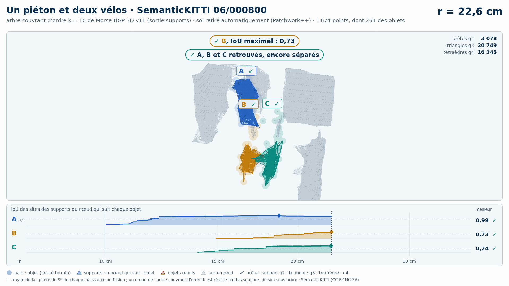

# Un piéton et deux vélos (trame 06/000800) — sol retiré automatiquement (Patchwork++)

[Exemple](../README.md) · autre variante : [instances de la vérité terrain seules](../instances/README.md) · [liste des exemples](../../README.md)

**k = 5** (HGP réussit, HDBSCAN échoue) :

<picture>
  <source media="(prefers-color-scheme: dark)" srcset="06_000800_pieton_deux_velos_2_8_12_sans_sol_k5_sombre_instant_cle.png">
  
</picture>

Vidéo de 80 s, k = 5, 1920 × 1080 : [thème sombre](06_000800_pieton_deux_velos_2_8_12_sans_sol_k5_sombre.mp4) · [thème clair](06_000800_pieton_deux_velos_2_8_12_sans_sol_k5_clair.mp4) ; image finale : [sombre](06_000800_pieton_deux_velos_2_8_12_sans_sol_k5_sombre_bilan.png) · [clair](06_000800_pieton_deux_velos_2_8_12_sans_sol_k5_clair_bilan.png).

<picture>
  <source media="(prefers-color-scheme: dark)" srcset="06_000800_pieton_deux_velos_2_8_12_sans_sol_k5_supports_sombre_instant_cle.png">
  
</picture>

Hiérarchie des supports q2, q3, q4 au même ordre, 49 s : [thème sombre](06_000800_pieton_deux_velos_2_8_12_sans_sol_k5_supports_sombre.mp4) · [thème clair](06_000800_pieton_deux_velos_2_8_12_sans_sol_k5_supports_clair.mp4) ; image finale : [sombre](06_000800_pieton_deux_velos_2_8_12_sans_sol_k5_supports_sombre_bilan.png) · [clair](06_000800_pieton_deux_velos_2_8_12_sans_sol_k5_supports_clair_bilan.png). Arbre couvrant d'ordre 5 : 22 192 nœuds, 22 196 naissances et fusions, chacune avec son support S\* (22 196 supports : 4 018 arêtes q2, 13 947 triangles q3, 4 231 tétraèdres q4).

**k = 10** (HGP réussit, HDBSCAN échoue) :

<picture>
  <source media="(prefers-color-scheme: dark)" srcset="06_000800_pieton_deux_velos_2_8_12_sans_sol_k10_sombre_instant_cle.png">
  
</picture>

Vidéo de 75 s, k = 10, 1920 × 1080 : [thème sombre](06_000800_pieton_deux_velos_2_8_12_sans_sol_k10_sombre.mp4) · [thème clair](06_000800_pieton_deux_velos_2_8_12_sans_sol_k10_clair.mp4) ; image finale : [sombre](06_000800_pieton_deux_velos_2_8_12_sans_sol_k10_sombre_bilan.png) · [clair](06_000800_pieton_deux_velos_2_8_12_sans_sol_k10_clair_bilan.png).

<picture>
  <source media="(prefers-color-scheme: dark)" srcset="06_000800_pieton_deux_velos_2_8_12_sans_sol_k10_supports_sombre_instant_cle.png">
  
</picture>

Hiérarchie des supports q2, q3, q4 au même ordre, 46 s : [thème sombre](06_000800_pieton_deux_velos_2_8_12_sans_sol_k10_supports_sombre.mp4) · [thème clair](06_000800_pieton_deux_velos_2_8_12_sans_sol_k10_supports_clair.mp4) ; image finale : [sombre](06_000800_pieton_deux_velos_2_8_12_sans_sol_k10_supports_sombre_bilan.png) · [clair](06_000800_pieton_deux_velos_2_8_12_sans_sol_k10_supports_clair_bilan.png). Arbre couvrant d'ordre 10 : 60 903 nœuds, 60 907 naissances et fusions, chacune avec son support S\* (60 907 supports : 4 007 arêtes q2, 29 227 triangles q3, 27 673 tétraèdres q4).

Points : tout ce que Patchwork++ (paramètres de la v8) ne classe pas en sol dans la boîte horizontale des objets élargie de 1 m, à toutes hauteurs : 1 674 points, dont 261 des objets (A 117, B 64, C 80) ; 43 points des objets retirés comme sol. Aucune étiquette ne sert au nettoyage : elles ne servent qu'à mesurer.

Meilleur IoU de chaque objet (meilleur bloc ; seuls les points non étiquetés et aberrants, classes 0 et 1, sont exclus : « autre structure » et « autre objet » comptent comme du fond) :

| k | HGP, meilleur IoU (A / B / C) | HDBSCAN, meilleur IoU | issue |
| --- | --- | --- | --- |
| 5 | 0,97 / 0,74 / 0,73 | 0,96 / **0,43** / 0,70 | HGP réussit, HDBSCAN échoue |
| 10 | 0,99 / 0,74 / 0,74 | 0,97 / **0,44** / **0,50** | HGP réussit, HDBSCAN échoue |

En gras : objet à 0,5 ou moins, qu'aucun groupe de la hiérarchie ne recouvre à plus de la moitié. Une vidéo par ordre où HGP réussit et HDBSCAN échoue ; sans gain, une seule, à k = 5.

## Événements de la vidéo à k = 5

Mêmes textes que les bandeaux. Premier balayage, HDBSCAN seul (HGP attend) :

| r | HDBSCAN |
| --- | --- |
| 21,0 cm | ✓ C, IoU maximal : 0,70 |
| 21,9 cm | ✗ B et C réunis : B jamais retrouvé |
| 26,2 cm | ✓ A, IoU maximal : 0,96 |
| 30,0 cm | ✗ A, B et C réunis : B jamais retrouvé |
| 32,2 cm | ✗ A, B et C, déjà réunis, fusionnent avec le bâtiment |

Second balayage, HGP ; HDBSCAN le suit au même r, sans pause propre :

| r | HGP | HDBSCAN au même r |
| --- | --- | --- |
| 15,2 cm | ✓ C, IoU maximal : 0,73 | IoU au même r : C 0,41 |
| 15,8 cm | ✓ A, IoU maximal : 0,97 | IoU au même r : A 0,90 |
| 16,8 cm | ✓ B, IoU maximal : 0,74 ; ✓ A, B et C retrouvés, encore séparés | IoU au même r : A 0,91  ·  B 0,23  ·  C 0,49 |
| 18,9 cm | ✓ B et C réunis, chacun retrouvé avant |  |
| 24,4 cm | ✗ B et C, déjà réunis, fusionnent avec un autre vélo |  |
| 24,6 cm | ✓ A, B et C réunis, chacun retrouvé avant |  |
| 27,7 cm | ✗ A, B et C, déjà réunis, fusionnent avec le bâtiment |  |

Nombres : [`resultats_duel_k5.json`](resultats_duel_k5.json).

## Hiérarchie des supports à k = 5

Meilleur IoU des sites des supports du nœud qui suit chaque objet : 0,98 / 0,74 / 0,74 (hiérarchie de points HGP : 0,97 / 0,74 / 0,73). Événements, mêmes textes que les bandeaux :

| r | supports |
| --- | --- |
| 14,7 cm | ✓ A, IoU maximal : 0,98 |
| 15,2 cm | ✓ C, IoU maximal : 0,74 |
| 16,8 cm | ✓ B, IoU maximal : 0,74 ; ✓ A, B et C retrouvés, encore séparés |
| 18,9 cm | ✓ B et C réunis, chacun retrouvé avant |
| 24,4 cm | ✗ B et C, déjà réunis, fusionnent avec un autre vélo |
| 24,6 cm | ✓ A, B et C réunis, chacun retrouvé avant |
| 27,7 cm | ✗ A, B et C, déjà réunis, fusionnent avec le bâtiment |

Nombres : [`resultats_supports_k5.json`](resultats_supports_k5.json).

## Événements de la vidéo à k = 10

Mêmes textes que les bandeaux. Premier balayage, HDBSCAN seul (HGP attend) :

| r | HDBSCAN |
| --- | --- |
| 22,8 cm | ✗ B et C réunis : B et C jamais retrouvés |
| 30,0 cm | ✓ A, IoU maximal : 0,97 |
| 30,7 cm | ✗ A, B et C réunis : B et C jamais retrouvés |
| 34,0 cm | ✗ A, B et C, déjà réunis, fusionnent avec le bâtiment |

Second balayage, HGP ; HDBSCAN le suit au même r, sans pause propre :

| r | HGP | HDBSCAN au même r |
| --- | --- | --- |
| 19,7 cm | ✓ A, IoU maximal : 0,99 | IoU au même r : A 0,89 |
| 22,3 cm | ✓ C, IoU maximal : 0,74 | IoU au même r : C 0,47 |
| 23,2 cm | ✓ B, IoU maximal : 0,74 ; ✓ A, B et C retrouvés, encore séparés | ✗ B et C déjà réunis ; IoU au même r : A 0,92 |
| 23,9 cm | ✓ B et C réunis, chacun retrouvé avant |  |
| 29,0 cm | ✓ A, B et C réunis, chacun retrouvé avant |  |
| 30,0 cm | ✗ A, B et C, déjà réunis, fusionnent avec le bâtiment |  |

Nombres : [`resultats_duel_k10.json`](resultats_duel_k10.json).

## Hiérarchie des supports à k = 10

Meilleur IoU des sites des supports du nœud qui suit chaque objet : 0,99 / 0,73 / 0,74 (hiérarchie de points HGP : 0,99 / 0,74 / 0,74). Événements, mêmes textes que les bandeaux :

| r | supports |
| --- | --- |
| 18,7 cm | ✓ A, IoU maximal : 0,99 |
| 22,6 cm | ✓ C, IoU maximal : 0,74 |
| 22,6 cm | ✓ B, IoU maximal : 0,73 ; ✓ A, B et C retrouvés, encore séparés |
| 23,9 cm | ✓ B et C réunis, chacun retrouvé avant |
| 29,0 cm | ✓ A, B et C réunis, chacun retrouvé avant |
| 30,0 cm | ✗ A, B et C, déjà réunis, fusionnent avec le bâtiment |

Nombres : [`resultats_supports_k10.json`](resultats_supports_k10.json).

Lecture, légende et convention de niveau : [README de la liste](../../README.md#lire-une-vidéo).

## Données

`bout.json` décrit la variante (trame, empreintes, instances, découpe, mesures). Les points ne sont pas versionnés (CC BY-NC-SA) : `data/` est ignoré par git ; ils se refont depuis les archives officielles (README de la liste, « Reproduire »).

