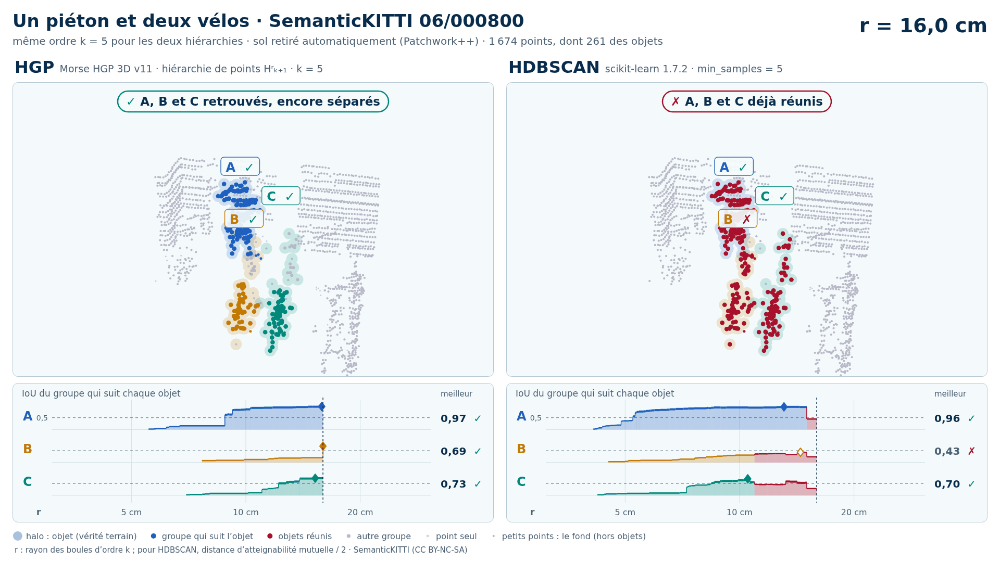

# Un piéton et deux vélos (trame 06/000800) — sol retiré automatiquement (Patchwork++)

[Exemple](../README.md) · autre variante : [instances de la vérité terrain seules](../instances/README.md) · [liste des exemples](../../README.md)

<picture>
  <source media="(prefers-color-scheme: dark)" srcset="06_000800_pieton_deux_velos_2_8_12_sans_sol_k5_sombre_instant_cle.png">
  
</picture>

Vidéo de 48 s, k = 5, 1920 × 1080 : [thème sombre](06_000800_pieton_deux_velos_2_8_12_sans_sol_k5_sombre.mp4) · [thème clair](06_000800_pieton_deux_velos_2_8_12_sans_sol_k5_clair.mp4) ; image finale : [sombre](06_000800_pieton_deux_velos_2_8_12_sans_sol_k5_sombre_bilan.png) · [clair](06_000800_pieton_deux_velos_2_8_12_sans_sol_k5_clair_bilan.png).

Points : tout ce que Patchwork++ (paramètres de la v8) ne classe pas en sol dans la boîte horizontale des objets élargie de 1 m, à toutes hauteurs : 1 674 points, dont 261 des objets (A 117, B 64, C 80) ; 43 points des objets retirés comme sol. Aucune étiquette ne sert au nettoyage : elles ne servent qu'à mesurer.

Meilleur IoU de chaque objet, même mesure que la campagne G4 (points void exclus) :

| k | HGP, meilleur IoU (A / B / C) | HDBSCAN, meilleur IoU | issue |
| --- | --- | --- | --- |
| 5 | 0,97 / 0,74 / 0,73 | 0,96 / **0,43** / 0,70 | HGP réussit, HDBSCAN échoue |
| 10 | 0,99 / 0,74 / 0,74 | 0,97 / **0,44** / **0,50** | HGP réussit, HDBSCAN échoue |

En gras : objet à 0,5 ou moins, qu'aucun groupe de la hiérarchie ne recouvre à plus de la moitié.

## Événements de la vidéo (k = 5)

Le niveau r croît pour les deux colonnes à la fois et s'arrête à chaque événement des groupes qui suivent les objets (mêmes textes que les bandeaux) :

| r | HGP | HDBSCAN |
| --- | --- | --- |
| 5,2 cm |  | ✓ A retrouvé · IoU 0,56 |
| 8,4 cm |  | ✓ C retrouvé · IoU 0,53 |
| 8,8 cm | ✓ A retrouvé · IoU 0,62 |  |
| 11,0 cm | B et C encore séparés | ✗ B et C réunis : B jamais retrouvé |
| 12,2 cm | ✓ C retrouvé · IoU 0,51 |  |
| 15,0 cm | A, B et C encore séparés | ✗ A, B et C réunis : B jamais retrouvé |
| 16,0 cm | ✓ A, B et C retrouvés, encore séparés | ✗ A, B et C déjà réunis |
| 18,9 cm | ✓ B et C réunis, chacun retrouvé avant |  |
| 24,6 cm | ✓ A, B et C réunis, chacun retrouvé avant |  |

Lecture, légende et convention de niveau : [README de la liste](../../README.md#lire-une-vidéo) ; nombres : [`resultats_duel_k5.json`](resultats_duel_k5.json).

## Données

`bout.json` décrit la variante (trame, empreintes, instances, découpe, mesures). Les points ne sont pas versionnés (CC BY-NC-SA) : `data/` est ignoré par git ; ils se refont depuis les archives officielles (README de la liste, « Reproduire »).

