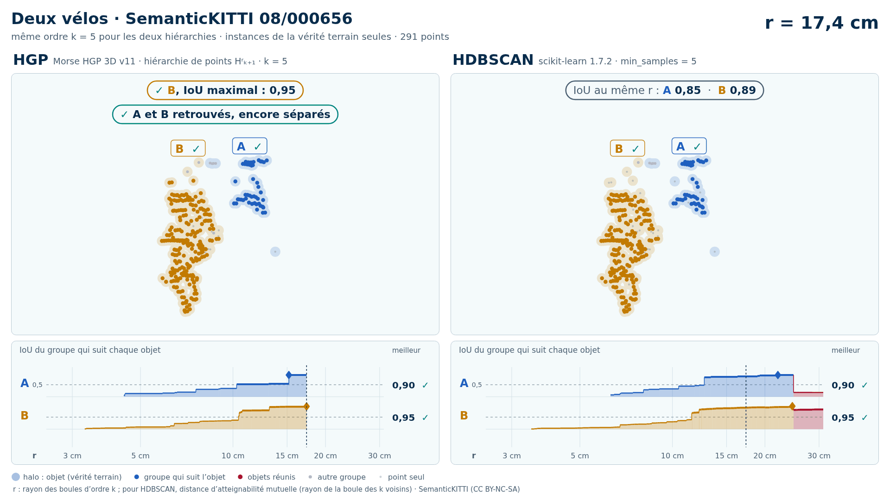
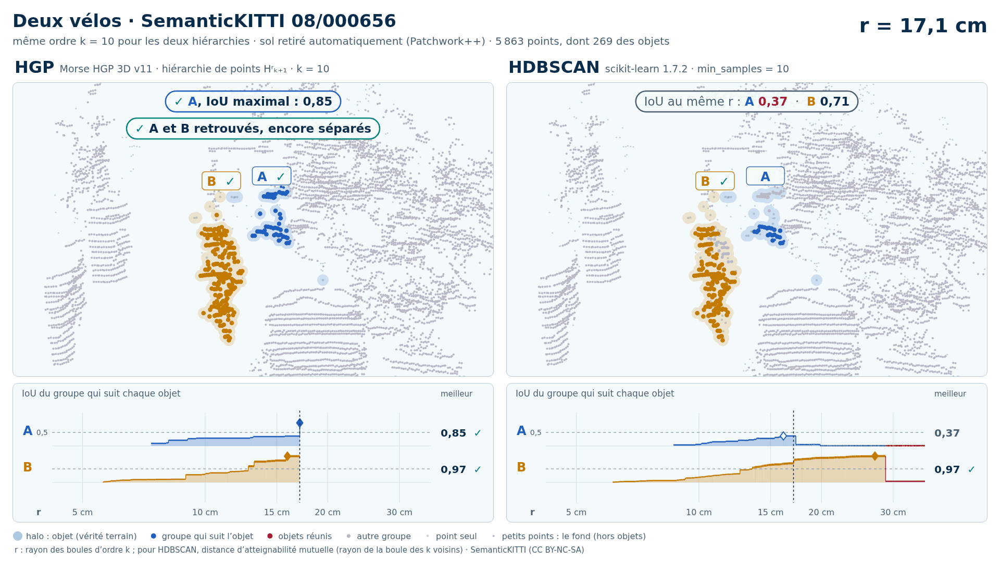

# Deux vélos (trame 08/000656)

Exemple vidéo HGP contre HDBSCAN ([liste](../README.md)) : SemanticKITTI, séquence 08, trame 000656. Deux variantes, chacune dans son sous-dossier :

- [`instances/`](instances/README.md) : les seuls points des objets (vérité terrain), 291 points ;
- [`sans_sol/`](sans_sol/README.md) : tout ce que Patchwork++ ne classe pas en sol dans la boîte des objets élargie de 1 m, 5 863 points (aucune étiquette ne sert au nettoyage).

| objet | classe | points (instances) | points gardés sans sol | points retirés comme sol |
| --- | --- | --- | --- | --- |
| A | vélo | 52 | 52 | 0 |
| B | vélo | 239 | 217 | 22 |

Écarts (plus courte distance entre les points de deux objets) : A–B : 0,11 m. Dans la découpe sans sol : 1 autre instance (1078 points) ; 655 points void ; 2833 points de sol retirés.

| variante | k | HGP, meilleur IoU (A / B) | HDBSCAN, meilleur IoU | issue |
| --- | --- | --- | --- | --- |
| instances de la vérité terrain seules | 5 | 0,90 / 0,95 | 0,90 / 0,95 | les deux réussissent |
| instances de la vérité terrain seules | 10 | 0,98 / 0,95 | 0,90 / 0,94 | les deux réussissent |
| sol retiré automatiquement (Patchwork++) | 5 | 0,51 / 0,96 | 0,80 / 0,96 | les deux réussissent |
| sol retiré automatiquement (Patchwork++) | 10 | 0,85 / 0,97 | **0,37** / 0,97 | HGP réussit, HDBSCAN échoue |

En gras : objet à 0,5 ou moins, qu'aucun groupe de la hiérarchie ne recouvre à plus de la moitié. Vidéos : k = 5 (instances) ; k = 10 (sans sol). Objets : instances SemanticKITTI A = 37, B = 61.

<!-- video:début -->
## Vidéos

| | instances de la vérité terrain seules | sol retiré automatiquement (Patchwork++) |
| --- | --- | --- |
| vidéos | [README](instances/README.md) · k = 5 : [sombre](instances/08_000656_deux_velos_37_61_instances_k5_sombre.mp4) · [clair](instances/08_000656_deux_velos_37_61_instances_k5_clair.mp4) | [README](sans_sol/README.md) · k = 10 : [sombre](sans_sol/08_000656_deux_velos_37_61_sans_sol_k10_sombre.mp4) · [clair](sans_sol/08_000656_deux_velos_37_61_sans_sol_k10_clair.mp4) |

**Instances de la vérité terrain seules**, k = 5 :

<picture>
  <source media="(prefers-color-scheme: dark)" srcset="instances/08_000656_deux_velos_37_61_instances_k5_sombre_instant_cle.png">
  
</picture>

**Sol retiré automatiquement (Patchwork++)**, k = 10 :

<picture>
  <source media="(prefers-color-scheme: dark)" srcset="sans_sol/08_000656_deux_velos_37_61_sans_sol_k10_sombre_instant_cle.png">
  
</picture>

<!-- video:fin -->
