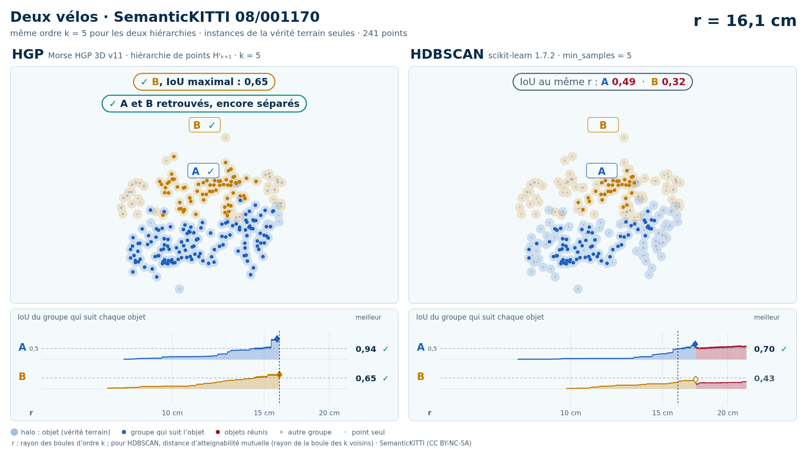
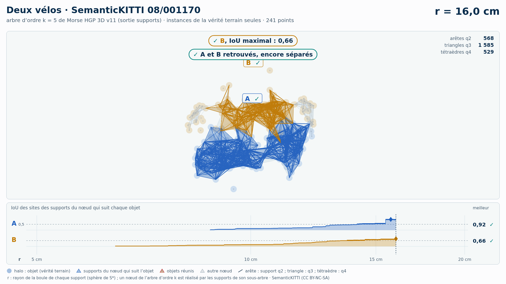
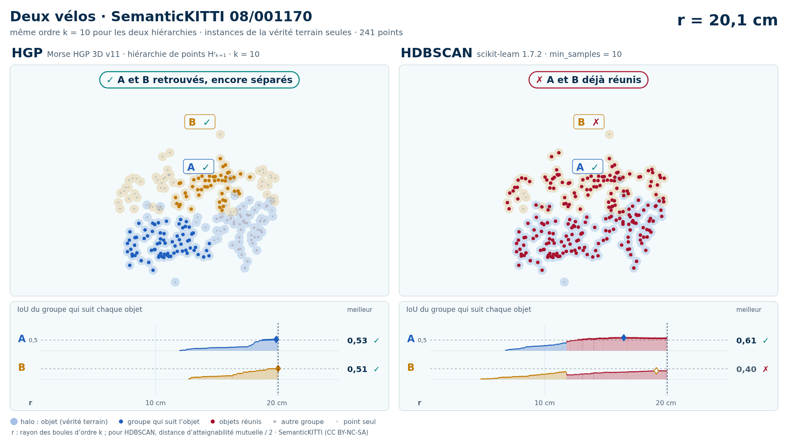
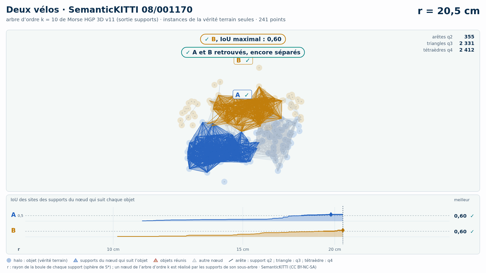

# Deux vélos (trame 08/001170) — instances de la vérité terrain seules

[Exemple](../README.md) · autre variante : [sol retiré automatiquement (Patchwork++)](../sans_sol/README.md) · [liste des exemples](../../README.md)

**k = 5** (HGP réussit, HDBSCAN échoue) :

<picture>
  <source media="(prefers-color-scheme: dark)" srcset="08_001170_deux_velos_43_57_instances_k5_sombre_instant_cle.png">
  
</picture>

Vidéo de 62 s, k = 5, 1920 × 1080 : [thème sombre](08_001170_deux_velos_43_57_instances_k5_sombre.mp4) · [thème clair](08_001170_deux_velos_43_57_instances_k5_clair.mp4) ; image finale : [sombre](08_001170_deux_velos_43_57_instances_k5_sombre_bilan.png) · [clair](08_001170_deux_velos_43_57_instances_k5_clair_bilan.png).

<picture>
  <source media="(prefers-color-scheme: dark)" srcset="08_001170_deux_velos_43_57_instances_k5_supports_sombre_instant_cle.png">
  
</picture>

Hiérarchie des supports q2, q3, q4 au même ordre, 39 s : [thème sombre](08_001170_deux_velos_43_57_instances_k5_supports_sombre.mp4) · [thème clair](08_001170_deux_velos_43_57_instances_k5_supports_clair.mp4) ; image finale : [sombre](08_001170_deux_velos_43_57_instances_k5_supports_sombre_bilan.png) · [clair](08_001170_deux_velos_43_57_instances_k5_supports_clair_bilan.png). Arbre d'ordre 5 : 4 176 nœuds, 5 815 boules, 5 815 supports (1 124 arêtes q2, 3 411 triangles q3, 1 280 tétraèdres q4).

**k = 10** (HGP réussit, HDBSCAN échoue) :

<picture>
  <source media="(prefers-color-scheme: dark)" srcset="08_001170_deux_velos_43_57_instances_k10_sombre_instant_cle.png">
  
</picture>

Vidéo de 64 s, k = 10, 1920 × 1080 : [thème sombre](08_001170_deux_velos_43_57_instances_k10_sombre.mp4) · [thème clair](08_001170_deux_velos_43_57_instances_k10_clair.mp4) ; image finale : [sombre](08_001170_deux_velos_43_57_instances_k10_sombre_bilan.png) · [clair](08_001170_deux_velos_43_57_instances_k10_clair_bilan.png).

<picture>
  <source media="(prefers-color-scheme: dark)" srcset="08_001170_deux_velos_43_57_instances_k10_supports_sombre_instant_cle.png">
  
</picture>

Hiérarchie des supports q2, q3, q4 au même ordre, 39 s : [thème sombre](08_001170_deux_velos_43_57_instances_k10_supports_sombre.mp4) · [thème clair](08_001170_deux_velos_43_57_instances_k10_supports_clair.mp4) ; image finale : [sombre](08_001170_deux_velos_43_57_instances_k10_supports_sombre_bilan.png) · [clair](08_001170_deux_velos_43_57_instances_k10_supports_clair_bilan.png). Arbre d'ordre 10 : 11 980 nœuds, 15 574 boules, 15 574 supports (1 015 arêtes q2, 7 094 triangles q3, 7 465 tétraèdres q4).

Points : les seuls points des objets du groupe (vérité terrain SemanticKITTI), 241 points (A 141, B 100) : ni sol, ni fond, ni autre objet.

Meilleur IoU de chaque objet, même mesure que la campagne G4 (points void exclus) :

| k | HGP, meilleur IoU (A / B) | HDBSCAN, meilleur IoU | issue |
| --- | --- | --- | --- |
| 5 | 0,94 / 0,65 | 0,70 / **0,43** | HGP réussit, HDBSCAN échoue |
| 10 | 0,66 / 0,59 | 0,61 / **0,41** | HGP réussit, HDBSCAN échoue |

En gras : objet à 0,5 ou moins, qu'aucun groupe de la hiérarchie ne recouvre à plus de la moitié. Une vidéo par ordre où HGP réussit et HDBSCAN échoue ; sans gain, une seule, à k = 5.

## Événements de la vidéo à k = 5

Mêmes textes que les bandeaux. Premier balayage, HDBSCAN seul (HGP attend) :

| r | HDBSCAN |
| --- | --- |
| 17,3 cm | ✓ A, IoU maximal : 0,70 |
| 17,4 cm | ✗ A et B réunis : B jamais retrouvé |

Second balayage, HGP ; HDBSCAN le suit au même r, sans pause propre :

| r | HGP | HDBSCAN au même r |
| --- | --- | --- |
| 15,9 cm | ✓ A, IoU maximal : 0,94 | IoU au même r : A 0,48 |
| 16,1 cm | ✓ B, IoU maximal : 0,65 ; ✓ A et B retrouvés, encore séparés | IoU au même r : A 0,49  ·  B 0,32 |
| 16,2 cm | ✓ A et B réunis, chacun retrouvé avant |  |

Nombres : [`resultats_duel_k5.json`](resultats_duel_k5.json).

## Hiérarchie des supports à k = 5

Meilleur IoU des sites des supports du nœud qui suit chaque objet : 0,92 / 0,66 (hiérarchie de points HGP : 0,94 / 0,65). Événements, mêmes textes que les bandeaux :

| r | supports |
| --- | --- |
| 15,7 cm | ✓ A, IoU maximal : 0,92 |
| 16,0 cm | ✓ B, IoU maximal : 0,66 ; ✓ A et B retrouvés, encore séparés |
| 16,2 cm | ✓ A et B réunis, chacun retrouvé avant |

Nombres : [`resultats_supports_k5.json`](resultats_supports_k5.json).

## Événements de la vidéo à k = 10

Mêmes textes que les bandeaux. Premier balayage, HDBSCAN seul (HGP attend) :

| r | HDBSCAN |
| --- | --- |
| 22,7 cm | ✗ A et B réunis : B jamais retrouvé |
| 31,4 cm | ✓ A, IoU maximal : 0,61 |

Second balayage, HGP ; HDBSCAN le suit au même r, sans pause propre :

| r | HGP | HDBSCAN au même r |
| --- | --- | --- |
| 21,2 cm | ✓ B, IoU maximal : 0,59 ; ✓ A et B retrouvés, encore séparés | IoU au même r : A 0,28  ·  B 0,30 |
| 21,2 cm | ✗ B fusionne avec une partie de A · IoU 0,59 → 0,40 |  |
| 22,9 cm | ✓ A et B réunis, chacun retrouvé avant |  |
| 23,6 cm | ✓ A, IoU maximal : 0,66 | ✗ A et B déjà réunis |

Nombres : [`resultats_duel_k10.json`](resultats_duel_k10.json).

## Hiérarchie des supports à k = 10

Meilleur IoU des sites des supports du nœud qui suit chaque objet : 0,64 / 0,60 (hiérarchie de points HGP : 0,66 / 0,59). Événements, mêmes textes que les bandeaux :

| r | supports |
| --- | --- |
| 20,5 cm | ✓ B, IoU maximal : 0,60 ; ✓ A et B retrouvés, encore séparés |
| 21,2 cm | ✗ B fusionne avec une partie de A · IoU 0,56 → 0,39 |
| 22,9 cm | ✓ A, IoU maximal : 0,64 ; ✓ A et B réunis, chacun retrouvé avant |

Nombres : [`resultats_supports_k10.json`](resultats_supports_k10.json).

Lecture, légende et convention de niveau : [README de la liste](../../README.md#lire-une-vidéo).

## Données

`bout.json` décrit la variante (trame, empreintes, instances, découpe, mesures). Les points ne sont pas versionnés (CC BY-NC-SA) : `data/` est ignoré par git ; ils se refont depuis les archives officielles (README de la liste, « Reproduire »).

