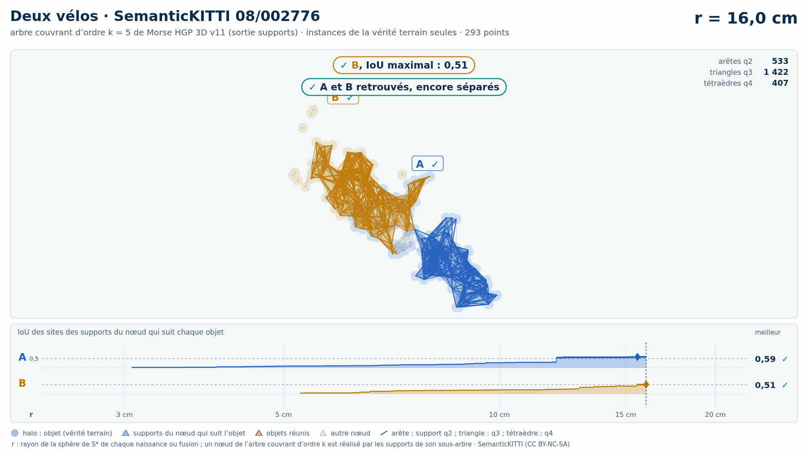

# Deux vélos (trame 08/002776) — instances de la vérité terrain seules

[Exemple](../README.md) · autre variante : [sol retiré automatiquement (Patchwork++)](../sans_sol/README.md) · [liste des exemples](../../README.md)

**k = 5** (HGP réussit, HDBSCAN échoue) :

<picture>
  <source media="(prefers-color-scheme: dark)" srcset="08_002776_deux_velos_17_64_instances_k5_sombre_instant_cle.png">
  
</picture>

Vidéo de 58 s, k = 5, 1920 × 1080 : [thème sombre](08_002776_deux_velos_17_64_instances_k5_sombre.mp4) · [thème clair](08_002776_deux_velos_17_64_instances_k5_clair.mp4) ; image finale : [sombre](08_002776_deux_velos_17_64_instances_k5_sombre_bilan.png) · [clair](08_002776_deux_velos_17_64_instances_k5_clair_bilan.png).

<picture>
  <source media="(prefers-color-scheme: dark)" srcset="08_002776_deux_velos_17_64_instances_k5_supports_sombre_instant_cle.png">
  
</picture>

Hiérarchie des supports q2, q3, q4 au même ordre, 36 s : [thème sombre](08_002776_deux_velos_17_64_instances_k5_supports_sombre.mp4) · [thème clair](08_002776_deux_velos_17_64_instances_k5_supports_clair.mp4) ; image finale : [sombre](08_002776_deux_velos_17_64_instances_k5_supports_sombre_bilan.png) · [clair](08_002776_deux_velos_17_64_instances_k5_supports_clair_bilan.png). Arbre couvrant d'ordre 5 : 2 904 nœuds, 2 904 naissances et fusions, chacune avec son support S\* (2 904 supports : 624 arêtes q2, 1 753 triangles q3, 527 tétraèdres q4).

Points : les seuls points des objets du groupe (vérité terrain SemanticKITTI), 293 points (A 198, B 95) : ni sol, ni fond, ni autre objet.

Meilleur IoU de chaque objet, même mesure que la campagne G4 (points void exclus) :

| k | HGP, meilleur IoU (A / B) | HDBSCAN, meilleur IoU | issue |
| --- | --- | --- | --- |
| 5 | 0,70 / 0,53 | 0,75 / **0,36** | HGP réussit, HDBSCAN échoue |
| 10 | 0,70 / **0,49** | 0,70 / **0,45** | les deux échouent |

En gras : objet à 0,5 ou moins, qu'aucun groupe de la hiérarchie ne recouvre à plus de la moitié. Une vidéo par ordre où HGP réussit et HDBSCAN échoue ; sans gain, une seule, à k = 5.

## Événements de la vidéo à k = 5

Mêmes textes que les bandeaux. Premier balayage, HDBSCAN seul (HGP attend) :

| r | HDBSCAN |
| --- | --- |
| 17,3 cm | ✗ A et B réunis : B jamais retrouvé |
| 20,6 cm | ✓ A, IoU maximal : 0,75 |

Second balayage, HGP ; HDBSCAN le suit au même r, sans pause propre :

| r | HGP | HDBSCAN au même r |
| --- | --- | --- |
| 16,0 cm | ✓ B, IoU maximal : 0,53 ; ✓ A et B retrouvés, encore séparés | IoU au même r : A 0,56  ·  B 0,28 |
| 17,7 cm | ✓ A, IoU maximal : 0,70 ; ✓ A et B réunis, chacun retrouvé avant | ✗ A et B déjà réunis |

Nombres : [`resultats_duel_k5.json`](resultats_duel_k5.json).

## Hiérarchie des supports à k = 5

Meilleur IoU des sites des supports du nœud qui suit chaque objet : 0,70 / 0,51 (hiérarchie de points HGP : 0,70 / 0,53). Événements, mêmes textes que les bandeaux :

| r | supports |
| --- | --- |
| 16,0 cm | ✓ B, IoU maximal : 0,51 ; ✓ A et B retrouvés, encore séparés |
| 17,7 cm | ✓ A, IoU maximal : 0,70 ; ✓ A et B réunis, chacun retrouvé avant |

Nombres : [`resultats_supports_k5.json`](resultats_supports_k5.json).

Lecture, légende et convention de niveau : [README de la liste](../../README.md#lire-une-vidéo).

## Données

`bout.json` décrit la variante (trame, empreintes, instances, découpe, mesures). Les points ne sont pas versionnés (CC BY-NC-SA) : `data/` est ignoré par git ; ils se refont depuis les archives officielles (README de la liste, « Reproduire »).

