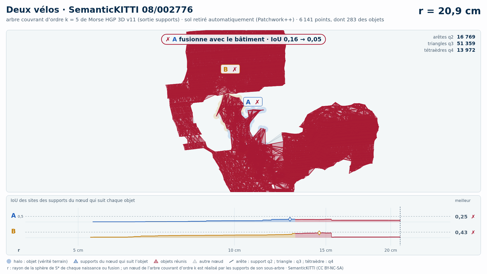

# Deux vélos (trame 08/002776) — sol retiré automatiquement (Patchwork++)

[Exemple](../README.md) · autre variante : [instances de la vérité terrain seules](../instances/README.md) · [liste des exemples](../../README.md)

**k = 5** (les deux échouent, aucun gain HGP dans cette variante) :

<picture>
  <source media="(prefers-color-scheme: dark)" srcset="08_002776_deux_velos_17_64_sans_sol_k5_sombre_instant_cle.png">
  
</picture>

Vidéo de 65 s, k = 5, 1920 × 1080 : [thème sombre](08_002776_deux_velos_17_64_sans_sol_k5_sombre.mp4) · [thème clair](08_002776_deux_velos_17_64_sans_sol_k5_clair.mp4) ; image finale : [sombre](08_002776_deux_velos_17_64_sans_sol_k5_sombre_bilan.png) · [clair](08_002776_deux_velos_17_64_sans_sol_k5_clair_bilan.png).

<picture>
  <source media="(prefers-color-scheme: dark)" srcset="08_002776_deux_velos_17_64_sans_sol_k5_supports_sombre_instant_cle.png">
  
</picture>

Hiérarchie des supports q2, q3, q4 au même ordre, 39 s : [thème sombre](08_002776_deux_velos_17_64_sans_sol_k5_supports_sombre.mp4) · [thème clair](08_002776_deux_velos_17_64_sans_sol_k5_supports_clair.mp4) ; image finale : [sombre](08_002776_deux_velos_17_64_sans_sol_k5_supports_sombre_bilan.png) · [clair](08_002776_deux_velos_17_64_sans_sol_k5_supports_clair_bilan.png). Arbre couvrant d'ordre 5 : 82 430 nœuds, 82 569 naissances et fusions, chacune avec son support S\* (82 569 supports : 16 877 arêtes q2, 51 684 triangles q3, 14 008 tétraèdres q4).

Points : tout ce que Patchwork++ (paramètres de la v8) ne classe pas en sol dans la boîte horizontale des objets élargie de 1 m, à toutes hauteurs : 6 141 points, dont 283 des objets (A 197, B 86) ; 10 points des objets retirés comme sol. Aucune étiquette ne sert au nettoyage : elles ne servent qu'à mesurer.

Meilleur IoU de chaque objet, même mesure que la campagne G4 (points void exclus) :

| k | HGP, meilleur IoU (A / B) | HDBSCAN, meilleur IoU | issue |
| --- | --- | --- | --- |
| 5 | **0,23** / **0,46** | **0,20** / **0,36** | les deux échouent |
| 10 | **0,25** / **0,42** | **0,19** / **0,38** | les deux échouent |

En gras : objet à 0,5 ou moins, qu'aucun groupe de la hiérarchie ne recouvre à plus de la moitié. Une vidéo par ordre où HGP réussit et HDBSCAN échoue ; sans gain, une seule, à k = 5.

## Événements de la vidéo à k = 5

Mêmes textes que les bandeaux. Premier balayage, HDBSCAN seul (HGP attend) :

| r | HDBSCAN |
| --- | --- |
| 13,0 cm | ✗ A et B réunis : A et B jamais retrouvés |
| 17,3 cm | ✗ B fusionne avec le sol · IoU 0,36 → 0,04 |
| 39,5 cm | ✗ A fusionne avec le bâtiment · IoU 0,16 → 0,05 |

Second balayage, HGP ; HDBSCAN le suit au même r, sans pause propre :

| r | HGP | HDBSCAN au même r |
| --- | --- | --- |
| 11,3 cm | ✗ A et B réunis : A et B jamais retrouvés | A et B encore séparés |
| 15,4 cm | ✗ B fusionne avec le sol · IoU 0,43 → 0,05 |  |
| 20,9 cm | ✗ A fusionne avec le bâtiment · IoU 0,16 → 0,05 |  |

Nombres : [`resultats_duel_k5.json`](resultats_duel_k5.json).

## Hiérarchie des supports à k = 5

Meilleur IoU des sites des supports du nœud qui suit chaque objet : 0,25 / 0,43 (hiérarchie de points HGP : 0,23 / 0,46). Événements, mêmes textes que les bandeaux :

| r | supports |
| --- | --- |
| 13,1 cm | ✗ A et B réunis : A et B jamais retrouvés |
| 15,4 cm | ✗ B fusionne avec le sol · IoU 0,43 → 0,05 |
| 20,9 cm | ✗ A fusionne avec le bâtiment · IoU 0,16 → 0,05 |

Nombres : [`resultats_supports_k5.json`](resultats_supports_k5.json).

Lecture, légende et convention de niveau : [README de la liste](../../README.md#lire-une-vidéo).

## Données

`bout.json` décrit la variante (trame, empreintes, instances, découpe, mesures). Les points ne sont pas versionnés (CC BY-NC-SA) : `data/` est ignoré par git ; ils se refont depuis les archives officielles (README de la liste, « Reproduire »).

