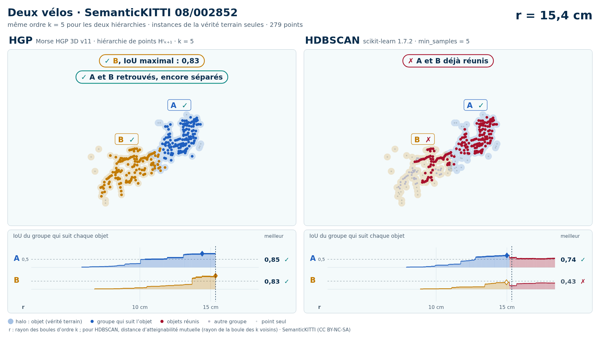
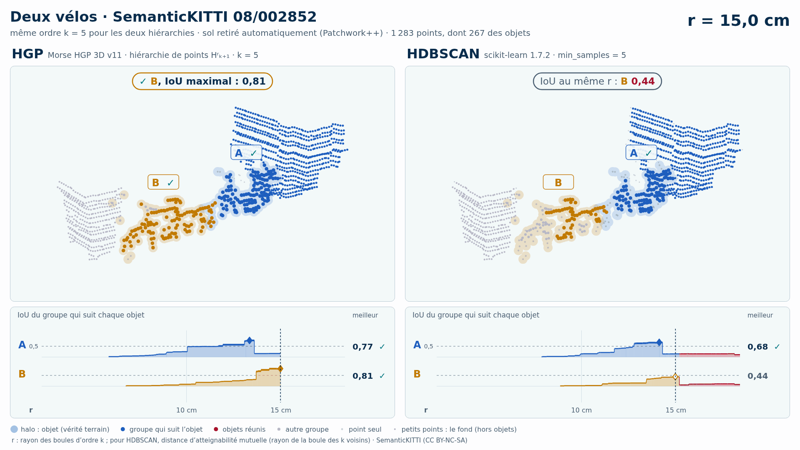

# Deux vélos (trame 08/002852)

Exemple vidéo HGP contre HDBSCAN ([liste](../README.md)) : SemanticKITTI, séquence 08, trame 002852. Deux variantes, chacune dans son sous-dossier :

- [`instances/`](instances/README.md) : les seuls points des objets (vérité terrain), 279 points ;
- [`sans_sol/`](sans_sol/README.md) : tout ce que Patchwork++ ne classe pas en sol dans la boîte des objets élargie de 1 m, 1 283 points (aucune étiquette ne sert au nettoyage).

| objet | classe | points (instances) | points gardés sans sol | points retirés comme sol |
| --- | --- | --- | --- | --- |
| A | vélo | 157 | 148 | 9 |
| B | vélo | 122 | 119 | 3 |

Écarts (plus courte distance entre les points de deux objets) : A–B : 0,05 m. Dans la découpe sans sol : aucune autre instance ; 362 points des classes 0, 1, 52 et 99 (non étiqueté, aberrant, autre structure, autre objet) ; 690 points de sol retirés.

| variante | k | HGP, meilleur IoU (A / B) | HDBSCAN, meilleur IoU | issue |
| --- | --- | --- | --- | --- |
| instances de la vérité terrain seules | 5 | 0,85 / 0,83 | 0,74 / **0,44** | HGP réussit, HDBSCAN échoue |
| instances de la vérité terrain seules | 10 | 0,85 / **0,50** | 0,73 / **0,44** | les deux échouent |
| sol retiré automatiquement (Patchwork++) | 5 | 0,77 / 0,81 | 0,68 / **0,44** | HGP réussit, HDBSCAN échoue |
| sol retiré automatiquement (Patchwork++) | 10 | 0,62 / 0,50 | 0,65 / **0,36** | HGP réussit, HDBSCAN échoue |

En gras : objet à 0,5 ou moins, qu'aucun groupe de la hiérarchie ne recouvre à plus de la moitié. Vidéos : k = 5 (instances) ; k = 5 et k = 10 (sans sol). Objets : instances SemanticKITTI A = 6, B = 51.

<!-- video:début -->
## Vidéos

| | instances de la vérité terrain seules | sol retiré automatiquement (Patchwork++) |
| --- | --- | --- |
| vidéos | [README](instances/README.md) · k = 5 : [sombre](instances/08_002852_deux_velos_6_51_instances_k5_sombre.mp4) · [clair](instances/08_002852_deux_velos_6_51_instances_k5_clair.mp4) ; supports : [sombre](instances/08_002852_deux_velos_6_51_instances_k5_supports_sombre.mp4) · [clair](instances/08_002852_deux_velos_6_51_instances_k5_supports_clair.mp4) | [README](sans_sol/README.md) · k = 5 : [sombre](sans_sol/08_002852_deux_velos_6_51_sans_sol_k5_sombre.mp4) · [clair](sans_sol/08_002852_deux_velos_6_51_sans_sol_k5_clair.mp4) ; supports : [sombre](sans_sol/08_002852_deux_velos_6_51_sans_sol_k5_supports_sombre.mp4) · [clair](sans_sol/08_002852_deux_velos_6_51_sans_sol_k5_supports_clair.mp4) ; k = 10 : [sombre](sans_sol/08_002852_deux_velos_6_51_sans_sol_k10_sombre.mp4) · [clair](sans_sol/08_002852_deux_velos_6_51_sans_sol_k10_clair.mp4) ; supports : [sombre](sans_sol/08_002852_deux_velos_6_51_sans_sol_k10_supports_sombre.mp4) · [clair](sans_sol/08_002852_deux_velos_6_51_sans_sol_k10_supports_clair.mp4) |

**Instances de la vérité terrain seules**, k = 5 :

<picture>
  <source media="(prefers-color-scheme: dark)" srcset="instances/08_002852_deux_velos_6_51_instances_k5_sombre_instant_cle.png">
  
</picture>

**Sol retiré automatiquement (Patchwork++)**, k = 5 :

<picture>
  <source media="(prefers-color-scheme: dark)" srcset="sans_sol/08_002852_deux_velos_6_51_sans_sol_k5_sombre_instant_cle.png">
  
</picture>

<!-- video:fin -->
