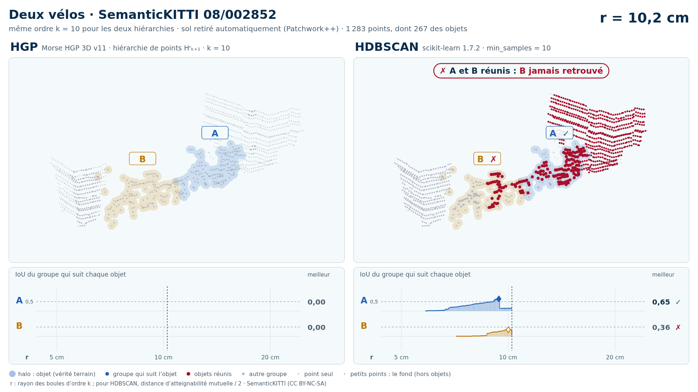

# Deux vélos (trame 08/002852) — sol retiré automatiquement (Patchwork++)

[Exemple](../README.md) · autre variante : [instances de la vérité terrain seules](../instances/README.md) · [liste des exemples](../../README.md)

**k = 5** (HGP réussit, HDBSCAN échoue) :

<picture>
  <source media="(prefers-color-scheme: dark)" srcset="08_002852_deux_velos_6_51_sans_sol_k5_sombre_instant_cle.png">
  
</picture>

Vidéo de 45 s, k = 5, 1920 × 1080 : [thème sombre](08_002852_deux_velos_6_51_sans_sol_k5_sombre.mp4) · [thème clair](08_002852_deux_velos_6_51_sans_sol_k5_clair.mp4) ; image finale : [sombre](08_002852_deux_velos_6_51_sans_sol_k5_sombre_bilan.png) · [clair](08_002852_deux_velos_6_51_sans_sol_k5_clair_bilan.png).

**k = 10** (HGP réussit, HDBSCAN échoue) :

<picture>
  <source media="(prefers-color-scheme: dark)" srcset="08_002852_deux_velos_6_51_sans_sol_k10_sombre_instant_cle.png">
  
</picture>

Vidéo de 45 s, k = 10, 1920 × 1080 : [thème sombre](08_002852_deux_velos_6_51_sans_sol_k10_sombre.mp4) · [thème clair](08_002852_deux_velos_6_51_sans_sol_k10_clair.mp4) ; image finale : [sombre](08_002852_deux_velos_6_51_sans_sol_k10_sombre_bilan.png) · [clair](08_002852_deux_velos_6_51_sans_sol_k10_clair_bilan.png).

Points : tout ce que Patchwork++ (paramètres de la v8) ne classe pas en sol dans la boîte horizontale des objets élargie de 1 m, à toutes hauteurs : 1 283 points, dont 267 des objets (A 148, B 119) ; 12 points des objets retirés comme sol. Aucune étiquette ne sert au nettoyage : elles ne servent qu'à mesurer.

Meilleur IoU de chaque objet, même mesure que la campagne G4 (points void exclus) :

| k | HGP, meilleur IoU (A / B) | HDBSCAN, meilleur IoU | issue |
| --- | --- | --- | --- |
| 5 | 0,77 / 0,88 | 0,68 / **0,44** | HGP réussit, HDBSCAN échoue |
| 10 | 0,62 / 0,50 | 0,65 / **0,36** | HGP réussit, HDBSCAN échoue |

En gras : objet à 0,5 ou moins, qu'aucun groupe de la hiérarchie ne recouvre à plus de la moitié. Une vidéo par ordre où HGP réussit et HDBSCAN échoue ; sans gain, une seule, à k = 5.

## Événements de la vidéo à k = 5

Le niveau r croît pour les deux colonnes à la fois et s'arrête à chaque événement des groupes qui suivent les objets (mêmes textes que les bandeaux) :

| r | HGP | HDBSCAN |
| --- | --- | --- |
| 7,0 cm |  | ✓ A, IoU maximal : 0,68 |
| 7,1 cm |  | ✗ A fusionne avec le bâtiment · IoU 0,68 → 0,14 |
| 7,6 cm |  | ✗ A et B réunis : B jamais retrouvé |
| 13,1 cm | ✓ A, IoU maximal : 0,77 |  |
| 13,4 cm | ✗ A fusionne avec le bâtiment · IoU 0,77 → 0,16 |  |
| 15,3 cm | ✓ B, IoU maximal : 0,88 |  |
| 15,8 cm | ✓ A et B réunis, chacun retrouvé avant |  |

Nombres : [`resultats_duel_k5.json`](resultats_duel_k5.json).

## Événements de la vidéo à k = 10

Le niveau r croît pour les deux colonnes à la fois et s'arrête à chaque événement des groupes qui suivent les objets (mêmes textes que les bandeaux) :

| r | HGP | HDBSCAN |
| --- | --- | --- |
| 9,4 cm |  | ✓ A, IoU maximal : 0,65 |
| 9,5 cm |  | ✗ A fusionne avec le bâtiment · IoU 0,65 → 0,14 |
| 10,2 cm |  | ✗ A et B réunis : B jamais retrouvé |
| 17,1 cm | ✓ A, IoU maximal : 0,62 |  |
| 17,3 cm | ✗ A fusionne avec le bâtiment · IoU 0,62 → 0,18 |  |
| 19,2 cm | ✓ B, IoU maximal : 0,504 |  |
| 19,5 cm | ✓ A et B réunis, chacun retrouvé avant |  |

Nombres : [`resultats_duel_k10.json`](resultats_duel_k10.json).

Lecture, légende et convention de niveau : [README de la liste](../../README.md#lire-une-vidéo).

## Données

`bout.json` décrit la variante (trame, empreintes, instances, découpe, mesures). Les points ne sont pas versionnés (CC BY-NC-SA) : `data/` est ignoré par git ; ils se refont depuis les archives officielles (README de la liste, « Reproduire »).

