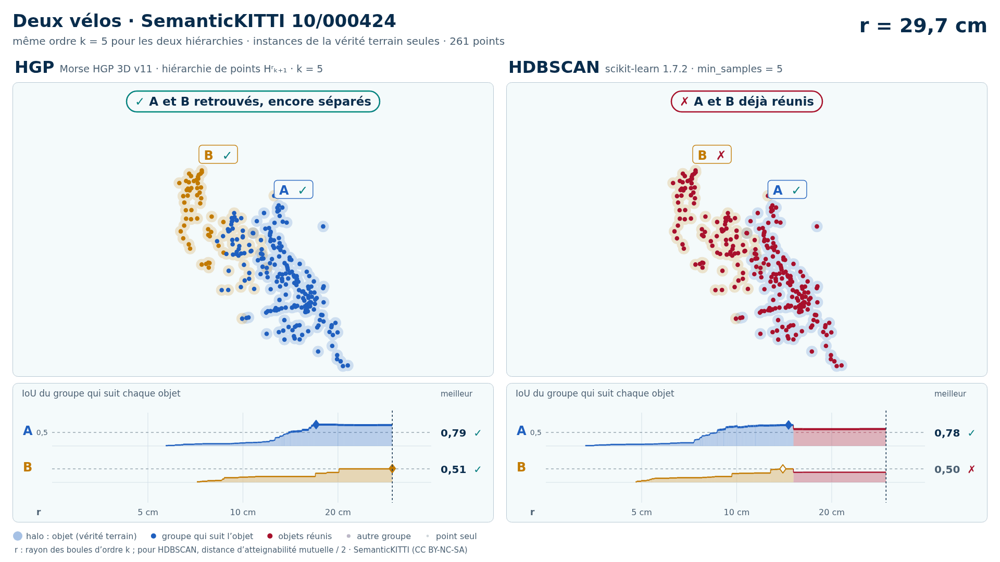
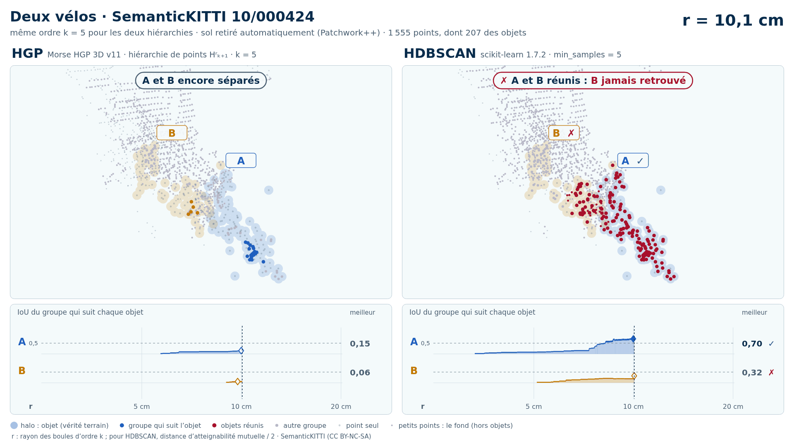

# Deux vélos (trame 10/000424)

Exemple vidéo HGP contre HDBSCAN ([liste](../README.md)) : SemanticKITTI, séquence 10, trame 000424. Deux variantes, chacune dans son sous-dossier :

- [`instances/`](instances/README.md) : les seuls points des objets (vérité terrain), 261 points ;
- [`sans_sol/`](sans_sol/README.md) : tout ce que Patchwork++ ne classe pas en sol dans la boîte des objets élargie de 1 m, 1 555 points (aucune étiquette ne sert au nettoyage).

| objet | classe | points (instances) | points gardés sans sol | points retirés comme sol |
| --- | --- | --- | --- | --- |
| A | vélo | 163 | 124 | 39 |
| B | vélo | 98 | 83 | 15 |

Écarts (plus courte distance entre les points de deux objets) : A–B : 0,04 m. Dans la découpe sans sol : aucune autre instance ; 0 points void ; 361 points de sol retirés.

| variante | k | HGP, meilleur IoU (A / B) | HDBSCAN, meilleur IoU | issue |
| --- | --- | --- | --- | --- |
| instances de la vérité terrain seules | 5 | 0,79 / 0,51 | 0,78 / **0,50** | HGP réussit, HDBSCAN échoue |
| instances de la vérité terrain seules | 10 | 0,81 / **0,50** | 0,79 / **0,46** | les deux échouent |
| sol retiré automatiquement (Patchwork++) | 5 | 0,59 / **0,24** | 0,70 / **0,32** | les deux échouent |
| sol retiré automatiquement (Patchwork++) | 10 | 0,71 / **0,25** | 0,53 / **0,21** | les deux échouent |

En gras : objet à 0,5 ou moins, qu'aucun groupe de la hiérarchie ne recouvre à plus de la moitié. Vidéos : k = 5 (instances), k = 5 (sans sol). Objets : instances SemanticKITTI A = 2, B = 3.

<!-- video:début -->
## Vidéos

| | instances de la vérité terrain seules | sol retiré automatiquement (Patchwork++) |
| --- | --- | --- |
| vidéo | [README](instances/README.md) · k = 5 : [sombre](instances/10_000424_deux_velos_2_3_instances_k5_sombre.mp4) · [clair](instances/10_000424_deux_velos_2_3_instances_k5_clair.mp4) | [README](sans_sol/README.md) · k = 5 : [sombre](sans_sol/10_000424_deux_velos_2_3_sans_sol_k5_sombre.mp4) · [clair](sans_sol/10_000424_deux_velos_2_3_sans_sol_k5_clair.mp4) |

**Instances de la vérité terrain seules** :

<picture>
  <source media="(prefers-color-scheme: dark)" srcset="instances/10_000424_deux_velos_2_3_instances_k5_sombre_instant_cle.png">
  
</picture>

**Sol retiré automatiquement (Patchwork++)** :

<picture>
  <source media="(prefers-color-scheme: dark)" srcset="sans_sol/10_000424_deux_velos_2_3_sans_sol_k5_sombre_instant_cle.png">
  
</picture>

<!-- video:fin -->
