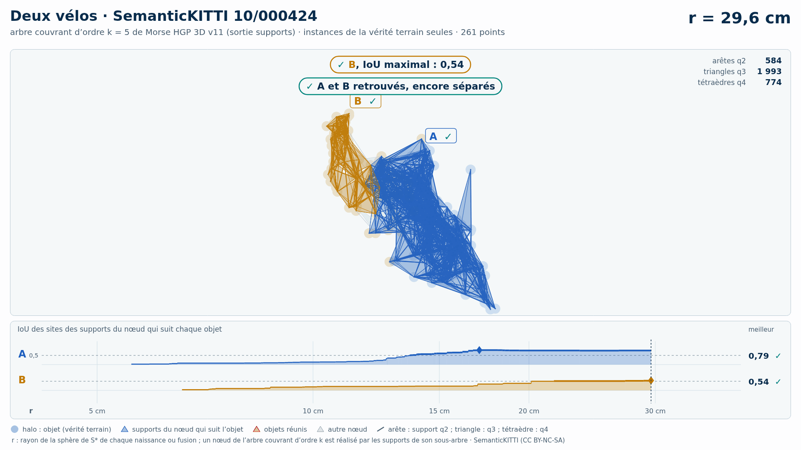

# Deux vélos (trame 10/000424) — instances de la vérité terrain seules

[Exemple](../README.md) · autre variante : [sol retiré automatiquement (Patchwork++)](../sans_sol/README.md) · [liste des exemples](../../README.md)

**k = 5** (HGP réussit, HDBSCAN échoue) :

<picture>
  <source media="(prefers-color-scheme: dark)" srcset="10_000424_deux_velos_2_3_instances_k5_sombre_instant_cle.png">
  
</picture>

Vidéo de 61 s, k = 5, 1920 × 1080 : [thème sombre](10_000424_deux_velos_2_3_instances_k5_sombre.mp4) · [thème clair](10_000424_deux_velos_2_3_instances_k5_clair.mp4) ; image finale : [sombre](10_000424_deux_velos_2_3_instances_k5_sombre_bilan.png) · [clair](10_000424_deux_velos_2_3_instances_k5_clair_bilan.png).

<picture>
  <source media="(prefers-color-scheme: dark)" srcset="10_000424_deux_velos_2_3_instances_k5_supports_sombre_instant_cle.png">
  
</picture>

Hiérarchie des supports q2, q3, q4 au même ordre, 38 s : [thème sombre](10_000424_deux_velos_2_3_instances_k5_supports_sombre.mp4) · [thème clair](10_000424_deux_velos_2_3_instances_k5_supports_clair.mp4) ; image finale : [sombre](10_000424_deux_velos_2_3_instances_k5_supports_sombre_bilan.png) · [clair](10_000424_deux_velos_2_3_instances_k5_supports_clair_bilan.png). Arbre couvrant d'ordre 5 : 3 445 nœuds, 3 445 naissances et fusions, chacune avec son support S\* (3 445 supports : 605 arêtes q2, 2 055 triangles q3, 785 tétraèdres q4).

Points : les seuls points des objets du groupe (vérité terrain SemanticKITTI), 261 points (A 163, B 98) : ni sol, ni fond, ni autre objet.

Meilleur IoU de chaque objet, même mesure que la campagne G4 (points void exclus) :

| k | HGP, meilleur IoU (A / B) | HDBSCAN, meilleur IoU | issue |
| --- | --- | --- | --- |
| 5 | 0,79 / 0,51 | 0,78 / **0,50** | HGP réussit, HDBSCAN échoue |
| 10 | 0,81 / **0,50** | 0,79 / **0,46** | les deux échouent |

En gras : objet à 0,5 ou moins, qu'aucun groupe de la hiérarchie ne recouvre à plus de la moitié. Une vidéo par ordre où HGP réussit et HDBSCAN échoue ; sans gain, une seule, à k = 5.

## Événements de la vidéo à k = 5

Mêmes textes que les bandeaux. Premier balayage, HDBSCAN seul (HGP attend) :

| r | HDBSCAN |
| --- | --- |
| 29,2 cm | ✓ A, IoU maximal : 0,78 |
| 30,3 cm | ✗ A et B réunis : B jamais retrouvé |

Second balayage, HGP ; HDBSCAN le suit au même r, sans pause propre :

| r | HGP | HDBSCAN au même r |
| --- | --- | --- |
| 17,1 cm | ✓ A, IoU maximal : 0,79 | IoU au même r : A 0,48 |
| 29,7 cm | ✓ B, IoU maximal : 0,51 ; ✓ A et B retrouvés, encore séparés | IoU au même r : A 0,77  ·  B 0,50 |
| 31,6 cm | ✓ A et B réunis, chacun retrouvé avant |  |

Nombres : [`resultats_duel_k5.json`](resultats_duel_k5.json).

## Hiérarchie des supports à k = 5

Meilleur IoU des sites des supports du nœud qui suit chaque objet : 0,79 / 0,54 (hiérarchie de points HGP : 0,79 / 0,51). Événements, mêmes textes que les bandeaux :

| r | supports |
| --- | --- |
| 17,1 cm | ✓ A, IoU maximal : 0,79 |
| 29,6 cm | ✓ B, IoU maximal : 0,54 ; ✓ A et B retrouvés, encore séparés |
| 31,6 cm | ✓ A et B réunis, chacun retrouvé avant |

Nombres : [`resultats_supports_k5.json`](resultats_supports_k5.json).

Lecture, légende et convention de niveau : [README de la liste](../../README.md#lire-une-vidéo).

## Données

`bout.json` décrit la variante (trame, empreintes, instances, découpe, mesures). Les points ne sont pas versionnés (CC BY-NC-SA) : `data/` est ignoré par git ; ils se refont depuis les archives officielles (README de la liste, « Reproduire »).

