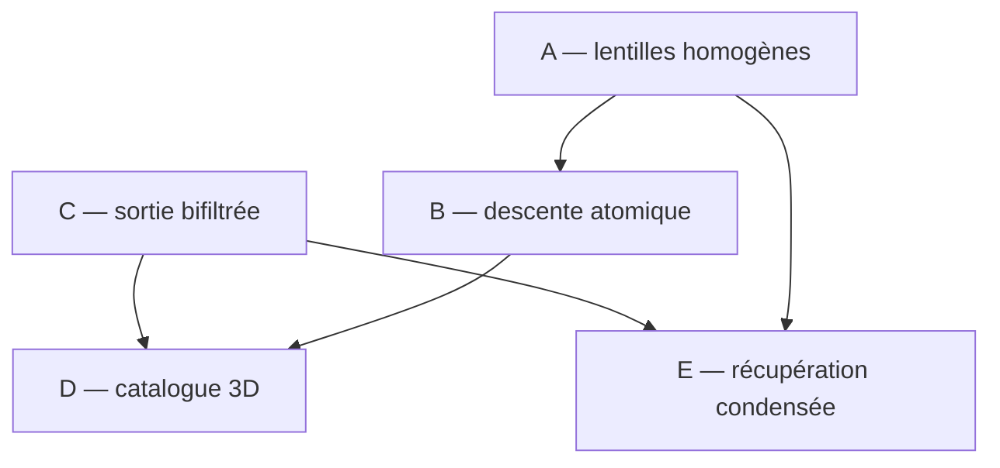

# Corpus mathématique E-HGP

Ce dossier transforme les pistes du rapport du 14 juillet 2026 en cinq résultats séparés, citables et réfutables. Il sert de référence à la future architecture à deux backends ; les rapports datés conservent l'historique du raisonnement.

## Doctrine commune

L'objet premier est la bifiltration des multicovertures $L(k,t)$ et son invariant de composantes connexes. Toute construction proposée ici doit donc répondre à trois questions distinctes :

1. **fidélité** — quelle hiérarchie continue est représentée ?
2. **fermeture** — quels événements ou quelles coupes ont été prouvés complets ?
3. **réalisation** — quelles opérations locales peuvent être évaluées en lots sur GPU ?

Une accélération locale ne vaut jamais preuve de fermeture globale. Réciproquement, une construction exacte mais impossible à matérialiser n'est pas retenue comme architecture de production.

## Les cinq résultats

| annexe | question résolue | backend principal |
|---|---|---|
| [A — Lentilles homogènes](RESULTAT_A_LENTILLES_HOMOGENES.md) | comment relier DTM et HGP sans casser la bifiltration ni introduire une température dimensionnée ? | haute dimension |
| [B — Descente atomique](RESULTAT_B_DESCENTE_ATOMIQUE.md) | comment relier un germe critique à un minimum par un chemin certifié sous le niveau ? | commun |
| [C — Complexe de Morse bifiltré](RESULTAT_C_COMPLEXE_MORSE_BIFILTRE.md) | quel objet minimal porte simultanément les hiérarchies des ordres $1$ à $K_{\max}$ ? | commun ; exact sous catalogue, attaches et lots complets |
| [D — Énumération 3D par puissance](RESULTAT_D_ENUMERATION_3D_POWER_GPU.md) | comment proposer puis fermer les événements classés sans mosaïque d'ordre supérieur ? | 3D massive |
| [E — Récupération condensée par coupes](RESULTAT_E_RECUPERATION_CONDENSEE_COUPES.md) | quand un atlas incomplet suffit-il à certifier les branches hiérarchiques importantes ? | haute dimension |

## Dépendances logiques

Le résultat C fixe ce qui doit être calculé. D donne la voie exacte ou conditionnelle en 3D. A fournit la continuation adaptée à la grande dimension, B son oracle de descente, et E le contrat qui permet de rester sparse sans prétendre reconstruire l'impossible.

## Niveaux de statut

Chaque annexe emploie les catégories suivantes.

| statut | sens |
|---|---|
| **théorème** | démontré dans l'annexe à partir d'hypothèses explicites ou cité depuis une source primaire |
| **corollaire algorithmique** | conséquence exacte du théorème, indépendamment de sa vitesse pratique |
| **conditionnel** | implication exacte sous une hypothèse d'oracle, de marge ou de fermeture explicitement indiquée ; ce n'est pas encore un certificat global tant que cette hypothèse n'est pas vérifiée |
| **conjecture** | énoncé mathématique précis qui reste à démontrer ou à réfuter |
| **heuristique** | mécanisme de proposition sans valeur de certificat |

Les futurs backends exposeront seulement les statuts d'exécution `exact`, `atlas_exact` et `conditional`, accompagnés d'un périmètre. Les noms comme `power_closed` ou $\pi$-complétude désignent des certificats susceptibles de justifier un statut ; ils ne constituent pas des statuts publics supplémentaires. Un résultat `conditional` ne pourra pas être renommé `exact` parce qu'il passe une campagne empirique.

## Lecture par régime

### 3D massive

Lire C, B puis D. La sortie cible est le HGP dur. Les lentilles de A peuvent ordonner ou proposer des candidats, mais elles ne remplacent pas les niveaux critiques durs. D donne une fermeture exacte par séparation aux sommets ; le verrou pratique devient la taille de ce certificat et la recherche d'une exclusion directement sensible à $H_0$.

### Grande dimension

Lire A, B, C puis E. La structure cible est une tour de forêts exacte sur atlas, durcie par continuation et enrichie de certificats de coupes. La globalité n'est annoncée que pour les branches condensées couvertes par E.

## Documents d'origine

- [Rapport ordre–échelle, descente et GPU — 14 juillet 2026](../../RAPPORT_HGP_ORDRE_ECHELLE_DESCENTE_GPU_2026-07-14.md)
- [Rapport Morse et SoftLens — 13 juillet 2026](../../RAPPORT_HIERARCHIE_HGP_MORSE_SOFTLENS_GPU_2026-07-13%20%281%29.md)
- [Addendum DTM et hiérarchie sparse — 13 juillet 2026](../../ADDENDUM_DTM_HIERARCHIE_SPARSE_GPU_2026-07-13.md)
- [Synthèse du manuscrit](../../thesis_repo_summary.md)

En cas de divergence, les annexes A–E et le README racine expriment l'orientation actuelle. Les rapports datés restent des documents de recherche et peuvent contenir des voies abandonnées.
