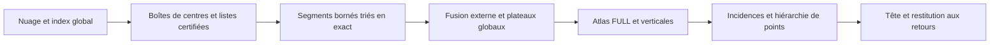

# Audit indépendant — LiDAR de plusieurs dizaines de millions de points

30 septembre 2026. Demande explicite de l'utilisateur : poursuivre le dialogue avec le développeur et examiner aussi le contrat massif. Sources produit à `bdc0b8f08ee37ee351996b29c5974f78415bc036`, identiques sur `origin/main` à `a6b380e9c`. Mesures historiques attribuées à leurs propres sources. `public_status=not_claimed`. Aucun GCP, aucune allocation massive, aucun changement du moteur.

**Verdict.** La v10 dispose d'une base mathématique utile pour répartir exactement la génération, mais sa représentation résidente ne qualifie pas encore 10–50 millions de sites LiDAR. Le nombre de boules, les états de la tour, les indices et l'étendue géographique deviennent des contraintes avant le seul stockage des points. Deux défauts d'arithmétique d'indices peuvent être corrigés immédiatement. Pour la suite, je recommande d'étudier des segments de catalogue issus des boîtes de centres déjà certifiées, avec fusion externe exacte, plutôt que de commencer par recoller des arbres calculés indépendamment sur des tuiles de points.

Les traces sont regroupées dans [le reçu massif](../receipts/audit_independant_20260930/massif/). Cette note et le [suivi courant](SUIVI_AUDIT_INDEPENDANT.md) sont mis à jour en place ; les captures restent immuables.

## 1. Préciser l'objet massif

Aucun délai ni enveloppe complète RAM/disque/sortie v10 pour 10–50 millions n'a été retrouvé. Le cadre historique de machine est GCP G4. Les anciens objectifs 1 M / 60 s et 10 M / 600 s, puis les plafonds de campagne 600 / 3 600 / 7 200 s, sont historiques. [Le document de performance](../../docs/PERFORMANCE_MORSEHGP3D.md#L245) exclut leur migration implicite ; le [protocole v10](../docs/conception/EVAL_v2.md) porte sur les trames de 30–60 k sites et des cumuls diagnostiques beaucoup plus petits. Le seuil de 100 ms des petites trames n'est donc pas une obligation massive acquise.

Hypothèse de travail en attendant la précision utilisateur : conserver **FULL pour tous les ordres 1..10, avec repli explicite 1..5**, puis distinguer la capacité de produire ce résultat exact du délai visé. Les attaches, la hiérarchie laminaire sur les points, la tête et la restitution aux retours doivent avoir des coûts séparés, puis un total. Une seule coupe, un arbre de recherche seul ou un résumé de compteurs ne valent pas la livraison du résultat FULL.

Il faut distinguer cinq volumes : `N`, les retours LiDAR ; `n`, les positions distinctes ; `B`, les boules du catalogue ; `P`, les occurrences de sites dans les listes I/U de ces boules ; `L`, les niveaux exacts distincts. Les cellules de l'atlas, les nœuds par ordre, les représentants et les incidences de points constituent encore d'autres volumes. Aucune identité `B = O(n)` n'est démontrée ici. Une linéarité en B ne donne pas une linéarité en n.

La [borne de sortie relue en v7](../../morsehgp3D_v7/docs/CROISSANCE_ET_BORNE_DE_SORTIE.md) construit même une famille rationnelle 3D à au moins n²/4 naissances FULL dès K2, par des paires Gabriel strictes. Elle concerne une précision croissante, pas une asymptotique infinie dans l'univers u18 fixé. Elle interdit néanmoins de promettre une énumération FULL universellement linéaire indépendamment de la sortie ; ni un tri externe ni le GPU ne suppriment ces records. Un résultat compact ou implicite demanderait un autre contrat de requêtes et d'expansion.

Un cumul de trames demande aussi une entrée déclarée : poses, repère commun, grille, masques, IDs originaux et correspondance retours → sites. Le nuage à sites distincts et le nuage avec multiplicités définissent des modèles statistiques différents. `prepare_cloud` conserve les doublons et leurs poids, mais [la tour](../src/tower/tower.cpp#L1169) refuse actuellement `multiplicity_unsupported`. Supprimer les doublons pour contourner ce refus exige une décision de modèle explicite et la conservation de tous les IDs ; ce n'est pas une qualification de la tour pondérée.

## 2. Ce qui a réellement été mesuré

[La session 5](../receipts/g4_session5_scale_20260929/README.md), source `882b13286177657c9b56287f2b1bf20b17858528`, est une capture **CPU**, 24 cœurs / 48 fils. Elle comporte 169 configurations réussies et 7 non lancées après épuisement du budget de campagne, pour 67 entrées synthétiques et 21 morceaux issus de trois trames de la seule séquence 08. Une graine, une exécution par configuration. Aucun nuage LiDAR de 10 ou 30 millions n'y figure.

| Même entrée synthétique : amas, densité ×128 | K5 | K10 |
| --- | ---: | ---: |
| Sites | 1 024 000 | 1 024 000 |
| Boules | 87 574 708 | 478 482 791 |
| Nœuds cumulés FULL | 91 295 769 | 606 575 494 |
| Catalogue | 7,8414 s | 41,3419 s |
| Tour | 13,0047 s | 83,0214 s |
| Mur du processus tour | 21,51 s | 126,82 s |
| Pic RSS | 23,405 Gio | 135,284 Gio |

Le runner appelle `--no-points` : tous les ordres et les verticales, mais aucune attache ponctuelle ni tête. Catalogue/tour excluent la lecture et la préparation ; le mur du processus les inclut. Le résultat archivé est un résumé, pas une exportation durable des centaines de millions de nœuds. Segmentation, quantification hors ligne, projection aux retours et export complet restent à ajouter au contrat concerné.

Le compteur B vient d'un processus catalogue, alors que temps et RSS viennent d'un second processus qui régénère le catalogue. L'ancien runner ne compare pas ces comptes. Cela ne prouve aucun désaccord dans la capture ; pour la prochaine, conserver B et le digest canonique du **processus effectivement chronométré**.

Les [errata](../receipts/ERRATA.md) corrigent les chiffres mémoire et les extrapolations. Les grands cas K10 observés valent environ 303,6–314,9 octets par boule, et non 280. Ce rapport inclut la représentation de tour sans attaches ; il n'est ni une borne ni un coefficient indépendant de K, de P, des coquilles et du nombre de niveaux. Le temps par boule varie aussi : pour les amas, la tour passe d'environ 86 à 174 ns/boule entre 8 k et 1,024 M.

La table suivante est un **calcul conditionnel de dimensionnement de la représentation actuelle**, sans valeur de prévision, de borne ou de capacité qualifiée. On conserve fictivement 120 ou 460 boules/site et 303,6–314,9 octets/boule. To et Go sont décimaux.

| Sites | Hypothèse boules/site | Boules | RSS calculée | Indices de boules u32 |
| --- | ---: | ---: | ---: | --- |
| 10 M | 120 | 1,2 milliard | 364–378 Go | nombre représentable, atlas à contrôler |
| 30 M | 120 | 3,6 milliards | 1,09–1,13 To | nombre représentable, atlas à contrôler |
| 50 M | 120 | 6 milliards | 1,82–1,89 To | dépassement |
| 10 M | 460 | 4,6 milliards | 1,40–1,45 To | dépassement |
| 30 M | 460 | 13,8 milliards | 4,19–4,35 To | dépassement |
| 50 M | 460 | 23 milliards | 6,98–7,24 To | dépassement |

La capture G4 dispose de 176 Gio de RAM totale, 173 disponibles au préflight, et d'un disque racine de 97 G avec 79 G libres. Elle ne dimensionne donc pas un espace temporaire de plusieurs To. Le GPU capturé ne rend pas ces calculs GPU : la session 7 n'a contrôlé qu'un comparateur i64×i64→i128 ; son ancien ratio de débit signé est invalidé. Aucune accélération FULL CUDA n'est héritée.

## 3. Verrous numériques et de représentation

### M1 — conversion du nombre de boules, à corriger dans le raccord

[Le générateur, ligne 803](../src/catalogue/generator.cpp#L803), convertit `refs.size()` en u32 sans garde préalable. [Catalogue::balls](../src/catalogue/catalogue.hpp#L86) fait également cette conversion ; la collecte emploie aussi un compteur local u32. À 2³² références, le nombre converti vaut zéro ; à d'autres tailles il est tronqué. La lecture établit l'absence de refus à cet endroit ; nous n'avons pas matérialisé des milliards de records ni observé un faux succès massif.

Une garde doit précéder la conversion et l'assemblage, et le producteur doit arrêter les émissions quand le domaine publié est épuisé. Avec `kNone = 0xffffffff`, les tailles et identifiants réservés doivent être convenus ensemble. Un catalogue segmenté aura besoin soit d'identifiants globaux u64, soit d'une identité `(segment, indice local)` accompagnée d'un protocole pour toutes les références. Modifier seulement PointId ne résout pas BallIdx, CellIdx ou LevelRank.

La tour a déjà un refus des cellules et représentants atteignant `kNone`, [lignes 1323–1347](../src/tower/tower.cpp#L1323), mais le catalogue global a été construit auparavant. De plus, l'atlas peut dépasser son domaine alors que B reste représentable. Les vérifications doivent porter sur chaque volume, pas sur le seul nombre de points.

### M2 — milieu de dichotomie au-delà de 2³¹ niveaux

[RankIndex::at_most](../src/tower/tower.cpp#L1022) calcule `(a+b)/2` en u32 dans le dernier bloc de niveaux. Pour `L = 2³¹+64`, `a = 2³¹+1`, `b = 2³¹+64`, la somme déborde et le milieu sort de `[a,b)`. La sonde scalaire du [reçu de représentation](../receipts/audit_independant_20260930/massif/representation/) ne converge pas en 200 étapes sur un prédicat monotone ; `a+(b-a)/2` termine en six étapes et rend L. Ce contrôle du noyau arithmétique n'est pas une exécution de la tour avec deux milliards de niveaux.

Corriger les milieux et les produits de rang/bloc dans tout le domaine déclaré, puis tester les seuils avec des compteurs synthétiques. Une très grande allocation n'est pas nécessaire pour cette porte causale.

### M3 — l'étendue géographique est indépendante de n

Le profil produit est u18. À 1 mm, [kCoordinateLimit](../src/core/types.hpp#L31) représente une étendue maximale de **262,143 m par axe**, après translation commune. Une carte de plusieurs kilomètres peut donc être hors contrat même avec peu de points.

La préparation et le Morton acceptent jusqu'à 21 bits ; [le générateur](../src/catalogue/generator.cpp#L636) et la tour refusent au-delà de 18. Le premier domaine ne qualifie pas les prédicats q3/q4 du second. Les bornes arithmétiques et les filtres doivent être rejugés avant élargissement. Mettre chaque tuile en origine locale u18 ne certifie pas les distances et interactions entre tuiles.

Trois décisions possibles, à comparer explicitement : conserver 1 mm avec une voie arithmétique globale plus large ; déclarer une grille plus grossière, avec toutes les fusions de retours publiées ; démontrer un raccord exact entre calcul local et interactions globales. Aucun écrêtage ni changement silencieux de grille n'est recevable. Les générateurs synthétiques qui ajustent leur pas à l'étendue ne constituent pas une preuve pour la grille LiDAR fixe de 1 mm.

## 4. Le budget doit couvrir les états simultanés

La sonde compile seulement des tailles de structures et l'arithmétique d'indices. Sur cet ABI : `Level` = 56 octets, record de génération = 104, référence de tri = 32, nœud SiteTree = 64. Level et P3 sont les types réels ; les dispositions privées sont copiées dans la sonde, pas instrumentées dans le produit. Le catalogue a des offsets de population **u64** : il ne faut pas lui attribuer le CSR u32 décrit dans une ancienne conception. Le CSR retours/site de Cloud reste, lui, u32.

Ordres de grandeur des **tailles logiques**, hors surcapacités, allocations internes, threads et états de tour :

| État | Octets |
| --- | ---: |
| Cloud | `20n + 4N + 4` |
| SiteTree | `28n + 64 × capacité des nœuds` ; réserve actuelle voisine de `16n` octets |
| Copies P/X/X²/poids du générateur | `60n`, plus les listes de candidats |
| Records et populations de génération | `104B + 4P` |
| Deux tableaux de références simultanés lors du tri | `64B` |
| Catalogue publié | `42B + 4P + 56L`, plus le terminal des offsets |

Records et références restent présents pendant l'assemblage du catalogue. Le pic ne se déduit donc pas de la taille finale. Par exemple, les termes logiques de tri donnent déjà `168B + 4P`, ceux d'assemblage peuvent atteindre environ `179B + 8P + 56L`, **avant** les capacités réelles, le socle et la tour. Le second tableau de références est temporaire au tri : ces deux pics ne s'additionnent pas. Avec N=n, le socle logique CLI/Cloud/index/copies géométriques/liste racine vaut environ `160n`, soit 8 Go pour 50 M sites, avant les listes de candidats et les capacités. Il faut relever phase par phase les capacités vivantes, leur propriétaire et leur libération effective.

Les attaches seules ajoutent environ `12n` octets par ordre en core, jusqu'à `16n` en cover ; l'option `ball_nodes` ajoute `4B` par ordre. Leur omission dans S5 devient donc matérielle au régime massif.

Le commentaire de `Buffer` promet des grands tableaux budgétés, mais `std::vector` et `UninitVector` du catalogue, du générateur et des index ne passent pas par ce budget. Les allocations de tour utilisent aussi le budget par défaut illimité ; aucun plafond de session n'est transmis par `TowerParams`. Le `--budget` du runner S5 est temporel, et empêche seulement les configurations suivantes : il ne limite pas la RAM d'un appel.

Le contrat massif nécessite une réservation couvrant entrée conservée, ancien état, nouveau segment, tri/fusion, atlas, sorties temporaires et espace disque. Une allocation refusée doit produire un statut de ressource, fermer les workers et laisser un état de reprise vérifiable. Le pic RSS reste un contrôle externe ; il ne remplace pas ce compte interne.

## 5. Répartir les centres avec des listes globalement certifiées

La [conception GEN, §§3.1–3.5](../docs/conception/GEN_v2.md#L110), fournit déjà l'invariant utile : pour toute boîte fermée de centres Q et tout centre c dans Q, `N_Kmax(c) ⊆ L(Q)`, voisins ex æquo inclus. Le recensement local est alors globalement exact pour les boules admises ; leur centre appartient à une unique feuille demi-ouverte. Il s'agit de répartir le travail exact existant, avec une règle d'émission unique.

Une certification simple, parfois large, existe : choisir Kmax sites quelconques distincts S et poser `R_Q² = max ||s-v||²`, pour s dans S et v aux sommets de Q. Alors `d_Kmax(c) ≤ R_Q` sur Q, et la liste de tous les sites à distance de Q au plus R_Q contient `N_Kmax(c)`. En pondéré, S doit porter un poids total au moins Kmax. La frontière est incluse. Cette proposition garantit la complétude, **aucune borne de taille** de liste ou de communication. Une cosphère ou un grand vide peut imposer une liste globale ; il faut subdiviser, traiter ce cas ou refuser explicitement, sans quota de voisins caché.

Le catalogue servant FULL Kmax conserve l'admission non pondérée `p + q_min ≤ Kmax+1`. Comme `q_min ≥ 2`, les boules admises vérifient `p ≤ Kmax-1`, d'où la certification par Kmax. **Il n'est pas nécessaire de gonfler le paramètre à Kmax+1.** En revanche, retenir seulement les boules de couverture `p + q_min ≤ Kmax` supprimerait des fusions nécessaires.

Deux petites preuves expliquent ce que le raccord doit protéger, [reçu sémantique](../receipts/audit_independant_20260930/massif/semantique/) :

- À K2 sur les sites colinéaires `{0,1,2}`, les deux naissances à β=1/4 couvrent toutes deux le point 1. Les composantes spatiales sont pourtant distinctes jusqu'à β=1. Recoller par « un point couvert en commun » les fusionne trop tôt.
- À K2 sur `{0,1,L,L+1}`, L>1, une naissance `{1,L}` apparaît dans le vide à β=(L−1)²/4. À β=L²/4, les trois branches fusionnent sur un plateau. Un halo fixe qui ne voit pas ce vide peut perdre la naissance et le plateau. Une simple arête entre les deux arbres locaux ne restitue pas FULL.

Ces exemples sont en dimension 1 plongée dans 3D : ils relèvent du contrat sans position générale. Ils expriment aussi l'intérêt des points frontière de la thèse : couverture commune et connexion spatiale sont deux relations différentes, et les deux doivent rester disponibles avant la projection laminaire.

## 6. Une voie concrète, avec les obligations encore ouvertes

**Étape proposée au développeur :** conserver d'abord nuage et index global résidents si leur budget le permet, borner les jobs et les records, puis écrire des segments avec clés exactes `(niveau,S*)`, I/U complets et identité globale stable. Le tri temporaire et la fusion externe évitent la résidence de tous les records et de leurs deux tableaux de références. Il faut une régulation de production par la capacité réellement réservée, sans limite silencieuse de candidats.

Le coût d'entrées/sorties du tri peut être modélisé en blocs, séparément du calcul des prédicats : [Aggarwal–Vitter, 1988, théorème 3.1](https://www.ittc.ku.edu/~jsv/Papers/AgV88.IO.pdf), donne la référence pour des records bornés et un tri externe par comparaisons. La topologie pose une autre question : unions, descentes, parentés et résolutions de représentants sont des accès globaux. [Chiang et al., 1995](https://www.ittc.ku.edu/~jsv/Papers/CGG95.external_graph.pdf), étudient les problèmes de graphes en mémoire externe ; cela ne donne pas directement un algorithme HGP ni une borne sur toute la chaîne. Prévoir disque, volume écrit/lu et passes ; un mmap de la tour actuelle peut seulement déplacer le coût vers les défauts de page.

Le catalogue par segments ne suffit donc pas. Le raccord doit encore définir :

1. **Plateaux globaux.** Grouper les niveaux exactement égaux à travers tous les segments, puis traiter le plateau complet avant publication des fusions n-aires. Construire un espace unique de rangs exacts après fusion externe : les rangs locaux ne sont pas comparables. Une limite de bloc ne doit ni binariser le plateau ni modifier son résultat selon le nombre de workers.
2. **Atlas et descente.** Décrire la mémoire et les accès disque des cellules, tables de résolution, unions et descentes par ordre ; garder les verticales K→K−1 et les coquilles non régulières. Les verticales se prennent à la coupe fermée du niveau de naissance/fusion, après activation du plateau complet. Les identifiants locaux ne doivent pas fuiter dans un parent global.
3. **Points frontière.** Émettre puis agréger les incidences sans confondre couverture et fusion. Une majorité à univers fixe peut nécessiter une première passe pour W(x), puis une seconde pour l'activation. Renormaliser sur le segment actuellement chargé change la règle et peut perdre la laminarité ou le rappel. L'[audit de frontière](audit_independant_20260929/ANCRAGE_AMBIGUITES.md) reste applicable ; le nouveau [contre-exemple de contact de coquille](audit_continu_20260929/AUDIT_LAMINARITE_POINTS_20260929.md#L694) rappelle que les marges doivent aussi porter sur l'admission des atomes, pas seulement sur leurs poids.
4. **Reprise.** Sceller chaque segment avec entrée, source, paramètres, intervalle de centres et digest canonique. Publier l'avancement après écriture durable ; conserver le dernier plateau validé et les opérations nécessaires à sa reprise. Un segment partiel n'est pas une sortie FULL réussie. La reprise doit éviter omissions et doubles émissions, y compris après un arrêt pendant la fusion ou l'export.

Une hiérarchie sélectionnée bien plus petite peut être une livraison utile, mais sa construction exacte doit être prouvée sans prétendre avoir exporté toute la tour. Le besoin de garder ou d'externaliser chaque état doit être motivé par les consommateurs effectivement requis.

## 7. Prochain travail utile à Claude

Je propose trois livrables successifs, sans nouvelle grande campagne préalable :

1. **Raccord des garde-fous.** Corriger M1/M2, propager les refus de ressource avant lecture de sorties, vérifier les limites de toutes les familles d'indices avec de petits compteurs synthétiques et une injection d'allocation. Le [contre-audit R2 publié](audit_continu_20260929/CONTRE_AUDIT_R2_20260930.md) ferme déjà plusieurs causes dans les copies ; il montre aussi une collision CLI qui écrase les étiquettes. Le binaire commun doit conserver ces réparations avant toute capture coûteuse.
2. **Décision de représentation.** Répondre ici par une note du développeur : étendue et grille prévues ; sites ou retours pondérés ; IDs globaux ; résultat FULL à livrer ; RAM et disque plafonnés ; premier découpage de production du catalogue et traitement global des plateaux. Cette réponse rendra le plan massif concret et auditable.
3. **Différentiel résident / segments.** Sur petites fixtures dev, comparer catalogue, forêt n-aire, verticales et incidences exactement, avec plateaux traversant les segments, coquilles étendues, permutation des jobs, segments vides et interruption/reprise. Mesurer ensuite le travail, les pics par phase et les E/S sur des cumuls LiDAR dev déclarés, avant d'admettre un palier massif entier. Toute capture doit distinguer les coûts exclus et comparer ses propres comptes/digests.

La priorité statistique demeure la bonne hiérarchie sur les points. Le chantier massif doit préserver ses incidences et ses marges ; il ne doit pas figer une projection simplement parce qu'elle permet de jeter tôt les données de frontière. Aucun coût quadratique n'est fermé par sa parallélisation ou son déplacement sur disque, et aucun contrat massif n'est acquis par ce rapport.
