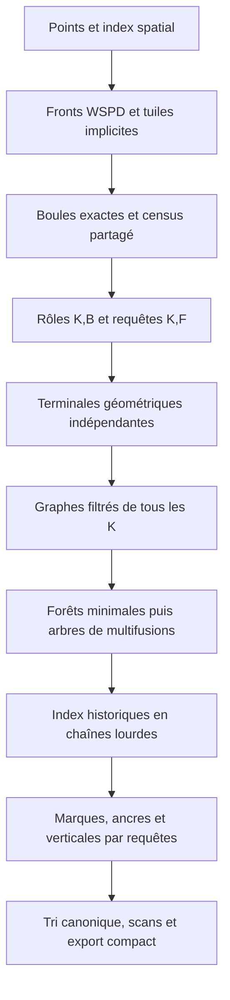

# Objets pour paralléliser toute la tour K-NN

11 septembre 2026, lecture de `34ad933d`, constructeur `full_ball_tower.hpp`
`83f1c78e`. Proposition et modèle borné indépendants ; aucun remplacement du
moteur, aucune mesure CPU/GPU de cette architecture. GCP non utilisé.

```text
phase=exploration_v7_hors_registre
backend=cpu_reference
profile=quantized_u16_input_only
mode=audit_independant_math_and_architecture
public_status=not_claimed
```

**La tour peut devenir un calcul sur tableaux immuables, avec des horizontales
indépendantes puis des jointures historiques pour les verticales.** Le calendrier
séquentiel actuel n’est pas une dépendance mathématique incontournable. Les
mesures du [second auditeur](../NOTE_CLAUDE_DECOUPE_TOUR_20260911.md) identifient
un coût de l’implémentation actuelle ; leurs plafonds ne bornent pas cette
nouvelle décomposition. La génération et les descentes adaptatives gardent,
quant à elles, des dépendances de découverte à traiter explicitement.

## 1. Les objets à garder distincts

| Objet | Données et fonction |
| --- | --- |
| Catalogue géométrique partagé | Une ligne par BallId exacte : niveau, intérieur I, coquille U, q_min et populations en segments partagés. Une seule géométrie pour toute la tour. |
| Rôles clairsemés `(K,B)` | Fenêtre de la boule, représentants stricts locaux et contribution éventuelle. Ce sont les tâches du calcul ; pas tous les simplexes de Gamma. |
| Requêtes de résolution | Facette complète triée F, ordre K, première occurrence et consommateurs. Résultat : terminale géométrique, indépendante du calendrier. |
| Graphe filtré sur naissances | Une identité de naissance par sommet, date propre, arêtes datées provenant des cofaces et terminaux. Le recouvrement des points ne fusionne pas les identités. |
| Forêt minimale et arbre FULL | La première conserve les composantes à chaque coupe ; le second porte leurs naissances et multifusions atomiques. Ils ne sont pas le même arbre. |
| Marques datées et images inférieures | Contribution attachée à un segment historique, date d’activation et référence de population ; référence inférieure de chaque naissance. Elles restituent croissance, ancres et verticales. |

Sous régularité, u=q≤4. Une boule n’intervient qu’aux deux ordres voisins
K=p+q−1 (connexion) et K=p+q (naissance), tronqués aux bornes de la tour.
Avec B boules, **A_boules≤2B et R≤4B** sur tous les ordres réunis ; ajouter
les n points K1 aux sommets de travail. Il n’y a donc pas Kmax copies de la
même géométrie à construire dans ce régime. Avec coquilles supplémentaires,
conserver au contraire la vraie fenêtre et ses coûts :

$$A_{\mathrm{boules}}=\sum_B\left|[\max(1,p_B+q_{\min,B}-1),\min(K_{\max},n,p_B+u_B)]\cap\mathbb{Z}\right|.$$

R compte alors les composantes strictes locales effectivement émises, sans
transférer la borne régulière. Le cas K=n conserve sa naissance terminale et
sa référence inférieure ; n=1 conserve son seul point. Profils pondérés et
positions dupliquées ne reçoivent aucun nouveau contrat par cette note.

## 2. Une chaîne de traitements parallèles



Les flèches sont les dépendances de données. À l’intérieur d’une étape, on
exploite aussi les boules, rôles, arêtes ou requêtes d’un même K : lancer
seulement dix tâches d’ordre ne constitue pas le parallélisme massif demandé.
Les étapes peuvent se recouvrir dès que les dépendances d’un segment sont
satisfaites, sous une limite explicite de mémoire en vol.

| Étape coûteuse actuelle | Transformation concrète à qualifier |
| --- | --- |
| Index et front WSPD | Morton, tri et scans ; tâches plates `(celluleA,celluleB,masques)` classées en parallèle, puis scan du nombre d’enfants. Les vagues conservent leurs dépendances. |
| Gros rectangles et ancres | Répartir des tuiles implicites de paires ; partager les histogrammes par rectangle/lane. Ne pas allouer tout le produit cartésien pour distribuer le travail. |
| Racines du sweep q4 | Trier exactement par seed et racine, regrouper les égalités, puis deux scans segmentés donnent les profondeurs de toutes les completions. Voir §3. |
| Candidats, préfiltre et census | Trier des indices, dédoublonner par groupes, compacter les survivants par scan, écrire les résultats à leurs offsets. Cela évite notamment l’application séquentielle de la permutation des gros candidats par cycles. |
| Validation du catalogue | Un travail par boule : certificat, q_min et fenêtre ; réduire les erreurs et compteurs, puis allouer les rôles par scan des largeurs. Les plateaux gardent leurs coûts locaux. |
| Préparation des résolutions | Compter les représentants, scan des offsets CSR, tri `(K,F,ordinal)`, dédoublonnage et jointure avec les semis de population complète, puis restitution aux consommateurs. |
| Histoire des composantes | Graphe sur naissances, MSF parallèle, construction parallèle du dendrogramme, contraction des nœuds internes de même date. Voir §4. |
| Ancres, contributions et verticales | Requêtes historiques indépendantes sur arbres immuables. Voir §5–6. |
| Banque et export | Populations partagées, comptages, scans et écritures à offsets uniques ; canonisation des numéros par ordre stable et minima des premières occurrences. |

Le catalogue des niveaux rationnels est trié **une fois exactement**. Son rang
entier sert ensuite aux graphes, égalités et requêtes ; les rationnels originaux
restent disponibles pour l’export. Un départage d’arêtes peut ajouter un ordinal
à ce rang pour l’algorithme, mais ne change jamais le rang géométrique du plateau.

Les requêtes se mutualisent par **`(K,F triée)`**, pas par BallKey ni par support
MEB : la recherche d’intrus exclut tous les sites de F. Une table optionnelle
des états rencontrés peut partager des transitions et comprimer les chemins
terminaux. Ses D états distincts peuvent dépasser les Q requêtes initiales ;
il faut borner ce cache et mesurer le travail évité. Les états futurs non
encore découverts ne se calculent pas par un saut de pointeurs magique.

## 3. Le sweep q4 devient deux scans exacts

Dans `generate.hpp:1043–1178`, après tri et groupement des racines d’un seed,
noter E_g les entrées du groupe g, X_g ses sorties et c0 les témoins constants.
La profondeur stricte au groupe est :

$$d_g=c_0+\sum_{j<g}E_j+\sum_{j>g}X_j.$$

Un préfixe exclusif des entrées et un suffixe exclusif des sorties calculent
toutes les profondeurs. La formule est exactement celle du code : retirer les
sorties courantes, laisser tous les incidents à zéro, ajouter les entrées après.
Chaque completion du groupe reçoit alors d_g et applique ses filtres indépendants.
Le groupement des racines exactement égales précède les scans ; traiter les
incidents ex aequo l’un après l’autre changerait la géométrie stricte.

Cette transformation évite la boucle de dépendance `ent/ext_after` sans
réintroduire le produit completions×témoins. Le nombre de racines stockées
reste celui des incidences réellement découvertes ; traiter des lots de seeds
pour borner leur résidence. Aucun gain de temps n’est mesuré ici.

## 4. Retirer le calendrier global des fusions

La [réduction déjà prouvée](../receipts_filtered_graph_20260911/README.md)
fournit pour chaque K les naissances, leurs dates, les arêtes réduites et la
carte pivot φ. Elle repose sur le census complet, la fenêtre suffisante, le
quotient local correct et des terminales strictement antérieures. Une forêt
minimale conserve toutes les coupes de ce graphe, pas toutes ses adjacences.

Le chaînon manquant n’est pas nécessairement un nouveau théorème HGP :
**la construction parallèle MSF→dendrogramme existe déjà.** RCTT construit un
arbre de contraction de calcul, trace les arêtes vers leurs groupes protecteurs,
puis trie ces groupes pour écrire les parents. L’article donne O(L log L)
travail et O(log² L) profondeur dans son modèle, indépendamment de la hauteur
de sortie ; les composantes séparées se traitent indépendamment. Son ParUF a,
lui, une profondeur dépendant de cette hauteur. C’est une raison concrète de
privilégier l’étude de RCTT pour des histoires très déséquilibrées.
[Source primaire, §2.3 et §4.2](https://arxiv.org/html/2404.19019v1).

PANDORA fournit une autre construction par contraction puis expansion,
implémentée pour CPU et GPU. C’est un candidat de comparaison pour la phase
sur arbre, pas un producteur HGP ni une preuve de notre débit.
[Source primaire, §3 et §5](https://arxiv.org/html/2401.06089v1).

Pour Morse HGP, conserver les dates de naissance des feuilles et **contracter
les liens entre nœuds internes de même niveau exact** après le raffinement
binaire. Une composante connexe de tels liens devient une multifusion ; ses
enfants extérieurs sont précisément les composantes avant lot. Ne pas
contracter deux fusions de même niveau appartenant à des composantes disjointes,
ni les feuilles au seul motif d’une égalité de dates. L’ordre total auxiliaire
des arêtes ne doit jamais produire des parents publics de durée nulle.

Trois arbres ont ainsi trois fonctions : **MSF** pour le certificat de
connexité filtrée ; **arbre de contraction** pour répartir le calcul ;
**arbre FULL** pour l’histoire restituée. Une grande profondeur du dernier
n’oblige pas à exécuter autant de rondes dans le deuxième.

Les arêtes réduites peuvent être fournies à un MSF par contractions de type
Borůvka, avec clé totale `(rang exact, identités d’extrémités, ordinal)` et
regroupement des composantes en parallèle. Ses rondes ne sont pas les niveaux
HGP. Cette étape doit elle aussi être mesurée ; réduire à une MSF ne rend pas
le flux d’arêtes initial gratuit. Le prototype de cette note ne livre ni MSF
parallèle ni RCTT/PANDORA exécuté.

## 5. Une consultation historique en O(log N), stockage O(N)

Dans l’arbre FULL atomique, noter A_K(v,t,c) le plus haut ancêtre de v actif à
la coupe t de côté c. Refuser v s’il n’est pas encore né ; comparer les dates
avec `<` en ouvert et `≤` en fermé. Les racines restent distinctes.

Un tableau de tous les sauts donne une référence simple, mais sa résidence
O(N log h) n’est pas le choix industriel par défaut. **Des chaînes lourdes en
tableaux suffisent.** Pour chaque nœud, choisir l’enfant de plus grand sous-arbre
(égalité départagée de façon stable) ; conserver tête de chaîne, position,
parent, date et tableau compact des chaînes.

Pour consulter depuis v actif :

1. Si la tête haute de sa chaîne est active, y aller directement. Si son parent
   est absent ou inactif, rendre cette tête ; sinon franchir ce lien léger.
2. Si cette tête est inactive, faire une unique recherche binaire finale dans
   le segment de chaîne entre la tête et v.

Tout enfant léger a au plus (taille(parent)−1)/2 nœuds : il existe un enfant
lourd au moins aussi gros. Une remontée franchit donc au plus log₂ N liens
légers, même avec des multifusions. Les chaînes entières coûtent O(1) chacune,
et **une seule** recherche binaire termine la requête : O(log N), stockage O(N).
Tailles, enfants lourds et positions se préparent par parcours d’Euler, scans,
réductions et classement des chemins. Une réalisation simple peut payer
O(N log N) travail temporaire ; ne pas confondre stockage linéaire et gratuité.

Pour le hub B, fixer u_B=A_K(φ(B),λ_B,fermé). Pour toute coupe qui admet B :

$$A_K(u_B,t,c)=A_K(\varphi(B),t,c).$$

En effet, le chemin φ(B)→u_B est déjà actif à λ_B. Une contribution peut donc
devenir `(u_B,activation=λ_B,population,masque,intérieur)`, en conservant sa
date propre. ABCZ montre pourquoi l’affecter au nœud ne permet pas de l’activer
à la naissance de ce nœud. Une fois les jointures consommées, φ et les hubs
sans usage restant sont libérables. Si l’API expose encore les ancres de tous
les BallId, garder `(K,B)→(u_B,λ_B)` ; pas besoin de conserver φ pour cet usage.
Cette économie concerne le stockage retenu, pas un pic mémoire déjà mesuré.

## 6. Les verticales de tous les K se calculent ensemble

Pour une naissance ℓ d’ordre K>1 portée par B, le bloc inférieur (K−1,B)
existe par la preuve antérieure. Conserver b_ℓ=φ_{K−1}(B). Pour chaque nœud
supérieur v, choisir une naissance descendante ℓ(v), puis poser :

$$V(v)=A_{K-1}(b_{\ell(v)},\lambda_v,\mathrm{ferme}).$$

Le calcul n’utilise que **l’histoire horizontale** K−1, jamais ses verticales.
Toutes les valeurs V de tous les ordres peuvent donc se calculer indépendamment
une fois les horizontales adjacentes disponibles. Une construction progressive
reste possible pour la mémoire ; elle n’est plus imposée par cette dépendance.

Conserver le contrôle, pour chaque parent public p de la fusion v :

$$A_{K-1}(V(p),\lambda_v,\mathrm{ferme})=V(v).$$

Les images géométriques aux naissances et ces égalités établissent la naturalité
par induction, donc l’indépendance du choix de ℓ(v). Les contrôles se font eux
aussi en parallèle après remplissage. Une naissance par **arbre final** ne
suffit pas : avant leur fusion, deux branches supérieures peuvent encore
avoir des images inférieures distinctes. Les requêtes ultérieures normalisent
V(v) à leur propre coupe. Les masses du manuscrit demandent toujours leurs
incidences et poids ; la seule MSF ne les reconstitue pas.

## 7. Sortie, résidence et prochain raccord utile

Pour L naissances et C arbres finaux, une forêt sans nœud unaire a au plus
2L−C nœuds. Cela ne borne pas L en n : les feuilles d’ordre supérieur peuvent
être nombreuses. Comptabiliser séparément B, A, R, Q, les D états de descente,
les arêtes après dédoublonnage, L, N, les marques et les populations partagées.
Le point-set de chaque nœud n’est jamais une étape obligatoire de l’export.

L’export actuel attribue notamment les populations au premier usage. Une
implémentation parallèle peut calculer cette première position par réduction
du minimum dans l’ordre canonique `(K,niveau,groupe,contribution)`, puis scan
pour les identifiants et offsets. Les masques restent liés à la coquille triée
par PointId. Reproduire l’encodage physique demandé ou comparer par bijection
explicite ; une égalité géométrique ne suffit pas à établir des octets identiques.

Le prochain raccord utile est borné : émettre depuis les vrais petits census
les rôles, terminaux et marques, construire les horizontales séparément, puis
rattacher contributions et verticales par requêtes. Comparer au calendrier
actif et à T2 : parents, coupes des deux côtés, couvertures, ancres et verticales.
Remplacer ensuite la construction séquentielle de référence par MSF/RCTT,
sans changer ce contrat de tableaux. Mesurer génération, préparation,
connectivité, requêtes et export séparément, puis toute la tour. Aucune cible
50k/1 s/100 ms n’est acquise par cette proposition.

## 8. Témoin borné et lecture

Le [modèle](parallel_model.py), exécuté en Python normal et `-O`, confronte
les tables de sauts et les chaînes lourdes au parcours indépendant des graphes :
**11 cas, 234 coupes et 5 178 requêtes**, dont 169 avant la naissance demandée.
Les 10 126 contrôles d’occurrences conservent les dates de croissance et
l’admission des hubs. Le peigne de profondeur 34 exerce sept niveaux de sauts ;
les requêtes HLD exercent à la fois les liens légers et les recherches binaires.

Deux tours collinéaires, à trois et quatre points, confrontent 12 nœuds verticaux
et leurs 16 témoins descendants. Deux images précèdent encore la racine finale,
neuf correspondent à une fusion inférieure au même niveau. Singleton, K=n,
recouvrement et multifusion ternaire sont présents. Cinq mutants sont rejetés :
fermé à la place d’ouvert, racine finale à la place de l’image datée, perte de
la date d’une contribution unaire, raffinement binaire égal non contracté,
et choix d’une feuille extérieure aux descendants supérieurs.

La construction tri/DSU et la préparation HLD du témoin sont **séquentielles**.
Les listes de descendants servent au juge borné, pas au stockage industriel
proposé. Le témoin n’exécute ni produit, ni MSF parallèle, ni RCTT/PANDORA ;
aucun temps, nombre d’octets Python ou vitesse n’est interprété en performance.
Il ne qualifie pas le scan q4, dont cette note donne l’identité mathématique.

Les [commandes complètes](commands.json), le [résultat](result.json) et les
[sources de contexte](context_pins.json) sont scellés. Le lecteur vérifie les
empreintes, les sources historiques et les captures ; il ne réexécute pas le
modèle. Pour reproduire la géométrie abstraite, exécuter directement le modèle :

```bash
python3 -B morsehgp3D_v7/audits/receipts_parallel_objects_20260911/verify.py
python3 -B -O morsehgp3D_v7/audits/receipts_parallel_objects_20260911/verify.py
python3 -B morsehgp3D_v7/audits/receipts_parallel_objects_20260911/parallel_model.py
python3 -B -O morsehgp3D_v7/audits/receipts_parallel_objects_20260911/parallel_model.py
```
