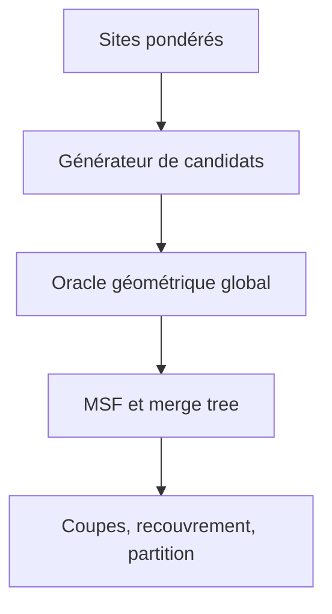

# Audit technique et mathématique de PERG-HGP

**Document de transmission à Gemini — 9 juillet 2026**

**Dépôt audité :** `Ludwig-H/E-HGP`

**Branche :** `main`

**Commit audité :** `7464288` (`perf: set default max_ram_facets to 100M...`)

**Objet principal :** `perg_hgp/`

---

## 0. Résumé exécutif

PERG-HGP repose sur une idée de recherche solide : remplacer l'énumération impossible du complexe de Čech d'ordre élevé par un atlas de cofaces produit par des témoins critiques d'un champ de rang entropique, certifier géométriquement les cofaces retenues, puis reconstruire les fusions au moyen d'un arbre couvrant du graphe dual.

Le noyau déterministe suivant est mathématiquement sain : une famille fixée de sites additivement pondérés

\[
\phi_i(y)=\|y-z_i\|^2+a_i,
\]

définit des régions témoins convexes et donc une hiérarchie de couverture d'ordre \(K\). Le raisonnement du Théorème 2 de la thèse s'étend à ces régions. Une étoile de facettes par coface préserve également la connexité de chaque sous-niveau. En revanche, le champ de rang entropique et les témoins finis sont des **générateurs de candidats** : ils ne prouvent pas que l'atlas obtenu est complet.

La version présente de `perg_hgp` doit être considérée comme un **prototype de recherche**, et non comme une bibliothèque exacte ou déjà validée à 30 millions de points. Les principaux verrous sont les suivants.

1. **La sortie hiérarchique est incorrecte.** `condense_tree` ne calcule ni un arbre condensé de type HDBSCAN, ni l'excès de masse, ni une sélection de branches. `extract_labels` assigne essentiellement une étiquette par composante finale du graphe dual. Sur un atlas connexe, le résultat tend donc vers un seul cluster (`perg_hgp/perg_hgp/hierarchy.py:233-382`).
2. **Les voisinages utilisés par le champ de rang ne sont pas des top-\(m\) de puissance.** Le code trouve d'abord les voisins euclidiens de \(Z\), puis trie seulement ceux-ci selon \(\phi_i\). Un site plus éloigné mais de faible coût additif peut être omis. La cohérence top et le test local ne sont donc pas des certificats globaux (`witnesses.py:36-45`; `cofaces.py:324-388`).
3. **La boucle de rang n'exécute pas la spécification.** Elle n'utilise que la dernière température de `rank_eps_schedule`, sans annealing ni échelle locale, et ne construit pas réellement le pool final \(W_{K+1}\) décrit dans le cahier des charges (`witnesses.py:31-45,72`; `estimator.py:283-305`).
4. **Le solveur batché de miniball est combinatoire.** Pour \(K=20\), il énumère 7 546 supports par coface. À deux millions de cofaces, cela représente 15,092 milliards de résolutions de supports, avant même la certification (`cofaces.py:41-105,355-375`).
5. **Le chemin Gabriel local matérialise un tableau global \(N\times m_{active}\).** À \(N=30\) M et \(m=128\), les seuls indices et distances occupent environ 42,9 Gio, sans compter les temporaires (`estimator.py:330-344`). Il est incompatible avec une carte de 15 ou 24 Gio.
6. **Le mode out-of-core n'est pas réellement borné.** Le seuil `max_ram_facets` compte des lignes et non des octets ; des tableaux globaux restent en RAM ; 64 buckets fixes ne bornent pas les distributions déséquilibrées (`dual_graph.py:6-178`).
7. **Les budgets sont surtout diagnostiques.** Plusieurs limites sont contrôlées après la construction des objets qui peuvent déjà avoir provoqué une saturation (`estimator.py:486-519`).
8. **Les noms d'exactitude sont trompeurs.** `atlas_exact` désactive Gabriel global ; `cut_certified` n'implémente aucun audit de coupe ; le rapport final fixe toujours `hgp_hierarchy_complete=False` (`estimator.py:124-133,505-519`).
9. **La cible 30 M n'est pas démontrée.** Le notebook correspondant n'a aucun `execution_count` ni aucune sortie enregistrée. Il ne mesure ni RAM, ni VRAM, ni disque, et son seuil de facettes pousse le chemin in-memory (`PERG_HGP_Colab_GPU_Benchmark.ipynb`).
10. **Les tests existants ne valident pas la promesse mathématique.** Ils vérifient surtout des formes, des équivalences entre deux implémentations partageant la même logique, et l'existence d'au moins un cluster. Il manque l'oracle Čech/Gabriel/K-MST exact sur petits nuages et la comparaison des hiérarchies à tous les seuils.

### Recommandation de fond

Ne pas poursuivre immédiatement l'optimisation de la version actuelle. La meilleure trajectoire est :

1. figer un **contrat mathématique canonique** ;
2. écrire un **oracle CPU exhaustif** pour les petits cas ;
3. corriger le calcul de l'atlas, du MSF et de la hiérarchie contre cet oracle ;
4. seulement ensuite remplacer les briques par des kernels GPU et des chemins out-of-core ;
5. n'annoncer la cible 30 M qu'après une exécution instrumentée, reproductible et enregistrée.

---

## 1. Périmètre et méthode de l'audit

Le dépôt contient 105 fichiers suivis, dont 52 fichiers Python/Cython (12 982 lignes), 3 573 lignes de C/C++, 11 notebooks, deux PDF et deux jeux de données. Ont été examinés :

- tout le package `perg_hgp`, sa suite de 15 tests, ses scripts et son notebook de benchmark ;
- `PERG-HGP/PERG_HGP_3D_30M_Gemini_spec.md`, `phase5_out_of_core_plan.md`, `perg_hgp_chatgpt_report.md`, `algorithme_reg_knn_hgp_certifie_v2.md` et `thesis_repo_summary.md` ;
- le manuscrit de thèse de 248 pages, en particulier les chapitres 2, 6, 7, 8 et 9 ;
- les implémentations antérieures `E-HGP/` et `HGP-old/`, leurs backends géométriques, notebooks et benchmarks ;
- l'historique Git récent et l'état de la branche `main`.

Les constats sont classés comme suit :

- **observé** : directement lisible dans le code, les documents ou les artefacts ;
- **démontré** : conséquence mathématique explicitement justifiée ;
- **inféré** : conséquence très probable d'une structure de code ou d'un calcul de coût ;
- **proposé** : architecture ou correction recommandée.

### Vérifications exécutées

- La syntaxe de tous les fichiers Python pertinents passe `compileall`.
- Les tests fonctionnels n'ont pas pu être rejoués dans l'environnement de cet audit, où `torch` et `pytest` ne sont pas installés. Le statut « 15 tests en 8,96 s » de `PERG-HGP/perg_hgp_chatgpt_report.md` est donc une **allégation enregistrée dans le dépôt**, pas une mesure indépendante de cet audit.
- Le notebook PERG-HGP ne contient aucune sortie d'exécution ; aucune preuve empirique de 1 M ou 30 M n'est versionnée.

---

## 2. Ce que la thèse démontre — et ce qu'elle ne démontre pas

Les numéros ci-dessous sont les pages imprimées du manuscrit ; les pages PDF sont données entre parenthèses.

| Résultat | Référence | Portée exacte |
|---|---|---|
| Estimateur \(K\)-NN et niveaux \(L_K(r)\) | Déf. 7, p. 19-20 (PDF 45-46) | Euclidien, non pondéré |
| Amas discrets couverts par une composante continue | Déf. 8, p. 21 (PDF 47) | Recouvrement, pas nécessairement partition |
| Complexe de Čech, graphe \(\Gamma_K\), \(K\)-polyèdres et HGP | Déf. 20-22, p. 57-58 (PDF 83-84) | Faces de cardinal \(K\), cofaces de cardinal \(K+1\) |
| HGP = amas discrets de forte densité \(K\)-NN | Th. 2, p. 60-61 (PDF 86-87) | Exact, par graphe d'intersection de régions témoins convexes |
| Rayon de naissance et miniball | Déf. 25-26, p. 84-85 (PDF 110-111) | Miniball euclidienne ordinaire |
| Toute coface \(K\)-séparante est de Gabriel | Th. 4, p. 88-89 (PDF 114-115) | Sous position générale, non pondéré |
| Le graphe de Gabriel conserve les fusions utiles | Prop. 6, p. 90 (PDF 116) | Composantes non réduites à une face isolée |
| \(K\)-MST élagué = \(K\)-polyèdres | Th. 5, p. 91 (PDF 117) | Composantes non triviales uniquement |
| Les cofaces Gabriel sont portées par la mosaïque d'ordre \(K\) | Th. 6, p. 92-93 (PDF 118-119) | Inclusion structurelle, pas promesse de petite taille |
| Fournisseur via \(\mathrm{Del}_{K-1}\) | Th. 7, p. 99 (PDF 125) | Exact en basse dimension si la mosaïque est calculable |
| Vote pondéré pour une partition stricte | §9.1, Prop. 7, p. 96-97 (PDF 122-123) | Post-traitement normalisé par point |
| Vietoris-Rips | Fait 13 et Prop. 10, p. 103-105 (PDF 129-131) | Approximation, pas égalité avec Čech |

La thèse **ne contient pas** PERG-HGP, le champ de rang entropique, les sites de puissance régularisés ou les témoins progressifs. Il s'agit d'une extension postérieure. Les garanties des Théorèmes 4 à 6 ne peuvent donc pas lui être attribuées sans théorèmes pondérés supplémentaires.

### Limites des résultats de percolation

Le chapitre 7 travaille avec un processus ponctuel de Poisson et HGP exact non régularisé. Après régularisation, les \((z_i,a_i)\) dépendent conjointement des voisinages de l'échantillon ; ce ne sont plus les points indépendants d'un processus de Poisson homogène. Après restriction à un atlas incomplet, la connectivité est encore modifiée.

Manquer des cofaces retarde mécaniquement la percolation. Une courbe PERG-HGP pourrait donc sembler meilleure que celle de HGP ou HDBSCAN simplement parce que l'atlas est incomplet. Toute expérience de percolation doit publier simultanément le rappel des cofaces ou des fusions contre un oracle exact.

Enfin, certaines ouvertures de la thèse sont explicitement non closes : la convergence gaussienne est fini-dimensionnelle, le passage aux événements de percolation gaussiens est admis, et les grandes déviations à haut rappel sont présentées comme intuitions. `thesis_repo_summary.md` doit être nuancé sur ces points.

---

## 3. Contrat mathématique canonique recommandé

### 3.1 Régularisation locale : choisir une seule définition

Deux documents du dépôt définissent deux modèles différents.

1. `algorithme_reg_knn_hgp_certifie_v2.md:108-175` utilise un support \(A_i\) contenant \(i\) et le coût quadratique brut :

\[
q_i^\kappa\in\arg\min_{q\in\Delta(A_i)}
\sum_{j\in A_i}q_j\|x_i-x_j\|^2
\quad\text{sous}\quad H(q)\ge\log\kappa.
\]

2. `PERG_HGP_3D_30M_Gemini_spec.md:528-560` utilise le coût décalé de type UMAP :

\[
c_{ij}=\bigl(\|x_i-x_j\|-\rho_i\bigr)_+^2.
\]

Le second crée plusieurs coûts nuls et ne possède pas, avec la convention actuelle, la limite propre \(\kappa=1\Rightarrow q_i=\delta_i\). Le code actuel prend la première distance de la liste, qui est la distance du point à lui-même, donc \(\rho_i=0\) ; il exécute de fait le coût quadratique brut tout en prétendant exécuter le coût décalé (`local_gibbs.py:76-83`).

**Décision recommandée :** rendre le coût quadratique brut, avec le point lui-même inclus, canonique. Il assure

\[
\kappa=1\Longrightarrow z_i=x_i,\qquad a_i=0,
\]

et permet de retrouver HGP classique. Conserver éventuellement le coût décalé sous le nom explicite `umap_shifted`, avec un statut heuristique distinct et sans revendiquer cette limite.

Il faut valider et exposer : `support_mode = full | exact_knn | approximate_knn`, `self_included`, les égalités de distances, les doublons, \(1\le\kappa\le |A_i|\), et le cas \(\kappa=|A_i|\) où \(\eta_i=+\infty\).

### 3.2 Sites de puissance et extension exacte du Théorème 2

Pour

\[
z_i=\sum_jq_{ij}x_j,
\qquad
a_i=\sum_jq_{ij}\|x_j-z_i\|^2,
\]

on a l'identité

\[
\sum_jq_{ij}\|y-x_j\|^2=\|y-z_i\|^2+a_i=\phi_i(y).
\]

Définissons

\[
t(\sigma)=\min_y\max_{i\in\sigma}\phi_i(y)
\]

et, pour une face \(\tau\) de cardinal \(K\),

\[
T_\tau(r)=\bigcap_{i\in\tau}\{y:\phi_i(y)\le r^2\}.
\]

Chaque \(T_\tau(r)\) est une intersection de boules fermées, donc un compact convexe. Par conséquent,

\[
L_{K,\kappa}(r)
=\{y:\#\{i:\phi_i(y)\le r^2\}\ge K\}
=\bigcup_{|\tau|=K}T_\tau(r),
\]

et les composantes du niveau correspondent aux composantes du graphe d'intersection des régions témoins. Cette extension pondérée du Théorème 2 est la base déterministe la plus solide de PERG-HGP.

### 3.3 Théorème de Gabriel pondéré à écrire

Le dépôt affirme qu'une coface séparante est Gabriel pondérée, sans définir complètement la position générale de puissance ni fournir de preuve. Le théorème doit devenir autonome.

Hypothèses minimales recommandées pour chaque coface \(\sigma\) :

1. unicité du centre \(c_\sigma\) ;
2. support actif minimal affinement indépendant ;
3. multiplicateurs KKT strictement positifs ;
4. absence d'égalité extérieure \(\phi_j(c_\sigma)=t(\sigma)\).

La contraposée suit alors le schéma du Théorème 4. Si un intrus \(j\notin\sigma\) satisfait \(\phi_j(c_\sigma)<t(\sigma)\), retirer chaque sommet actif \(s\) empêche \(c_\sigma\) de rester optimal, car il n'appartient plus à l'enveloppe convexe des centres actifs restants. Les cofaces où \(s\) est remplacé par \(j\) naissent donc strictement plus tôt et relient les facettes actives. La coface initiale n'est pas séparante.

Ce résultat doit être rédigé et testé exhaustivement sur de petits nuages pondérés avant toute valeur `hgp_hierarchy_complete=true`.

### 3.4 Rôle exact du champ de rang entropique

Pour les énergies complètes \(E_i(y)=\phi_i(y)\), le top-\(k\) canonique est mathématiquement bien défini. Si \(F_k\) est sa libre énergie, les marges

\[
p_i^{(k)}=\frac{u_i e_{k-1}(u_{-i})}{e_k(u)},
\qquad
b_i^{(k)}=p_i^{(k)}-p_i^{(k-1)}
\]

donnent, avant toute correction numérique,

\[
\nabla Q_{k,\varepsilon}(y)
=2\left(y-\sum_i b_i^{(k)}z_i\right).
\]

Les points fixes sont donc des candidats naturels pour explorer les cellules d'ordre supérieur. Mais un ensemble fini de points fixes ne prouve ni la couverture de toutes les cellules, ni la présence de toutes les cofaces séparantes. Le vocabulaire normatif doit être :

> Les témoins entropiques génèrent un atlas candidat. L'exactitude des cofaces vient d'un oracle géométrique global. La complétude de la hiérarchie exige en plus une preuve de couverture des faces et des coupes.

### 3.5 Cinq statuts, pas un booléen

Le résultat doit distinguer :

```yaml
result_status:
  - exact_full_hgp
  - exact_localized_power_hgp
  - exact_generated_atlas
  - certified_true_cofaces_but_incomplete_hierarchy
  - heuristic
```

`exact_generated_atlas` signifie seulement que le MSF et les sous-niveaux du graphe **fourni** sont exacts. Il ne signifie pas que toutes les cofaces de HGP ont été générées.

---

## 4. Architecture actuelle de `perg_hgp`

| Étape | Module actuel | Observation |
|---|---|---|
| Configuration | `config.py` | Nombreux paramètres sans validation ; plusieurs ne sont jamais utilisés |
| Grille 3D / k-NN | `grid.py` | Recherche euclidienne exacte avec fallback global, mais nombreuses boucles Python et buffers globaux |
| Régularisation | `local_gibbs.py` | Bisection vectorisée ; résidu non contrôlé ; `tol` inutilisé ; \(\eta\) ensuite jeté |
| Champ de rang | `rank_field.py` | DP formellement correcte en régime stable ; calcul direct non logarithmique et clipping du gradient |
| Témoins | `witnesses.py` | Raffinement et lifting heuristiques ; annealing, dédoublonnage et beam absents |
| Cofaces / miniball | `cofaces.py` | Top local incomplet ; énumération de tous les supports jusqu'à 4 ; tolérance forcée à \(10^{-5}\) |
| Gabriel | `gabriel.py` | Filtre local séquentiel ; test global exact dans son principe mais \(O(U\times\text{cellules})\) en Python |
| Facettes / dual | `dual_graph.py` | Étoile correcte topologiquement ; dédoublonnage lourd et seuil mémoire non dimensionné en octets |
| MSF / arbre | `hierarchy.py` | Borůvka rescanne les arêtes plusieurs fois ; condensation et extraction plates incorrectes |
| Orchestration | `estimator.py` | Pipeline monolithique ; checkpoints non liés aux données/config ; budgets tardifs |

Les paramètres `beam_per_bucket`, `L_shell` et `support_cap` sont exposés par l'estimateur mais n'influencent pas effectivement le pipeline. `rank_eps_schedule` est réduit à son dernier élément. `PERGHGPConfig.load_from_yaml` n'est relié à aucune entrée publique de l'estimateur. Les modes d'exactitude modifient silencieusement les paramètres de l'objet pendant `fit`.

---

## 5. Défauts critiques, module par module

### 5.1 API, configuration et emballage

**P0**

- Valider immédiatement `X.shape == (N,3)`, les valeurs finies, \(N>0\), \(1\le K<N\), `K+1 <= m_active <= N`, `1 <= K_rho <= m_local <= N`, la résolution de grille, les températures et les budgets.
- `scikit-learn` est importé par `estimator.py` mais absent des dépendances de `pyproject.toml` et `setup.py`.
- Le défaut mutable `rank_eps_schedule=[...]` doit devenir un tuple ou `None`.
- `atlas_exact`, `global_gabriel_certified` et `cut_certified` doivent être remplacés par des noms qui correspondent aux garanties réellement exécutées.
- Le package de redirection `perg_hgp/__init__.py` charge l'implémentation comme `perg_hgp.inner`; depuis la racine, `import perg_hgp.cofaces` échoue. Supprimer ce shim et utiliser un layout `src/` standard.

**P1**

- Ajouter `verbose`, `random_state`, `precision_generation`, `precision_certification`, `memory_budget_bytes`, `scratch_dir` et un objet de configuration validé.
- Ne pas muter `self.local_gabriel` et `self.global_gabriel` pendant `fit`.
- Exposer les artefacts : `cofaces_`, `coface_weights_`, `facets_`, `msf_`, `merge_tree_`, diagnostics et méthodes de coupe.
- Ajouter un fichier de licence racine. `HGP-old` est sous licence non commerciale tandis que `perg_hgp` se déclare MIT sans fichier de licence : la distribution du mono-dépôt est ambiguë.

### 5.2 Grille et régularisation locale

La recherche de `grid.py` peut rendre des k-NN euclidiens exacts grâce à un certificat de bord et à un fallback exhaustif. Cela ne suffit pas pour le champ de puissance.

**P0 — créer un oracle `query_topk_power`.** Pour une cellule \(C\), pré-calculer

\[
\mathrm{LB}(C,c)=d(c,\mathrm{AABB}(C))^2+\min_{j\in C}a_j.
\]

Parcourir les cellules dans l'ordre de cette borne, maintenir les \(m\) plus petites valeurs de \(\phi_j(c)\), et arrêter lorsque la meilleure borne non visitée dépasse la \(m\)-ième énergie courante. Cette condition certifie à la fois le top de puissance et sa queue.

Conséquence utile : si, au centre exact \(c_\sigma\), le top global de cardinal \(K+1\) est exactement \(\sigma\), alors aucun point extérieur n'a une puissance strictement inférieure à \(t(\sigma)\). La cohérence top globale fournit directement le certificat de Gabriel, avec le gap donné par l'énergie suivante.

**P0 — choisir explicitement le coût de Gibbs.** Avec le modèle canonique proposé, supprimer le pseudo-décalage et utiliser le coût quadratique brut avec self inclus. Si le mode UMAP est conservé, calculer le plus proche voisin hors self et lui donner un nom distinct.

**P1**

- Faire doubler la borne haute de bisection jusqu'à encadrer l'entropie cible ; vérifier le résidu final et utiliser réellement `tol`.
- Ne pas conserver `X_normalized` si seules les clés et la boîte sont nécessaires.
- Remplacer la grille fixe par une résolution dérivée d'un échantillon des distances locales et subdiviser les cellules surchargées.
- Éliminer les `.item()` et les boucles par offset sur GPU ; un kernel Triton/CUDA ne doit venir qu'après validation de l'oracle CPU.
- Définir une tolérance relative aux unités et à l'échelle des données.

### 5.3 Champ de rang et témoins

**P0**

- Exécuter toutes les températures de `rank_eps_schedule`, multipliées par une échelle d'énergie locale ; la version actuelle n'utilise que `[-1]`.
- Construire explicitement les rangs \(1,\ldots,K+1\), puis extraire les cofaces à partir de \(W_{K+1}\).
- Faire du dédoublonnage spatial et par signature après chaque température ; appliquer `beam_per_bucket` avant de matérialiser le rang suivant.
- Remplacer les top euclidiens locaux par l'oracle top-puissance certifié ou publier une borne de troncature.

Le seuil fixe de queue \(12\varepsilon\) proposé dans le cahier des charges n'est pas suffisant à \(N=30\) M. En effet,

\[
(N-m)e^{-12}\approx184.
\]

La somme de millions de petits poids omis peut être dominante. Une borne grossière dépendant de \(N,K,\delta\) exige déjà

\[
\frac{\Delta}{\varepsilon}
\gtrsim \log\frac{(N-m)K}{\delta},
\]

soit environ 34 pour \(K=20\) et \(\delta=10^{-6}\). Pour la loi canonique, calculer une borne de queue à partir des polynômes symétriques, du nombre de sites omis et de la plus petite énergie omise.

**P1**

- Calculer la DP en espace logarithmique ou par renormalisations de degré. Le clipping `b=max(0,b); b/=sum(b)` modifie le gradient et donc le champ dont les points fixes sont recherchés.
- Utiliser `scores` et `signatures`, aujourd'hui calculés puis presque ignorés.
- Remplacer la boucle Python de \(N\) mises à jour lors de l'initialisation par une réduction segmentée. En pratique, initialiser \(W_1\) à partir de \(Z\) puis sélectionner globalement les plus petits \(a_i\) détruit la couverture spatiale ; sélectionner par buckets.
- La « rank-capacity » actuelle compte les valeurs sous le prochain ordre statistique et accepte presque toujours exactement le rang demandé. Il faut une vraie mesure de gap ou de stabilité.

### 5.4 Miniball et certification géométrique

**P0**

- Pour \(K>5\), utiliser un active-set de support maximal 4, conformément à `algorithme_reg_knn_hgp_certifie_v2.md:519-535`, et non l'énumération de tous les sous-ensembles de taille au plus 4.
- Exécuter la génération en float32 si nécessaire, puis recalculer centre, rayon, multiplicateurs, résidu primal et gap Gabriel en float64.
- Rendre l'état de certification ternaire : `accepted`, `rejected`, `uncertain`. Un gap dans la bande d'erreur doit déclencher un recalcul robuste, pas être accepté par tolérance.
- Ne jamais remplacer silencieusement un échec du solveur par le premier sommet (`cofaces.py:100-104,204-207`).

**Bugs précis à corriger**

- La tolérance demandée est forcée à au moins \(10^{-5}\), alors que l'API annonce \(10^{-6}\).
- L'active-set peut ajouter deux fois le même indice.
- Lorsqu'un support de taille 5 est réduit, le code conserve le sous-support faisable de **plus grand** rayon (`cofaces.py:277-291`) ; il faut minimiser le rayon.
- Le ridge \(10^{-6}I\) n'est pas un calcul exact et n'est pas remis à l'échelle.
- La conversion `sqrt(r2)` puis `weights**2` dégrade inutilement la précision.

### 5.5 Gabriel local et global

Le test global de `gabriel.py` est correct dans son idée pour des centres/rayons exacts et une grille contenant tous les sites. Son implémentation actuelle pré-décode les cellules puis boucle en Python sur chaque couple coface-cellule.

**P0**

- Supprimer la requête globale `grid_z.query_knn_grid(Z, m_active)` utilisée seulement pour Gabriel local.
- Certifier chaque coface via le top-puissance global au centre ou visiter directement les cellules intersectant la boule de rayon \(\sqrt t\), avec bornes AABB et `min_a`.
- Si Gabriel global n'est exécuté que sur les arêtes du MSF, utiliser une boucle paresseuse sûre : construire un MSF candidat, certifier toutes ses cofaces propriétaires, supprimer les fausses cofaces, recalculer, et répéter jusqu'à stabilité.

`global_gabriel='selective'` et `'all'` ont aujourd'hui pratiquement le même comportement : tous les candidats ayant passé le filtre local sont testés. La sémantique doit être explicitée.

### 5.6 Facettes et out-of-core

**P0**

- Remplacer `max_ram_facets` par un planificateur en octets qui estime toutes les copies simultanées.
- Utiliser `uint32` pour les indices de points et de facettes tant que les bornes le permettent ; convertir en `int64` seulement dans les chunks requis par PyTorch.
- Enregistrer les incidences sous forme compacte `(hash128, coface_id, dropped_pos)` et conserver les tuples complets une seule fois par facette unique.
- Vérifier les tuples complets pour chaque groupe de hash égal. Deux hashes 64 bits réduisent le risque, mais ne donnent pas une preuve d'identité.
- Repartitionner récursivement tout bucket qui dépasse le budget ; 64 buckets fixes ne bornent rien sous forte inhomogénéité.
- Écrire sous un gestionnaire transactionnel qui nettoie les fichiers en cas d'exception, vérifie l'espace disque et permet de reprendre.

Le tableau `unique_ids_raw` reste global en RAM : 420 M incidences demanderaient 3,36 Go en `int64`. Le résultat final `facet_ids` est également rematérialisé sur le device. Ce chemin ne peut donc pas être qualifié de « <1 Go ».

### 5.7 MSF, merge tree, condensation et labels

L'étoile de \(K\) arêtes entre les \(K+1\) facettes d'une coface est correcte : elle préserve les composantes pour chaque seuil. Le reste de cette étape doit être réécrit.

**P0 — produire d'abord le bon objet.**

1. Le résultat topologique primaire est une **forêt couvrante minimale** (MSF), car l'atlas peut être déconnecté.
2. Le merge tree brut doit traiter ensemble toutes les arêtes de même poids afin d'être invariant à leur ordre.
3. La condensation doit utiliser la masse de face de la thèse :

\[
S_\tau=\sum_{\sigma\supset\tau}\psi(\rho(\sigma)),
\qquad
T_x=\sum_{\tau\ni x}S_\tau,
\qquad
m_\tau=S_\tau\sum_{x\in\tau}\frac1{T_x}.
\]

Le code actuel prend une fonction du minimum des rayons des cofaces incidentes. Ce n'est ni le vrai rayon de naissance \(\rho(\tau)\), ni le score \(S_\tau\) du manuscrit.

4. Implémenter `leaf`, `eom`, les coupes à rayon fixé, la stabilité et le bruit.
5. Conserver la sortie naturelle en recouvrement ; rendre le vote en partition stricte optionnel, avec la normalisation par \(T_x\) du §9.1 de la thèse.

**Naissance et faces isolées.** Le vrai graphe possède comme sommets toutes les faces \(\tau\) dès \(\rho(\tau)\). Le graphe construit uniquement à partir des cofaces :

- retarde une facette jusqu'à sa première coface incidente ;
- omet les faces qui ne participent à aucune coface générée.

Il faut annoncer soit une « hiérarchie complète des faces », qui exige les vrais rayons de naissance et les faces isolées, soit une « hiérarchie des fusions non triviales », correspondant à la portée du Théorème 5.

**Performance.** Le Borůvka actuel relit les arêtes trois fois par phase, transfère les parents CPU/GPU et fusionne les arêtes retenues dans une boucle Python. En mode générateur, il choisit CUDA dès qu'elle est disponible, même si `device='cpu'`. Persister les arêtes compactes une fois. Pour un stockage disque, comparer sérieusement :

- tri externe suivi d'un Kruskal C++ en une passe ;
- Borůvka multi-passes.

Borůvka est attractif en mémoire GPU, mais \(O(\log V)\) lectures complètes du disque peuvent être plus lentes qu'un tri externe.

### 5.8 Checkpoints

Les fichiers `sites.pt`, `witnesses_rank_k.pt`, etc. ne contiennent ni hash de l'entrée, ni hash de configuration, ni version de schéma. Réutiliser un répertoire avec un autre nuage ou d'autres paramètres charge silencieusement des artefacts incompatibles.

**P0**

- Créer un manifeste contenant SHA-256 des données, forme/dtype, commit Git, version de schéma, configuration normalisée, matériel et dépendances.
- Valider chaque étape avant reprise ; invalider automatiquement toutes les étapes descendantes après changement.
- Écrire de façon atomique (`tmp` puis renommage) et stocker sommes de contrôle et longueurs.
- Corriger la reprise partielle des témoins : le checkpoint est enregistré avant le lifting, mais `start_rank=k+1` reprend par un raffinement sans mettre le pool au bon rang.
- Éviter `torch.load(..., weights_only=False)` pour des checkpoints non fiables ; préférer tableaux explicites et métadonnées JSON.

---

## 6. Pourquoi la cible 30 M n'est pas atteinte par le code actuel

Les estimations suivantes utilisent \(N=30\) M, \(m=128\), deux millions de cofaces et des indices 64 bits, conformément aux budgets documentés.

| Bloc actuel | \(K=10\) | \(K=20\) | Conséquence |
|---|---:|---:|---|
| `nbr_indices_z` + distances, forme \(N\times128\) | 42,9 Gio | 42,9 Gio | OOM sur T4/L4 avant Gabriel local |
| Supports énumérés par coface | 561 | 7 546 | Ce n'est pas un active-set |
| Résolutions de supports pour 2 M cofaces | 1,122 milliard | 15,092 milliards | Temps prohibitif |
| Une matrice complète d'incidences de facettes | 1,64 Gio | 6,26 Gio | Plusieurs copies coexistent dans le chemin in-memory |
| Arêtes étoile | 20 M | 40 M | Faisable compact, mais rescanné des dizaines de fois |
| DP d'un chunk de 50 k témoins au rang maximal | ~1,13 Gio au rang 10 | ~2,08 Gio au rang 20 | Hors voisins, énergies et temporaires |

Autres coûts non représentés dans le tableau :

- `global_gabriel_grid_test` peut effectuer jusqu'à \(U\times C\) comparaisons de cellules en Python ;
- l'initialisation des témoins effectue une boucle Python par point ;
- le calcul des poids de facettes parcourt toutes les incidences deux fois en Python ;
- `condense_tree` et l'Union-Find final parcourent potentiellement des dizaines de millions d'arêtes en Python ;
- le vote final construit des tableaux et une matrice COO de taille proportionnelle à `num_facets * K`.

Avec le seuil par défaut `max_ram_facets=100_000_000`, 42 M incidences pour \(K=20\) choisissent le chemin in-memory. Une seule matrice int64 demande 6,26 Gio ; `facets_all`, sa version triée, sa copie NumPy et les buffers de `np.unique` coexistent. Le seuil est donc particulièrement dangereux sur une machine de 12 à 24 Gio.

### Conclusion de faisabilité

Le pipeline peut être raisonnable sur de petits nuages, mais la cellule 30 M du notebook ne constitue pas un test réussi. À ce commit, plusieurs étapes ont une complexité ou un pic mémoire incompatibles avec la cible avant même d'atteindre la hiérarchie.

---

## 7. Ce qu'il faut récupérer — ou ne pas récupérer — des versions antérieures

### 7.1 `HGP-old` : référence fonctionnelle, pas oracle aveugle

`HGP-old` contient plusieurs fonctions que PERG-HGP a perdues :

- extraction `eom`, `leaf` ou coupe numérique ;
- re-sélection et `splitting` sans recalcul géométrique ;
- parcours du `whole_tree` ;
- multi-appartenance et vote pondéré ;
- sous-échantillonnage puis propagation ;
- métriques euclidiennes, pré-calculées ou creuses ;
- fallback Rips ;
- `HGPDelaunay` et `HGPReducer` ;
- backends CGAL et Geogram.

Les formules de masse et de vote dans le chapitre 9 de la thèse sont mieux reflétées par `HGP-old/src/hgp_clusterer/hypergraph.py:247-279` et `core.py:202-220,297-344` que par PERG-HGP. La structure `GetClusters` et l'API `refine_clusters` peuvent inspirer la nouvelle couche hiérarchique.

Il ne faut cependant pas déclarer `HGP-old` oracle sans correction. Le fournisseur order-\(K\) reçoit `min_samples-1`, tandis que le dual est construit avec `K` (`hypergraph.py:67-77,215-222`). Si `min_samples != K+1`, la largeur des simplexes peut diverger ; le Cython constate le problème sans l'arrêter, puis utilise un stride `K+1` (`_cython.pyx:773-777`). L'oracle de test doit imposer `min_samples=K+1` et vérifier toutes les formes, ou être réécrit de façon exhaustive pour les petits cas.

Autres réserves : build complexe CGAL/Geogram/Cython, dépendances incomplètes, peu de tests automatisés et licence non commerciale. Le fichier `miniball.hpp` porte en outre une notice GPLv3 ou ultérieure. La compatibilité entre cette licence et l'interdiction commerciale de `HGP-old/LICENSE` doit être revue avant toute redistribution.

### 7.2 `E-HGP` : prototype de briques, pas preuve GPU

`E-HGP` fournit des idées utiles : régularisation entropique locale, miniball additivement pondérée, Gabriel global et condensation pondérée. Mais :

- son cœur est NumPy/SciPy/Cython, pas CUDA ;
- le notebook « GPU vs CPU » ne fait que modifier `torch.cuda.is_available` et exécute deux fois le même code CPU ;
- le Borůvka paresseux sème une seule face par site, possède une logique de frontière incomplète et peut fusionner des coupes non certifiées ;
- les scripts massifs matérialisent des tableaux \(N\times L\) et de nombreuses structures Python ;
- les chiffres de `benchmark_results.md` portent sur de petits jeux et ne sont pas accompagnés d'artefacts reproductibles.

Conclusion : réutiliser des formules et éventuellement du code de référence, jamais ses affirmations d'exactitude ou de passage à l'échelle sans nouveaux tests.

### 7.3 Notebooks et résultats historiques : scénarios utiles, preuves invalides

Les notebooks anciens fournissent une bonne liste de cas d'usage, mais aucun protocole reproductible. La plupart n'ont aucune sortie enregistrée ; celui de `HGP-clusterer` s'arrête après une erreur d'import et celui de MarieBenchmark après un échec de téléchargement. Les données externes n'ont ni checksum, ni manifeste de version, ni licence documentée.

Plusieurs évaluations utilisent en outre de l'information oracle ou un calcul différent de celui annoncé :

- la matrice dite de confusion OliveOil efface les cases hors appariement hongrois et masque donc une partie des erreurs ;
- MarieBenchmark utilise la vérité terrain pour reconnaître les anomalies, absorber le vrai bruit et fusionner des clusters ;
- SemanticKITTI utilise par défaut la sémantique oracle, traite les images séparément plutôt qu'un nuage spatio-temporel 4D, et réinjecte les classes vraies dans la prédiction ;
- le « MILP exact » SemanticKITTI est une programmation dynamique suivie d'une heuristique d'intersections, et l'UOT construit un `cdist` dense, donc quadratique en mémoire ;
- l'expérience de percolation n'a qu'une réplication, utilise un graphe 20-NN approximatif et ne versionne pas son résultat.

La seule trace chiffrée SemanticKITTI versionnée indique LSTQ (0{,}8253), (S_{assoc}=0{,}6811) et (S_{cls}=1), mais elle provient d'un run avec sémantique oracle et compte notamment 337 changements d'identité. Elle ne doit pas être citée comme benchmark PERG-HGP.

Il faut conserver OliveOil, Maya, MarieBenchmark, la percolation et SemanticKITTI comme **scénarios à reconstruire**, sans réutiliser leurs chiffres comme résultats établis.

### 7.4 Organisation du dépôt et visibilité pour Gemini

La coexistence de `HGP-old`, `E-HGP` et `perg_hgp` est scientifiquement utile mais produit une confusion de statut. Le README racine doit présenter :

| Sous-projet | Statut recommandé | Usage |
|---|---|---|
| `HGP-old` | `legacy-lowdim` | Référence historique CGAL/Geogram, petites tailles |
| `E-HGP` | `research-prototype` | Expériences de sites de puissance et lazy Borůvka |
| `perg_hgp` | `active-experimental` | Nouvelle implémentation, garanties par étape |

Les scripts et notebooks doivent être déplacés sous le sous-projet correspondant. Les fichiers vides `t.txt`, `test.txt` et `MarieBenchmark/readme.md` peuvent être supprimés ou documentés. Il manque également un README racine, une CI, un environnement verrouillé, des tags de version et un manifeste des données.

Point critique pour le destinataire de ce rapport : `HGP-old/.geminiignore` exclut `CGALDelaunay/`, les `test_*.py`, les fichiers texte, les logs et les données binaires. Gemini ne verra donc pas spontanément l'algorithme géométrique de référence, les tests ni la seule trace SemanticKITTI. Pour appliquer ce rapport, il faut soit modifier temporairement cet ignore, soit fournir explicitement ces fichiers dans son contexte.

---

## 8. Architecture cible recommandée

La séparation la plus importante est celle entre **génération**, **certification**, **topologie** et **sélection statistique**.



Une coface peut être vraie sans que l'atlas soit complet. Un MSF peut être exact pour l'atlas sans être celui du HGP complet. Une partition plate peut être bien choisie sans que la hiérarchie soit complète. Les quatre statuts doivent rester séparés dans le code et les diagnostics.

### 8.1 Couche de référence exacte

Créer un sous-package `perg_hgp.reference` uniquement destiné aux petits \(N\) :

- énumération de toutes les faces et cofaces ;
- miniball pondérée par supports exhaustifs en float64 ;
- scan Gabriel global ;
- graphe dual explicite ;
- Kruskal/MSF ;
- partitions à chaque rayon critique ;
- régions témoins et exemple à six points du chapitre 6.

Cette couche doit être lente, simple et indépendante des optimisations de production. Elle définit la vérité des tests.

### 8.2 Couche de modèle

Modules suggérés :

```text
perg_hgp/
  model.py              # définitions K, phi, conventions, unités
  regularization.py     # quadratic_entropy / umap_shifted / sinkhorn
  power_search.py       # top-m de puissance + bornes de queue
  rank_field.py         # DP stable, gradients, annealing
  witnesses.py          # génération seulement
  miniball.py           # active-set + certification robuste
  certification.py      # top-consistency, Gabriel, états ternaires
  facets.py             # incidences, hash, collision check, face births
  msf.py                # Kruskal/Boruvka et merge tree brut
  condensation.py       # masses, EOM/leaf/cuts
  assignment.py         # recouvrement et vote strict optionnel
  checkpoint.py         # manifeste transactionnel
  diagnostics.py        # compteurs, distributions, profil mémoire
  result.py             # objet de résultat durable
  reference/            # oracle petit N
```

### 8.3 Recherche top-puissance unifiée

Une même primitive doit servir à quatre endroits :

1. active set du champ de rang ;
2. signature des témoins ;
3. cohérence top au centre d'une coface ;
4. gap Gabriel.

Elle doit retourner :

```python
PowerTopKResult(
    indices,
    energies,
    next_energy_lower_bound,
    exact: bool,
    visited_cells,
    tail_mass_bound,
)
```

Avec un top global exact de \(K+2\) valeurs, la vérification d'une coface devient directe :

```text
top[:K+1] == sigma
gap = energy[K+1] - radius_sq
```

Cette unification supprime plusieurs passes et empêche les divergences entre « top-consistency » et Gabriel.

### 8.4 Planification mémoire

Avant chaque étape, calculer une estimation conservatrice :

```python
MemoryPlan(
    persistent_cpu_bytes,
    peak_cpu_bytes,
    persistent_gpu_bytes,
    peak_gpu_bytes,
    scratch_disk_bytes,
    output_bytes,
)
```

Le plan choisit ensuite :

- taille de chunk ;
- dtypes de stockage ;
- chemin in-memory ou externe ;
- Kruskal trié ou Borůvka ;
- conservation ou recomputation des voisins ;
- nombre de témoins/cofaces réellement admissible.

Un budget dépassé doit provoquer un arrêt contrôlé **avant** l'allocation, avec checkpoint, et non un warning après coup.

### 8.5 Objet résultat

L'estimateur sklearn peut continuer à exposer `labels_`, mais le résultat scientifique doit être plus riche :

```python
PERGHGPResult(
    transform,                 # bbox, scale
    sites,                     # z, a, eta
    witnesses_by_rank,         # optionnel / chemins
    cofaces,                   # indices, centres, r2, gaps, statuts
    facets,                    # ids, tuples, births, masses
    msf,                       # u, v, w, owner_coface
    merge_tree,
    exactness,
    diagnostics,
    manifest,
)
```

Méthodes attendues :

```python
result.components_at(radius, include_isolated=False)
result.overlapping_point_clusters_at(radius)
result.condense(min_cluster_mass)
result.select(method="eom")
result.strict_partition(method="weighted_vote")
```

---

## 9. Plan d'implémentation proposé à Gemini

Chaque étape doit être une PR indépendante, avec critères de sortie mesurables. Ne pas mélanger correction mathématique et optimisation GPU dans la même PR.

### PR 0 — Sécuriser les affirmations et l'API

- Renommer les modes d'exactitude.
- Ajouter validation stricte et dépendance `scikit-learn`.
- Remplacer le README de cinq lignes par une documentation de statut.
- Désactiver la cellule 30 M par défaut.
- Ajouter CI CPU et une commande de test reproductible.
- Ajouter licence et README racine.

**Acceptation :** installation propre dans un environnement neuf ; erreurs explicites sur toute configuration invalide ; aucune documentation n'affirme que 30 M est validé.

### PR 1 — Oracle exact petit \(N\)

- Implémenter `reference/` sans réutiliser le solveur de production.
- Comparer toutes les partitions de sous-niveau, pas seulement le poids total du MST.
- Inclure \(K=1\), l'exemple à six points \(K=2\), petits sites pondérés et égalités contrôlées.

**Acceptation :** un fichier JSON de vérité versionné pour plusieurs jeux déterministes ; tests de propriétés à tous les rayons critiques.

### PR 2 — Régularisation canonique et recherche de puissance

- Fixer le modèle `quadratic_entropy`.
- Résidu Gibbs et cas limites.
- Construire `query_topk_power` CPU exact, puis GPU.
- Normalisation et invariance d'unités.

**Acceptation :** égalité bit-à-bit ou tolérée avec scan exhaustif sur des cas adversariaux ; borne de queue vérifiée.

### PR 3 — Champ de rang et témoins

- DP stable contre énumération brute.
- Gradient contre différences finies/autograd.
- Annealing complet et rang final \(K+1\).
- Dédoublonnage, beam spatial, budgets anticipés.

**Acceptation :** tests démontrant que chaque valeur de la schedule est utilisée, que `W.rank == K+1`, et que le résultat est équivariant par homothétie après remise à l'échelle.

### PR 4 — Miniball et cofaces certifiées

- Active-set support \(\le4\), float64 de certification.
- États `accepted/rejected/uncertain`.
- Top-consistency et Gabriel unifiés par l'oracle de puissance.
- Théorème Gabriel pondéré documenté.

**Acceptation :** accord avec oracle indépendant sur cas aléatoires et dégénérés ; aucune coface acceptée avec résidu ou gap non certifié.

### PR 5 — Facettes, MSF et hiérarchie correcte

- Incidences, births, masses du manuscrit.
- MSF déterministe et invariant aux ex æquo.
- Merge tree sans perte.
- Coupes, recouvrement, EOM/leaf et vote strict.

**Acceptation :** égalité avec l'oracle à tous les rayons ; chaque facette a une trajectoire valide ; exemple à plusieurs clusters où le résultat n'est pas une simple racine finale.

### PR 6 — Out-of-core exact et checkpoints

- Records compacts, buckets récursifs, collision check.
- Manifeste, checksums et écritures atomiques.
- Tests d'interruption à chaque frontière d'étape.
- Comparaison tri externe/Kruskal avec Borůvka multi-passes.

**Acceptation :** résultat identique in-memory/out-of-core pour plusieurs découpages et buckets ; pic RSS sous le budget fixé ; aucune fuite de fichier après erreur.

### PR 7 — Kernels GPU

- Profiler d'abord la version correcte.
- Fusionner les kernels DP, active-set et top-puissance uniquement sur les goulots mesurés.
- Parité CPU/GPU, déterminisme optionnel, précision mixte seulement pour la génération.

**Acceptation :** mêmes certificats et mêmes partitions que la référence CPU ; mesures avec synchronisation CUDA.

### PR 8 — Validation 30 M

- Générateur streamé float32 sans copie float64.
- Run isolé, commit fixé, checkpoints, métriques RAM/VRAM/disque.
- Rapport de succès ou d'échec complet.

**Acceptation :** artefact versionné contenant logs, configuration, matériel, temps par étape, pics mémoire, tailles de sorties et statut d'exactitude. Sans cet artefact, ne pas écrire « supporte 30 M ».

---

## 10. Suite de tests indispensable

### 10.1 Tests mathématiques

| Test | Oracle / propriété |
|---|---|
| Limite classique | `quadratic_entropy`, self inclus, \(\kappa=1\) donne \(z_i=x_i,a_i=0\) puis HGP classique |
| Gibbs | Solveur convexe ou haute précision ; résidu, \(\kappa=1\), \(\kappa=m\), doublons, ex æquo |
| Identité de puissance | \(\sum_jq_{ij}\|y-x_j\|^2=\|y-z_i\|^2+a_i\) |
| Top-puissance | Scan global, y compris un intrus lointain de faible \(a_i\) |
| DP top-\(k\) | Énumération de tous les sous-ensembles pour \(m\le12\) |
| Gradient | Différences finies de \(Q_{k,\varepsilon}\) ; pas seulement batch contre scalaire |
| Queue | Champ complet contre champ tronqué et borne d'erreur annoncée |
| Miniball | Énumération/SOCP indépendant, supports 1-4, cas quasi singuliers |
| Gabriel pondéré | Toutes les cofaces séparantes d'un petit nuage satisfont le théorème formalisé |
| Čech pondéré | Composantes des régions témoins contre graphe de faces à chaque rayon critique |

### 10.2 Tests topologiques

- MSF contre Kruskal/NetworkX sur graphes connexes, déconnectés et avec ex æquo.
- Comparer les partitions de sous-niveau pour **chaque poids distinct**, pas l'identité arbitraire des arêtes.
- Forcer une collision de hash et vérifier les tuples complets.
- Vérifier l'invariance au chunking, à l'ordre d'entrée, au nombre de buckets et au device.
- Construire un cas avec une arête légère omise, une face non découverte et une composante non semée pour faire échouer l'audit de coupe.
- Vérifier la naissance de chaque face et la politique choisie pour les faces isolées.
- Vérifier l'égalité entre clique et étoile par coface à tous les seuils.

### 10.3 Tests de hiérarchie et d'assignation

- Chaque face apparaît exactement une fois comme feuille ou événement d'attachement.
- Les masses sont conservées ; la somme des masses de faces vaut le nombre de points couverts lorsque la normalisation du manuscrit s'applique.
- EOM et leaf sur des arbres synthétiques à solution connue.
- Coupe directe du graphe dual = coupe du MSF = coupe du merge tree.
- Recouvrement naturel pour \(K\ge2\) ; vote strict déterministe et normalisé.
- Une chaîne de trois facettes sous le seuil ne doit perdre aucune facette lors de la première fusion.

### 10.4 Tests logiciels et de reprise

- Entrées vides, mauvaises dimensions, NaN/Inf, \(m>N\), \(K+1>m_{active}\), modes invalides.
- Translation, rotation et homothétie ; remise des rayons dans les unités originales.
- CPU/GPU parity et dtypes float32/float64.
- Checkpoint repris après chaque étape, puis changements individuels de données/config/commit.
- Corruption volontaire d'un checkpoint et arrêt explicite.
- Test mémoire avec budget artificiellement petit garantissant l'arrêt avant allocation.

---

## 11. Refonte des benchmarks

### 11.1 Défauts des benchmarks actuels

- Les sphères utilisent \(\theta\sim U(0,\pi)\), ce qui sur-échantillonne les pôles. Pour une surface uniforme, tirer \(u=\cos\theta\sim U(-1,1)\).
- L'ARI globale traite `-1` comme une classe ordinaire.
- Une seule exécution, sans warm-up, synchronisation CUDA ou dispersion.
- `ru_maxrss` est cumulatif : HDBSCAN est mesuré après PERG encore vivant.
- Les méthodes n'ont pas les mêmes conditions matérielles ; le MSF « CPU » peut même choisir CUDA.
- Le CLI borne `K_rho` par \(N\), pas par `m_local`.
- Le notebook fait varier simultanément \(K\), `expZ` et `K_rho`.
- Aucun oracle exact et aucune métrique hiérarchique.
- Aucun artefact de sortie pour 1 M/30 M.

### 11.2 Protocole scientifique recommandé

Chaque couple `(méthode, configuration, seed)` s'exécute dans un processus neuf. Enregistrer :

- commit Git et état dirty ;
- versions Python, NumPy, PyTorch, CUDA, drivers et bibliothèques ;
- CPU, GPU, RAM, VRAM, disque et profil de puissance si disponible ;
- paramètres demandés et paramètres effectifs ;
- temps mural par étape avec synchronisation ;
- RSS, VRAM allouée/réservée et scratch disque de pointe ;
- statut `success | error | oom | timeout | budget_stop` ;
- exactness report complet.

Répéter sur plusieurs seeds et publier médiane, quantiles et taux d'échec.

### 11.3 Jeux de données

1. **Exact-small** : petits nuages 2D/3D où Čech et Gabriel sont exhaustifs.
2. **Exemple de la thèse** : six points du §6.1, \(K=2\), avec fusions connues.
3. **Densités contrôlées** : blobs de variances différentes, bruit uniforme et ponts.
4. **Géométries non convexes** : sphères uniformes, tores, spirales et filaments.
5. **Cas adversariaux** : doublons, plans, lignes, co-sphéricité, grands écarts de poids \(a_i\).
6. **Applications du dépôt** : huiles d'olive, MarieBenchmark, Maya, SemanticKITTI.
7. **Scalabilité** : même distribution et mêmes hyperparamètres pour \(10^5,3\cdot10^5,10^6,3\cdot10^6,10^7,3\cdot10^7\).

### 11.4 Métriques

- rappel/précision des cofaces Gabriel ;
- rappel des fusions séparantes ;
- distance entre ultramétriques ou hauteurs de fusion ;
- accord des partitions à chaque niveau critique ;
- vitesse de percolation **avec rappel de l'atlas** ;
- ARI/AMI globales, conditionnelles aux points classés et couverture ;
- nombre de clusters, bruit et stabilité ;
- temps, RAM, VRAM, disque et taille des sorties.

Les notebooks doivent devenir de simples frontends du runner commun. Le notebook E-HGP « GPU » doit être supprimé ou marqué explicitement invalide.

---

## 12. Rapport d'exactitude cible

```yaml
model:
  regularization_definition: quadratic_entropy | umap_shifted | sinkhorn_sparse
  support_mode: full | exact_knn | approximate_knn
  self_included: bool
  n_points: int
  K: int
  kappa: float
  arithmetic_model: float32_generation_float64_certification

regularization:
  entropy_residual_max: float
  invalid_rows: int
  eta_min_median_max: [float, float, float]

rank_field:
  final_rank_reached: int
  eps_schedule_effective: [float]
  top_power_exact: bool
  tail_mass_bound_max: float | unknown
  witness_count_by_rank: [int]
  witness_budget_truncations: [int]

cofaces:
  candidates_before_dedupe: int
  candidates_after_dedupe: int
  miniball_converged: int
  gabriel_accepted: int
  gabriel_rejected: int
  gabriel_uncertain: int
  min_gabriel_gap: float

topology:
  facet_identity_exact: bool
  face_births_complete: bool
  isolated_faces_included: bool
  vertex_set_complete: true | false | unknown
  cut_complete: true | false | unknown
  msf_components: int
  msf_edges: int

resources:
  requested_budget_bytes: int
  peak_rss_bytes: int
  peak_vram_allocated_bytes: int
  peak_vram_reserved_bytes: int
  peak_scratch_bytes: int
  budget_stop: bool

result_status:
  exact_full_hgp |
  exact_localized_power_hgp |
  exact_generated_atlas |
  certified_true_cofaces_but_incomplete_hierarchy |
  heuristic
```

Règles impératives :

- `exact_generated_atlas` exige identité exacte des facettes, MSF vérifié et cofaces acceptées conformément à la définition de l'atlas annoncée ;
- `exact_localized_power_hgp` exige en plus le jeu complet de faces/cofaces pour les supports locaux choisis ;
- `exact_full_hgp` exige supports `full` ou équivalence prouvée, faces complètes et audit de coupe global ;
- un budget tronqué, un gap incertain ou une queue de rang non bornée ne doit jamais être converti silencieusement en `true`.

---

## 13. Instructions condensées à transmettre à Gemini

> Travaille sur `perg_hgp` à partir du commit `7464288`, mais traite la version actuelle comme un prototype. N'optimise pas le pipeline existant avant d'avoir construit un oracle CPU exact pour les petits cas et des tests de hiérarchie à tous les rayons critiques.
>
> Adopte comme modèle canonique la régularisation entropique au coût quadratique brut avec self inclus ; garde `umap_shifted` comme variante explicitement distincte. Formalise et prouve le théorème Gabriel pondéré sous une position générale de puissance précise.
>
> Corrige dans cet ordre : validation/API ; top-\(m\) de puissance certifié ; annealing et rang \(K+1\) ; active-set miniball ; facettes/naissances/masses ; MSF/merge tree/recouvrement ; checkpoints ; out-of-core ; kernels GPU ; benchmarks.
>
> Ne présente jamais les témoins comme un certificat de complétude. Ne présente jamais `atlas_exact` comme HGP complet. Toute affirmation d'exactitude doit être attachée à un certificat et toute affirmation 30 M à un artefact d'exécution versionné.
>
> Chaque PR doit être petite, testée contre l'oracle et accompagnée d'une estimation de mémoire en octets. Aucun budget ne peut être vérifié après allocation. Aucune optimisation GPU ne peut modifier les partitions de sous-niveau ou le statut des certificats par rapport à la référence CPU.

---

## 14. Verdict final

La direction PERG-HGP mérite d'être poursuivie. Elle propose une réponse pertinente au verrou combinatoire de HGP en 3D à grand \(K\) : les témoins entropiques peuvent concentrer la recherche sur des cofaces plausibles, et une certification de puissance bien conçue peut séparer nettement heuristique de génération et vérité géométrique.

Mais l'ordre des travaux doit être inversé par rapport à la dynamique récente du dépôt. Le besoin immédiat n'est pas un kernel supplémentaire : c'est un contrat mathématique unique, un oracle exact, un vrai merge tree et des tests qui empêchent une optimisation de changer l'objet calculé. Une fois ces fondations posées, les optimisations GPU/out-of-core pourront être menées avec des critères fiables.

En l'état du commit audité :

- **cofaces vraies :** non garanties en mode par défaut ;
- **atlas complet :** non garanti ;
- **MSF de l'atlas :** algorithme plausible, mais non adapté au volume cible et device implicite ;
- **hiérarchie condensée :** incorrecte ;
- **partition plate :** non interprétable comme sortie HGP validée ;
- **30 millions de points :** non démontré et incompatible avec plusieurs pics actuels ;
- **valeur scientifique :** prototype riche, dont plusieurs briques sont récupérables après réécriture ciblée.

La prochaine version crédible devrait donc être une version de **référence correcte et auditée**, même limitée à de petites tailles. Le passage à 30 M doit venir ensuite comme résultat d'ingénierie mesuré, pas comme hypothèse de départ.
