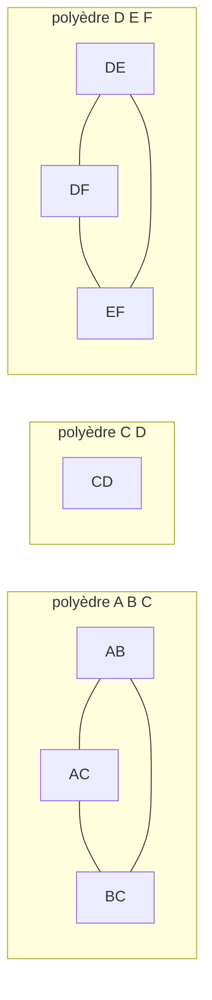
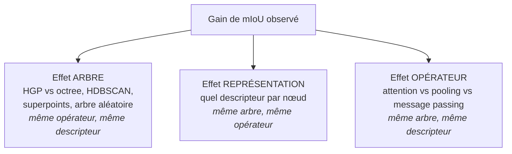
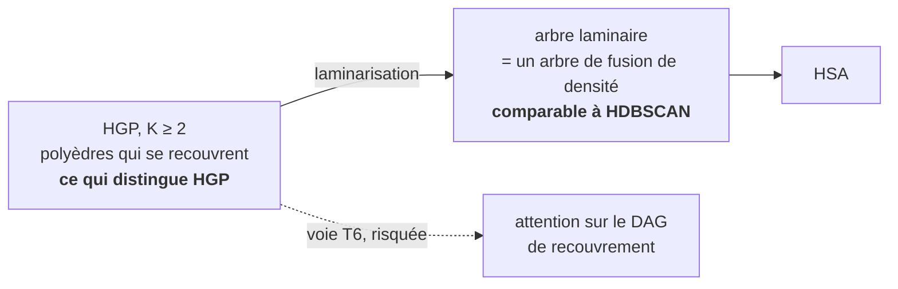

# Guide — comprendre ce projet de bout en bout

Ce document est le **parcours d'entrée** du dossier. Il ne remplace aucun contrat : il explique, dans l'ordre, ce qu'on cherche à faire, pourquoi ça pourrait marcher, pourquoi ça pourrait échouer, et ce qu'il faut mesurer avant de coder. Les documents normatifs sont plus précis et plus sévères ; ce guide sert à y entrer sans se perdre.

Chaque chapitre se lit seul et se termine par ce qu'il faut en retenir. Les termes techniques sont définis dans le [glossaire](GLOSSAIRE.md).

---

## Chapitre 0 — La question, en une phrase

> Une hiérarchie de clusters construite sur la densité — et non sur l'apprentissage — peut-elle donner à un réseau un meilleur contexte multi-échelle pour segmenter sémantiquement un scan LiDAR ?

Trois objets se combinent :

1. **HGP-Clusterer**, l'algorithme de la thèse, qui produit une hiérarchie de clusters à partir de la densité locale, avec une garantie mathématique exacte ;
2. **un descripteur** qui résume chaque nœud de cette hiérarchie en un vecteur de taille fixe ;
3. **un opérateur d'attention hiérarchique**, qui fait circuler l'information entre les nœuds.

Et une cible : le mIoU sur SemanticKITTI.

**À retenir.** Ce dossier n'est pas un rapport de résultats. Au moment où ces lignes sont écrites, **aucune expérience apprise n'a été réalisée**. Tout ce qui suit est de la conception et de la falsification.

---

## Chapitre 1 — Le problème, et où se trouve la marge

SemanticKITTI demande, pour chaque point d'un scan LiDAR, une classe parmi 19. La métrique officielle est le **mIoU** : on calcule l'intersection sur union pour chaque classe, puis on fait la **moyenne non pondérée sur les 19 classes**.

Ce détail décide de tout. Chaque classe pèse $1/19$, qu'elle contienne un million de points ou trois mille. Ordres de grandeur pour un modèle fort sur le test, à réauditer avant toute citation :

| Groupe de classes | IoU typique | Marge restante |
|---|---|---|
| `car`, `road`, `building`, `vegetation` | 87–96 | quasi nulle |
| `sidewalk`, `terrain`, `parking`, `trunk`, `fence`, `pole` | 60–85 | modérée |
| `bicycle`, `motorcycle`, `motorcyclist`, `other-vehicle`, `traffic-sign` | 25–60 | **toute la marge** |

Les classes `person` et `bicyclist` varient fortement entre validation et test, ce qui les rend peu fiables comme repère.

Autrement dit : **le mIoU se gagne sur des objets petits, fins et rares.** Un poteau ou un panneau, c'est quelques dizaines de points ; un deux-roues lointain, moins encore.

Gardez ce tableau en tête : il réapparaîtra à chaque chapitre, et c'est lui qui condamne ou sauve la plupart des idées séduisantes.

**À retenir.** Toute proposition doit être évaluée en se demandant : *est-ce que ça aide sur un objet de 30 points ?* Si la réponse est non, l'effet sur le mIoU sera faible même si l'idée est bonne.

---

## Chapitre 2 — HGP en dix minutes

### 2.1 D'où ça vient : le Single-Linkage et son défaut

Le **Single-Linkage** relie deux points dès qu'ils sont à distance $\leq 2r$, et fait croître $r$. Les clusters sont les composantes connexes du graphe obtenu. C'est simple, c'est optimal à plusieurs égards — et ça a un défaut fatal en dimension $\geq 2$ : **l'effet de chaînage**. Une seule chaîne de points de bruit suffit à souder deux amas distincts, bien avant que chacun soit complet.

### 2.2 La réponse habituelle, et pourquoi elle est bancale

DBSCAN, HDBSCAN et le Robust Single-Linkage ajoutent une notion de **densité locale** fondée sur les $K$ plus proches voisins : un point ne compte que s'il a $K$ voisins assez proches.

La critique centrale de la thèse tient en une phrase : **ces algorithmes imposent une condition d'ordre $K$ aux points, mais propagent la connexité à l'ordre 1**, c'est-à-dire par arêtes, deux points à la fois. Il y a une incohérence entre la condition et la propagation.

### 2.3 L'idée de HGP : faire percoler des simplexes, pas des points

HGP remplace le graphe géométrique par le **complexe de Čech**. Pour un ordre $K$ fixé :

- les objets élémentaires ne sont plus les points, mais les **$(K-1)$-simplexes** — des groupes de $K$ points dont les boules de rayon $r$ ont une intersection commune non vide ;
- deux simplexes sont **adjacents** quand leur réunion est encore un simplexe du complexe ;
- un **$K$-polyèdre** est l'ensemble des points apparaissant dans une composante connexe de ce graphe de simplexes.

Pour $K=1$, on retrouve exactement le Single-Linkage.

### 2.4 L'exemple à six points, tiré du manuscrit

Six points $A,B,C,D,E,F$. À un certain rayon, le complexe de Čech contient les triangles $ABC$ et $DEF$, plus l'arête isolée $CD$. Le graphe $\Gamma_2$ a pour **sommets les arêtes** et pour **arêtes les triangles** :

Trois composantes, donc trois $2$-polyèdres : $\lbrace A,B,C\rbrace$, $\lbrace C,D\rbrace$, $\lbrace D,E,F\rbrace$.

**Regardez $C$ et $D$ : ils appartiennent chacun à deux polyèdres.** Ce n'est pas un artefact. C'est le phénomène central de HGP :

> Pour $K\geq2$, les $K$-polyèdres **se recouvrent**. La sortie n'est pas une partition.

Ce point reviendra au chapitre 5, et il coûte cher.

### 2.5 Le théorème qui justifie tout

Ce que HGP achète, c'est une **correspondance exacte**. Notons $L_K(r)$ l'ensemble des positions $y$ de l'espace ayant au moins $K$ observations à distance $\leq r$ — c'est-à-dire l'ensemble de niveau supérieur de l'estimateur de densité aux $K$ plus proches voisins. Alors :

> Les $K$-polyèdres du complexe de Čech sont **exactement** les amas discrets de forte densité $K$-NN, à tout niveau de la filtration.

La mécanique de la preuve est simple et vaut la peine d'être comprise, parce que le vocabulaire qui en sort sert partout dans le dossier. À chaque simplexe $\sigma$ on associe sa **région témoin** $T_r(\sigma)=\bigcap_{x\in\sigma}\overline{B}(x,r)$ : l'ensemble des centres de boules de rayon $r$ qui attrapent tous les points de $\sigma$. C'est une intersection finie de boules, donc un convexe compact. Deux faits :

- $L_K(r)$ est **exactement** la réunion de toutes ces régions témoins ;
- $\Gamma_K$ est **exactement** leur graphe d'intersection, puisque $T_r(\sigma)\cap T_r(\tau)=T_r(\sigma\cup\tau)$.

Des convexes qui se recouvrent : les composantes de la réunion correspondent aux composantes du graphe d'intersection. D'où le théorème.

**À retenir.** HGP n'est pas « encore un algorithme de clustering ». C'est le seul dont la hiérarchie coïncide **niveau par niveau** avec un modèle statistique explicite (Hartigan avec estimateur $K$-NN). C'est son actif principal — et [le seul que personne d'autre ne possède](STRATEGIE_PUBLICATION.md).

---

## Chapitre 3 — Pourquoi une hiérarchie pourrait aider, et les trois effets à séparer

Un réseau de segmentation LiDAR voit essentiellement local : quelques mètres de contexte. Une hiérarchie de clusters offre gratuitement une structure multi-échelle exogène — « ce point est dans ce petit amas, qui est dans ce plus gros amas, qui est dans cette région ». L'espoir est que ce contexte aide là où le local échoue : objets lointains, classes rares, frontières ambiguës.

Mais si l'on mesure un gain, **trois causes différentes peuvent l'expliquer**, et il faut les séparer sous peine de ne rien pouvoir conclure :

Un gain global sans cette décomposition ne convaincra aucun relecteur, et surtout ne vous apprendra rien.

### Que prédit un nœud ?

Question naturelle, et la réponse évite un piège. **Un cluster ne reçoit jamais un label unique** : sa cible est le vecteur des **proportions** des 19 classes parmi ses points. Les feuilles prédisent une distribution $p_i$, et un nœud en déduit la moyenne pondérée par les masses de ses enfants — exactement, sans tête supplémentaire.

Le piège serait de croire que ces proportions suffisent. Elles ne **localisent** pas les classes à l'intérieur d'un cluster mixte : savoir qu'un nœud contient $70\,\%$ de route et $30\,\%$ de trottoir ne dit pas *où*. **La sortie officielle reste une prédiction par point** ; les proportions sont un état multi-échelle cohérent et une cible auxiliaire, jamais un label diffusé uniformément.

### Le squelette du modèle

1. un encodeur local point/voxel calcule des features haute résolution ;
2. une passe ascendante construit les descripteurs et les états de chaque nœud ;
3. un ou deux blocs hiérarchiques propagent le contexte entre nœuds ;
4. une passe descendante ramène ce contexte aux feuilles ;
5. un décodeur combine ce contexte avec un raccourci local, qui protège les frontières ;
6. une tête produit 19 logits par point, dans l'ordre exact du fichier d'entrée.

La règle qui compte : **l'objectif d'entraînement doit être exactement celui de la baseline reproduite** dans toutes les variantes comparées. Une loss auxiliaire sur les proportions ne s'ouvre qu'après l'ablation de la structure, sinon on confond gain architectural et recette d'entraînement.

**À retenir.** Trois expériences, pas une. Et l'ordre dans lequel on les fait n'est pas neutre : voir [ORDRE_DES_PREUVES.md](ORDRE_DES_PREUVES.md).

---

## Chapitre 4 — Décrire un nœud

C'est le chapitre le plus technique, et celui où les intuitions trompent le plus. Le détail complet est dans [DESCRIPTEURS_DE_NOEUD.md](DESCRIPTEURS_DE_NOEUD.md) ; voici la carte.

### 4.1 Une seule construction, trois lectures

Presque tous les descripteurs directionnels envisageables reposent sur **la même** opération : prendre une direction $u$, projeter les points dessus, regarder le sous-niveau $\left\langle u,x\right\rangle\leq t$.

Attention à la géométrie, c'est une source de confusion fréquente : $u$ est un **vecteur unitaire**, pas un plan. Mais les fibres de $x\mapsto\left\langle u,x\right\rangle$ **sont** les plans orthogonaux à $u$. Donc $u$ désigne une **famille de plans parallèles**, et le couple $(u,t)$ désigne **un** plan. Vérification : $(u,t)\in S^2\times\mathbb{R}$, soit 3 paramètres, exactement la dimension de l'espace des plans orientés de $\mathbb{R}^3$.

Ce qui change d'un descripteur à l'autre, c'est **ce qu'on résume** de ce balayage par plans :

| Lecture | Descripteur | Agrégation | Ce qu'il voit | Dimension |
|---|---|---|---|---|
| l'**extremum** | fonction support $h$ | $\max$ | l'enveloppe convexe, rien d'autre | $D$ |
| la **masse** | CDF projetée $F$ | $+$ | la distribution des points | $D\times B$ |
| la **topologie** | ECT / WECT | $\chi$ | trous et composantes | $D\times B$ |

### 4.2 La fonction support n'est pas un choix, elle est forcée

Résultat démontré dans [DESCRIPTEURS_DE_NOEUD.md](DESCRIPTEURS_DE_NOEUD.md) : si l'on exige d'un canal qu'il soit à la fois

- **exactement agrégeable** le long de l'arbre de fusion,
- **exactement recentrable** en forme close,
- et continu,

alors c'est **nécessairement** une reparamétrisation croissante d'une valeur de la fonction support. Il n'y a pas d'alternative.

La forme utile de ce résultat est sa **forme négative** :

> $D(A;c)=D\left(\mathrm{conv}(A);c\right)$ : un tel canal ne voit **rien** de $A$ hormis un hyperplan d'appui de son enveloppe convexe.

Donc tout descripteur réellement sensible à la non-convexité doit **renoncer** à l'une des trois propriétés. C'est un arbitrage, pas un problème d'ingénierie.

Attention à ne pas survendre ce lemme : il **justifie** un choix d'architecture, il ne **contribue** pas. La fonction support échantillonnée est littéralement un PointNet à première couche linéaire, et l'agrégation par $\max$ sur les enfants d'un arbre de partition est déjà publiée (Superpoint Transformer, ICCV 2023).

### 4.3 Les canaux radiaux, et le choix du centre

L'idée naturelle pour voir la non-convexité : pour chaque direction, la **dernière sortie** $\rho_{\mathrm{out}}$ et la **première entrée** $\rho_{\mathrm{in}}$ du carrier le long du rayon.

Ce qui les distingue de la fonction support n'est **pas** la continuité — le rayon extérieur non binné est parfaitement continu — mais le **recentrage**. Raison géométrique, et elle est jolie :

- support et CDF balaient par des **plans parallèles**. Translater l'ensemble décale la cote du plan de $\left\langle u,\delta\right\rangle$ : **le même décalage pour tous les points**, un simple scalaire ;
- les canaux radiaux balaient par des **rayons issus d'un centre**. Translater déforme la géométrie des rayons de façon non uniforme : un point proche change beaucoup d'angle, un point lointain presque pas.

D'où la recommandation, qui change la proposition en profondeur : **prendre l'origine capteur comme centre unique**, et non le barycentre du nœud.

Autour du barycentre, $\rho_{\mathrm{in}}$ est soit vacu (identiquement nul si le centre est dans le carrier), soit instable. Autour du capteur :

- les canaux se fusionnent **exactement** en une seule passe ascendante ;
- $\rho_{\mathrm{in}}$ devient la **surface visible**, $\rho_{\mathrm{out}}-\rho_{\mathrm{in}}$ l'**épaisseur en profondeur** — ce qui sépare un mur d'un buisson ;
- un scan mono-retour donne **au plus un point par faisceau**, donc le nuage est déjà exactement étoilé autour du capteur.

Cette dernière remarque est à double tranchant, et il faut la dire : à résolution angulaire fine, ces canaux **sont** une image de portée, c'est-à-dire les données brutes ré-encodées en polaire. Le canal radial est donc soit une compression incontrôlée (barycentre), soit un ré-encodage sans perte (capteur). Il n'y a pas de régime intermédiaire miraculeux.

### 4.4 Le canal qui manque : la masse

$h$, $\rho_{\mathrm{in}}$ et $\rho_{\mathrm{out}}$ sont **tous les trois des extrema**. Or un max-pooling ne peut pas approcher une moyenne — c'est la séparation classique PointNet / DeepSets. Ils ne voient donc :

- ni le nombre de retours,
- ni leur répartition,
- ni la densité — qui est pourtant le signal LiDAR le plus fort.

Deux objets aux mêmes enveloppes et aux intérieurs totalement différents sont indiscernables : le cube plein et sa frontière, la haie et la clôture, deux voitures accolées et une camionnette.

Le remède est le **canal de masse** : la CDF projetée. Elle est additive, donc **exactement fusionnable** elle aussi, et strictement plus expressive. Par Cramér–Wold, la collection de toutes les projections détermine la mesure.

Deux économies pratiques :

- pour la CDF, $u$ et $-u$ sont **redondants** ($F(-u,t)=1-F(u,(-t)^-)$), donc une demi-sphère suffit — deux fois moins de directions que pour le support, où les antipodes ne le sont pas ;
- la fonction support est **le bord du domaine de la CDF** : on ne paie le facteur $B$ que pour ce qu'il y a avant ce bord.

### 4.5 Faut-il calculer sur les points ou sur le polyèdre reconstruit ?

| Canal | Points ou carrier ? |
|---|---|
| support $h$ | **aucune différence** : $h_{C_v^{F}}=h_{V_v}$ est une identité exacte |
| support de $W_v(a)$ | **vraie différence**, la seule reconstruction qui paye |
| CDF / masse | **vrai choix**, et c'est exactement le débat de la portée |
| radial depuis le capteur | **points** ; le carrier n'ajoute que de l'interpolation entre faisceaux |

La seule reconstruction qui apporte une grandeur nouvelle est l'union témoin $W_v(a)$, via l'écart

$\Delta_v(u)=h_{V_v}(u)-h_{W_v(a)}(u)\geq0$

qui mesure **de combien il faut rentrer, dans la direction $u$, avant que la condition d'ordre $K$ soit satisfaite** : une densité de bord directionnelle, propre à HGP. Elle se calcule sans énumérer les facettes, par dichotomie sur la cote du plan avec un test $K$-NN. Mais elle dépend du niveau, donc **elle ne se compose pas** le long de l'arbre : c'est un recalcul par nœud.

**À retenir.** Trois canaux gratuits et exactement composables en une passe (support, CDF, radial capteur), et **un seul** canal qui justifie de reconstruire quoi que ce soit ($\Delta_v$), au prix de la composabilité.

---

## Chapitre 5 — Faire circuler l'information : HSA et ses goulots

L'opérateur envisagé est **HSA** (Hierarchical Self-Attention, NeurIPS 2025) : une attention dont les scores sont contraints à être constants par blocs entre sous-arbres frères, dérivée comme la projection KL-optimale de l'attention plate sous cette contrainte.

Il faut comprendre trois choses avant de s'engager.

**1. Mécaniquement, HSA est une attention sur des moyennes.** Sous LayerNorm, l'énergie d'interaction ne dépend que des moyennes pondérées par la taille des requêtes et des clés de chaque sous-arbre. C'est cette réduction qui produit tout le gain de complexité. Sa nouveauté est la **dérivation**, pas le calcul — et il est donc *a priori* très proche du contrôle « bottom-up/top-down `mean` + MLP » déjà prévu dans la matrice d'ablation.

**2. Votre descripteur y entre par un scalaire.** Dans HSA fidèle, la géométrie n'intervient que par $\varepsilon(A')^{\top}\varepsilon(B')$ : **un seul nombre de biais par couple de frères**. Raffiner le descripteur sans changer ce goulot ne peut rien produire. Le faire entrer dans la voie des valeurs sort du théorème et doit être annoncé comme variante.

**3. La profondeur est un problème de calcul.** L'algorithme demande $D$ produits matrice creuse–vecteur **séquentiels**, où $D$ est la profondeur de la hiérarchie. Un arbre de fusion issu d'une filtration est typiquement très déséquilibré, avec de longues chaînes de fusions ponctuelles. La **condensation** de l'arbre n'est donc pas une optimisation optionnelle : c'est une condition d'existence sur GPU — et elle modifie l'objet, donc elle doit être versionnée et ablatée.

### La tension centrale : la laminarisation efface HGP

C'est le point le plus important du chapitre, et il conditionne tout choix d'opérateur.

HSA exige un arbre **strictement laminaire** : son lemme de sous-structure optimale est énoncé sur une *partition*, avec des ensembles de feuilles disjoints. Or on a vu au chapitre 2 que pour $K\geq2$ les $K$-polyèdres **se recouvrent**.

Laminariser **supprime exactement la propriété qui distingue HGP de la concurrence**. Et à $K=1$, HGP *est* le Single-Linkage. Deux issues, à choisir explicitement :

1. assumer la laminarisation, et faire porter la contribution ailleurs (théorie, correction capteur, descripteur) ;
2. traiter le recouvrement comme l'objet, et construire l'attention sur le **DAG de recouvrement** — c'est [T6](THEOREMES.md), plus distinctif et plus risqué.

Si un budget de nouveauté doit aller à un opérateur, il doit aller à la seconde.

**À retenir.** HSA est une baseline nécessaire, pas une contribution. Et il impose une laminarisation qui coûte précisément ce qu'on voulait vendre.

---

## Chapitre 6 — Les six façons dont ce projet peut mourir

Classées par ce que je crois être leur probabilité décroissante. Chacune renvoie au risque numéroté correspondant.

### 6.1 Le goulot n'est pas la partition

C'est le fait le plus dérangeant, et il est publié. Dans la littérature superpoint, **l'oracle de partition est déjà très loin devant les modèles** :

| Travail | Modèle | Oracle de sa propre partition | Écart |
|---|---|---|---|
| SPG, CVPR 2018 | 62,1 mIoU | 88,2 mIoU | 26,1 |
| SPT, ICCV 2023 | 68,9 mIoU (Area 5) | $\gtrsim 89$ | « more than 20 points » |
| SuperCluster, 3DV 2024 | — | 93,4 PQ | « very little precision is lost » |

Environ **vingt points d'oracle sont déjà non convertis**. Améliorer le plafond d'une partition qui n'est pas saturée ne peut pas payer.

Conséquence méthodologique majeure : un diagnostic d'oracle est une **porte de réfutation, pas de promotion**. Le perdre tue le programme ; le gagner ne prouve presque rien.

### 6.2 HGP sous-segmente les objets fins

Objection la plus spécifique, et elle vient du manuscrit lui-même. Sur le jeu `birch2` :

| Algorithme | ARI | Points classés |
|---|---|---|
| HDBSCAN, $k=100$ | 0,996 | 99,7 % |
| HGP-Clusterer, $k=84$ | 0,441 | 83,9 % |

Cause citée : « les clusters sont essentiellement filiformes et sont donc mieux identifiés avec de simples graphes ».

Le mécanisme est structurel. La connexité d'ordre $K$ exige $K$ points **simultanément** proches. Le long d'une structure fine échantillonnée de façon éparse, cette condition n'est satisfaite qu'à un rayon nettement plus grand — l'objet fin **naît tard** dans la filtration, et à ce niveau ses voisines l'ont déjà rejoint. Résultat : sous-segmentation.

Or, chapitre 1 : la marge de mIoU est sur `pole`, `traffic-sign`, `bicycle`, `person`, `bicyclist`. **HGP achète sa résistance au chaînage en pénalisant exactement les classes qui décident de la métrique.**

### 6.3 La densité encode le capteur, pas la sémantique

Le modèle de Hartigan suppose un échantillon d'une densité $f$ sur $\mathbb{R}^3$. Un scan LiDAR est un échantillonnage de **surfaces** à densité angulaire fixée : la densité locale y est d'abord fonction de la portée, de l'angle d'incidence et de l'occultation. L'hypothèse statistique qui fonde HGP n'est pas satisfaite telle quelle.

Signal contraire à consigner honnêtement : dans l'ablation d'ALPINE, un seuil proportionnel à la portée **dégrade** le clustering ($75{,}9$ contre $76{,}3$ PQ) malgré l'optimisation de son coefficient. La correction range-aware doit donc être mesurée, pas supposée.

### 6.4 Le descripteur est le levier le plus faible

Ablations publiées sur exactement cette famille d'architectures :

| Ce qu'on retire | S3DIS 6-fold | KITTI-360 | DALES |
|---|---|---|---|
| toutes les features de nœud | $-0{,}7$ | $-4{,}1$ | $-1{,}4$ |
| l'encodage d'adjacence | $-6{,}3$ | $-5{,}4$ | $-3{,}0$ |
| un seul niveau de partition | $-8{,}4$ | $-5{,}1$ | $-0{,}9$ |

Et EZ-SP : remplacer les features handcrafted par un réseau appris change le résultat de $\pm0{,}1$.

Le descripteur — donc tout le chapitre 4 — vaut quelques points au mieux. L'adjacence et la profondeur dominent.

### 6.5 Le terrain est celui que la famille a concédé

**Aucune méthode de la lignée superpoint ne publie SemanticKITTI mono-scan** : ni SPG, ni SSP, ni SPNet, ni SPT, ni SuperCluster, ni EZ-SP. Toutes rapportent S3DIS, ScanNet, DALES ou KITTI-360 *accumulé*.

Lecture à double tranchant : créneau libre, mais très probablement parce qu'un scan unique offre trop peu de points par région pour qu'une partition soit informative.

### 6.6 Le coût

La voie exacte — Čech, mosaïque de Delaunay d'ordre $K$, graphe de Gabriel — est chère, et le manuscrit ne donne aucune borne de complexité pour la mosaïque d'ordre $K$ en dimension 3.

Mais il fournit lui-même la sortie : le complexe de **Vietoris–Rips**, avec l'encadrement $\check{C}(X,r)\subseteq\mathrm{VR}(X,r)\subseteq\check{C}(X,\alpha_p r)$ et $\alpha_p=\sqrt{2p/(p+1)}$, soit $\alpha_3\approx1{,}22$ seulement en dimension 3. Cette voie se réduit à quatre opérations de graphe massivement parallélisables, et pour $K=2$ à une énumération de triangles.

**Le prix n'est donc pas le temps, c'est l'exactitude** : sous Vietoris–Rips, le théorème du chapitre 2 ne tient plus qu'à $22\,\%$ près sur le rayon. C'est un arbitrage à décider, pas à subir.

**À retenir.** Les deux risques les plus dangereux (6.1 et 6.2) n'étaient dans aucune version antérieure du dossier, et **aucun des deux ne concerne le descripteur ni l'opérateur**.

---

## Chapitre 7 — Que mesurer d'abord

Le dossier contient une spécification plus complète que la plupart des sections méthodes publiées, et **aucune mesure**. Le rendement marginal d'une ligne de spécification supplémentaire est donc proche de zéro.

Trois diagnostics, aucun ne demande d'entraînement. Détail dans [ORDRE_DES_PREUVES.md](ORDRE_DES_PREUVES.md).

### M1 — L'arbre est-il aligné sur la sémantique ?

Construire la forêt HGP sur la séquence 08, choisir une antichaîne, étiqueter chaque nœud par sa classe majoritaire, rapporter le mIoU. Comparer à HDBSCAN, octree, superpoints et arbre aléatoire à compression égale.

**Piège à éviter** : le mIoU n'est pas additif sur les régions, donc « la meilleure antichaîne au sens du mIoU » n'est pas un problème d'optimisation bien posé. La version correcte minimise l'**impureté totale** $\sum_v n_v H(\pi_v)$, critère additif qui admet une programmation dynamique exacte sur l'arbre, puis rapporte le mIoU obtenu comme descripteur et non comme optimum.

Et se rappeler 6.1 : porte de réfutation seulement.

### M2 — Les niveaux survivent-ils à la portée ?

Transporter des objets à plusieurs portées, rééchantillonner selon un modèle capteur déclaré, mesurer la dérive des niveaux de naissance/mort et de l'ancêtre commun. Tester en même temps la correction par normalisation de la densité d'échantillonnage attendue.

### M3 — Le raccourci qui donne un nombre publiable le plus vite

Le clusterer d'ALPINE est **littéralement du Single-Linkage** : graphe $k$-NN en BEV par classe, coupe des arêtes au-delà d'un seuil tiré de dimensions d'objets, composantes connexes, plus un découpage de boîtes. C'est **HGP à $K=1$** avec un rayon par classe. Et son mode d'échec déclaré est le **chaînage** — la motivation centrale de toute la thèse.

D'où une expérience à une seule variable : reprendre le pipeline ALPINE tel quel, mêmes logits sémantiques gelés, mêmes seuils, même découpage, et **remplacer uniquement les composantes connexes par les $K$-polyèdres à $K=2,3$**.

Le cadre chiffré est connu, et il est à double tranchant :

| Fait | Valeur | Lecture |
|---|---|---|
| écart imputable au seul clusterer | $10{,}4$ PQ | le clusterer compte |
| HDBSCAN dans ce comparatif | $55{,}1$ PQ, bon dernier | HGP en est le correctif de principe |
| ALPINE | $65{,}5$ PQ à $14{,}4$ Hz, un cœur CPU | la barre, et la contrainte de temps |
| plafond de l'oracle d'instance | $+4{,}3$ PQ | la marge totale |
| pipeline HGP historique | $\sim1$ s/trame | un ordre de grandeur à combler |

Aucun entraînement, une baseline publiée, un plafond publié, et l'hypothèse exacte de la thèse.

**À retenir.** Si HGP ne bat pas du Single-Linkage sur la tâche que la thèse a conçue pour lui, il est peu probable qu'il apporte quoi que ce soit à la segmentation sémantique.

---

## Chapitre 8 — Quel papier, quelle venue

### La barre réelle

Deux régimes qu'il ne faut jamais mélanger :

| Régime | Meilleurs chiffres | Lecture |
|---|---|---|
| **val, mono-scan, LiDAR seul, sans TTA** — celui du dossier | PTv3 reproduit $66{,}2$ ; SphereFormer $67{,}8$ ; WaffleIron-256 $68{,}0$ | la cible réaliste est **$\approx68$** |
| **test, tout permis** | TASeg $76{,}5$ (16 trames passées), RAPiD-Seg $76{,}1$, LSK3DNet $75{,}6$ (TTA déclarée) | un autre régime |

Le $70{,}8$ val annoncé par PTv3 n'est pas reproductible. Viser $76$ en régime strict, c'est viser un nombre d'un autre régime. Ces chiffres sont des **instantanés à réauditer avant soumission**.

### Le classement honnête des actifs

| Actif | Force | Pourquoi |
|---|---|---|
| **HGP + percolation** | **fort** | personne d'autre ne l'a : correspondance exacte, fonction et vitesse de percolation, limite gaussienne $\mu=K+a\sqrt{K}$ — une théorie quantitative de la fraction récupérable avant fusion parasite |
| le descripteur | moyen | le théorème justifie mais ne contribue pas |
| HSA | **faible** | papier d'une autre équipe, aucune expérience 3D, réduction aux moyennes, aucun paramètre apprenable |

### La conclusion de venue

Un gain de mIoU SemanticKITTI, même net, est un papier **CVPR/ICCV/ECCV** — et il y sera jugé sur l'ingénierie du backbone autant que sur l'idée.

NeurIPS/ICML acceptent la perception 3D quand le cadrage est représentation, théorie ou passage à l'échelle (PTv2, Seal, SFCNet, Concerto, Utonia). La forme plausible est donc : **une théorie de ce qui est récupérable dans une hiérarchie de densité, sa version valable pour un échantillonnage capteur inhomogène, la mesure qui la vérifie, et l'opérateur qui l'exploite** — le gain de segmentation devenant une validation, pas la contribution.

Le point théorique le plus prometteur est l'extension de l'analyse de percolation à une **intensité inhomogène** modélisant la portée. C'est difficile en toute généralité ; une version locale par changement d'échelle, prédisant le déplacement du niveau critique en fonction de la portée et vérifiée empiriquement, suffirait — et répondrait à 6.3 dans le même geste.

---

## Chapitre 9 — Où en est-on

| Élément | État |
|---|---|
| Spécification | très complète |
| Mesures | **aucune** |
| Payload HGP marqué complet | non livré par v3, dépendance de recherche |
| Hiérarchie sur scan LiDAR | supposée disponible, coût non mesuré de bout en bout |
| Statut public | `not_claimed` |

Les mots « exact », « temps réel », « GPU-friendly » et « état de l'art » ne doivent apparaître comme **résultats** que soutenus par le protocole correspondant.

---

## Où aller ensuite

| Vous voulez… | Lisez |
|---|---|
| le détail des descripteurs, avec les démonstrations | [DESCRIPTEURS_DE_NOEUD.md](DESCRIPTEURS_DE_NOEUD.md) |
| savoir quoi faire lundi matin | [ORDRE_DES_PREUVES.md](ORDRE_DES_PREUVES.md) |
| la définition d'un terme | [GLOSSAIRE.md](GLOSSAIRE.md) |
| le modèle et ses contrats d'entrée | [ARCHITECTURE.md](ARCHITECTURE.md) |
| ce qu'un relecteur exigeant répondrait | [STRATEGIE_PUBLICATION.md](STRATEGIE_PUBLICATION.md) |
| les risques chiffrés et les règles d'arrêt | [RISQUES.md](RISQUES.md) |
| la concurrence | [CONCURRENCE.md](CONCURRENCE.md) |
