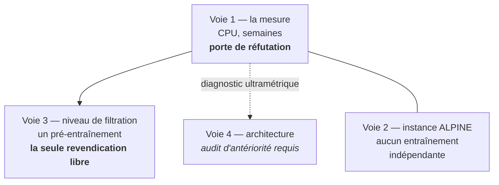

# Les voies, et pourquoi les autres sont fermées

Ce document remplace la discussion ouverte par une décision. Il liste **ce qui est fermé et par quel chiffre**, **ce qui reste libre**, et pour chaque voie survivante **une feuille de route**.

Règle de lecture : une voie est *fermée* quand un fait vérifié la rend non publiable ou non mesurable — pas quand elle est difficile.

---

## 0. La cible : état de l'art SemanticKITTI mono-scan

Le dossier vise l'état de l'art. Voici l'arithmétique qui dit à quelles conditions c'est atteignable, et par quelle voie.

### Le chiffre à battre

| | Valeur | Régime |
|---|---|---|
| baseline reproductible | $68{,}0$ WaffleIron, $70{,}3$ MinkUNet | val, une trame, LiDAR seul, sans TTA |
| **SOTA val** | **$73{,}5$ — DOS** | val, fine-tuning après pré-entraînement auto-supervisé |
| SOTA test, LiDAR seul | $76{,}1$ — RAPiD-Seg | test, recette non documentée |
| SOTA test, tous régimes | $76{,}5$ | TASeg (LiDAR + caméra + temps) et SimpleSeg (non attribuable) |

**L'écart à combler en val est de $+3{,}2$ à $+5{,}5$ points.**

### Pourquoi ce n'est pas exclu

Un raisonnement que le dossier a longtemps porté à tort : « l'auto-supervision ne paie qu'à peu d'étiquettes ». Sonata le suggère — $+0{,}3$ sur PPT supervisé. **DOS le réfute** : $73{,}5$ en fine-tuning contre $69{,}1$ pour PTv3 supervisé, soit **$+3$ à $+4$ points à supervision complète**, pour $2$ A100 pendant $20$ h.

Donc un pré-entraînement auto-supervisé bien conçu vaut, sur ce benchmark, **le même ordre de grandeur que l'écart à combler**. C'est la seule voie du dossier dont un précédent publié démontre qu'elle peut produire plusieurs points en supervision complète.

### Les conditions, et elles sont dures

1. **Battre DOS**, pas une baseline nue. DOS a trois composantes — distillation observable, softmaps sémantiques, prior de Zipf–Sinkhorn — là où la voie 3 en propose une. Se comparer au scratch serait malhonnête.
2. **Dépasser le plancher de bruit.** Variance de graine $1{,}5$ point. Un gain revendiqué doit être d'au moins $2$ points sur trois graines, avec augmentations appariées.
3. **La voie 1 doit passer d'abord.** Si l'arbre HGP ne sépare pas les classes sur un scan unique, la voie 3 n'a pas de matière.
4. **Le régime doit être déclaré ligne à ligne.** Le SOTA val de DOS est-il avec ou sans TTA ? Non vérifié à ce jour. À établir avant toute comparaison.
5. **Le test est une autre affaire.** Y viser $76{,}1$ demande la machinerie de soumission — entraînement train+val, décisions de TTA — et le classement officiel est aujourd'hui **non attribuable**. Viser le val en régime strict est la cible scientifique ; le test est un objectif séparé, à verrouiller après.

### Ce que cela ordonne

| Voie | Rapport à la cible SOTA |
|---|---|
| **Voie 3 — supervision par le niveau de filtration** | **la seule avec un chemin arithmétique vers le SOTA** |
| Voie 1 — la mesure | condition d'entrée de la voie 3 |
| Voie 2 — instance ALPINE | diagnostic rapide, **hors** de la cible SOTA sémantique |
| Voie 4 — ultramétrique | complément possible de la voie 3, antériorité non vérifiée |

**Estimation honnête.** SOTA val en régime strict : $10$ à $15\,\%$. SOTA test : nettement moins. Ce n'est pas une promesse, c'est un pari dont l'arithmétique tient.

---

## 0 bis. Le fil qui relie tout : le **niveau**

En reprenant l'ensemble, une régularité saute aux yeux et elle organise tout le reste.

| Ce qui est mort | Ce que ça utilisait |
|---|---|
| le descripteur de nœud | la **forme** d'un nœud |
| « notre partition est meilleure » | **une seule coupe** |
| HSA | la **topologie** de l'arbre |
| « hiérarchie comme structure d'auto-supervision » | la relation **parent–enfant** |

| Ce qui survit | Ce que ça utilise |
|---|---|
| voie 1, la mesure | les **niveaux** séparent-ils les classes |
| voie 3, la supervision | superviser **sur le niveau** |
| le prior de DINO | la masse **à un niveau** |
| voie 4, l'ultramétrique | le **niveau** de l'ancêtre commun |

Ce n'est pas un hasard. L'actif unique de la thèse est que **le niveau a un sens** : il *est* le niveau de densité $K$-NN, exactement. Chez HDBSCAN, un niveau est un rayon d'accessibilité mutuelle, qui dépend de l'échelle locale et ne transfère pas.

Et personne n'a jamais eu besoin qu'un niveau signifie quelque chose, **parce que personne n'utilise les niveaux** — ils utilisent des nombres de clusters. D'où la thèse du projet, en une ligne :

> **Faire du niveau l'objet. Alors l'exactitude compte.**

### L'expérience qui teste l'actif lui-même

Cela change la question centrale de la voie 1. « HGP est-il plus pur que HDBSCAN ? » ne teste pas l'actif. La bonne question est :

> **Le niveau $\lambda$ veut-il dire la même chose d'un scan à l'autre ?**

Pour HGP il le devrait — c'est une densité, une grandeur physique. Pour HDBSCAN il ne le devrait pas. **La transférabilité du niveau entre scans est la signature mesurable de la calibration.**

Protocole, sans aucun entraînement :

1. tracer pureté en fonction du niveau, scan par scan, pour HGP et pour HDBSCAN ;
2. mesurer la **dispersion entre scans** de ces courbes ;
3. vérifier si le niveau optimal d'un scan reste optimal sur un autre.

Si les courbes de HGP se superposent et pas celles de HDBSCAN, l'actif est démontré — sans GPU, sans réseau. Si elles ne se superposent pas davantage, l'exactitude ne sert à rien en aval et les voies 3 et 4 tombent ensemble.

C'est l'expérience la plus directe et la moins chère du programme, et son résultat est interprétable dans les deux sens.

---

## 1. Ce qui est fermé

| Voie | Le fait qui la ferme |
|---|---|
| **Battre l'état de l'art supervisé** | marge d'environ $1$ point ; variance de graine $1{,}5$ point ; la recette d'augmentation vaut $+3{,}5$ à $+4{,}3$. Un gain n'y est **ni mesurable ni attribuable** |
| **« Notre partition est meilleure »** | l'oracle de partition est déjà $\approx20$ points au-dessus des modèles (SPG $62{,}1$ contre $88{,}2$ ; SPT « more than 20 points below »). Relever un plafond non atteint ne paie pas |
| **Le descripteur de nœud comme contribution** | ablations publiées : retirer *toutes* les features de nœud coûte $-0{,}7$ à $-4{,}1$, contre $-3{,}0$ à $-6{,}3$ pour l'adjacence et jusqu'à $-8{,}4$ pour le nombre de niveaux. EZ-SP : les remplacer par un réseau appris change le résultat de $\pm0{,}1$ |
| **« Hiérarchie de clusters comme structure d'auto-supervision »** | **9/10 occupé** : HCSC (CVPR 2022, arbres de prototypes parent–enfant), MHCCL (AAAI 2023, séries temporelles), HASSL (juillet 2026, HDBSCAN + distillation, microscopie) |
| **« Arbre à niveaux indexés par un rayon, sur nuage 3D, comme tâche prétexte »** | **8/10 occupé** par Sharma & Kaul, **NeurIPS 2020** : cover-tree, « balls of varying radii at each level », « parent and child ball pairs that span consecutive levels », tâches « at multiple levels ». Peu cité, parfaitement citable |
| **HSA comme contribution** | aucune expérience 3D dans le papier ; aucun paramètre apprenable le long de la hiérarchie ; $D$ passes séquentielles en profondeur ; le descripteur n'y entre que par un scalaire par couple de frères |

Ces six lignes ne sont pas des opinions. Chacune tient à un chiffre ou à une citation vérifiée sur source primaire.

---

## 2. Ce qui reste libre

L'audit d'antériorité décompose la revendication. C'est cette décomposition qui compte, pas une note globale.

| Composante de la revendication | Occupé | Par qui |
|---|---|---|
| arbre hiérarchique, parent–enfant, perte multi-niveaux | **9/10** | HCSC, MHCCL, HASSL |
| arbre à rayons sur nuage 3D comme prétexte | **8/10** | Sharma & Kaul 2020 |
| hiérarchie de densité + distillation | **7/10** | HASSL |
| sur LiDAR extérieur | 3/10 | créneau étroit, surveillé |
| **arbre non condensé, distinction assumée** | **1/10** | le terme n'existe pas en ML |
| **niveaux d'une *filtration* comme axe de supervision** | **1/10** | **personne** |
| **choix des niveaux justifié théoriquement** | **1/10** | **personne** |
| niveaux exacts, certifiés | **0/10** | étranger à la culture SSL |

Le fait le plus utile de tout l'audit tient en une phrase :

> Chez **tous** les antécédents, l'axe de supervision est un **nombre de clusters** — PCL $25\,000$ ; HCSC $3000$–$2000$–$1000$ ; MHCCL des partitions successives ; TS2Vec un arbre de max-pooling. **Jamais un paramètre de filtration.**

D'où la seule revendication qui reste entière :

> **Superviser sur le niveau de filtration, pas sur un nombre de clusters.** HGP rend ce niveau signifiant — il *est* le niveau de densité $K$-NN — et la percolation dit lequel choisir.

**Réserve de méthode.** Le budget de recherche web était épuisé ; l'audit s'est fait via OpenAlex et l'interface arXiv, qui n'indexent que titre et résumé. Un « 0 résultat » signifie « personne ne le revendique dans son résumé », pas « personne ne le fait ». Contre-exemple avéré : TARL n'affiche pas HDBSCAN dans son résumé alors qu'il l'utilise.

---

## 3. Voie 1 — La mesure

**Ce que c'est.** L'oracle de partition d'une hiérarchie sur un scan LiDAR unique. **Il n'existe sur aucun benchmark LiDAR mono-scan** — la métrique existe depuis SPG 2018 mais uniquement sur S3DIS, ScanNet, KITTI-360 et DALES.

**Pourquoi elle a une chance.** Elle n'a besoin d'aucun GPU, elle produit un chiffre qui n'existe nulle part, elle est informative que le résultat soit bon ou mauvais, et **les trois autres voies en dépendent**.

### Feuille de route

| Étape | Contenu | Sortie |
|---|---|---|
| 1 | construire les hiérarchies sur la séquence 08 : HGP $K=1,2,3$, HDBSCAN, octree, voxels, partition superpoint, arbre aléatoire | forêts sérialisées |
| 2 | sélection d'antichaîne à budget de régions fixé, par **programmation dynamique exacte** minimisant l'impureté $\sum_v n_v H(\pi_v)$ | antichaînes |
| 3 | courbes **pureté** et **complétude** contre nombre de régions | la figure centrale |
| 4 | stratifier par **portée**, par **cardinal** et par **dimension intrinsèque** du nœud | où ça marche et où ça casse |
| 5 | courbe pureté-contre-niveau, confrontée à la prédiction de percolation | le pont théorie–mesure |
| 6 | rejouer avec **rééchelonnement en élévation** de la métrique | l'effet de l'anisotropie des anneaux |

**Trois diagnostics à ne pas oublier**, chacun peut invalider une voie aval :

- **pureté contre complétude, séparément.** La sémantique tolère la sur-segmentation ; l'instance non. Et le mode d'échec documenté de HGP — la naissance retardée des objets fins — est de la **sous-segmentation**, donc du mélange : le mauvais type d'erreur pour la sémantique.
- **décoder l'ultramétrique.** Régresser $d_{\text{ultra}}(i,j)$ contre la classe, l'écart de portée et l'écart d'anneau. Si elle prédit mieux l'anneau que la classe, la voie 4 est compromise.
- **l'anisotropie.** Un LiDAR échantillonne à $\sim4$–$7$ cm le long d'un anneau et $\sim14$ cm entre anneaux à $20$ m, avec un rapport qui croît avec la portée. Mesurer si l'optimum en $K$ décroît avec la portée, et si le rééchelonnement le déplace.

**Règle d'arrêt.** Si HGP ne domine aucun contrôle à compression égale, ou si la domination disparaît après stratification par portée, les voies 3 et 4 tombent. La voie 2 reste testable.

**Asymétrie à assumer.** C'est une porte de **réfutation**, pas de promotion : la perdre tue le programme, la gagner ne prouve presque rien.

---

## 4. Voie 2 — L'instance sans entraînement

**Ce que c'est.** Reprendre le pipeline ALPINE tel quel — mêmes logits sémantiques gelés, mêmes seuils par classe, même découpage de boîtes — et **remplacer uniquement les composantes connexes par les $K$-polyèdres**.

**Pourquoi elle a une chance.** Une seule variable change. La baseline et le plafond sont publiés. Aucun entraînement. Et le mode d'échec déclaré d'ALPINE est le **chaînage** — la motivation centrale de la thèse. Le clusterer d'ALPINE *est* HGP à $K=1$ avec un rayon par classe.

### Feuille de route

| Étape | Contenu |
|---|---|
| 1 | reproduire ALPINE à l'identique et retrouver son chiffre |
| 2 | substituer le clusterer, $K=2$ puis $K=3$ |
| 3 | rapporter PQ, PQ$_{\text{Th}}$, ventilation par portée, et **le temps** |
| 4 | ablater le rééchelonnement en élévation |

**Le cadre chiffré, à double tranchant :**

| Fait | Valeur |
|---|---|
| écart imputable au seul clusterer | $10{,}4$ PQ |
| HDBSCAN dans ce comparatif | $55{,}1$, bon dernier — et HGP en est le correctif de principe |
| ALPINE | $65{,}5$ PQ à $14{,}4$ Hz sur **un cœur CPU** |
| plafond de l'oracle d'instance | $+4{,}3$ PQ |
| pipeline HGP historique | $\sim1$ s par trame |

**Règle d'arrêt.** Si HGP ne bat pas du single-linkage sur la tâche que la thèse a conçue pour lui, il est peu probable qu'il apporte quelque chose ailleurs.

**Limite à assumer.** Le plafond est de $+4{,}3$ PQ et il y a un ordre de grandeur de vitesse à combler. C'est un excellent **diagnostic** ; seul, ce n'est pas une contribution suffisante — la littérature considère « du clustering pour l'instance » comme acquis.

---

## 5. Voie 3 — Superviser sur le niveau de filtration

**Ce que c'est.** La seule revendication restée entière. Tous les travaux d'auto-supervision hiérarchique indexent leur hiérarchie par un **nombre de clusters** choisi à la main. Ici l'axe de supervision est le **niveau de filtration** $\lambda$, qui est une grandeur physique — le niveau de densité $K$-NN — et non un hyperparamètre.

**Pourquoi elle a une chance.** C'est $1/10$ occupé sur trois composantes indépendantes : l'axe de filtration, la justification théorique du choix des niveaux, et l'exactitude. Et l'écart avec HASSL est de nature, pas de degré : **son arbre porte sur les embeddings latents d'un batch de 128, recalculé à chaque pas, sans persistance ; ici l'arbre porte sur la géométrie de la donnée et il est fixé avant tout apprentissage.**

### Feuille de route

| Étape | Contenu | Dépend de |
|---|---|---|
| 1 | voie 1 réussie | — |
| 2 | hiérarchie précalculée hors gradient, transportée avec les points | voie 1 |
| 3 | pré-entraînement à petite échelle, cible = représentations de nœuds aux niveaux **prédits par la percolation** | 2 |
| 4 | évaluation en **linear probing** et à peu d'étiquettes ($0{,}1$ %, $1$ %, $10$ %) | 3 |
| 5 | l'ablation qui décide : niveaux prédits contre niveaux équirépartis contre nombres de clusters à la HCSC | 4 |

**Contre qui se mesurer.** À budget apparié, contre SegContrast, TARL et BEVContrast — **pas** contre Utonia ni Concerto, qui disposent de $64$ H20. Les baselines chiffrées sur SemanticKITTI, par fraction d'étiquettes : scratch $46{,}2$ à $1$ % et $30{,}0$ à $0{,}1$ % ; TARL $52{,}5$ et $37{,}9$ ; BEVContrast $53{,}8$ et $39{,}7$.

**Pourquoi ce régime.** En supervision complète la marge est d'un point sous un bruit de $1{,}5$. En probing, l'écart au supervisé est de $10{,}3$ points ($62{,}0$ contre $72{,}3$).

**Deux avertissements.**

- **HASSL affaiblit son propre argument** : dans sa table d'ablation, la composante hiérarchique ne vaut que $+0{,}3$ à $+0{,}6$ point ; l'essentiel du gain vient de son enseignant de segmentation. C'est une antériorité pour l'idée, **pas une preuve que le mécanisme marche**.
- Il faut **démontrer** que l'exactitude change une métrique aval. Dans cette littérature personne ne l'exige : HDBSCAN heuristique suffit et coûte moins cher.

**L'ablation qui décide de tout**, à architecture et budget identiques :

| Bras | Ce qu'il teste |
|---|---|
| HGP exact | la proposition |
| **HDBSCAN, arbre condensé conservé** | **sépare l'exactitude de la hiérarchie** |
| HDBSCAN aplati | le protocole TARL |
| arbre aléatoire | le contrôle |

Si le deuxième bras égale le premier, il ne reste que « utiliser une hiérarchie » — $9/10$ occupé.

---

## 6. Voie 4 — L'architecture, statut non vérifié

**Ce que ce serait.** Un arbre de fusion définit exactement une **ultramétrique** sur les points — c'est l'équivalence dendrogramme/ultramétrique du chapitre 3 de la thèse. L'injecter comme biais relatif dans l'attention change ce que « proche » veut dire : de la distance euclidienne à la **connexité par densité**. Ce qui corrigerait le défaut structurel de l'attention locale sur LiDAR, qui mélange des surfaces proches et déconnectées.

**Pourquoi elle n'est pas dans la liste des voies retenues.** Je n'ai **pas** vérifié son antériorité. La famille « distance structurelle comme biais d'attention » existe — Graphormer utilise les plus courts chemins, les transformers syntaxiques la distance dans l'arbre. L'audit conduit a porté sur l'auto-supervision, pas sur ce point.

**Ce qu'il faut faire avant de l'ouvrir :** un audit d'antériorité ciblé sur « structural / tree / ultrametric distance as attention bias », et le diagnostic de décodage de l'ultramétrique de la voie 1. Si l'ultramétrique prédit mieux l'anneau que la classe, la voie est morte avant d'être ouverte.

---

## 7. Séquencement

Les voies 1 et 2 sont **indépendantes** et peuvent démarrer ensemble : l'une ne demande pas de GPU, l'autre pas d'entraînement.

**Le facteur temps.** PointINS est de mars 2026, HASSL de juillet. Le domaine entre dans cet espace maintenant. Un programme qui met douze mois à produire son premier chiffre risque d'être doublé — ce qui plaide pour publier la mesure tôt, même en atelier, pour planter le drapeau.

## 8. Ce qui sort du chemin critique

À dire explicitement, sinon cela consomme le temps des voies 1 et 2 : l'objet HGP marqué complet, les quatre carriers, l'autorité d'export, le programme T0–T6, QC-HSA et le descripteur de nœud **ne sont sur aucune des voies retenues**. Ce travail n'est pas perdu — il servira si le programme survit — mais il est hors périmètre du premier papier.

---

## Annexes — les analyses qui établissent ce qui précède

Ces trois analyses ne sont pas des voies. Ce sont les raisonnements qui ferment ou ouvrent celles ci-dessus, conservés ici pour qu'on puisse les contester.

### A. Le coût n'est pas le blocage, l'exactitude l'est

Sur le **coût**, le manuscrit fournit lui-même la sortie, et il faut la prendre au sérieux avant de conclure à un blocage. La voie exacte — Čech, mosaïque de Delaunay d'ordre $K$, $K$-graphe de Gabriel — coûte cher : la triangulation de Delaunay ordinaire est déjà en $\mathcal{O}\left(n^{\lceil p/2\rceil}\right)$ au pire dans $\mathbb{R}^{p}$. Mais le § 9.3 propose le complexe de Vietoris–Rips avec l'encadrement $\check{C}(X,r)\subseteq\mathrm{VR}(X,r)\subseteq\check{C}\left(X,\alpha_p r\right)$ et $\alpha_p=\sqrt{2p/(p+1)}$, soit $\alpha_3\approx1{,}22$ seulement en dimension $3$ — un encadrement serré. Cette voie se réduit à quatre opérations de graphe massivement parallélisables, et pour $K=2$ l'énumération des cliques est une simple énumération de triangles par intersection de listes d'adjacence triées, dont le coût suit le nombre réel de triangles et non $\binom{n}{K+1}$. Sur un graphe $k$-NN de scan LiDAR, c'est une charge GPU ordinaire.

Le prix n'est donc pas le temps, c'est **l'exactitude** : sous Vietoris–Rips, le Théorème 2 — correspondance exacte entre $K$-polyèdres et amas discrets de forte densité $K$-NN — ne tient plus qu'à un facteur $\alpha_3$ près sur le rayon. Le papier ne pourra plus dire « exact », seulement « interpolé entre deux niveaux distants de $22\,\%$ ». C'est un arbitrage à décider explicitement, pas à subir.

L'objection sérieuse est ailleurs, et elle est écrite dans le manuscrit lui-même. Sur le jeu `birch2`, HDBSCAN est presque parfait tandis que HGP-Clusterer fusionne indûment : « les clusters sont essentiellement filiformes et sont donc mieux identifiés avec de simples graphes ». Le mécanisme est structurel, pas anecdotique. La connexité d'ordre $K$ exige que $K$ points soient **simultanément** proches. Le long d'une structure filiforme ou d'une surface mince échantillonnée de façon éparse, cette condition n'est satisfaite qu'à un rayon nettement plus grand que celui qui suffirait à une connexité par arêtes. La structure mince naît donc tard dans la filtration — et à ce niveau tardif, ses voisines l'ont déjà rejointe. Le résultat observable est bien celui du manuscrit : sous-segmentation des objets fins, pas fragmentation. HGP achète sa résistance au chaînage en retardant la naissance des objets minces.

Or les classes qui portent la marge de progression du mIoU SemanticKITTI sont exactement celles-là : `pole`, `traffic-sign`, `bicycle`, `person`, `bicyclist`, `motorcyclist`, `fence`. Les classes épaisses et bien remplies — `road`, `building`, `vegetation`, `terrain` — plafonnent déjà au-delà de $90$ d'IoU.

**C'est l'objection la plus spécifique et la plus dangereuse du dossier**, et elle n'apparaît dans aucun des risques R1–R11 : il existe une tension structurelle entre l'avantage revendiqué de HGP et le profil des classes qui décident de la métrique visée. Elle doit devenir un risque numéroté à part entière, avec son propre test — mIoU-oracle stratifié par dimension intrinsèque estimée du nœud, ou au minimum par classe fine contre classe volumique — et sa propre atténuation. Le manuscrit en suggère une : sur `birch2`, changer d'estimateur, $\hat\rho=1/r^{2}$, résout le problème. Une atténuation testable ne dispense pas de mesurer d'abord l'ampleur du problème.

### B. La laminarité n'est pas le problème que je croyais

Cette section corrige une erreur de la version précédente de ce document, qui affirmait que la laminarisation détruisait ce qui distingue HGP. C'est faux, et le § 9.1 du manuscrit le dit littéralement :

> « pour $K\geq2$, l'objet naturel n'est pas une partition de $X$, mais un recouvrement de $X$ (ou bien une **partition des $(K-1)$-simplexes**) »

**L'arbre de fusion est déjà laminaire, sur les facettes.** Il est construit sur $\mathcal{F}_K$ et en constitue une partition à chaque niveau. Le recouvrement n'apparaît que dans la projection vers les points, un point appartenant à plusieurs facettes. HSA, dont le lemme de sous-structure optimale porte sur une partition des feuilles, est donc satisfait sans aucun bricolage **dès lors que les feuilles sont les facettes et non les points**.

### La partition de l'unité existe déjà

Le § 9.1 fournit exactement l'objet que [ARCHITECTURE.md](archive/ARCHITECTURE.md) exigeait avant d'autoriser $K\geq2$. À chaque facette il associe $S_\tau=\sum_{\sigma\supset\tau,\,\left|\sigma\right|=K+1}\psi\left(\rho(\sigma)\right)$ avec $\psi(t)=1/t^{p}$, puis normalise par point via $T_x=\sum_{\tau\ni x}S_\tau$. En posant $w_{x\tau}=S_\tau/T_x$, on a $w_{x\tau}\geq0$ et $\sum_{\tau\ni x}w_{x\tau}=1$ : une partition de l'unité pondérée par la densité de naissance, donc pas arbitraire.

Trois verrous sautent d'un coup.

1. **Conservation de la masse.** Pour toute antichaîne, $w_{x\to v}=\sum_{\tau\in v}w_{x\tau}$ vérifie $\sum_v w_{x\to v}=1$. Absence de double comptage, en une ligne.
2. **Canal de masse correct.** La CDF additive double-comptait pour $K\geq2$ ; pondérer chaque point par $w_{x\to v}$ rétablit l'exactitude.
3. **Masse de nœud.** Le manuscrit définit $m_\tau=S_\tau\sum_{x\in\tau}1/T_x$ et l'utilise à la place du comptage de faces dans `min_cluster_size`.

### Le vote de la thèse a une relaxation différentiable immédiate

La conversion en partition stricte se fait par vote pondéré, $V_x(c)=\sum_{\tau\ni x,\ \ell(\tau)=c}w_{x\tau}$ puis $\hat\ell(x)\in\arg\max_c V_x(c)$ (Proposition 7). Il suffit de remplacer l'argmax par la combinaison convexe $p(x)=\sum_{\tau\ni x}w_{x\tau}\,p_\tau$ pour obtenir une lecture point-wise différentiable, chaque point gardant une prédiction propre puisque les poids dépendent de lui. L'argmax redevient la version d'inférence lorsqu'une partition stricte est demandée.

### Ce qui reste ouvert, et ce qui reste vrai

Le durcissement final perd de l'information, et cette perte est **mesurable** : la marge $V_x^{(1)}-V_x^{(2)}$ entre les deux premiers clusters. La fraction de points à vote contesté est le coût exact de la laminarisation et doit être rapportée.

Reste également vrai, et indépendant de tout cela : à $K=1$ HGP **est** le single-linkage, donc la configuration la plus simple du programme n'a aucune nouveauté structurelle ; et le nombre de facettes dépasse celui des points, donc passer les feuilles aux facettes augmente la taille de l'arbre — à mesurer avec la profondeur et le degré avant d'en faire la baseline.

T6 du [programme théorique](archive/THEOREMES.md) n'est donc plus une condition d'existence mais une **extension** : l'attention directement définie sur le DAG de recouvrement, sans passer par les facettes comme feuilles. Elle reste le seul endroit où un budget de nouveauté d'opérateur serait bien placé, mais le programme n'est plus bloqué sans elle.

### C. La tension entre la théorie et les mesures, qui est une contribution en puissance

Le chapitre 7 du manuscrit mesure la **vitesse de percolation**, indice de la fraction d'un amas récupérable avant fusion parasite. En dimension $3$ :

| $K$ | HGP | Robust Single-Linkage | DBSCAN |
|---|---|---|---|
| $2$ | $0{,}646$ | $0{,}462$ | $0{,}563$ |
| $3$ | $0{,}690$ | $0{,}412$ | $0{,}582$ |
| $4$ | $0{,}714$ | $0{,}400$ | $0{,}605$ |
| $5$ | $0{,}732$ | $0{,}399$ | $0{,}625$ |

La conclusion du manuscrit est nette : « les $K$-polyèdres améliorent systématiquement la vitesse de percolation dès que $K\geq2$ ». La théorie prédit donc une amélioration **monotone en $K$**.

Or l'étude HGP existante sur SemanticKITTI observait $K=2$ supérieur à $K=1$ **et à $K=3$**. Sur données réelles, l'optimum n'est pas au bout : il est tout de suite.

**Cette contradiction est un actif, pas un embarras.** Les vitesses sont mesurées sur un processus de Poisson homogène dans $\mathbb{R}^{p}$ ; un scan LiDAR est un échantillonnage de surfaces à densité angulaire fixée, dépendant de la portée et de l'occultation. L'écart entre la prédiction monotone et l'optimum observé à $K=2$ **est** l'effet du modèle d'échantillonnage, et il est mesurable.

L'expérience correspondante est simple et n'a jamais été faite : mesurer où se situe l'optimum en $K$ sur données réelles, **stratifié par portée et par dimension intrinsèque du nœud**, et le confronter à la prédiction théorique. Deux issues, toutes deux publiables :

- l'optimum se déplace vers les grands $K$ quand on corrige l'échantillonnage — la théorie transfère, la correction capteur est validée, et l'on tient le pont théorie–pratique ;
- l'optimum reste à $K=2$ quel que soit le traitement — la théorie ne transfère pas, et il faut dire pourquoi. Les deux explications candidates sont déjà écrites dans ce dossier : la naissance retardée des objets filiformes, et la dépendance de la densité à la portée.

C'est la seule expérience du dossier qui teste **la théorie elle-même** plutôt qu'une architecture. C'est aussi, à mon sens, celle qui a le meilleur rapport valeur scientifique sur coût.

### D. Une mesure faite ici : sans bruit dans le vide, $K$ élevé ne fait que coûter

Petite expérience numérique conduite pendant la rédaction, sur deux nappes planes parallèles séparées d'un vide, échantillonnées comme un LiDAR (fin le long d'un anneau, grossier entre anneaux), $K$-polyèdres par Vietoris–Rips. On mesure la marge $r_{\text{merge}}/r_{\text{intra}}$ : jusqu'où on récupère une nappe avant qu'elle ne fusionne avec l'autre.

| anisotropie $\Delta v/\Delta h$ | $K=1$ | $K=2$ | $K=3$ | $K=4$ |
|---|---|---|---|---|
| $1$ (isotrope) | $6{,}00$ | $4{,}00$ | $3{,}05$ | $2{,}65$ |
| $4$ (type LiDAR) | $1{,}50$ | $1{,}43$ | $1{,}45$ | $1{,}36$ |

Le résultat contredit la prédiction de percolation — et c'est instructif. **Le vide était propre.** L'avantage de HGP est de résister aux **ponts de bruit** ; sans bruit à franchir, $K$ élevé ne fait que retarder la naissance de la nappe, donc coûter.

Deux conséquences à retenir :

- l'avantage de HGP **n'existe que si la séparation est franchie par des points épars**, pas si elle est vide. Sur du LiDAR, c'est le cas — retours mixtes, bords d'objets, végétation — mais cela doit être **mesuré**, pas supposé ;
- l'anisotropie écrase la marge d'un facteur $4$ et l'aplatit en $K$ : à $\Delta v/\Delta h = 4$, passer de $K=1$ à $K=4$ ne change presque rien. C'est une explication candidate de l'optimum empirique à $K=2$, et le rééchelonnement en élévation est le correctif à tester.

Cette expérience est un jouet — deux plans, pas de vraie scène. Elle ne prouve rien sur SemanticKITTI. Elle montre seulement **quelle variable il faut contrôler** : la densité de bruit dans la séparation.

---

## Claims autorisés et preuves requises

| Claim potentiel | Preuve minimale |
|---|---|
| l'arbre non condensé bat sa propre condensation plate | bras (ii) contre (iii), même recette et mêmes augmentations, trois graines, IC excluant zéro |
| l'exactitude de la hiérarchie change une métrique aval | bras (i) contre (ii), même consommateur d'arbre et même budget ; sans ce résultat, l'exactitude sort du papier |
| les niveaux ont le même sens d'une scène à l'autre | prédiction de percolation confrontée au niveau de fusion mesuré, stratifiée par bins de portée |
| gain en régime à peu d'étiquettes | 0,1 / 1 / 10 %, protocole TARL/BEVContrast, trois graines, contre scratch $46{,}2$, TARL $52{,}5$ et BEVContrast $53{,}8$ à 1 % |
| HGP est un meilleur prior | arbres échangés à budget constant, seeds appariées, IC excluant zéro |
| le complexe HGP apporte de la géométrie utile | points, accès à $\Gamma_K^{\mathrm{elem}}$, sac de tokens sans messages, incidences du contrat, mutant invalide, MPSN/CWN/EMPSN/SAT et Deep Sets à capacité égale |
| le support source aide le complexe source/PL | complexe seul contre support source + complexe, mêmes `payload_kind`, `carrier_kind`, `authority`, coupe, cellules, capacité et recette ; aucun transfert au support de `witness_union` |
| HSA exploite mieux HGP | même arbre/features contre pooling et message passing |
| QC-HSA est la projection optimale annoncée | preuve complète, solveur dense sur petits arbres, inclusion HSA et facteur de cardinalité vérifiés |
| QC-HSA préserve mieux les points | reverse-KL et erreurs de frontière inférieurs à HSA, coût $C_T$ et latence inclus |
| robuste à longue portée | gains par bins et perturbations, pas seulement moyenne globale |
| plus efficace | latence et mémoire end-to-end sur même matériel |
| SOTA LiDAR mono-trame | audit frais, protocole strict, résultat test caché |
| général | second dataset/capteur et mécanisme cohérent |

Ne pas revendiquer :

- nouveauté par le seul usage d'une hiérarchie (cTree, HASSL), de la densité (HDBSCAN standard depuis TARL) ou de l'absence de caméra (TARL, SegContrast, BEVContrast, ALSO, STSSL, ALPINE) ;
- l'exactitude comme avantage tant que le bras (ii) n'a pas été mesuré ;
- un gain obtenu contre un bras dont les augmentations diffèrent, ou sous $1{,}5$ point sur un run unique ;
- une comparaison à un chiffre publié avec TTA, ensemble ou recette différente, ni au $70{,}8$ de PTv3 non reproduit ;
- une reproduction de Sonata extérieur — poids jamais publiés — ni l'import de poids CC-BY-NC dans la ligne produit ;
- invariance rotationnelle d'un vecteur sur directions fixes ;
- préservation complète de la géométrie par fonction support ;
- préservation de la non-convexité par seul rayon extérieur hors cas étoilé ;
- nouveauté par le seul usage d'un réseau ou d'une attention simpliciale ;
- « complexe complet » sans préciser le contrat reconstruit et les cellules omises ;
- opérateur DAG conservatif tant que les poids $w_{iv}$, leur domaine et la contrainte $\sum_v w_{iv}=1$ ne sont pas définis et testés ;
- nouveauté par la seule utilisation d'ECT/WECT, de Fourier ou d'un kernel mean ;
- complexité linéaire sans bornes de degré et mesure réelle ;
- optimalité sémantique ou approximation d'une attention arbitraire à partir du théorème KL très borné de HSA ;
- certificat mIoU à partir de Pinsker ou d'une marge point-wise ;
- exactitude ou statut GPU de MorseHGP3D hors registre.

## Figures décisives

1. **Schéma d'architecture** : backbone local, graphe d'incidence point–facette, hiérarchie HGP, support global, HSA tardif et décodeur point-fin.
2. **Résultat QC-HSA** : rectangles HSA contre partitions feuille–sous-arbre, projection fermée, coût supplémentaire et pont conditionnel vers les hauteurs de fusion.
3. **Diagnostic de compression dure** : vote majoritaire réalisable et union par classe optimiste, distincts du modèle à proportions et de sa sortie point-wise.
4. **Ablation à quatre bras** : (i) exact conservé, (ii) heuristique conservé, (iii) heuristique condensé, (iv) aléatoire, par fraction d'étiquettes, avec IC sur trois graines.
5. **Stabilité capteur** : variation de hiérarchie et mIoU selon portée/thinning.
6. **Représentations et collisions** : mêmes sommets/support mais incidences distinctes, certificats sparse équivalents et perturbations de filtration ; le hash canonique les sépare, tandis que les collisions du learned encoder sont mesurées jusqu'à preuve d'expressivité.
7. **Pareto système** : mIoU contre latence/VRAM, coût HGP inclus, avec $N_W$ et $\varepsilon_W$ pour l'union témoin.
8. **Analyse d'erreurs** : frontière sémantique traversée par une branche et rôle du gate résiduel.

## Tables décisives

- les quatre bras × fractions d'étiquettes 0,1 / 1 / 10 / 100 %, contre scratch, TARL et BEVContrast au même protocole ;
- comparaison track A strict, avec colonnes modality, temporal, external data, TTA, ensemble ;
- ablation HGP $K=1$/SL comme fixture, puis HGP $K=2,3$ vs RSL/octree/superpoints/random ;
- points seuls, $\Gamma_K^{\mathrm{elem}}$ avec tokens précalculés, sac des mêmes tokens sans messages, complexe d'incidence, complexe + support source et mutant d'incidences invalide, à budget égal ;
- encodeur proposé vs MPSN/CWN/EMPSN/SAT/TopNets et Deep Sets ;
- HSA vs pooling/message passing/local attention ;
- QC-HSA vs HSA : KL, sortie, frontière, mIoU, $C_T$, VRAM et latence ;
- IoU par classe et distance ;
- temps construction/arbre/extraction des incidences/encodeur/réseau/reprojection ;
- second dataset et changement de capteur.
