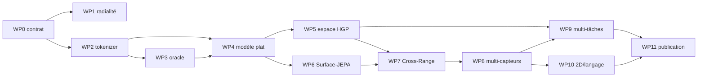

# Feuille de route de recherche

## 1. Voie principale

Une seule voie principale est retenue :

```text
hiérarchie HGP disponible
    → surfaces polyédriques explicites
    → mesure surfacique attribuée normalisée
    → token fixe par polyèdre
    → trajectoires et fusions de densité
    → pré-entraînement cross-range
    → transfert multi-capteurs et multi-tâches
```

La fonction radiale monocouche est une baseline. Elle n'est plus une hypothèse constitutive. Le projet doit survivre à son éventuelle réfutation.

Le modèle cible est `HGP-PolyFM`. Le nom reste provisoire et ne vaut pas brevet de nouveauté délivré par autocongratulation.

## 2. Résultat scientifique visé

Le projet doit établir quatre propositions, dans cet ordre :

1. **tokenizer** : une surface polyédrique fournit un code plus stable et plus efficace qu'un échantillon de points ;
2. **espace d'échelle** : la trajectoire HGP apporte plus qu'un polyèdre isolé ou une hiérarchie générique ;
3. **invariance apprise** : le code de forme survit à la portée, au thinning et au changement de capteur ;
4. **fondation** : le même encodeur transfère entre datasets et tâches avec peu de labels.

Un SOTA SemanticKITTI est une cible utile, mais il ne remplace aucune de ces preuves.

## 3. WP0 — Schéma de données après HGP

### Travail

Sérialiser :

```text
facets
polyhedra
polyhedron_facets
parent / children
branch_next
merge_events
facet_birth_level
lateral_edges
facet_point_index / weight
```

Calculer les attributs de surface sans labels : aire, normales ou projecteurs, bords, confiance, rémission et statistiques d'acquisition.

### Livrables

```text
poly_schema_version.json
validate_poly_surface.py
build_surface_measure.py
profile_poly_dataset.py
```

### Tests

- permutation ;
- remeshing ;
- surfaces ouvertes et multicouches ;
- orientation de normale ;
- conservation de masse ;
- exactitude de reprojection ;
- cohérence des deltas de facettes.

### Porte

Aucun réseau avant G0. Une erreur dans les incidences peut produire une loss parfaitement lisse, ce qui est une qualité esthétique mais pas scientifique.

## 4. WP1 — Audit géométrique de la radialité

### Travail

Pour chaque polyèdre et plusieurs ancres :

- lancer les rayons ;
- mesurer couverture et multiplicité ;
- identifier les tangences et instabilités ;
- stratifier par classe, portée, persistance et géométrie ;
- visualiser les pires cas.

### Livrables

```text
radiality.parquet
radiality_by_class.csv
radiality_report.md
worst_cases/
```

### Décision

- `K=1` quasi universel et stable : carte radiale conservée comme baseline forte ;
- faible multiplicité bornée : ouvrir `K=2/4` ;
- multiplicité ou centre instables : aucune tentative de sauver artificiellement `ρ(u)` ; passer à la mesure surfacique.

Ce WP ne peut tuer que la carte radiale, pas le paradigme polyédrique.

## 5. WP2 — Benchmark du tokenizer de surface

### Représentations

1. `Analytic` : moments, spectre, distributions ;
2. `Radial-1` ;
3. `Radial-K` ;
4. `Spectral-SR` : moments sphéro-radiaux ;
5. `MeasureGrid` : grille douce de mesure ;
6. `MeasureGrid-MA` : multi-ancre ;
7. `SurfaceSet` : quadrature d'aire + Set Encoder ;
8. `SurfaceAtlas` ;
9. `SurfaceGraph`.

### Tâches

- autoencodage de surface ;
- classification ou probe des labels de polyèdres ;
- retrieval du même support sous remeshing et thinning ;
- prédiction de bords ;
- reconstruction de couches multiples.

### Courbes obligatoires

```text
fidélité vs octets
fidélité vs FLOPs
probe sémantique vs dimension latente
invariance vs distorsion
```

### Porte

Retenir une représentation compacte et un plafond riche :

```text
voie compacte : MeasureGrid ou Spectral-SR
plafond       : SurfaceGraph
```

La configuration cible initiale est `MeasureGrid + topo scalars`. Ajouter la branche `SurfaceGraph` seulement si son gain dépasse son coût à budget apparié.

## 6. WP3 — Oracle et sortie sémantique

### Travail

- oracle par facette ;
- oracle par polyèdre à différents niveaux ;
- oracle multi-ancêtres ;
- oracle de branche ;
- métriques de frontières et petites classes ;
- courbe qualité contre nombre de polyèdres.

### Décodeur pilote

Pour chaque facette :

```text
feature locale de facette
+ tokens des ancêtres persistants
+ événements de fusion proches
→ logits facette
→ reprojection point-wise
```

### Porte

Continuer si l'oracle possède une marge suffisante et si le décodeur peut séparer les frontières que le token global ne localise pas.

Si l'oracle polyèdre est faible mais l'oracle facette élevé, le paradigme reste viable avec un backbone polyédrique et un décodeur fin.

## 7. WP4 — Modèles plats sur polyèdres

### Modèles

1. `Analytic-MLP` ;
2. `SurfaceGraph` ;
3. `Measure-Flat` ;
4. `Measure+Topo` ;
5. `Measure-Lateral`.

### But

Établir avant l'arbre :

- l'apprenabilité du token ;
- le gain de la mesure normalisée ;
- la valeur de la connectivité ;
- le plafond du graphe spatial ;
- le coût d'abandonner les tokens points.

### Comparaisons

- point/voxel backbone moderne ;
- superpoints SPT ;
- même nombre de tokens ;
- mêmes paramètres ;
- même FLOPs ;
- même volume d'entrée.

### Porte

`Measure+Topo` doit battre les descripteurs analytiques et montrer au moins un avantage net : segmentation, faible supervision, portée, robustesse ou qualité–coût.

Sans signal positif, ne pas coder un Transformer hiérarchique pour créer artificiellement de l'espoir.

## 8. WP5 — Architecture native de l'espace d'échelle

### Composants

- `SurfaceEncoder` partagé ;
- tokens d'état et deltas de facettes ;
- `BranchEncoder` indexé par `Δlogλ` et rangs ;
- `MergeEventEncoder` permutation-invariant ;
- graphe latéral ;
- décodeur par facette ;
- latents globaux seulement si nécessaires.

### Ordre d'ouverture

1. branche seule ;
2. branche + deltas ;
3. événements de fusion ;
4. graphe latéral ;
5. contexte global.

### Baselines

- quatre coupes SPT-nano ;
- `MeanTree` ;
- `Sequoia-fixed` ;
- HSA fidèle au régime publié ;
- arbre aléatoire ;
- octree ;
- HDBSCAN/RSL ;
- niveaux HGP permutés.

### Porte

La hiérarchie doit améliorer au moins deux axes parmi mIoU, portée, faible supervision, instance, robustesse et qualité–coût.

Le gain doit venir de la vraie structure ou des vrais niveaux, pas seulement du nombre de couches.

## 9. WP6 — `Surface-JEPA`

### Phase 1 — même surface

- teacher complet ;
- student avec secteurs de grille ou facettes masqués ;
- prédiction latente ;
- régularisation de variance/covariance ;
- reconstruction basse fréquence auxiliaire.

### Phase 2 — espace d'échelle

- masquer un delta de facettes ;
- prédire le parent depuis les enfants ;
- prédire un segment de branche ;
- prédire persistance et prochain événement en auxiliaire.

### Porte

Continuer si le frozen probing et le faible régime de labels progressent. Une loss qui descend sans gain de probing n'est qu'une activité GPU bien organisée.

## 10. WP7 — `Cross-Range PolyJEPA`

### Phase 1 — vues synthétiques

Teacher et student utilisent des HGP reconstruits indépendamment sous :

- suppression d'anneaux ;
- thinning angulaire ;
- portée simulée ;
- occultation ;
- bruit et rémission.

Le matching combine support commun, mesure surfacique et cohérence d'arbre.

### Phase 2 — séquences réelles

- compensation de l'ego-motion ;
- traitement des objets mobiles ;
- matching de surfaces réelles à plusieurs distances ;
- teacher temporel plus dense ;
- student mono-scan.

### Audit

- couverture des matches ;
- biais par classe et portée ;
- retrieval cross-range ;
- probes capteur et sémantique ;
- mIoU par distance.

### Porte

Le SSL doit améliorer à la fois représentation et robustesse sur au moins deux datasets. Un gain seulement sur les grandes routes proches ne valide pas l'idée.

## 11. WP8 — Pré-entraînement multi-capteurs

### Données

Commencer par plusieurs LiDAR outdoor dont les patterns diffèrent. Conserver :

- même `SurfaceEncoder` ;
- mêmes dimensions de grille ;
- même règle d'ancre ;
- mêmes canaux ;
- normalisation statistique globale ou adaptative sans labels.

### Évaluations

- frozen cross-dataset ;
- `0.1 %`, `1 %`, `10 %` labels ;
- adaptation complète ;
- capteur tenu hors pré-entraînement ;
- courbes de scaling avec le nombre de scans et capteurs.

### Porte

Un gain multi-capteurs stable autorise le terme **foundation model LiDAR outdoor**. Le terme **foundation model 3D général** reste fermé.

## 12. WP9 — Multi-tâches et instances

### Tâches

- sémantique ;
- instance / panoptique ;
- détection ;
- frontières ;
- retrieval ;
- reconstruction ou complétion.

Les branches persistantes fournissent des candidats naturels d'instance, mais elles ne sont jamais supposées égales aux instances GT. Mesurer fragmentation, fusion et stabilité temporelle.

### Architecture

Le backbone est partagé. Les têtes consomment :

- tokens de polyèdres ;
- deltas ;
- événements ;
- features de facettes.

### Porte

Le pré-entraînement doit améliorer plusieurs tâches, en particulier une tâche de localisation. Une représentation uniquement sémantique ne suffit pas au claim fondation.

## 13. WP10 — Distillation 2D et langage

Ouvrir seulement après WP7/WP8.

### Travail

- projeter les facettes dans les images ;
- agréger les features vision sur les polyèdres ;
- distiller vers le sous-espace sémantique ;
- comparer au même teacher distillé vers points, voxels et superpoints ;
- ouvrir l'alignement texte pour l'open vocabulary.

### Règle

La géométrie-only reste une table principale. Un teacher 2D ne doit pas rendre impossible l'attribution du gain au tokenizer.

## 14. WP11 — Campagne de publication

### Papier 1 : nouvelle représentation

Contributions minimales :

1. surfaces polyédriques HGP comme unités perceptives ;
2. mesure surfacique normalisée et encodeur compact ;
3. analyse radialité / multicouches / remeshing ;
4. benchmark taux–distorsion ;
5. segmentation et robustesse cross-range ;
6. second capteur.

Ce papier peut viser ICCV, NeurIPS ou ICML sans modèle de fondation complet si l'analyse causale et les résultats sont forts.

### Papier 2 ou version étendue : fondation

- pré-entraînement multi-datasets ;
- temps et multimodalité ;
- plusieurs tâches ;
- low-shot et frozen probing ;
- courbes de scaling ;
- open vocabulary éventuel.

Empiler les deux ambitions dans une première soumission peut fonctionner, mais réduit la capacité à expliquer proprement quelle idée a produit quel résultat.

## 15. Graphe de dépendances



## 16. Priorités immédiates

| Priorité | Travail | Décision obtenue |
|---:|---|---|
| 1 | radialité + multiplicité + ancres | tuer ou conserver `ρ(u)` |
| 2 | benchmark taux–distorsion du tokenizer | choisir MeasureGrid / SurfaceGraph |
| 3 | oracle facette/polyèdre/branche | valider la sortie |
| 4 | modèle plat `Measure+Topo` | valider l'unité polyédrique |
| 5 | branches + deltas | valider l'espace d'échelle |
| 6 | Cross-Range PolyJEPA | valider l'invariance apprise |
| 7 | second capteur | valider le transfert |
| 8 | multi-tâches / 2D | gagner le statut fondation |

La prochaine ligne de code utile n'est donc pas HSA. C'est le benchmark de représentation de surface et ses courbes de radialité, remeshing, taux–distorsion et retrieval cross-range.
