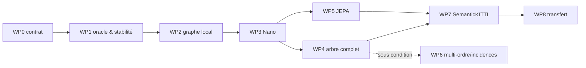

# Feuille de route de recherche

Une seule voie principale est retenue : **segmentation polyèdre-only sur arbre complet**, avec une montée en complexité strictement conditionnée par les résultats intermédiaires.

## 0. Résultat visé

Le projet doit répondre, dans cet ordre, à trois questions :

1. **représentation** : les feuilles et leur reprojection conservent-elles l'information sémantique ?
2. **inductive bias** : la hiérarchie améliore-t-elle vraiment le graphe local ?
3. **apprentissage invariant** : le pré-entraînement rend-il les embeddings plus stables à la portée et au capteur ?

Le classement SemanticKITTI n'est ouvert qu'après une réponse positive aux trois.

## 1. WP0 — Contrat de données

### Travail

- définir le schéma sérialisé de [ARCHITECTURE.md](ARCHITECTURE.md) ;
- exporter les feuilles, nœuds, niveaux, arêtes et poids de reprojection ;
- versionner les paramètres de construction ;
- écrire les loaders CPU/GPU ;
- construire les structures de contrôle.

### Livrables

```text
schema_version.json
scan_<id>.pt ou .safetensors
validate_structure.py
profile_dataset.py
```

### Tests

- conservation de masse ;
- permutation des identifiants ;
- reconstruction exacte de l'ordre des points ;
- absence de cycle ;
- déterminisme bit-à-bit du prétraitement ;
- cohérence des statistiques parent–enfants.

### Porte

Aucun entraînement avant G0. Les réseaux compensent volontiers les erreurs de données jusqu'au moment où il faut expliquer le résultat, ce qui est une stratégie assez peu compatible avec la science.

## 2. WP1 — Oracle et stabilité

### 2.1 Oracle des feuilles

Pour plusieurs granularités et ordres :

- distribution GT par feuille ;
- reprojection pondérée ;
- mIoU, IoU par classe et frontières ;
- courbes oracle contre nombre de feuilles et mémoire.

### 2.2 Stabilité sous thinning

Construire les vues dégradées depuis les identifiants des points originaux :

- uniforme ;
- dépendant de la portée ;
- suppression d'anneaux ;
- secteurs occultés.

Apparier les nœuds et mesurer la conservation de l'arbre.

### 2.3 Contrôles

- HDBSCAN/RSL ;
- octree ;
- partition SPT ;
- single-linkage ;
- arbre aléatoire seulement pour les métriques structurelles pertinentes.

### Porte

Continuer si :

- l'oracle conserve une marge d'au moins `10` points au-dessus de la cible apprise ;
- le matching reste exploitable au thinning `1/4` ;
- la stabilité n'est pas entièrement expliquée par de grandes régions planes proches.

## 3. WP2 — Baseline polyèdre-only locale

### Modèles

1. `Leaf-MLP` : aucun graphe ;
2. `Dual-GNN` : message passing sur le graphe dual ;
3. `Dual-Transformer` : attention sparse avec RPE.

### Canaux ouverts

Commencer par :

```text
shape_min = Gram + spectre + support_42 + masques
metric_min = taille + centre + hauteur + pose
sensor_min = rémission + portée
```

Le canal de filtration n'est pas encore utilisé : il n'existe pas de hiérarchie dans ce WP.

### But

Établir :

- qu'un token de feuille est apprenable ;
- quels descripteurs sont utiles ;
- le coût minimal de la reprojection ;
- le plafond du graphe local.

### Porte

Le `Dual-Transformer` doit battre `Leaf-MLP` et réduire l'écart à la baseline point-wise. Sinon, revoir les feuilles et les canaux avant toute attention hiérarchique.

## 4. WP3 — `PolyTreeFormer-Nano`

### Implémentation

Fork minimal du dépôt SPT :

1. conserver le mode `nano` ;
2. remplacer le `NAG` par les niveaux sélectionnés de l'arbre ;
3. injecter les canaux de feuilles et d'arêtes ;
4. remplacer l'unpooling dur par la reprojection massique ;
5. garder quatre niveaux seulement au premier essai.

### Configuration pilote

```yaml
levels: 4
widths: [96, 128, 192, 256]
heads: [3, 4, 6, 8]
blocks_down: [2, 2, 3, 3]
blocks_up: [1, 1, 2]
ffn_ratio: 4
pre_norm: true
drop_path: 0.10
```

### Ablations

- pooling moyen + MLP ;
- message passing sans attention ;
- SPT attention ;
- mêmes niveaux avec arbre aléatoire ;
- niveaux bruts contre relatifs.

### Porte

La hiérarchie doit améliorer le graphe dual sur trois graines. Sans cela, ne pas coder l'arbre complet.

## 5. WP4 — `PolyTreeFormer-Full`

### Objectif

Utiliser tous les événements pertinents, sans réduire la filtration à quatre coupes arbitraires.

### Bloc

Chaque itération combine :

1. agrégation enfants→parent ;
2. attention dans la fratrie d'un événement ;
3. diffusion parent→enfants ;
4. attention latérale géométrique ;
5. FFN et résidus.

### Gestion du degré

- attention exacte sous un seuil `d_max` ;
- `m` inducing tokens au-delà ;
- mêmes paramètres pour toutes les familles ;
- aucun ordre artificiel entre enfants simultanés.

### Trajectoires

Ajouter un Transformer 1D partagé le long des états d'une branche seulement si le bloc de famille fonctionne. Les positions sont des `Δlogλ`, pas des indices de profondeur.

### Comparateurs

- `Sequoia-fixed` ;
- HSA ;
- SPT-Nano quatre niveaux ;
- `MeanTree`.

### Porte

Le modèle complet doit apporter soit :

- un gain de mIoU ;
- un gain net sur les classes lointaines ;
- une meilleure robustesse au thinning ;
- ou un meilleur compromis paramètres/qualité.

Une architecture plus lente et strictement égale reste une ablation, pas le modèle final.

## 6. WP5 — `Range-Hierarchy JEPA`

### Phase 1 — même arbre

Avant d'apparier deux arbres :

- teacher et student utilisent la même structure ;
- le student reçoit des sous-arbres ou attributs masqués ;
- il prédit les embeddings teacher des cibles ;
- EMA et variance regularization.

Cette phase valide l'objectif et le predictor.

### Phase 2 — deux arbres reconstruits

- teacher : scan complet ;
- student : scan aminci ;
- reconstruction indépendante des structures ;
- matching par Weighted Jaccard des identifiants survivants ;
- loss seulement sur les correspondances fiables.

### Phase 3 — événements

Prédire en plus :

- prochaine variation de niveau ;
- persistance restante ;
- rapport de masse parent/enfants ;
- degré de fusion.

### Phase 4 — softmaps observables

Ajouter la distillation de distributions de prototypes seulement si :

- le matching couvre les petites classes ;
- l'embedding ne s'effondre pas ;
- la régression latente améliore déjà le probing.

### Porte

Continuer vers une campagne coûteuse si le pilote produit `+0.5` mIoU en probing ou fine-tuning et améliore explicitement la stabilité des branches appariées.

## 7. WP6 — Multi-ordre et incidences

Ce WP n'est pas sur le chemin critique initial.

### Multi-ordre

Ouvrir `K=1/2/3` si un ordre unique échoue de façon complémentaire :

- `K=1` sur structures linéaires ;
- `K=2` sur surfaces ;
- `K=3` sur régions épaisses.

Fusion par gate dépendant de :

- forme intrinsèque ;
- portée ;
- persistance ;
- incertitude ;
- masse.

Le gate doit être audité pour vérifier qu'il ne se réduit pas à une table portée→ordre.

### Incidences complètes

Tester `AllSet-incidence` si le graphe dual est insuffisant. Comparer :

- incidences exactes ;
- incidences mélangées ;
- mêmes cellules sans arêtes ;
- même budget sur graphe dual.

## 8. WP7 — Campagne SemanticKITTI

### Étapes

1. développer sur sous-splits internes du train ;
2. geler la recette pilote ;
3. lancer trois graines sur `08` ;
4. analyser par classe, portée et frontière ;
5. comparer au meilleur backbone reproduit ;
6. seulement ensuite lancer train+val et test caché.

### Résultat minimum publiable

Même sans SOTA, un papier peut être sérieux si les résultats démontrent :

- un oracle polyédrique élevé ;
- une invariance structurelle mesurée ;
- une architecture polyèdre-only compétitive ;
- un gain causé par les niveaux relatifs ;
- une amélioration sous changement de densité.

### Résultat pour conférence majeure

Il faut en plus :

- gain robuste sur SemanticKITTI ;
- transfert vers un second capteur ;
- avantage au-delà d'une SPT-nano adaptée ;
- analyse de coût ;
- contribution méthodologique générale, probablement le JEPA inter-arbres ou l'attention événementielle.

## 9. WP8 — Transfert

Choix recommandé : nuScenes, puis éventuellement Waymo.

### Protocole

- conserver le code et les dimensions ;
- recalibrer les statistiques sans labels ;
- ne pas retoucher les canaux pour chaque capteur ;
- mesurer zero-shot des embeddings, linear probing et fine-tuning ;
- tester un modèle pré-entraîné conjointement sur plusieurs capteurs.

### Porte

Un gain SemanticKITTI qui disparaît complètement sur nuScenes doit être présenté comme spécifique au capteur, pas comme invariance générale.

## 10. Dépendances entre lots



## 11. Priorité pratique

| Priorité | Tâche | Pourquoi |
|---:|---|---|
| 1 | G0/G1/G2 | tue rapidement les mauvaises hypothèses |
| 2 | SPT-nano adapté | code existant, baseline crédible |
| 3 | canaux et RPE | levier principal avant nouvel opérateur |
| 4 | JEPA même arbre | valide l'entraînement sans matching fragile |
| 5 | JEPA deux arbres | contribution la plus originale |
| 6 | arbre complet / Sequoia | gain potentiel, coût d'ingénierie élevé |
| 7 | HSA / AllSet / multi-ordre | seulement après preuve du socle |

## 12. Règle générale

Chaque WP produit une table de résultats et une décision `continue / revise / stop`. Aucune étape suivante ne doit servir à sauver rétrospectivement une étape précédente non concluante.
